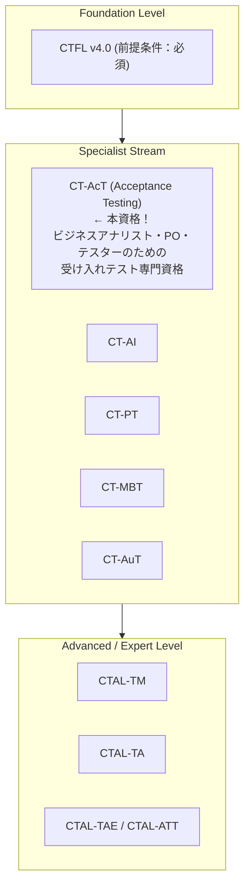
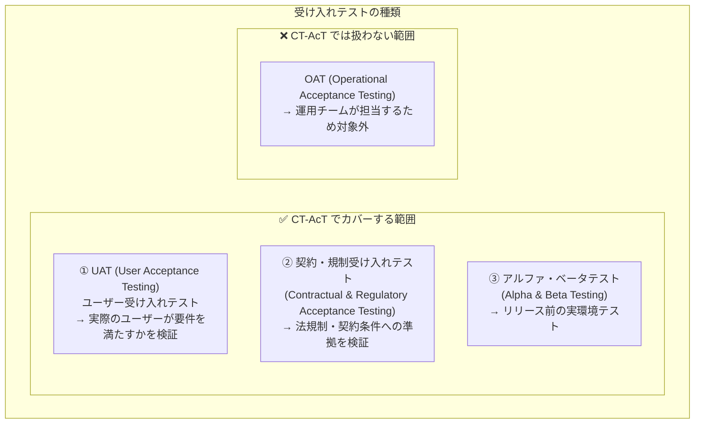
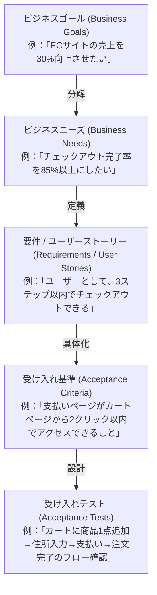
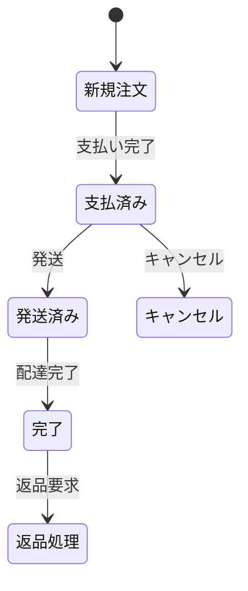

# ✅ ISTQB® Certified Tester Acceptance Testing (CT-AcT)

## 受け入れテスト 完全学習ガイド 2025

### 初学者からプロフェッショナルまで — ISTQB CT-AcT v1.0 準拠

> **対応資格**: ISTQB® Certified Tester – Acceptance Testing (CT-AcT v1.0)
> **試験形式**: 40問 / 合格基準 26/40点（65%） / 60分
> **前提資格**: ISTQB CTFL（Foundation Level）保有必須
> **最終更新**: 2025年
>
> 🔗 **公式ページ**: https://istqb.org/certifications/certified-tester-acceptance-testing/

---

## 📚 目次

1. [CT-AcT 概要と資格ロードマップ](#%F0%9F%8C%9F-chapter-0-ct-act-%E6%A6%82%E8%A6%81%E3%81%A8%E8%B3%87%E6%A0%BC%E3%83%AD%E3%83%BC%E3%83%89%E3%83%9E%E3%83%83%E3%83%97-chapter-0)
2. [Chapter 1: 導入と基礎（Introduction and Foundations）](#%F0%9F%93%8B-chapter-1-%E5%B0%8E%E5%85%A5%E3%81%A8%E5%9F%BA%E7%A4%8E%EF%BC%88introduction-and-foundations%EF%BC%89-chapter-1)
3. [Chapter 2: 受け入れ基準・受け入れテスト・経験ベースのプラクティス](#%F0%9F%93%9D-chapter-2-%E5%8F%97%E3%81%91%E5%85%A5%E3%82%8C%E5%9F%BA%E6%BA%96%E3%83%BB%E5%8F%97%E3%81%91%E5%85%A5%E3%82%8C%E3%83%86%E3%82%B9%E3%83%88%E3%83%BB%E7%B5%8C%E9%A8%93%E3%83%99%E3%83%BC%E3%82%B9%E3%81%AE%E3%83%97%E3%83%A9%E3%82%AF%E3%83%86%E3%82%A3%E3%82%B9-chapter-2)
4. [Chapter 3: ビジネスプロセスとビジネスルールのモデリング](#%F0%9F%97%BA%EF%B8%8F-chapter-3-%E3%83%93%E3%82%B8%E3%83%8D%E3%82%B9%E3%83%97%E3%83%AD%E3%82%BB%E3%82%B9%E3%81%A8%E3%83%93%E3%82%B8%E3%83%8D%E3%82%B9%E3%83%AB%E3%83%BC%E3%83%AB%E3%81%AE%E3%83%A2%E3%83%87%E3%83%AA%E3%83%B3%E3%82%B0-chapter-3)
5. [Chapter 4: 非機能要件の受け入れテスト](#%F0%9F%9B%A1%EF%B8%8F-chapter-4-%E9%9D%9E%E6%A9%9F%E8%83%BD%E8%A6%81%E4%BB%B6%E3%81%AE%E5%8F%97%E3%81%91%E5%85%A5%E3%82%8C%E3%83%86%E3%82%B9%E3%83%88-chapter-4)
6. [Chapter 5: 協調的な受け入れテスト（Collaborative Acceptance Testing）](#%F0%9F%A4%9D-chapter-5-%E5%8D%94%E8%AA%BF%E7%9A%84%E3%81%AA%E5%8F%97%E3%81%91%E5%85%A5%E3%82%8C%E3%83%86%E3%82%B9%E3%83%88%EF%BC%88collaborative-acceptance-testing%EF%BC%89-chapter-5)
7. [試験対策・サンプル問題](#%F0%9F%93%9D-%E8%A9%A6%E9%A8%93%E5%AF%BE%E7%AD%96%E3%83%BB%E3%82%B5%E3%83%B3%E3%83%97%E3%83%AB%E5%95%8F%E9%A1%8C-exam-tips)
8. [主要ツール・フレームワーク一覧](#%F0%9F%94%A7-%E4%B8%BB%E8%A6%81%E3%83%84%E3%83%BC%E3%83%AB%E3%83%BB%E3%83%95%E3%83%AC%E3%83%BC%E3%83%A0%E3%83%AF%E3%83%BC%E3%82%AF%E4%B8%80%E8%A6%A7-tools)
9. [参照URL一覧](#%F0%9F%93%9A-%E5%8F%82%E7%85%A7url%E4%B8%80%E8%A6%A7-references)

---

## 🌟 Chapter 0: CT-AcT 概要と資格ロードマップ {#chapter-0}

### 0.1 この資格とは？



**CT-AcT（Certified Tester Acceptance Testing）** は、受け入れテストの専門知識を認定する国際資格です。プロダクトオーナー（PO）・ビジネスアナリスト（BA）・テスターが協力して、ソフトウェアがビジネスニーズを満たすかを検証するための手法を体系的に学びます。

### 0.2 CT-AcT が扱う受け入れテストの種類

受け入れテスト（Acceptance Testing）の全体像：



### 0.3 試験概要

**CT-AcT v1.0 試験スペック**

| 項目 | スペック |
| --- | --- |
| **問題数** | 40問 |
| **合格点** | 26点（40点満点） |
| **合格率目標** | 約65% |
| **試験時間** | 60分 (+25% = 75分 英語非母語者) |
| **前提条件** | CTFL資格（必須） |
| **最新シラバス** | v1.0（2019年） |

### 0.4 CT-AcT の対象者

| 役割 | この資格で得られる価値 |
|------|---------------------|
| **プロダクトオーナー（PO）** | 受け入れ基準の定義・検証を主導できる |
| **ビジネスアナリスト（BA）** | 要件からテスト可能な基準を導き出せる |
| **テスター** | ビジネス視点のテスト設計ができる |
| **テストアナリスト** | 協調的テスト活動をリードできる |
| **テストマネージャー** | 受け入れテストプロセスを管理できる |

### 0.5 CT-AcT のビジネスアウトカム（Business Outcomes）

**ビジネスアナリスト・プロダクトオーナー向け:**

| ID | アウトカム |
|----|-----------|
| BO1 | テスト設計フェーズに参加し、製品とビジネス要件の整合性を支援できる |
| BO2 | 受け入れテストプロセス（プロセス・成果物・コミュニケーション・報告・管理）の組織化に貢献できる |
| BO3 | 品質フレームワークの実装で生成された成果物の検証・確認に貢献できる |

**テスター向け:**

| ID | アウトカム |
|----|-----------|
| BO4 | 要件定義フェーズにおける受け入れ基準の定義に貢献できる |
| BO5 | 全ての受け入れテスト活動でBAおよびステークホルダーと効率的に協力できる |
| BO6 | ビジネス目標を理解し、ビジネスユニットとコミュニケーションを取り、共通の目標を共有できる |

---

## 📋 Chapter 1: 導入と基礎（Introduction and Foundations） {#chapter-1}

### 1.1 基本的な関係性（Fundamental Relationships）

#### 1.1.1 ビジネスゴール・ビジネスニーズ・要件の関係

受け入れテストを理解するためには、まず「なぜテストするのか」を把握することが重要です。

ビジネスゴールからテストへの変換フロー：



**なぜ要件の品質が重要なのか:**

**要件品質と欠陥コストの関係：**

| 発見フェーズ | コスト倍率 |
| --- | --- |
| 要件定義フェーズで欠陥発見 | 1倍のコスト |
| 設計フェーズで発見 | 5倍のコスト |
| 実装フェーズで発見 | 10倍のコスト |
| テストフェーズで発見 | 50倍のコスト |
| 本番環境（ユーザー発見） | 100倍のコスト ← 最もコスト高！ |

> **💡 ポイント**
> 受け入れ基準を早期に明確化することは、最高のコスト削減策です！

#### 1.1.2 要件・受け入れ基準・受け入れテストの関係

| 概念 | 定義 | 例 |
|------|------|-----|
| **要件（Requirement）** | システムが持つべき機能や性質の記述 | 「ユーザーはメールアドレスで登録できる」 |
| **ユーザーストーリー** | ユーザー視点の要件記述（As a / I want / So that） | 「会員として、メールでサインアップしたい。購入履歴を管理したいから」 |
| **受け入れ基準（AC）** | ストーリーが「完了」と判断できる条件の列挙 | 「有効なメール形式のみ受け付ける」「重複メールはエラーを表示する」 |
| **受け入れテスト** | 受け入れ基準が満たされているかを確認するテスト | 「test@example.com で登録できることを確認」「test@test@com でエラーが出ることを確認」 |

> **要件の品質基準（SMART原則のテスト視点版）**
>
> - ✅ **明確（Clear）**：「高速に動作する」→ 「3秒以内に応答する」
> - ✅ **完全（Complete）**：全ての正常系・異常系・境界値を網羅
> - ✅ **一貫（Consistent）**：矛盾がない
> - ✅ **テスト可能（Testable）**：Yes/No で判定できる
> - ✅ **追跡可能（Traceable）**：ビジネスゴールまで追跡できる
> - ✅ **独立（Independent）**：他の要件と不必要に依存しない

#### 1.1.3 要件の品質の重要性（The Importance of Quality Requirements）

受け入れテストの品質は、その基礎となる要件の品質に直接依存します。

```
低品質な要件の例（問題あり）：
  ✗ 「システムはユーザーフレンドリーでなければならない」
     → 主観的。「ユーザーフレンドリー」の定義が人によって異なる

  ✗ 「レスポンスは速くなければならない」
     → 数値基準がない。テストできない

  ✗ 「必要に応じてエラーを表示する」
     → 「必要に応じて」の条件が不明

高品質な要件の例（テスト可能）：
  ✓ 「検索ボタンをクリックしてから結果が表示されるまで3秒以内」
  ✓ 「パスワードは8文字以上64文字以下で、英数字を含むこと」
  ✓ 「ログイン失敗5回でアカウントを30分ロックし、
       その旨のメッセージを表示すること」
```

### 1.2 ビジネス分析と受け入れテスト（Business Analysis and Acceptance Testing）

#### 1.2.1 ビジネス分析とテスト活動の関係

### ビジネス分析 vs テスト活動の役割分担

**ビジネスアナリスト（BA）の主な責任：**
- ビジネス要件の収集・文書化
- ユーザーストーリーの作成
- ステークホルダーとのコミュニケーション
- 受け入れ基準の定義（テスターと協力）
- 要件変更の管理

**テスター（Tester）の主な責任：**
- 受け入れ基準のレビュー（テスト可能性の確認）
- 受け入れテストの設計・実行
- 欠陥の報告・追跡
- テスト結果のビジネス側への説明
- リリース判断のための品質情報の提供

**協力すべき場面（3 Amigos ミーティング）：**
- ✓ ユーザーストーリーの受け入れ基準の定義
- ✓ エッジケースの洗い出し
- ✓ テスト可能性の確認
- ✓ テスト結果のレビュー

#### 1.2.2 ビジネスアナリストとテスターの協調（Collaboration）

**サイロ効果（Silo Effect）とは:**

### サイロ効果（情報が部門間で共有されない問題）

- BAチーム → 「要件を書いた」
- テストチーム → 「要件を渡された」
  ↓
- ✗ 曖昧な要件が発見されるのはテスト開始後
- ✗ 修正コストが高い

**CT-AcT の目的：このサイロを壊す！**
- ✓ BA・PO・テスターが最初から協力
- ✓ 受け入れ基準を共同で定義
- ✓ 早期に問題を発見・修正

---

## 📝 Chapter 2: 受け入れ基準・受け入れテスト・経験ベースのプラクティス {#chapter-2}

### 2.1 受け入れ基準の作成（Writing Acceptance Criteria）

受け入れ基準（Acceptance Criteria）は、ソフトウェアが要件を満たしているかを判断するための**具体的・測定可能な条件**です。

#### 2.1.1 受け入れ基準の記述形式

**形式1: チェックリスト形式（Checklist Style）**

```
ユーザーストーリー：
  「登録ユーザーとして、パスワードをリセットしたい。
   アカウントにアクセスできなくなった場合でも復元できるから」

受け入れ基準（チェックリスト形式）：
  □ メールアドレスを入力してリセットリンクを要求できること
  □ リセットリンクは30分間有効であること
  □ リンクの有効期限切れ後にアクセスするとエラーが表示されること
  □ 新しいパスワードは現在のパスワードと同じにできないこと
  □ パスワード変更後、他のデバイスのセッションが無効になること
  □ 登録されていないメールアドレスを入力した場合、
    セキュリティのため「メールを送信しました」と表示されること
```

**形式2: Given-When-Then（Gherkin）形式**

```gherkin
Feature: パスワードリセット機能

  Scenario: 有効なメールアドレスでリセットリンクを要求する
    Given ユーザーが "user@example.com" で登録されている
    When  ユーザーがリセットページで "user@example.com" を入力する
    And   「送信」ボタンをクリックする
    Then  "user@example.com" にリセットリンクが届く
    And   画面に「メールをご確認ください」が表示される

  Scenario: リセットリンクの有効期限切れ
    Given ユーザーが31分前にリセットリンクを要求した
    When  ユーザーがそのリセットリンクをクリックする
    Then  「リンクの有効期限が切れています」エラーが表示される
    And   「新しいリンクを要求する」ボタンが表示される

  Scenario: 登録されていないメールアドレスを入力した場合
    Given ユーザーが "notregistered@example.com" を入力する
    When  「送信」ボタンをクリックする
    Then  「メールをご確認ください」が表示される
    # セキュリティのため「そのメールは登録されていません」とは表示しない
```

#### 2.1.2 良い受け入れ基準の特性

```
INVEST 基準をACに適用する：

  I - Independent（独立）
    → 他の基準に不必要に依存しない

  N - Negotiable（交渉可能）
    → チームで議論・調整できる余地がある

  V - Valuable（価値がある）
    → ビジネス価値につながっている

  E - Estimable（見積もり可能）
    → 実装・テストの工数を見積もれる

  S - Small（小さい）
    → 1スプリントで対応できる粒度

  T - Testable（テスト可能）← 最重要！
    → 明確な合否判断ができる
```

### 2.2 受け入れテストの設計（Designing Acceptance Tests）

#### 2.2.1 受け入れテスト駆動開発（ATDD）

**ATDD（Acceptance Test-Driven Development）** とは、受け入れテストを**開発開始前に**定義する手法です。

```
ATDD のワークフロー：

  ┌─────────────────────────────────────────────────────────────┐
  │                    ATDD サイクル                              │
  │                                                             │
  │  Step 1: 話し合い（Discuss）                                  │
  │  BA + PO + テスターが「3 Amigos ミーティング」で集まる          │
  │  ↓                                                          │
  │  Step 2: 受け入れ基準の定義（Define AC）                       │
  │  Gherkin または他の形式で受け入れ基準を記述                      │
  │  ↓                                                          │
  │  Step 3: 受け入れテストの作成（Create Tests）                   │
  │  受け入れ基準から具体的なテストを設計                            │
  │  ↓                                                          │
  │  Step 4: 実装（Implement）                                    │
  │  開発者は受け入れテストを「ゴール」としてコードを書く              │
  │  ↓                                                          │
  │  Step 5: テスト実行・確認（Execute & Verify）                  │
  │  受け入れテストが全てパスしたら「完了（Done）」                   │
  └─────────────────────────────────────────────────────────────┘

ATDD の効果：
  ✓ 要件の曖昧さを早期に解消
  ✓ BA・開発者・テスターの共通理解が生まれる
  ✓ 「完了の定義（Definition of Done）」が明確になる
  ✓ 後工程での手戻りコストを削減
```

#### 2.2.2 振る舞い駆動開発（BDD）と Gherkin

**BDD（Behavior-Driven Development）** は、ATDD をビジネス言語で記述するアプローチです。

```gherkin
# Gherkin の基本構文

Feature: [機能名]
  [機能の説明]

  Background:    # 全シナリオで共通の前提条件
    Given [前提条件]

  Scenario: [シナリオ名]
    Given [前提条件]    # 初期状態の設定
    When  [操作・アクション]  # ユーザーの行動
    Then  [期待結果]     # 確認すべき結果
    And   [追加の結果]   # 複数の結果を連続して記述
    But   [否定的な結果] # 「〜しないこと」を確認

  Scenario Outline: [データ駆動シナリオ]
    Given <変数>で操作する
    When  <条件>でアクセスする
    Then  <期待値>が表示される

    Examples:
      | 変数  | 条件 | 期待値 |
      | 値1  | 条件1 | 結果1 |
      | 値2  | 条件2 | 結果2 |
```

**実践的な Gherkin 記述例（ECサイトの注文機能）:**

```gherkin
Feature: 商品の注文機能
  登録ユーザーが商品を検索して購入できる

  Background:
    Given ユーザー "tanaka@example.com" がログインしている
    And   ショッピングカートが空の状態である

  Scenario: 在庫がある商品を1点注文する
    Given 商品 "ワイヤレスイヤホン" の在庫が5個ある
    When  ユーザーが "ワイヤレスイヤホン" を検索する
    And   商品ページで「カートに追加」をクリックする
    And   カートページで「購入する」をクリックする
    And   配送先住所と支払い情報を入力する
    And   「注文を確定する」をクリックする
    Then  「ご注文を承りました」画面が表示される
    And   注文確認メールが "tanaka@example.com" に届く
    And   商品 "ワイヤレスイヤホン" の在庫が4個になる

  Scenario: 在庫切れの商品を注文しようとする
    Given 商品 "限定スニーカー" の在庫が0個である
    When  ユーザーが "限定スニーカー" の商品ページを開く
    Then  「在庫切れ」と表示される
    And   「カートに追加」ボタンが非活性化（グレーアウト）されている

  Scenario Outline: 異なる数量での注文テスト
    Given 商品 "Tシャツ" の在庫が10個ある
    When  ユーザーが <数量> 枚をカートに追加する
    Then  カートの合計金額は <合計金額> 円と表示される

    Examples:
      | 数量 | 合計金額 |
      | 1   | 2,500   |
      | 3   | 7,500   |
      | 5   | 12,500  |
```

#### 2.2.3 受け入れテスト設計のテクニック

```
受け入れテスト設計で使用する技法：

1. 同値分割法（Equivalence Partitioning）
   → 同じ扱いを受けるデータをグループ化
   例：パスワード長（4文字未満/4〜20文字/20文字超）

2. 境界値分析（Boundary Value Analysis）
   → 境界付近の値をテスト
   例：パスワード最小4文字 → 3文字(NG)・4文字(OK)・5文字(OK)

3. デシジョンテーブル（Decision Table）
   → 複数条件の組み合わせをテーブルで整理
   例：会員ランク × 購入金額 × 送料無料条件の組み合わせ

4. 状態遷移テスト（State Transition Testing）
   → システムの状態変化をテスト
   例：注文状態「未払い→支払い済み→発送済み→完了→返金」

5. ユースケーステスト（Use Case Testing）
   → ユーザーの実際の利用シナリオをテスト
   例：「新規ユーザーが初めて商品を購入する」E2Eフロー
```

### 2.3 受け入れテストにおける経験ベースアプローチ（Experience-Based Approaches）

#### 2.3.1 探索的テスト（Exploratory Testing）

```
探索的テストとは？
  → テスト設計・実行・学習を同時並行で行う動的テスト手法
  → 事前に詳細なテストケースを書かず、テスターの
    知識・経験・直感を活用する

受け入れテストでの活用場面：
  ✓ 要件が不完全または変更が多い場合
  ✓ 従来のテストケースでは発見しにくい欠陥を探す場合
  ✓ 新機能の初回テスト
  ✓ UAT での実際のユーザー行動を模倣するテスト

探索的テストのセッション管理（テストチャーター）：
  EXPLORE [テスト対象: パスワードリセット機能]
  TO DISCOVER [セキュリティと使いやすさの問題]
  USING [実際のメールクライアント・様々なブラウザ・60分間]

セッション中の記録ポイント：
  ✓ 発見した問題（バグ・仕様の疑問点）
  ✓ テストした内容・使ったデータ
  ✓ テストしていない領域
  ✓ 次のセッションへの推奨事項
```

#### 2.3.2 ベータテスト（Beta Testing）

**アルファテスト vs ベータテスト:**

| 特徴 | アルファテスト | ベータテスト |
| --- | --- | --- |
| **環境** | 開発者の環境 | ユーザー自身の実環境 |
| **対象者** | 社内（開発者の監視下） | 社外の一般ユーザー・特定の顧客（通常、開発者は立ち会わない） |
| **段階** | ソフトウェアリリース前 | ほぼ完成したソフトウェア（一般公開前） |
| **テスト手法** | 構造化テスト | 非構造化・実際の使い方 |

**ベータテストの組織方法：**
1. テスターの選定（ターゲットユーザーを代表する人々）
2. テスト期間と目標の設定
3. フィードバック収集の仕組み構築
   → バグレポートフォーム・アンケート・ユーザーインタビュー
4. フィードバックの分類・優先度付け
5. 最終リリース判断

---

## 🗺️ Chapter 3: ビジネスプロセスとビジネスルールのモデリング {#chapter-3}

### 3.1 プロセスとルール（Processes and Rules）

受け入れテストの多くは、**ビジネスプロセス**と**ビジネスルール**の検証に焦点を当てています。

#### 3.1.1 ビジネスプロセスとは？

```
ビジネスプロセス（Business Process）の定義：
  → 特定のビジネスゴールを達成するための
    活動・タスク・意思決定の流れ

例：「オンラインショッピングの購入プロセス」
  Step 1: 商品を検索する
  Step 2: 商品詳細を確認する
  Step 3: カートに追加する
  Step 4: 配送情報を入力する
  Step 5: 支払い情報を入力する
  Step 6: 注文を確認・送信する
  Step 7: 注文確認メールを受け取る
  Step 8: 商品を受け取る・レビューを書く

ビジネスルール（Business Rules）の例：
  → 同じプロセス内での制約・条件
  例：
  - 「合計金額が5,000円以上の場合、送料無料」
  - 「18歳未満はアルコール類を購入できない」
  - 「在庫が3個以下の場合、「残り僅か」を表示する」
```

#### 3.1.2 ビジネスルールの分類

```
ビジネスルールの種類：

  ① 制約ルール（Constraint Rules）：
     「何ができないか」を定義
     例：「ユーザーは同じメールアドレスで複数のアカウントを
           作成できない」

  ② 計算ルール（Calculation Rules）：
     「どのように計算するか」を定義
     例：「消費税 = 商品価格 × 10%（切り捨て）」

  ③ 条件ルール（Condition Rules）：
     「特定の条件でどう動作するか」を定義
     例：「プレミアム会員の場合、割引クーポンが自動適用される」

  ④ トリガールール（Trigger Rules）：
     「特定のイベントが発生した時に何をするか」を定義
     例：「在庫が10個以下になった時、購買担当者にメールを送る」
```

### 3.2 ビジネスプロセス・ルールモデルから受け入れテストを導出

#### 3.2.1 ビジネスプロセスからのテスト設計（BPMN の活用）

```
BPMN（Business Process Model and Notation）を使ったテスト設計：

  BPMN 記号の基本：
  ○ スタートイベント  ◎ エンドイベント
  □ タスク（活動）   ◇ ゲートウェイ（分岐）
  → シーケンスフロー  ⊕ 並行ゲートウェイ

  例：ローン審査プロセスの BPMN フロー

  [申請受付] → [書類確認] →◇→ [書類完備？]
                              Yes → [信用調査] → [審査]
                              No  → [不備通知] → [申請者へ返却]
                                    ↓
                            [審査結果] →◇→ [承認？]
                                          Yes → [契約書作成] → [送付]
                                          No  → [却下通知]

  このフローから受け入れテストを導出：
  テスト1：書類が完備されている場合の正常系フロー確認
  テスト2：書類不備の場合の通知と再申請フロー確認
  テスト3：審査承認の場合の契約書作成・送付フロー確認
  テスト4：審査却下の場合の通知フロー確認
  テスト5：境界値テスト（審査スコアの閾値付近）
```

#### 3.2.2 デシジョンテーブルテスト（Decision Table Testing）

複数のビジネスルールが組み合わさる場合、デシジョンテーブルが有効です。

**例：サブスクリプション料金計算のビジネスルール**
- 会員種別：一般・プレミアム
- 支払い方法：月払い・年払い
- 初回登録：はい・いいえ

**デシジョンテーブル：**

| 条件 / アクション | R1 | R2 | R3 | R4 | R5 | R6 |
| --- | :---: | :---: | :---: | :---: | :---: | :---: |
| **会員種別=一般** | T | T | T | F | F | F |
| **支払い=月払い** | T | T | F | T | T | F |
| **初回登録** | T | F | F | T | F | F |
| **アクション: 月額980円** | ✓ | ✓ | - | - | - | - |
| **アクション: 年額9,800円** | - | - | ✓ | - | - | - |
| **アクション: 初回30日無料** | ✓ | - | - | ✓ | - | - |
| **アクション: 月額1,980円** | - | - | - | - | ✓ | - |
| **アクション: 年額19,800円** | - | - | - | - | - | ✓ |

→ 各ルール（列）に対して受け入れテストを1つ以上設計する

### 3.3 受け入れテストのためのビジネスプロセスモデリング

#### 3.3.1 状態遷移テスト（State Transition Testing）

**受け入れテストでの状態遷移ダイアグラム例：「注文管理システム」**



**各状態遷移の受け入れテスト（1スイッチカバレッジ）：**
- **TC-01:** 新規注文 → 支払い完了で「支払済み」になること
- **TC-02:** 支払済み → 発送で「発送済み」になること
- **TC-03:** 支払済み → キャンセルで「キャンセル」になること
- **TC-04:** 発送済み → 配達完了で「完了」になること
- **TC-05:** 完了 → 返品要求で「返品処理」になること

**ネガティブテスト（無効な遷移）：**
- **TC-06:** 完了状態からキャンセルができないこと
- **TC-07:** 発送済み状態から支払い取り消しができないこと

---

## 🛡️ Chapter 4: 非機能要件の受け入れテスト {#chapter-4}

### 4.1 非機能特性と使用品質（Non-functional Characteristics and Quality in Use）

```
非機能要件の受け入れテストの位置づけ：

  機能テスト：「システムが何をするか」
  非機能テスト：「システムがどのようにするか」

  受け入れテストで扱う主要な非機能要件：
  ┌───────────────────────────────────────────────────────────┐
  │  ① ユーザビリティ（Usability）                             │
  │  ② ユーザーエクスペリエンス（UX）                           │
  │  ③ パフォーマンス効率性（Performance Efficiency）           │
  │  ④ セキュリティ（Security）                                │
  └───────────────────────────────────────────────────────────┘
```

### 4.2 ユーザビリティとユーザーエクスペリエンス（Usability and UX）

#### 4.2.1 ユーザビリティの評価基準（ISO 9241-11）

```
ユーザビリティの3要素：

  ① 有効性（Effectiveness）：
     ユーザーが目標を正確に達成できるか
     測定方法：タスク完了率（%）
     例：「10名のユーザーに、商品を注文させると9名が完了できた → 90%」

  ② 効率性（Efficiency）：
     目標達成にかかる時間・労力
     測定方法：タスク完了時間・クリック数
     例：「チェックアウト完了までの平均時間：2分30秒」

  ③ 満足度（Satisfaction）：
     主観的な使いやすさの評価
     測定方法：SUSスコア（System Usability Scale）
     例：「SUSスコア 72点（目標 68点以上）」
```

**SUSスコアの評価基準:**

```
SUS（System Usability Scale）スコア：

  90〜100点：Excellent（優秀）       Grade: A
  80〜89点：Good（良好）             Grade: B
  70〜79点：OK（許容範囲）           Grade: C
  60〜69点：Poor（要改善）           Grade: D
  60点未満：Awful（非常に問題あり）   Grade: F

  業界標準：SUSスコア 68点 が「平均的」
  受け入れ基準の例：「SUSスコアが80点以上であること」
```

#### 4.2.2 ユーザビリティテストの実施

```
ユーザビリティテストの手順：

  Step 1: テスト計画
  ├── テスト参加者の選定（ターゲットユーザー代表）
  ├── テストタスクの設計（現実的なシナリオ）
  └── 評価指標の設定（タスク完了率・時間・エラー数・SUS）

  Step 2: テスト実施
  ├── 「声に出して考えてください」（Think Aloud法）
  ├── テスター/モデレーターは介入を最小限に
  └── 画面録画・ユーザー観察・メモ記録

  Step 3: データ分析
  ├── 定量データ（完了率・時間・エラー数）の集計
  ├── 定性データ（コメント・困った点）の分類
  └── 問題点の優先度付け（頻度 × 重大度）

  Step 4: 改善提案
  └── ユーザビリティ問題を具体的な改善案として報告

ユーザビリティ受け入れ基準の例：
  □ 初回ユーザーが10分以内に商品を注文できること
  □ ヘルプなしでメインタスクを完了できるユーザーが80%以上
  □ エラーメッセージが理解でき、修正方法が分かること
  □ アクセシビリティガイドライン（WCAG 2.1 AA）に準拠していること
```

### 4.3 パフォーマンス効率性（Performance Efficiency）

#### 4.3.1 パフォーマンス受け入れ基準の設定

```
パフォーマンステストの種類と受け入れ基準：

  ① 応答時間テスト（Response Time Testing）：
     基準例：
     - 通常操作：2秒以内に応答
     - 検索操作：3秒以内に結果表示
     - レポート生成：10秒以内に完了

  ② 負荷テスト（Load Testing）：
     基準例：
     - 同時ユーザー100名で正常動作すること
     - 同時ユーザー500名時に応答時間が3秒以内であること

  ③ ストレステスト（Stress Testing）：
     基準例：
     - 同時ユーザー1,000名の負荷でもクラッシュしないこと
     - 高負荷時にも適切なエラーメッセージを表示すること

  ④ スケーラビリティテスト（Scalability Testing）：
     基準例：
     - ユーザー数が2倍になってもシステムが稼働すること

パフォーマンスKPI の受け入れ基準例：
  ┌─────────────────────────────────────────────────────────────┐
  │  SLA（Service Level Agreement）の受け入れ基準例：            │
  │                                                             │
  │  可用性：99.9%（年間ダウンタイム8.76時間以内）               │
  │  ページロード時間：最初のバイト到達まで200ms以内              │
  │  同時接続数：1,000ユーザーで応答時間3秒以内を維持             │
  │  スループット：100リクエスト/秒を処理できること               │
  └─────────────────────────────────────────────────────────────┘
```

### 4.4 セキュリティ（Security）

#### 4.4.1 セキュリティ受け入れ基準の設定

```
受け入れテストで確認すべき主なセキュリティ要件：

  認証・認可：
  □ 強力なパスワードポリシーが適用されていること
    （最低8文字・英数字混在）
  □ 多要素認証（MFA）が機能すること
  □ セッションタイムアウト（15分）が機能すること
  □ アクセス権限が適切に設定されていること
    （一般ユーザーが管理者機能にアクセスできないこと）

  データ保護：
  □ 個人情報（パスワード）がハッシュ化されて保存されること
  □ 通信が HTTPS で暗号化されていること
  □ クレジットカード情報が PCI DSS に準拠して処理されること
  □ GDPR / 個人情報保護法への準拠

  脆弱性：
  □ OWASP Top 10 の主要脆弱性（SQLインジェクション・XSS等）
    に対して防御されていること
  □ セキュリティスキャン（OWASP ZAP等）で重大な問題がないこと

  セキュリティ受け入れテストのアプローチ：
  ✓ ペネトレーションテスト（ペンテスト）
  ✓ 脆弱性スキャン（自動ツール）
  ✓ コードレビュー（セキュリティ観点）
  ✓ 外部セキュリティ監査
```

---

## 🤝 Chapter 5: 協調的な受け入れテスト（Collaborative Acceptance Testing） {#chapter-5}

### 5.1 コラボレーション（Collaboration）

#### 5.1.1 主要ステークホルダーと役割

**受け入れテストの主要ステークホルダー：**

| ステークホルダー | 受け入れテストでの役割 |
|---|---|
| プロダクトオーナー（PO） | 受け入れ基準の最終決定・承認<br>ビジネス要件の代表者 |
| ビジネスアナリスト（BA） | 要件の詳細化・受け入れ基準の作成<br>ステークホルダー間の橋渡し |
| テスター / QA | テスト設計・実行・結果報告<br>テスト可能性の確認・品質の守護 |
| 開発者 | 技術的な実現可能性の確認<br>ATDD の実装 |
| エンドユーザー / UAT担当 | 実際の使い方でのテスト実行<br>ユーザビリティ・実務適合性の評価 |
| プロジェクトマネージャー | スケジュール・リソース管理<br>リリース判断の調整 |

#### 5.1.2 3 Amigos ミーティング（3アミーゴ）

```
3 Amigos ミーティングとは？
  → PO（ビジネス視点）+ 開発者（技術視点）+ テスター（品質視点）
    の3者が集まって、受け入れ基準を共同で定義するセッション

  各参加者の視点：
  👤 プロダクトオーナー：「これで何を達成したいか」
  👤 開発者：「どのように実装するか」
  👤 テスター：「どのようにテストするか、何が失敗し得るか」

  ミーティングの流れ（30〜60分）：
  1. POがユーザーストーリーを説明
  2. 各参加者が質問・懸念を共有
  3. 受け入れ基準をホワイトボード/ドキュメントに記述
  4. エッジケース・例外ケースを洗い出す
  5. Gherkin シナリオを共同で作成
  6. 全員が内容に合意する

  3 Amigos 参加前のテスターの準備：
  ✓「もし〇〇だったら？」という質問リストを用意
  ✓ 過去の類似機能で発見した欠陥パターンを確認
  ✓ 境界値・異常系のシナリオを事前に考える
  ✓ 非機能要件（パフォーマンス・セキュリティ）の観点も準備
```

### 5.2 受け入れテストの活動（Activities）

#### 5.2.1 UAT（ユーザー受け入れテスト）の計画と実施

```
UAT の全体プロセス：

  Phase 1: 計画（Planning）
  ├── UAT 範囲の定義（何をテストするか）
  ├── テスト参加者の選定（実際のエンドユーザー）
  ├── テスト環境の準備（本番に近い環境）
  ├── テストデータの準備（現実に近いデータ）
  ├── スケジュールの決定
  └── 入口・出口基準の設定

  Phase 2: 準備（Preparation）
  ├── テストケース / シナリオの作成
  ├── テスト参加者へのトレーニング・オリエンテーション
  └── テスト環境の最終確認

  Phase 3: 実行（Execution）
  ├── ユーザーによるテスト実行
  ├── 欠陥の記録・報告
  └── テスト進捗のモニタリング

  Phase 4: 評価（Evaluation）
  ├── テスト結果の集計
  ├── 出口基準の達成確認
  ├── リスクの評価
  └── Go/No-Go の判断

  Phase 5: 完了（Closure）
  ├── UAT 完了レポートの作成
  ├── 承認の取得（ステークホルダーのサインオフ）
  └── 教訓の記録
```

**UAT の入口基準・出口基準:**

```
入口基準（UAT を開始できる条件）：
  ✓ システムテスト・統合テストが完了していること
  ✓ 既知の Critical / High 欠陥が全て修正されていること
  ✓ テスト環境がセットアップ済みで安定していること
  ✓ テストデータが準備されていること
  ✓ ユーザーマニュアル・トレーニング資料が準備されていること

出口基準（UAT を完了できる条件）：
  ✓ 計画したテストケースの95%以上が実行されていること
  ✓ Critical 欠陥が0件であること
  ✓ High 欠陥が3件以下（全件修正計画あり）であること
  ✓ ステークホルダーが承認（サインオフ）していること
```

#### 5.2.2 契約・規制受け入れテスト

```
契約受け入れテスト（Contractual Acceptance Testing）：
  → 契約書に記載された要件・SLAへの準拠を検証
  → 例：「システムは99.9%の可用性を保証する」

規制受け入れテスト（Regulatory Acceptance Testing）：
  → 法律・業界標準・規制への準拠を検証

規制適合テストの例：
  医療システム：
    ✓ ISO 13485（医療機器品質管理システム）
    ✓ FDA 21 CFR Part 11（電子記録・電子署名）
    ✓ HIPAA（医療情報保護）

  金融システム：
    ✓ PCI DSS（支払いカード業界データセキュリティ基準）
    ✓ SOX 法（企業改革法）
    ✓ 金融庁ガイドライン

  一般的な規制：
    ✓ GDPR（EU 一般データ保護規則）
    ✓ 個人情報保護法（日本）
    ✓ WCAG 2.1（ウェブアクセシビリティ）
```

### 5.3 ツールサポート（Tool Support）

#### 5.3.1 受け入れテスト自動化ツール

**受け入れテストで活用できる主要ツール：**

**BDD / ATDD フレームワーク：**

| ツール | 言語 | 特徴 |
|---|---|---|
| Cucumber | Ruby/Java/<br>JS/Python | Gherkin標準対応・広く普及 |
| SpecFlow | C# | .NET 向け BDD フレームワーク |
| Behave | Python | Python の BDD フレームワーク |
| JBehave | Java | Java の BDD フレームワーク |
| Robot Framework | Python | キーワード駆動テスト |

**テスト管理ツール：**

| ツール | 特徴 |
|---|---|
| Jira + Zephyr | 欠陥管理とテスト管理の統合 |
| TestRail | テスト管理・実行・レポートに特化 |
| Azure DevOps | MS環境との統合・CI/CD連携 |
| Xray | Jira連携テスト管理 |

**探索的テスト支援ツール：**

| ツール | 特徴 |
|---|---|
| Zephyr Squad | セッションベーステスト管理 |
| Exploratory Tester | チャーター管理・バグ報告 |

#### 5.3.2 実践的な Cucumber + Gherkin の実装例

```python
# Gherkin シナリオの定義（features/order.feature）
"""
Feature: 商品注文機能

  Background:
    Given ユーザー "test@example.com" がログインしている

  Scenario: プレミアム会員が割引を受けて注文できる
    Given ユーザーは「プレミアム会員」である
    And   カートに「Tシャツ」3,000円が入っている
    When  ユーザーがチェックアウトを実行する
    Then  請求金額は2,700円である（10%割引適用）
    And   「プレミアム割引10%適用済み」が表示される
"""

# Python / Behave でのステップ定義（steps/order_steps.py）
from behave import given, when, then

@given('ユーザー "{email}" がログインしている')
def step_user_logged_in(context, email):
    context.browser.navigate_to("/login")
    context.browser.fill("#email", email)
    context.browser.fill("#password", "test_password")
    context.browser.click("#login-btn")
    assert context.browser.current_url == "/dashboard"

@given('ユーザーは「プレミアム会員」である')
def step_premium_member(context):
    context.user.membership = "premium"

@given('カートに「{product_name}」{price:d}円が入っている')
def step_item_in_cart(context, product_name, price):
    context.cart.add_item(product_name, price)

@when('ユーザーがチェックアウトを実行する')
def step_checkout(context):
    context.browser.click("#checkout-btn")
    context.browser.click("#confirm-order-btn")

@then('請求金額は{expected_amount:d}円である（{discount}割引適用）')
def step_verify_amount(context, expected_amount, discount):
    actual_amount = context.browser.get_text("#total-amount")
    assert int(actual_amount.replace(",", "")) == expected_amount, \
        f"期待: {expected_amount}円, 実際: {actual_amount}円"

@then('「{message}」が表示される')
def step_verify_message(context, message):
    assert context.browser.is_visible(f"[data-testid='message']")
    actual_message = context.browser.get_text("[data-testid='message']")
    assert message in actual_message, \
        f"「{message}」が表示されていない。実際の表示: 「{actual_message}」"
```

---

## 📝 試験対策・サンプル問題 {#exam-tips}

### 試験情報まとめ

```
CT-AcT v1.0 試験仕様：
  問題数:    40問（多肢選択問題）
  配点:      各問題 1点（合計 40点満点）
  合格点:    26点（65%）
  試験時間:  60分 / 非英語話者: +25% = 75分
  前提資格:  CTFL（Foundation Level）必須

  学習目標のレベル（K-Level）：
  K1（記憶）: 用語・定義を正確に覚える
  K2（理解）: 概念を説明・分類できる
  K3（適用）: 実際のシナリオに技法を適用できる
```

### 章別重要度と配点

| 章 | テーマ | 出題比重 | 重要度 |
|---|--------|---------|-------|
| **1** | 導入・基礎（ビジネスゴール〜要件の品質） | ~8問 | ★★★★ |
| **2** | 受け入れ基準・テスト設計・BDD/ATDD | ~12問 | ★★★★★ |
| **3** | ビジネスプロセス・ルールモデリング | ~8問 | ★★★★ |
| **4** | 非機能要件の受け入れテスト | ~6問 | ★★★ |
| **5** | 協調的受け入れテスト・UAT・ツール | ~6問 | ★★★★ |

### 必ず覚える重要概念

```
✅ 受け入れテストの種類（UAT / 契約 / 規制 / アルファ / ベータ）
   ※ OAT は CT-AcT の対象外であることを覚える！

✅ ビジネスゴール → ニーズ → 要件 → AC → テストの変換フロー

✅ 受け入れ基準（AC）の特性（INVEST / SMART）
   特に「T（Testable）= テスト可能であること」が最重要

✅ ATDD のワークフロー：
   話し合い → AC 定義 → テスト作成 → 実装 → テスト実行

✅ Gherkin の基本構文：
   Feature / Background / Scenario / Given / When / Then / And / But

✅ 3 Amigos の3つの役割：
   プロダクトオーナー（ビジネス視点）
   開発者（技術視点）
   テスター（品質視点）

✅ アルファテスト vs ベータテスト：
   アルファ：社内・開発者監視下
   ベータ：社外・実環境・ユーザー自身

✅ ユーザビリティの3要素（ISO 9241-11）：
   有効性（Effectiveness） / 効率性（Efficiency） / 満足度（Satisfaction）

✅ SUS スコアの評価：
   68点が平均、80点以上が Good、90点以上が Excellent

✅ UAT の入口基準・出口基準
```

### サンプル問題と解説

---

**問1（K2 / Chapter 1）**

受け入れテストにおいて「OAT（Operational Acceptance Testing）」が CT-AcT の対象から除外されている理由として最も適切なものはどれか？

A) OAT は開発チームが実施するため  
B) OAT は一般的に「システムを運用するチーム」によって実施されるため  
C) OAT は受け入れテストではなくシステムテストの一種であるため  
D) OAT はコストが高すぎて商用プロジェクトでは実施されないため  

<details>
<summary>📌 解答を見る</summary>

**正解: B**

CT-AcT のシラバスでは、OAT（Operational Acceptance Testing）は通常「システムを運用するチーム（オペレーションチーム）」によって実施されるため、ビジネスアナリスト・PO・テスター向けの本資格の対象外としている。

CT-AcT が対象とするのは：
- UAT（ユーザー受け入れテスト）
- 契約受け入れテスト
- 規制受け入れテスト
- アルファ・ベータテスト

</details>

---

**問2（K3 / Chapter 2）**

以下のユーザーストーリーについて、受け入れ基準として最も適切なものはどれか？

ユーザーストーリー：「登録ユーザーとして、ログイン試行の失敗に対してアカウントを保護したい。不正アクセスを防ぐために」

A) 「ログイン失敗時に適切なエラーメッセージを表示すること」  
B) 「ログイン失敗が5回連続した場合、アカウントを30分間ロックし、登録メールにロック通知を送信すること」  
C) 「システムはセキュリティを確保すること」  
D) 「ログインは安全で使いやすくすること」  

<details>
<summary>📌 解答を見る</summary>

**正解: B**

良い受け入れ基準の条件（テスト可能性が最重要）：

A) 「適切なエラーメッセージ」が主観的で測定できない
B) ✅ 具体的（5回・30分）で測定可能・テスト可能
C) 「セキュリティを確保する」が曖昧でテストできない
D) 「安全で使いやすく」が主観的でテストできない

B のみが「Yes/No で判定できる」受け入れ基準です。

</details>

---

**問3（K3 / Chapter 2）**

以下の Gherkin シナリオについて、「Given-When-Then」の構文として不適切な箇所はどれか？

```gherkin
Scenario: 無効なメールアドレスでの登録
  When  ユーザーが登録フォームを開く
  Given "invalid-email" をメール欄に入力する
  Then  「有効なメールアドレスを入力してください」エラーが表示される
```

A) When 節の内容が間違っている  
B) Given と When の順序が逆になっている  
C) Then 節の記述が冗長すぎる  
D) シナリオ名が不明確である  

<details>
<summary>📌 解答を見る</summary>

**正解: B**

Gherkin の正しい順序：
1. **Given**（前提条件：初期状態の設定）
2. **When**（操作：ユーザーのアクション）
3. **Then**（期待結果：確認すべき結果）

このシナリオでは Given と When が逆になっています。

正しい記述：

```gherkin
Scenario: 無効なメールアドレスでの登録
  Given ユーザーが登録フォームを開く          ← Given に修正
  When  "invalid-email" をメール欄に入力する  ← When に修正
  Then  「有効なメールアドレスを入力してください」エラーが表示される
```

</details>

---

**問4（K2 / Chapter 5）**

UAT（ユーザー受け入れテスト）を開始するための「入口基準」として最も不適切なものはどれか？

A) システムテストが完了し、Critical 欠陥が全て修正されていること  
B) テスト環境がセットアップ済みで安定していること  
C) UAT の完了後、全ての欠陥が修正されること  
D) テストデータが本番環境に近い状態で準備されていること  

<details>
<summary>📌 解答を見る</summary>

**正解: C**

「UAT の完了後、全ての欠陥が修正されること」は UAT の入口基準ではなく、UAT 実施後に求められる活動です。

入口基準（UAT を開始するための前提条件）：
- A) ✅ システムテスト完了・Critical 欠陥修正済み
- B) ✅ テスト環境の準備完了
- D) ✅ テストデータの準備完了
- C) ✗ これは出口基準や後続活動に関する条件

</details>

---

**問5（K2 / Chapter 4）**

パフォーマンスとユーザビリティの受け入れ基準として最も「テスト可能」なものはどれか？

A) 「システムは快適に使えること」  
B) 「システムは高速であること」  
C) 「トップページのロード時間は95パーセンタイルで3秒以内であること」  
D) 「ユーザーにとって使いやすいシステムであること」  

<details>
<summary>📌 解答を見る</summary>

**正解: C**

A・B・D はすべて主観的で測定不可能です。
C のみが：
- 測定対象（トップページのロード時間）が明確
- 測定方法（95パーセンタイル）が指定されている
- 数値基準（3秒以内）が具体的
- Yes/No で判定できる

受け入れ基準の「Testable（テスト可能）」の原則に従った唯一の正解です。

</details>

---

### 試験直前チェックリスト

### ✅ Chapter 1 導入・基礎

- [ ] ビジネスゴール → ニーズ → 要件 → AC → テストの変換を説明できる
- [ ] 受け入れ基準の品質特性（テスト可能・明確・完全など）を説明できる
- [ ] BA とテスターの役割の違いを説明できる
- [ ] CT-AcT が対象とする受け入れテストの種類（UAT・契約・規制・アルファ・ベータ）を挙げられる
- [ ] OAT が CT-AcT の対象外である理由を説明できる

### ✅ Chapter 2 受け入れ基準・テスト設計

- [ ] 良い受け入れ基準の特性（SMART・INVEST）を説明できる
- [ ] ATDD のワークフロー 5 ステップを順番に説明できる
- [ ] Gherkin の Given-When-Then の正しい順序と意味を説明できる
- [ ] Feature・Background・Scenario・Scenario Outline の違いを説明できる
- [ ] 探索的テストのテストチャーター（EXPLORE/TO DISCOVER/USING）を書ける
- [ ] アルファテストとベータテストの違いを説明できる

### ✅ Chapter 3 ビジネスプロセス・ルールモデリング

- [ ] ビジネスプロセスとビジネスルールの違いを説明できる
- [ ] デシジョンテーブルの作成方法と受け入れテストへの適用を説明できる
- [ ] 状態遷移テストの概念と受け入れテストへの適用を説明できる
- [ ] BPMN の基本要素（スタートイベント・タスク・ゲートウェイ）を説明できる

### ✅ Chapter 4 非機能要件

- [ ] ユーザビリティの3要素（有効性・効率性・満足度）を説明できる
- [ ] SUS スコアの評価基準（68点が平均・80点以上 Good）を覚えた
- [ ] パフォーマンステストの種類（応答時間・負荷・ストレス）を説明できる
- [ ] セキュリティ受け入れテストで確認すべき主要要素を説明できる

### ✅ Chapter 5 協調的受け入れテスト

- [ ] 3 Amigos の3者とそれぞれの視点を説明できる
- [ ] UAT の5フェーズを順番に説明できる
- [ ] UAT の入口基準・出口基準の例を挙げられる
- [ ] 主要な BDD ツール（Cucumber・SpecFlow・Behave）を挙げられる
- [ ] 契約受け入れテストと規制受け入れテストの違いを説明できる

---

## 🔧 主要ツール・フレームワーク一覧 {#tools}

### BDD / ATDD ツール

| ツール | 言語 | 特徴 | 公式URL |
|-------|------|------|---------|
| **Cucumber** | Java/JS/Ruby/Python | Gherkin 標準・最も広く使われる | https://cucumber.io/ |
| **SpecFlow** | C# / .NET | Visual Studio 統合・.NET 向け | https://specflow.org/ |
| **Behave** | Python | Python の BDD フレームワーク | https://behave.readthedocs.io/ |
| **JBehave** | Java | Java の BDD フレームワーク | https://jbehave.org/ |
| **Robot Framework** | Python | キーワード駆動・豊富なライブラリ | https://robotframework.org/ |
| **Karate** | DSL | API テスト特化の BDD ツール | https://karatelabs.github.io/karate/ |

### テスト管理ツール

| ツール | 特徴 | 公式URL |
|-------|------|---------|
| **TestRail** | テスト管理・実行・レポートに特化 | https://www.testrail.com/ |
| **Jira + Zephyr** | 欠陥管理とテスト管理の統合 | https://marketplace.atlassian.com/apps/1213259/zephyr-test-management-and-automation-for-jira |
| **Azure DevOps** | MS 環境・CI/CD 連携 | https://azure.microsoft.com/services/devops |
| **Xray** | Jira 連携テスト管理 | https://www.getxray.app/ |
| **qTest** | エンタープライズ向けテスト管理 | https://www.tricentis.com/products/qtest |

### ユーザビリティ・UXテストツール

| ツール | 特徴 | 公式URL |
|-------|------|---------|
| **Maze** | プロトタイプのユーザビリティテスト | https://maze.co/ |
| **Hotjar** | ヒートマップ・セッション録画 | https://www.hotjar.com/ |
| **UserTesting** | リモートユーザーテスト | https://www.usertesting.com/ |
| **Optimal Workshop** | カードソート・ツリーテスト | https://www.optimalworkshop.com/ |

### パフォーマンステストツール

| ツール | 特徴 | 公式URL |
|-------|------|---------|
| **Apache JMeter** | 老舗・豊富なプラグイン | https://jmeter.apache.org/ |
| **k6** | Grafana 製・CI/CD 統合が容易 | https://k6.io/ |
| **Gatling** | 高スループット・Scala/Java | https://gatling.io/ |
| **Locust** | Python 分散負荷テスト | https://locust.io/ |

### セキュリティテストツール

| ツール | 特徴 | 公式URL |
|-------|------|---------|
| **OWASP ZAP** | 無料・ウェブアプリ脆弱性スキャン | https://www.zaproxy.org/ |
| **Burp Suite** | 業界標準ペンテストツール | https://portswigger.net/burp |
| **Snyk** | 依存関係脆弱性スキャン | https://snyk.io/ |

---

## 📚 参照URL一覧 {#references}

### 🏛️ 公式 ISTQB® リソース

| リソース | URL |
|---------|-----|
| **CT-AcT 認定ページ（公式）** | https://istqb.org/certifications/certified-tester-acceptance-testing/ |
| **CT-AcT シラバス v1.0 ダウンロード** | https://istqb.org/?sdm_process_download=1&download_id=3585 |
| **サンプル試験問題 v1.3** | https://istqb.org/?sdm_process_download=1&download_id=3586 |
| **サンプル試験解答 v1.3** | https://istqb.org/?sdm_process_download=1&download_id=3587 |
| **試験構造とルール v1.2** | https://istqb.org/?sdm_process_download=1&download_id=3829 |
| **ISTQB グロッサリー** | https://glossary.istqb.org/en_US/search?term= |
| **CTFL v4.0（前提資格）** | https://istqb.org/certifications/certified-tester-foundation-level/ |

### 📢 試験プロバイダー

| リソース | URL |
|---------|-----|
| **iSQI 試験情報（CT-AcT）** | https://isqi.org/ISTQB-Certified-Tester-Acceptance-Testing-CT-AcT/CT-AcT.502 |
| **ASTQB（米国）** | https://astqb.org/certifications/acceptance-testing-certification/ |
| **ANZTB（豪州・NZ）** | https://www.anztb.org/certification/ctfl-act/ |
| **試験プロバイダー検索** | https://istqb.org/exam-providers/ |
| **研修プロバイダー検索** | https://istqb.org/training-providers/ |

### 🎓 学習リソース

| リソース | URL |
|---------|-----|
| **ISTQB.Guru CT-AcT ガイド** | https://www.istqb.guru/ |
| **iSQI オンラインモック試験** | https://isqi.org/ISTQB-Certified-Tester-Acceptance-Testing-CT-AcT/CT-AcT.502 |
| **Udemy CT-AcT 模擬試験** | https://www.udemy.com/course/istqb-acceptance-testing-sample-exams-2024-l/ |
| **ProcessExam CT-AcT 学習ガイド** | https://www.processexam.com/istqb/istqb-ct-act-certification-exam-syllabus |

### 📖 BDD / ATDD 関連リソース

| リソース | URL |
|---------|-----|
| **Cucumber / Gherkin 公式ドキュメント** | https://cucumber.io/docs/gherkin/ |
| **SpecFlow 公式** | https://specflow.org/ |
| **Behave 公式** | https://behave.readthedocs.io/ |
| **Robot Framework 公式** | https://robotframework.org/ |

### 📋 関連標準・ガイドライン

| 標準 / リソース | 内容 | URL |
|---------------|------|-----|
| **ISO 9241-11:2018** | ユーザビリティの定義・測定 | https://www.iso.org/standard/63500.html |
| **ISO/IEC 25010:2023** | ソフトウェア品質特性モデル | https://www.iso.org/standard/78176.html |
| **WCAG 2.1** | ウェブアクセシビリティガイドライン | https://www.w3.org/WAI/WCAG21/quickref/ |
| **OWASP Top 10** | Webセキュリティリスク | https://owasp.org/www-project-top-ten/ |
| **PCI DSS** | 決済カードセキュリティ基準 | https://www.pcisecuritystandards.org/ |
| **BPMN 2.0 仕様** | ビジネスプロセスモデリング標準 | https://www.omg.org/spec/BPMN/2.0/ |
| **IEEE 829** | テスト文書化標準 | https://standards.ieee.org/ |

### 🔧 ツール公式ドキュメント

| ツール | URL |
|-------|-----|
| **Cucumber** | https://cucumber.io/docs/ |
| **JMeter** | https://jmeter.apache.org/usermanual/ |
| **k6（パフォーマンス）** | https://grafana.com/docs/k6/latest/ |
| **OWASP ZAP（セキュリティ）** | https://www.zaproxy.org/docs/ |
| **TestRail** | https://www.testrail.com/support/ |
| **Jira + Xray** | https://docs.getxray.app/ |
| **Hotjar（UX）** | https://help.hotjar.com/ |

---

## 🏁 まとめ：受け入れテスト成功の10の鉄則

### 1. 📋 受け入れ基準を「テスト可能」な形で書く

- 「速い」「使いやすい」は NG
- 「3秒以内」「SUSスコア80点以上」はOK

### 2. 🤝 3 Amigos で早期にコラボレーションする

- PO・開発者・テスターが開発開始前に集まる
- 「作り終えてからテスト」では遅すぎる

### 3. 📝 Gherkin（Given-When-Then）でシナリオを記述する

- ビジネス視点で書く（実装詳細を含めない）
- 非エンジニアも読める「生きたドキュメント」に

### 4. 🔄 ATDD サイクルを回す

- 実装前に受け入れテストを定義する
- テストが「完了の定義（DoD）」になる

### 5. 🎯 ビジネスゴールとのトレーサビリティを確保する

- テストがビジネス価値につながっていることを確認
- 「何のためのテストか」を常に意識する

### 6. 👤 実際のユーザーを UAT に巻き込む

- テスターだけでは発見できない問題を発見
- ビジネス視点での品質確認が可能

### 7. 🔍 探索的テストで「想定外」を発見する

- テストケースだけでは見落とす問題がある
- テストチャーターで探索を構造化する

### 8. 📊 非機能要件（性能・セキュリティ・ユーザビリティ）も受け入れ基準に含める

- 機能テストだけでは品質は保証できない
- SLA・SUS スコア・セキュリティ準拠を定量化する

### 9. 📣 テスト結果をビジネス言語でステークホルダーに報告する

- 「〇〇のテストがパス」より「返金業務が正常に機能することを確認」
- 合否だけでなく「リリースに値するか」を伝える

### 10. 📈 継続的に受け入れテストプロセスを改善する

- レトロスペクティブで課題を振り返る
- 受け入れ基準の品質を毎スプリント向上させる

---

> **📌 作成日**: 2025年
> **📌 準拠資格**: ISTQB CT-AcT v1.0（2019年リリース）
> **📌 次のステップ**:
> - CTAL-TA v4.0（Test Analyst）でテスト設計スキルを強化
> - CTAL-ATT（Agile Technical Tester）でアジャイル環境での技術スキルを習得
> - CTAL-TM v3.0（Test Management）でテスト管理スキルを向上
>
> 🔗 **公式リソース**: https://istqb.org/certifications/certified-tester-acceptance-testing/

---

> ⚠️ **免責事項**: 本ガイドは ISTQB® が公認したトレーニング資料ではありません。
> 公式シラバス・サンプル問題と合わせて使用してください。
> 試験情報の最終確認は必ず公式サイト（istqb.org）で行ってください。
