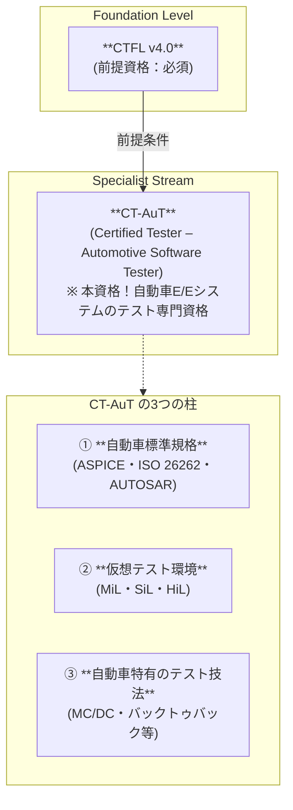
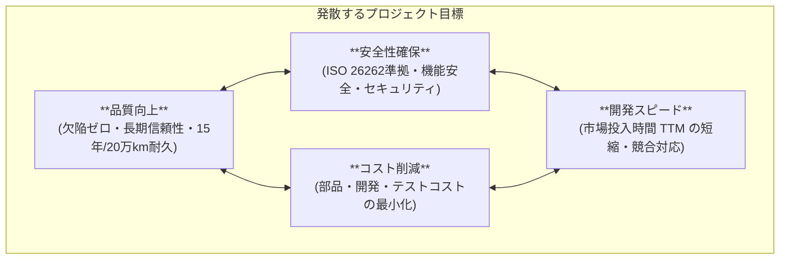
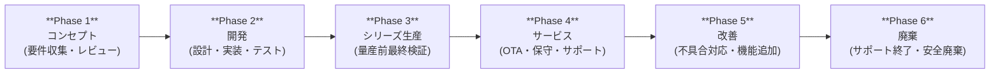
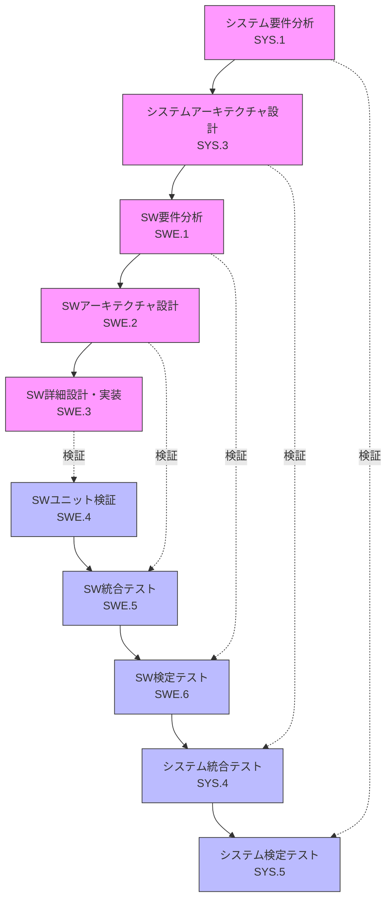
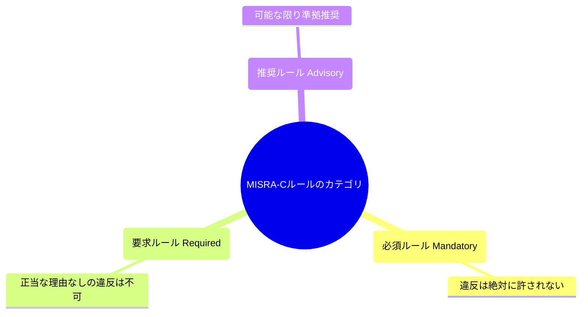
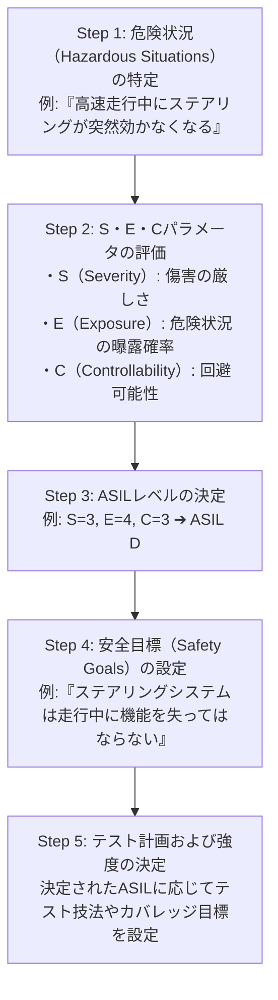

# 🚗 自動車ソフトウェアテスト 完全ガイド 2025

## ISTQB® Certified Tester – Automotive Software Tester (CT-AuT) 準拠

### 初学者から実践者まで｜ステップバイステップ図解解説

> **対応資格**: ISTQB® CT-AuT（Certified Tester – Automotive Software Tester）v2.1.1  
> **試験形式**: 40問 / 合格基準 26/40点（65%） / 60分  
> **前提資格**: ISTQB CTFL（Foundation Level）保有必須  
> **最終更新**: 2025年  
> 📌 **公式ページ**: <https://istqb.org/certifications/certified-tester-automotive-software-tester-ct-aut/>

---

## 📚 目次

1. [CT-AuT 概要と資格ロードマップ](#chapter-0)
2. [Chapter 1: 自動車ソフトウェアテストの概要](#chapter-1)
3. [Chapter 2: E/Eシステムのテストのための標準規格](#chapter-2)
   - [2.1 Automotive SPICE（ASPICE）](#section-2-1)
   - [2.2 ISO 26262（機能安全）](#section-2-2)
   - [2.3 AUTOSAR](#section-2-3)
   - [2.4 標準規格の比較](#section-2-4)
4. [Chapter 3: 仮想環境でのテスト（XiL）](#chapter-3)
5. [Chapter 4: 自動車特有の静的・動的テスト技法](#chapter-4)
6. [試験対策・サンプル問題](#exam-tips)
7. [参照URL一覧](#references)

---

<a id="chapter-0"></a>

## 🌟 Chapter 0: CT-AuT 概要と資格ロードマップ

### 0.1 CT-AuT とは何か？



**CT-AuT（Certified Tester – Automotive Software Tester）** は、自動車業界の電気/電子（E/E）システムのテスト専門家を認定するISTQBのスペシャリスト資格です。ISO 26262・ASPICE・AUTOSARなどの業界標準に基づいたテスト手法を体系的に習得できます。

### 0.2 試験概要

#### CT-AuT v2.1.1 試験スペック

| 項目 | 詳細 |
| :--- | :--- |
| **問題数** | 40問 |
| **合格点** | 26点（40点満点 / 65%以上で合格） |
| **合格率目標** | 約65% |
| **試験時間** | 60分（英語非母語者の場合は +25% = 75分） |
| **前提条件** | CTFL（必須） |
| **シラバスバージョン** | v2.1.1（最新版） |

📌 試験情報公式: <https://istqb.org/certifications/certified-tester-automotive-software-tester-ct-aut/>  
📌 シラバスダウンロード: <https://istqb.org/?sdm_process_download=1&download_id=3615>  
📌 サンプル試験問題: <https://istqb.org/?sdm_process_download=1&download_id=3616>  
📌 サンプル試験解答: <https://istqb.org/?sdm_process_download=1&download_id=3617>

### 0.3 対象者

CT-AuT 資格は以下のような方を対象としています：

| 役割 | CT-AuT の活用場面 |
|------|------------------|
| **ソフトウェアテスター** | 車載ソフトのテスト手法・標準規格の習得 |
| **QAエンジニア** | 自動車品質保証プロセスの理解 |
| **テストアナリスト/エンジニア** | 車載E/Eシステムの分析・設計 |
| **テストマネージャー** | リスクベースのテスト計画立案 |
| **ソフトウェア開発者** | テストの観点からの設計品質向上 |
| **プロジェクト/品質マネージャー** | 自動車標準規格への準拠確認 |
| **システムアナリスト（BA）** | 車載ソフト要件のテスト可能性確認 |

### 0.4 ビジネスアウトカム（4つの目標）

CT-AuT 取得者が達成できる4つのビジネス目標：

#### CT-AuT 4つのビジネスアウトカム

| ID | ビジネスアウトカム |
| :--- | :--- |
| **BO1** | テストチームで効果的に協業できる |
| **BO2** | CTFLで習得したテスト技法を自動車プロジェクトの要件に適応させられる |
| **BO3** | ASPICE・ISO 26262等の自動車標準規格の基本要件を理解し、適切なテスト技法を選択できる |
| **BO4** | 仮想テスト環境（MiL・SiL・HiL等）でテスト手法を適用できる |

### 0.5 シラバス構成と学習時間

| 章 | タイトル (和名) | タイトル (英名) | 重要度 / 試験の比重 |
| :--- | :--- | :--- | :--- |
| **Chapter 1** | 自動車ソフトウェアテストの概要 | Introduction to Automotive Software Testing | 中 |
| **Chapter 2** | E/Eシステムのテストのための標準規格 | Standards for the Testing of E/E Systems | **最重要** (ASPICE, ISO 26262, AUTOSAR) |
| **Chapter 3** | 仮想環境でのテスト | Testing in a Virtual Environment (XiL) | 高 |
| **Chapter 4** | 自動車特有 of 静的・動的テスト技法 | Automotive-specific Static and Dynamic Test Techniques | 高 |

---

<a id="chapter-1"></a>

## 🚘 Chapter 1: 自動車ソフトウェアテストの概要

### 1.1 なぜ自動車ソフトウェアテストは特別なのか？

現代の自動車は「走るコンピュータ」です。その複雑さと安全要件は、他のソフトウェア分野とは一線を画しています。

| 指標 | 数値・内容（2024年時点） |
| :--- | :--- |
| **ECU数** | 最大 100個以上（Electronic Control Unit） |
| **コード行数** | 約 1億行（2030年には3億行に増加すると予測） |
| **コード行数（比較）** | 宇宙ステーション: 約150万行 ← 自動車の方がはるかに大規模 |
| **車内ネットワーク** | CAN・LIN・FlexRay・Ethernet等、複数のプロトコルが混在 |
| **セキュリティ脆弱性** | 2024年に530件以上の新しい自動車向け脆弱性が発見された |

📌 参照: [Medium: Automotive Safety 2025](https://medium.com/@j.parganiha/automotive-safety-2025-integrating-aspice-4-0-iso-26262-cybersecurity-1381c190d8b5)

### 1.2 発散するプロジェクト目標（Divergent Project Objectives）

自動車プロジェクトは複数の対立する目標を同時に達成する必要があります。



**テスターへの影響：**

- テストの「優先順位付け」が極めて重要（リソースは有限）
- リスクベーステストで安全クリティカルな機能を優先
- 標準規格への準拠確認がテスト活動の一部となる

### 1.3 製品の複雑性の増大

| システムカテゴリ | 主要機能・ECU例 |
| :--- | :--- |
| **パワートレイン** | エンジン制御・トランスミッション |
| **シャシー制御** | ABS・ESC・電動パワーステアリング（EPS） |
| **ADAS** | 自動緊急ブレーキ・車線維持支援・ACC（アダプティブクルーズコントロール） |
| **インフォテインメント** | カーナビ・オーディオ・スマートフォン連携 |
| **ボディ制御** | エアコン・照明・ドアロック |
| **安全システム** | エアバッグ・シートベルトテンショナー |
| **通信** | V2X（車両と外界の通信）・OTA（Over-The-Air）更新 |
| **電動化** | BMS（バッテリー管理システム）・回生ブレーキ |

> 📌 これらすべてのソフトウェアをテストするのが CT-AuT の守備範囲です。

### 1.4 システムライフサイクルの6つのフェーズ

CT-AuT シラバスでは、自動車システム開発の「6つのジェネリックフェーズ」を定義しています：



各フェーズにおけるテスターの具体的な役割：

- **Phase 1: コンセプト (Concept)**
  - 製品コンセプトの定義、顧客要件の収集
  - テスターの役割：テスト可能性の観点から要件レビューに参加
- **Phase 2: 開発 (Development)**
  - システム・ソフトウェア・ハードウェアの開発
  - テスターの役割：テスト計画、テスト設計、テスト環境の構築と実行
- **Phase 3: シリーズ生産 (Series Production)**
  - 量産に向けた製品 of 最終検証
  - テスターの役割：量産前最終テスト、サンプルテスト
- **Phase 4: サービス (Service)**
  - 市場投入後のサービス・保守
  - テスターの役割：OTA（Over-The-Air）アップデートのテスト、市場不具合の解析支援
- **Phase 5: 改善 (Improvement)**
  - フィールド不具合への対応、機能改善
  - テスターの役割：影響度分析に基づくリグレッションテスト、改善確認テスト
- **Phase 6: 廃棄 (Disposal / End of Life)**
  - 製品の生産終了・廃棄処理
  - テスターの役割：サポート終了後のシステム安全性確認

### 1.5 リリースプロセスへのテスターの貢献

自動車のリリース（量産承認）プロセスにおけるテスターの役割：

> **テスターがリリースプロセスに貢献する主な活動：**
>
> - **テスト計画の立案とステークホルダーへの提示**: テストの全体方針とスケジュールを定義
> - **標準規格（ASPICE・ISO 26262）への準拠確認**: 要求されるプロセスやテスト強度の検証
> - **テスト結果のエビデンス作成（型式認証に必要）**: 監査や認証に耐えうる証跡の作成
> - **残存リスクの評価・報告（Go/No-Go 判断の支援）**: 未解決の不具合やリスクの可視化
> - **変更管理に伴うリグレッションテストの実施**: 修正による影響範囲の検証
> - **サプライヤーのテスト成果物のレビュー**: 外部調達モジュールの品質担保
>
> > [!IMPORTANT]
> > 自動車業界ではテスト証跡（エビデンス）が法的要件・認証取得に直結するため、テスト記録の正確性・完全性が特に重要！

---

<a id="chapter-2"></a>

## 📐 Chapter 2: E/Eシステムのテストのための標準規格

自動車業界では、国際標準規格への準拠が「法的要件」または「商慣行上の義務」として求められます。CT-AuT ではこの3つの主要標準規格を扱います。

| 規格名 | 焦点 |
| :--- | :--- |
| **Automotive SPICE (ASPICE)** | ソフトウェア開発プロセスの成熟度・能力<br>「どのように開発するか」のプロセス評価 |
| **ISO 26262** | E/Eシステムの機能安全<br>「どれだけ安全か」の安全性評価 |
| **AUTOSAR** | 車載ソフトウェアアーキテクチャの標準化<br>「どのように構成するか」のアーキテクチャ標準 |

---

<a id="section-2-1"></a>

### 2.1 Automotive SPICE（ASPICE）

#### 2.1.1 ASPICEとは何か？

> **Automotive Software Process Improvement and Capability dEtermination (ASPICE)**
>
> - **読み方**: エーエスパイス または アスパイス
> - **元となった標準**: ISO/IEC 15504 (SPICE) → 自動車業界向けに特化
> - **策定**: 欧州自動車メーカー (OEM) が主導して策定
> - **目的**:
>   > 自動車OEMがサプライヤーの開発能力を客観的に評価するための共通フレームワークを提供すること
> - **主要OEMの要件 (一般的な要求)**:
>   - BMW, Audi, VW, Mercedes: 能力レベル2以上を要求
>   - 一部先進システムでは: 能力レベル3以上を要求

📌 参照: [Navigating Automotive Software Compliance: ASPICE vs. ISO 26262](https://www.qt.io/quality-assurance/blog/navigating-automotive-software-compliance)  
📌 参照: [LDRA: ISO 26262, functional safety, and ASILs](https://ldra.com/iso-26262/)

#### 2.1.2 ASPICEのプロセス能力レベル（0〜5）

**ASPICEの6段階能力レベル（試験頻出！）**

| レベル | 名称 | 説明 |
| :---: | :--- | :--- |
| **0** | **Incomplete** (不完全) | プロセスが未実施または目的未達成。最低レベル。ほぼ無秩序な状態。 |
| **1** | **Performed** (実施済み) | プロセスが実施され、目的は達成。ただし計画・管理は不十分。 |
| **2** | **Managed** (管理済み) ★ | プロセスが計画・監視・調整されている。**← OEMが最低限要求する水準** |
| **3** | **Established** (確立済み) ★★ | 定義されたプロセスが組織全体で標準化。← 高い水準。達成が困難。 |
| **4** | **Predictable** (予測可能) | 定量的データでプロセスを管理・制御。統計的プロセス制御を適用。 |
| **5** | **Innovating** (革新的) | 継続的改善・イノベーションを実施。最高レベル。非常に稀。 |

**★ 実務での目安:**

- **レベル2**: 多くのTier1サプライヤーが達成を目標とするライン
- **レベル3**: 達成できる企業は少数。大きな競争優位になる

#### 2.1.3 ASPICEのプロセスグループ

ASPICEでは、開発プロセスを複数の「プロセスグループ」に分類しています：

> **Primary Life Cycle Processes (主要ライフサイクルプロセス)**
>
> - **SYS (System) プロセス**:
>   - **SYS.1**: 要件分析
>   - **SYS.2**: システム要件分析
>   - **SYS.3**: システムアーキテクチャ設計
>   - **SYS.4**: システム統合・統合テスト
>   - **SYS.5**: システム検定テスト
> - **SWE (Software Engineering) プロセス**:
>   - **SWE.1**: ソフトウェア要件分析
>   - **SWE.2**: ソフトウェアアーキテクチャ設計
>   - **SWE.3**: ソフトウェア詳細設計・ユニット構築
>   - **SWE.4**: ソフトウェアユニット検証 (★テスターの活動範囲)
>   - **SWE.5**: ソフトウェア統合・統合テスト (★テスターの活動範囲)
>   - **SWE.6**: ソフトウェア検定テスト (★テスターの活動範囲)
>
> ※ **SWE.4〜SWE.6** がテスターが主に担当するプロセスです。

#### 2.1.4 ASPICEとVモデルの関係



---

<a id="section-2-2"></a>

### 2.2 ISO 26262（機能安全：Functional Safety）

#### 2.2.1 ISO 26262とは何か？

**ISO 26262 (Road vehicles – Functional safety)**

- **初版**: 2011年
- **改訂版**: 2018年 (第2版)
- **対象**: 自動車の電気/電子 (E/E) システムの機能安全
- **機能安全 (Functional Safety) の定義**:
  電気/電子システムの誤作動挙動に起因するハザードによる不合理なリスクが存在しないこと

つまり、ソフトウェアやハードウェアのバグが、人命に関わる事故を引き起こさないようにするための規格です。

#### 2.2.2 ISO 26262のパーツ構成（12パーツ）

**ISO 26262 の12のパーツ (テスターに関連する主要パーツ):**

- **Part 1**: 用語定義 (Vocabulary)
- **Part 2**: 機能安全の管理 (Management of Functional Safety)
- **Part 3**: コンセプトフェーズ (Concept Phase)
- **Part 4**: システムレベルの製品開発 ★
- **Part 5**: ハードウェアレベルの製品開発 ★
- **Part 6**: ソフトウェアレベルの製品開発 ★ *(最重要)*
- **Part 7**: 生産・運用・サービス・廃棄
- **Part 8**: 支援プロセス (テストツールの資格認定など) ★
- **Part 9**: ASIL指向の安全解析（半導体向け）
- **Part 10**: ガイドライン (規格の解説)
- **Part 11**: 半導体への適用ガイドライン
- **Part 12**: 二輪車への適用ガイドライン (第2版で追加)

※ ★はテスターに関連する主要なパーツです。特に **Part 4, 5, 6, 8** が重要で、**Part 6 (ソフトウェアレベル)** のメソッドテーブルは試験に頻出します。

#### 2.2.3 ASIL（自動車安全整合性レベル）- 試験最頻出！

ASIL（Automotive Safety Integrity Level）は、ISO 26262の核心概念です。

| ASILレベル | 説明 | 具体例 |
| :---: | :--- | :--- |
| **QM**<br>(Quality Management) | 安全要件なし。通常の品質管理プロセスで対応可能。 | インフォテインメント（一部）、インテリア照明 |
| **ASIL A** | 最低レベルの安全要件。危害の可能性は低い・制御可能性が高い。 | ワイパー制御、ウォッシャー液システム |
| **ASIL B** | 中程度の安全要件。 | 速度計、ヘッドランプ（一部） |
| **ASIL C** | 高い安全要件。 | エアバッグ（一部）、パワーウィンドウ |
| **ASIL D** | 最高レベルの安全要件（最も厳格）。危害の可能性が高い・制御困難・致命的影響の可能性。 | ADAS（自動緊急ブレーキ、操舵制御）、パワーステアリング |

> **★ 各レベルの特徴:**
>
> - **ASIL D**: 最も厳格であり、テストの網羅率・精度の要求が最も高い。
> - **ASIL A**: 比較的緩やかであり、基本的なテスト技法で対応可能。
> - **QM**: 通常の品質管理（標準的な開発プロセス）で十分対応可能。

#### 2.2.4 ASIL決定のための3要素（HARA）

ASILは**ハザード分析とリスク評価（HARA: Hazard Analysis and Risk Assessment）** によって決定されます。

> **ASIL = 危害度 (Severity) × 暴露 (Exposure) × 制御可能性 (Controllability)**

| 要素 | 説明 | スコアの定義 |
| :--- | :--- | :--- |
| **S** (危害度)<br>Severity | 危害の深刻さ・人命への影響 | **S0**: 危害なし<br>**S1**: 軽傷<br>**S2**: 重傷<br>**S3**: 致命的・死亡 |
| **E** (暴露)<br>Exposure | 危険な状況が発生する確率・頻度 | **E0**: 信じられないほど低い<br>**E1**: 非常に低い<br>**E2**: 低い<br>**E3**: 中程度<br>**E4**: 高い（常時発生） |
| **C** (制御可能性)<br>Controllability | ドライバーが危険を回避できる確率 | **C0**: 一般に制御可能<br>**C1**: 単純な制御で回避可能<br>**C2**: 通常は制御可能<br>**C3**: 制御困難・不可能 |

**★ ASILの決定方法:**

- S × E × C の組み合わせによって ASIL (A〜D) が決定されます。
- 例: **S3** (致命的) × **E4** (常時) × **C3** (制御不可) $\rightarrow$ **ASIL D** (最高レベルの要件)

📌 参照: [Parasoft: ISO 26262 Software Compliance](https://www.parasoft.com/learning-center/iso-26262/what-is/)  
📌 参照: [Lemberg Solutions: ASPICE and ISO 26262](https://lembergsolutions.com/blog/impact-automotive-spice-and-iso-26262-your-engineering-process)

#### 2.2.5 ASILとテスト手法の関係（メソッドテーブル）- 試験頻出！

ISO 26262 Part 6 では、ASILレベルに応じた推奨テスト手法を「メソッドテーブル」で定義しています。

**メソッドテーブルの記号の読み方:**

- **`++`**: 強く推奨（高いASILレベルではほぼ必須とされる手法）
- **`+`**: 推奨
- **`o`**: 推奨も非推奨もなし（使用しても問題ない）
- **`--`**: 使用禁止

**ASILレベル別の主要テスト技法（Part 6 Table 10 より抜粋・概略）**

| テスト技法 | QM | ASIL A | ASIL B | ASIL C | ASIL D |
| :--- | :---: | :---: | :---: | :---: | :---: |
| **ステートメントカバレッジ 100%** | + | + | + | ++ | ++ |
| **ブランチカバレッジ 100%** | o | + | + | ++ | ++ |
| **MC/DC カバレッジ (後述)** | o | o | o | + | **++** |
| **境界値分析 (BVA)** | + | + | + | ++ | ++ |
| **クラスパーティション (EP)** | + | + | + | ++ | ++ |
| **要件ベーステスト** | ++ | ++ | ++ | ++ | ++ |
| **バックトゥバックテスト (後述)** | o | o | + | + | **++** |

> [!IMPORTANT]
> ASIL D になるほど要求されるテスト技法が増え、網羅率の要件も厳しくなります（例: MC/DC は ASIL D でのみ `++` となるため極めて重要です）。

#### 2.2.6 ISO 26262のテストレベルとISTQBの対応

**ISTQB テストレベル ←→ ISO 26262 / ASPICE テストレベルの対応：**

| ISTQB テストレベル | ISO 26262 / ASPICE | 備考 |
| :--- | :--- | :--- |
| **コンポーネントテスト**<br>（ユニットテスト） | SW ユニットテスト（SWE.4） | |
| **コンポーネント統合テスト** | SW 統合テスト（SWE.5） | |
| **システムテスト** | SW 検定テスト（SWE.6） | |
| **システム統合テスト** | SYS 統合テスト（SYS.4） | |
| **受入テスト** | SYS 検定テスト（SYS.5） | ※ ISO 26262 では HW/SW混在システムも対象となる（ISTQBはSWのみ） |

---

<a id="section-2-3"></a>

### 2.3 AUTOSAR（自動車オープンシステムアーキテクチャ）

#### 2.3.1 AUTOSARとは何か？

**AUTOSAR（AUTomotive Open System ARchitecture）の概要**

- **設立**: 2003年
- **設立者**: BMW・Bosch・Continental・Daimler・Ford・GM・PSA・Siemens VDO・Toyota・Volkswagen など
- **目的**:
  車載ソフトウェアの標準化されたアーキテクチャを定義し、ハードウェア依存のコードとアプリケーションコードを分離することで、ソフトウェアの再利用性と移植性を高める。
- **2種類のAUTOSAR**:
  - **Classic AUTOSAR**: 従来型ECU向け（C言語ベース）
  - **Adaptive AUTOSAR**: 高性能ECU・自動運転向け（C++ベース）

📌 参照: [Synopsys: MISRA-AUTOSAR Standards](https://www.synopsys.com/automotive/misra-autosar-standards.html)

#### 2.3.2 AUTOSARのアーキテクチャ構造

Classic AUTOSARの階層構造：

```mermaid
flowchart TD
    App["アプリケーション層 (Application Layer)<br>ソフトウェアコンポーネント (SWC)<br>← 機能を実装するアプリケーションコード"]
    RTE["ランタイム環境 (RTE: Runtime Environment)<br>← SWC間の通信を仲介する中間層"]
    
    subgraph BSW ["基本ソフトウェア (BSW: Basic Software) - OS・通信・診断・メモリ管理等"]
        MCAL["マイコン抽象化層 (MCAL)<br>← ハードウェアへの直接アクセスを抽象化"]
    end
    
    HW["マイコン (Microcontroller) ハードウェア"]

    App === RTE
    RTE === BSW
    BSW === HW

    style App fill:#1e293b,stroke:#3b82f6,stroke-width:2px
    style RTE fill:#1e293b,stroke:#10b981,stroke-width:2px
    style BSW fill:#0f172a,stroke:#6366f1,stroke-width:2px
    style MCAL fill:#1e293b,stroke:#f59e0b,stroke-width:1px
    style HW fill:#1e293b,stroke:#ef4444,stroke-width:2px
```



#### 2.3.3 AUTOSARがテスターに与える影響

##### テスターの視点からのAUTOSAR

- **① MCALのテスト（ホワイトボックス）**:
  - MISRA-C/C++ コーディング規約への準拠確認
  - 静的解析ツールによるコード品質チェック
  - ユニットテスト（SWE.4相当）
- **② BSWのテスト**:
  - 通信スタック（CAN・LIN・Ethernet等）のテスト
  - 診断機能（UDS: Unified Diagnostic Services）のテスト
- **③ SWCのテスト**:
  - アプリケーション機能の検証
  - RTE経由の通信インターフェーステスト
- **④ AUTOSAR準拠ツールの活用**:
  - CANalyzer（Vectorツール）でCAN通信をテスト
  - dSPACE の HIL システムで仮想テスト環境を構築
  - AUTOSAR Explorer でアーキテクチャを確認
- **⑤ MISRA-C コーディング規約の確認**:
  - MISRA-C:2012 が現在の主流
  - 静的解析ツール（Polyspace・Klocwork等）を使用
  - AUTOSAR C++14 も重要（Adaptive AUTOSARで使用）

📌 参照: [Sasken: Automotive Testing in the AUTOSAR age](https://blog.sasken.com/testing-automotive-product-engineering-in-the-autosar-age)  
📌 参照: [QA Systems: AUTOSAR OS Test and Validation](https://www.qa-systems.com/blog/autosar-os-test-and-validation-iso-26262/)

---

<a id="section-2-4"></a>

### 2.4 標準規格の比較（試験頻出！）

**ASPICE vs ISO 26262 vs AUTOSAR の違い（重要！）**

| 観点 | ASPICE | ISO 26262 |
| :--- | :--- | :--- |
| **主な目的** | プロセス成熟度評価 | 機能安全の確保 |
| **焦点** | 「どのように作るか」 | 「どれだけ安全か」 |
| **評価指標** | 能力レベル（0〜5） | ASILレベル（QM/A〜D） |
| **適用対象** | 開発プロセス全般 | E/Eシステムの安全機能 |
| **アセスメント方法** | プロセスアセスメント | 安全監査・FMEA・FTA |
| **自動車業界での役割** | サプライヤー選定基準 | 製品安全性の認証根拠 |
| **AUTOSAR との関係** | ASPICE プロセスで AUTOSAR開発を管理 | ASIL要件をAUTOSARアーキテクチャで設計に反映 |

> [!TIP]
> **試験対策用の覚え方：**

- **ASPICE** = **Process**（プロセスの品質）
- **ISO 26262** = **Safety**（安全性の保証）
- **AUTOSAR** = **Architecture**（アーキテクチャの標準化）

📌 参照: [QT.io: Navigating Automotive Software Compliance](https://www.qt.io/quality-assurance/blog/navigating-automotive-software-compliance)  
📌 参照: [Embitel: ASPICE and ISO 26262](https://www.embitel.com/blog/embedded-blog/aspice-and-iso-26262-in-automotive-software-development)

---

<a id="chapter-3"></a>

## 🔬 Chapter 3: 仮想環境でのテスト（XiL Test Environments）

### 3.1 なぜ仮想テスト環境が必要か？

#### 仮想テスト環境が必要な理由と解決策

- **問題 1**: 実際のハードウェアが存在しない（開発初期段階）
- **問題 2**: 実機テストは高コスト（ECU1台数十万〜数百万円）
- **問題 3**: 危険なシナリオ（事故・故障）をリアルで再現できない
- **問題 4**: テストの再現性確保が困難（環境変動の影響）
- **問題 5**: テストの並列実行ができない（実機は1台しかない）

> [!TIP]
> **解決策 ＝ 仮想テスト環境（XiL）！**
> **XiL** ＝ **X-in-the-Loop**（Xには Model / Software / Processor / Hardware / Vehicle が入る）

### 3.2 XiLテスト環境の全体像

```mermaid
flowchart LR
    MiL["<b>MiL</b><br>Model-in-the-Loop<br>(最初期 / モデル)"]
    SiL["<b>SiL</b><br>Software-in-the-Loop<br>(設計中期 / SW確認)"]
    PiL["<b>PiL</b><br>Processor-in-the-Loop<br>(コード生成後)"]
    HiL["<b>HiL</b><br>Hardware-in-the-Loop<br>(試作ECU搭載後)"]
    ViL["<b>ViL</b><br>Vehicle-in-the-Loop<br>(実車両 / 最終確認)"]

    MiL --> SiL --> PiL --> HiL --> ViL

    style MiL fill:#1e293b,stroke:#3b82f6,stroke-width:2px
    style SiL fill:#1e293b,stroke:#10b981,stroke-width:2px
    style PiL fill:#1e293b,stroke:#f59e0b,stroke-width:2px
    style HiL fill:#1e293b,stroke:#ef4444,stroke-width:2px
    style ViL fill:#1e293b,stroke:#a855f7,stroke-width:2px
```



| 項目 | MiL | SiL | PiL | HiL | ViL |
| :--- | :---: | :---: | :---: | :---: | :---: |
| **仮想度** | 最高 | 高 | 中 | 低 | 最低（実機） |
| **テスト時期** | 最初期 | 設計中期 | コード生成後 | 試作ECU搭載後 | 実車両（最終確認） |
| **テスト対象** | シミュレーションモデル | ソースコード（PC上） | ターゲットコード（評価ボード） | 物理ECU（実機） | 実車・実システム |
| **コスト** | 最低 | 低 | 中 | 高 | 最高 |
| **現実性** | 低 | 低 | 中 | 高 | 最高 |
| **実行速度** | 最速（シミュレーション） | 速 | 中 | 遅（リアルタイム） | 最遅 |

### 3.3 各XiLテスト環境の詳細解説

#### 3.3.1 MiL（Model-in-the-Loop：モデルインザループ）

##### MiL（Model-in-the-Loop）


- **実施タイミング**: 最初期（要件定義〜基本設計段階）
- **使用ツール**: MATLAB/Simulink、ETAS ASCET、dSPACE TargetLink
- **何をテストするか**:
  - 制御ロジックのアルゴリズムの正しさ
  - PID制御・状態遷移・安全ロジックの動作確認

> [!NOTE]
> **MiL のメリット・デメリット**
>
> | メリット | デメリット |
> | :--- | :--- |
> | ✓ ハードウェア不要 → 最低コストで早期テスト可能 | ✗ モデルと実際のコードの乖離がある |
> | ✓ アルゴリズムの基本動作を素早く検証 | ✗ タイミング・リアルタイム挙動は検証できない |
> | ✓ 繰り返しテストが容易（リセット一発） | ✗ ハードウェア固有の問題を発見できない |
> | ✓ 危険シナリオも安全に実施可能 | |

#### 3.3.2 SiL（Software-in-the-Loop：ソフトウェアインザループ）

##### SiL（Software-in-the-Loop）


- **実施タイミング**: 開発中期（コーディング〜統合テスト段階）
- **使用ツール**: QNX・Linux ホスト環境、GoogleTest、Vector CANoe
- **MiLとの違い**:
  - **MiL**: アルゴリズムモデル（.slx等）をテスト
  - **SiL**: 実際のCコード（コンパイル済みバイナリ）をテスト

> [!NOTE]
> **SiL のメリット・デメリット**
>
> | メリット | デメリット |
> | :--- | :--- |
> | ✓ 実際のプロダクションコードをテスト可能 | ✗ タイミング挙動は検証できない |
> | ✓ ハードウェアなしで統合テストが可能 | ✗ ハードウェア固有の問題は見つけられない |
> | ✓ CI/CDへの統合が容易 | |
> | ✓ バックトゥバックテスト（MiL vs SiL比較）が可能 | |

- **何をテストするか**:
  - コード生成の正しさ（MiL $\rightarrow$ SiL のバックトゥバックテスト）
  - ソフトウェア機能テスト
  - MISRA-C 準拠確認のための静的解析との組み合わせ

#### 3.3.3 PiL（Processor-in-the-Loop：プロセッサインザループ）

##### PiL（Processor-in-the-Loop）

```mermaid
graph TD
    subgraph Host ["PCホスト環境"]
        Frame["テストフレームワーク"]
        Plant["環境シミュレーション"]
    end
    
    Target["<b>実際のターゲットプロセッサ（ECU用マイコン）</b><br>※ 実際のCPU上でコードが動作"]

    Frame <--> |通信ケーブル| Target
    Plant <--> Target

    style Host fill:#0f172a,stroke:#64748b,stroke-width:2px
    style Target fill:#1e293b,stroke:#ef4444,stroke-width:2px
```



- **実施タイミング**: SiLの後、HiLの前（コード生成後）
- **何をテストするか**:
  - タイミング挙動・リアルタイム応答性
  - プロセッサ固有のバグ（エンディアン・スタックオーバーフロー等）

> [!NOTE]
**PiL のメリット**

- ✓ 実際のプロセッサ上での実行時間・タイミングを検証
- ✓ プロセッサ固有の問題（エンディアン、整数オーバーフロー等）を発見
- ✓ コードカバレッジを実際のCPU上で測定

#### 3.3.4 HiL（Hardware-in-the-Loop：ハードウェアインザループ）- 最重要！

##### HiL（Hardware-in-the-Loop）

```mermaid
graph TD
    PC["<b>テストPCホスト</b><br>テストスクリプト・テスト管理ツール"]
    Sim["<b>HiL リアルタイムシミュレータ</b><br>車両・環境のリアルタイムシミュレーション<br>(dSPACE / NI VeriStand 等)"]
    ECU["<b>実際のECU（テスト対象）</b><br>本物のマイコン・基板"]

    PC <--> |USB / LAN| Sim
    Sim <--> |電気信号 (アナログ/デジタル/バス)| ECU
    
    style PC fill:#1e293b,stroke:#3b82f6,stroke-width:2px
    style Sim fill:#1e293b,stroke:#10b981,stroke-width:2px
    style ECU fill:#1e293b,stroke:#ef4444,stroke-width:2px
```

- **実施タイミング**: 試作ECU完成後（量産前の最終検証段階）
- **使用ツール**: dSPACE SCALEXIO、NI VeriStand、ETAS LABcar、Vector CANoe、INCA（ETAS）

> [!IMPORTANT]
> **HiLの動作イメージ**
> ECU（Electronic Control Unit）は「本物の車両と接続されている」と錯覚しながら動作し、車両側の挙動（センサー値の入力、アクチュエーターへの出力フィードバック）はリアルタイムシミュレーターが電気信号レベルで模倣します。
> [!NOTE]
> **HiL のメリット・デメリット**
>
> | メリット | デメリット |
> | :--- | :--- |
> | ✓ 実際のECUを使って現実に近い環境でテスト | ✗ システム構築コストが高い（数百万〜数千万円） |
> | ✓ 危険なシナリオ（センサー故障・通信エラー）を安全に再現 | ✗ セットアップに時間がかかる |
> | ✓ リアルタイム挙動・割り込みタイミングを検証 | ✗ HiL システム自体の保守が必要 |
> | ✓ ISO 26262 の故障注入テストにも対応 | |

- **何をテストするか**:
  - ECUの通信動作（CAN・LIN・FlexRay・Ethernet）
  - センサー・アクチュエーターとのインターフェース
  - リアルタイムタイミング要件
  - 故障シナリオ（フォールトインジェクション）
  - ASIL要件への適合確認（ISO 26262）

#### 3.3.5 ViL（Vehicle-in-the-Loop）とその他

##### その他のXiLテスト環境

- **ViL（Vehicle-in-the-Loop）**:
  - 実際の車両を使い、一部のコンポーネントを仮想化してテストします。
  - 開発終盤・最終検証段階で使用されます。
- **CiL（Component-in-the-Loop）**:
  - 特定のコンポーネント（センサー等）を実物で、残りを仮想化してテストします。
- **DiL（Driver-in-the-Loop）**:
  - ドライバーシミュレーター（ゲーム用ハンドル等）を使ったテストです。
  - 運転操作を含むシナリオの検証（UX・ADAS検証等）で使用されます。

📌 参照: [Engineering.com: How is HIL testing used](https://www.engineering.com/how-is-hil-testing-used-in-automotive-engineering/)  
📌 参照: [NashTech Blog: MIL, SIL, PIL and HIL](https://blog.nashtechglobal.com/understanding-the-testing-environments-in-automotive-development-mil-sil-pil-and-hil/)  
📌 参照: [MDPI: Evaluation of SiL Testing Potential](https://www.mdpi.com/2624-8921/6/2/44)

### 3.4 XiLテスト環境の比較表（試験対策チートシート）

| 環境 | 実物コンポーネント | 実施タイミング | コスト | 何を検証するか |
| :--- | :--- | :--- | :---: | :--- |
| **MiL** | なし（全てモデル） | 最初期（設計初期） | 低 | アルゴリズムの正しさ |
| **SiL** | ソフトウェア（コード） | 開発中期（コーディング後） | 低〜中 | コードの正しさ、SW機能テスト |
| **PiL** | プロセッサ（マイコン） | コード生成後 | 中 | タイミング・プロセッサ挙動 |
| **HiL** ★ | ECU全体（本物のHW） | 試作ECU完成後（量産前） | 高 | ECU動作・通信・故障注入 |
| **ViL** | 実車両 | 最終検証（開発終盤） | 最高 | 実車両での総合動作確認 |

### 3.5 バックトゥバックテスト（Back-to-Back Testing）

XiL環境で特に重要なテスト技法です（試験頻出！）。

> **定義**:
> 同じ入力を2つの異なる実装に与えて、出力を比較することで正しさを検証するテスト技法。

#### 典型的な使用パターン

```mermaid
graph TD
    Input["同じ入力信号"]
    
    subgraph MiL_vs_SiL ["パターン1: MiL vs SiL 比較 (コード生成検証)"]
        Mil["MiLモデル"]
        Sil["SiLコード"]
        Comp1{"出力比較"}
        
        Mil --> |出力A| Comp1
        Sil --> |出力B| Comp1
        Comp1 --> |一致| Pass1["コード生成が正しい ✓"]
        Comp1 --> |不一致| Fail1["コード生成に問題あり ✗"]
    end

    subgraph SiL_vs_HiL ["パターン2: SiL vs HiL 比較 (ECU動作検証)"]
        Sil2["SiLテスト"]
        Hil["HiLテスト"]
        Comp2{"出力比較"}
        
        Sil2 --> |出力A| Comp2
        Hil --> |出力B| Comp2
        Comp2 --> |一致| Pass2["ECUが正しく動作 ✓"]
        Comp2 --> |不一致| Fail2["HW固有の問題あり ✗"]
    end

    Input --> Mil
    Input --> Sil
    Input --> Sil2
    Input --> Hil

    style MiL_vs_SiL fill:#0f172a,stroke:#3b82f6,stroke-width:1px
    style SiL_vs_HiL fill:#0f172a,stroke:#10b981,stroke-width:1px
```



- **ISO 26262 との関係**:
  - ASIL B〜D で推奨（メソッドテーブルで `++` または `+`）
  - 高ASILシステムでのコード検証に特に有効
- **メリット**:
  - ✓ テストオラクル問題の解決（期待値が不明でも比較可能）
  - ✓ コード生成ツールの正しさを自動的に検証できる
  - ✓ リグレッションテストへの応用も可能

---

<a id="chapter-4"></a>

## ⚙️ Chapter 4: 自動車特有の静的・動的テスト技法

### 4.1 静的テスト技法（Static Test Techniques）

#### 4.1.1 コードレビューとMISRA-C

**MISRA-C（Motor Industry Software Reliability Association – C）**

組み込みシステム（特に自動車）の安全性・移植性・信頼性の低いC言語の書き方を禁止するコーディングガイドラインです。

##### バージョンと関連規格

| 規格・バージョン | 位置づけ・対象 |
| :--- | :--- |
| **MISRA C:2012** | 現在の主流 |
| **MISRA C:2004** | レガシー |
| **MISRA C:2023** | 最新バージョン |
| **MISRA C++2008** | C++向け規格 |
| **AUTOSAR C++14** | C++向け規格（AUTOSARとの統合） |

##### 主要なMISRA-Cルールのカテゴリ



##### MISRA-C が禁止する典型的な書き方の例（教育目的）

- ❌ **`goto`文の使用**
- ❌ **再帰関数の使用**（スタックオーバーフローのリスクがあるため）
- ❌ **動的メモリ割り当て（`malloc`/`free`等）**（メモリリークや断片化のリスクがあるため）
- ❌ **未定義動作を引き起こす可能性のある型変換**
- ❌ **複数代入（`a = b = c`）**

##### 主要な静的解析ツール（自動チェック）

- Polyspace (MathWorks)
- Klocwork (Perforce)
- Parasoft C/C++test
- QA-MISRA (QA Systems)

📌 参照: [Parasoft: ISO 26262 Software Compliance](https://www.parasoft.com/learning-center/iso-26262/what-is/)  
📌 参照: [Black Duck: MISRA and AUTOSAR Coding Compliance](https://www.blackduck.com/blog/misra-autosar-compliance-steps.html)

#### 4.1.2 要件レビュー

##### 自動車特有の要件レビュー観点

- **ASILレベルに対応するテスト技法の適切性確認**: 各ASIL（A〜D）に要求されるテストカバレッジや技法が適切に選択されているか。
- **トレーサビリティの確保**: システム要件、ソフトウェア要件、そしてテストケース間の双方向トレーサビリティが確立されているか。
- **要件の曖昧さの排除**: 「十分な速度で減速する」などの主観的表現を排除し、「0.5秒以内に減速Gが0.3G以上に達すること」のように数値化・定量化されているか。
- **フェールセーフ要件の完全性**: 異常発生時の縮退運転（フェールセーフ）仕様が漏れなく定義されているか。
- **タイミング要件の明確さ**: 制御周期や応答時間（リアルタイム性）の閾値が明確に定められているか。
- **HARA（ハザード分析とリスク評価）との整合性**: 識別された安全目標（Safety Goal）が漏れなくソフトウェア要件にブレイクダウンされているか。

> [!NOTE]
> **ASPICE（Automotive SPICE）における要件レビュー**  
> ASPICEの「SWE.1（ソフトウェア要件分析）」プロセスでは、システム要件からソフトウェア要件へのトレーサビリティ確保に加え、要件自体の**テスト可能性（Testability）**、**完全性（Completeness）**、**一貫性（Consistency）**をレビューによって検証することが必須要件として定められています。

### 4.2 動的テスト技法（Dynamic Test Techniques）

#### 4.2.1 CTFL由来の技法（自動車への適用）

CTFLで学んだ標準的なテスト技法を自動車文脈に適用します：

##### CTFL技法と自動車E/Eシステムへの適用例

| CTFLテスト技法 | 自動車ドメインにおける具体的な適用例 |
| :--- | :--- |
| **同値分割（EP）** | **エンジン回転数のパーティション設定**<br/>・無効値（-10〜-1 rpm）：エラー処理テスト<br/>・アイドリング（700〜900 rpm）：停車時動作テスト<br/>・通常走行（1500〜5000 rpm）：通常制御テスト<br/>・レッドゾーン近傍（5001〜8000 rpm）：高負荷時のフェールセーフテスト |
| **境界値分析（BVA）** | **ABS（アンチロックブレーキ）作動開始速度のテスト**<br/>・作動閾値が 10 km/h の場合、境界値である 9, 10, 11 km/h のそれぞれの速度で走行させ、ABSの動作有無を検証 |
| **状態遷移テスト** | **EV（電気自動車）バッテリーの充電・放電ステートマシンテスト**<br/>・「充電中 ➔ 満充電 ➔ 走行中（放電）➔ 低残量警告 ➔ 緊急シャットダウン」などの各状態間の遷移イベント、ガード条件、アクションを網羅 |
| **デシジョンテーブル** | **ADAS（先進運転支援システム）の自動緊急ブレーキ（AEB）作動判断**<br/>・「前方障害物あり/なし」「車速閾値超過/以下」「ドライバーのブレーキペダル踏み込みあり/なし」といった複数入力条件の論理的組み合わせと、AEB警告/自動ブレーキ作動のアクションの網羅テスト |

#### 4.2.2 MC/DC（修正条件/判定カバレッジ）- 試験頻出！

> **MC/DC（Modified Condition/Decision Coverage：修正条件判定網羅）**
> 自動車の機能安全規格 **ISO 26262** において、**ASIL Cで推奨（+）**、**ASIL Dで強く推奨（++）**されているコードカバレッジ測定基準です。
> **目的:** 複数の条件が組み合わさった複雑な判定において、「他の条件値を固定したまま、ある一つの条件値のみを反転させることで、判定全体の結果が反転する」ことを示し、各条件が判定結果に独立して影響を与えることを証明すること。

##### MC/DC の4つの要件

1. すべての判定（Decision）に対して、結果が True / False の両方になることをテストする。
2. すべての条件（Condition）に対して、評価が True / False の両方になることをテストする。
3. 判定における各条件が、他のすべての条件の値を変更することなく、独立してその判定結果を変化させられることを示す。
4. プログラムのすべてのエントリー（入口）およびイグジット（出口）ポイントを少なくとも1回は通過する。

##### ブランチカバレッジとの違い

- **ブランチ（分岐）カバレッジ**: 判定（`if`文の全体）の True / False を網羅すれば良いため、個々の条件（A, B, C）がどのように判定に寄与しているかまでは検証できません。
- **MC/DC**: 判定全体だけでなく、構成する個々の条件（A, B, C）がそれぞれ独立して結果を左右できることを確認するため、極めて論理的エラーを検出しやすくなります。

##### 具体例

次のような安全機能の作動条件があるとします。

```c
if (A && B && C) {
    /* 安全機能を作動させる */
}
```

MC/DCを満たすテストケースの設計は以下の通りになります。

| テストケース（TC） | 条件 A | 条件 B | 条件 C | 判定結果 | 証明する独立影響 |
| :---: | :---: | :---: | :---: | :---: | :--- |
| **TC1** | **T** | **T** | **T** | **True** | ベースケース（基準値） |
| **TC2** | **F** | **T** | **T** | **False** | **条件 A** の独立影響（TC1と比較してAのみ変化 ➔ 結果反転） |
| **TC3** | **T** | **F** | **T** | **False** | **条件 B** の独立影響（TC1と比較してBのみ変化 ➔ 結果反転） |
| **TC4** | **T** | **T** | **F** | **False** | **条件 C** の独立影響（TC1と比較してCのみ変化 ➔ 結果反転） |

- **効率性**: 3つの論理入力がある場合、全論理組み合わせは $2^3 = 8$ 通りですが、MC/DCを適用することでわずか **4テストケース** で同等以上の安全性保証が可能になります（一般に $N$ 個の条件に対して $N+1$ 個のテストケースで済みます）。

#### 4.2.3 条件テスト（Condition Testing）

##### 条件テスト（Condition Testing）の種類

1. **条件カバレッジ（Condition Coverage）**
   - 判定を構成する個々の条件（Condition）が、少なくとも1回は True と False の両方の値を評価するようにテストします。
   - *例*: `if (A && B && C)` において、A, B, C がそれぞれ True / False となるような入力を与えます。
2. **条件判定カバレッジ（Condition/Decision Coverage）**
   - 個々の条件の True / False に加え、判定全体（Decision）の結果も True / False の両方を評価するようにテストします。
3. **修正条件判定カバレッジ（MC/DC）**
   - 前述の通り、各条件が他の条件に影響されることなく、独立して判定結果を変化させられることを示す最も厳格な網羅基準です。

> [!IMPORTANT]
> **自動車開発における条件テストの重要性**

- **複雑なADAS制御ロジックの検証**: ADAS（先進運転支援システム）や自動運転ロジックでは多層的な分岐が発生するため、単なる分岐網羅（ブランチカバレッジ）では検出しきれない論理欠陥の検出に必須となります。
- **規格準拠の証明**: ISO 26262 における ASIL C および D での要件（強く推奨）を満たしていることの証明資料として、カバレッジ結果の提出が求められます。
- **代表的な計測ツール**: カバレッジ計測は、LDRA tool suite、Cantata、Polyspace Test、VectorCAST などの自動解析ツールを使用して開発プロセス内で自動計測されます。

#### 4.2.4 バックトゥバックテスト（再掲・動的テスト視点）

##### 動的テストとしてのバックトゥバックテストの適用場面

| 適用場面 | 具体的な目的・比較対象 |
| :--- | :--- |
| **1. コード自動生成の検証** | MATLAB/Simulink 等の **Model-in-the-Loop（MiL）** と、自動生成されたCコードによる **Software-in-the-Loop（SiL）** を同一入力で実行し、生成コードに不具合（ジェネレータのバグ等）が混入していないか出力を比較検証する。 |
| **2. リファクタリング後の回帰テスト** | 機能追加を行わないリファクタリングにおいて、**旧バージョンECU** と **新バージョンECU** に同一入力を与え、動作や出力に意図しない変更（デグレード）が発生していないかを比較検証する。 |
| **3. マイコンポーティングの検証** | 異なるハードウェアプラットフォーム（例: **A社製マイコン** ➔ **B社製マイコン**）にソフトウェアを移植した際、それぞれのターゲットボードで同一のテストを実行し、コンパイラやマイコン依存の不具合がないか比較検証する。 |

> [!CAUTION]
> **バックトゥバックテスト実施上の注意点**

- **許容誤差（丸め誤差）の定義**: 浮動小数点演算や実行タイミングの違いにより、完全に一致しない場合があります。そのため、「許容できる出力差分（誤差範囲）」をテスト開始前に明確に定義しておく必要があります。
- **テストオラクル（正解基準）の確保**: 二者間で出力の差異が発生した際、どちらが期待される「正しい出力」なのかを判断するための基準（テストオラクル）が必須です。
- **リアルタイム性の確認**: バックトゥバックテストは出力値の一致を検証するのに優れていますが、実行時間やタイミングの制約（リアルタイム挙動）は別で確認する必要があります。

#### 4.2.5 インターフェーステスト（自動車特有の観点）

##### 車載ソフトウェアのインターフェーステスト

自動車で重要な通信プロトコル別のテスト観点は以下の通りです。

| 通信プロトコル・機能 | 具体的なテスト観点 | 主な用途・特徴 |
| :--- | :--- | :--- |
| **CAN**<br/>(Controller Area Network) | ・メッセージID、DLC（データ長コード）、データバイトの正しさ検証<br/>・通信タイムアウトやエラーフレーム（バスオフ等）発生時の復帰処理確認<br/>・バス負荷率（100%負荷時など）を上げた状態での優先度制御の確認 | 車載通信のデファクトスタンダード。ボディ、シャシー、パワートレインなどの制御系全般。 |
| **LIN**<br/>(Local Interconnect Network) | ・マスター/スレーブ間通信のシーケンスとタイミングの検証<br/>・スレーブECUのリセットやスリープ/ウェイクアップ挙動の確認 | CANを補完する低コスト・低速通信。ウィンドウレギュレーター、シートポジション、ドアミラー制御など。 |
| **FlexRay** | ・タイムスロット管理（静的/動的セグメント）および同期機能の確認<br/>・通信遅延やデータ欠損時のセーフティ挙動の検証 | 高信頼性・高速かつ時間駆動型（タイムトリガー）のプロトコル。ステア・バイ・ワイヤやシャシー制御、X-by-Wire技術など。 |
| **Automotive Ethernet** | ・SOME/IP（Scalable service-Oriented MiddlewarE over IP）やDoIP（Diagnostics over IP）プロトコル準拠テスト<br/>・大容量データ通信時のパケットロス、ジッター、遅延特性の検証 | 高帯域・広帯域通信向け。ADAS（先進運転支援システム）、自動運転用のカメラ/センサー映像伝送、OTAアップデートなど。 |
| **診断（UDS）**<br/>(Unified Diagnostic Services) | ・故障コード（DTC: Diagnostic Trouble Code）の読み出し・消去テスト<br/>・セッション遷移（デバッグ/開発モード、フラッシュモード）とセキュリティアクセスの検証<br/>・ISO 14229 に準拠した要求/応答メッセージとタイミングパラメータのテスト | ECUの保守・診断機能。市場での故障診断、出荷検査、ECUのソフトウェアアップデートなど。 |

#### 4.2.6 故障注入テスト（Fault Injection Testing）

> **故障注入テスト（Fault Injection Testing）の定義**
> 開発対象のシステム（ソフトウェアおよびハードウェア）に対して、意図的にフォールトやエラーを注入し、安全機構（フェールセーフや縮退運転）が設計通りに機能し、システムが安全な状態（セーフステート）を維持できるかを検証するテスト手法です。

##### ISO 26262 における位置づけ

ISO 26262 では、安全機構の自己診断率や有効性を実証するための代表的な手法として、特に **ASIL B〜D の開発において強く推奨（++）** されています。

##### 故障注入の主なアプローチ

- **ソフトウェア故障注入（SWFi - Software Fault Injection）**
  - メモリ値のビット反転、変数への異常値の上書き、APIのダミーフロー（エラーリターン）挿入など、コードレベルまたは実行時のメモリ操作でエラーを発生させます。
- **ハードウェア故障注入（HWFi - Hardware Fault Injection）**
  - 物理的な端子のショート/オープン、電源の低電圧/過電圧、クロック異常の発生、電磁ノイズの印加など、物理回路レベルで異常状態を作り出します。
- **通信故障注入（Communication Fault Injection）**
  - バス上でのエラーフレーム強制発生、チェックサムエラー、カウンター（Alive Counter）の重複やパケット順序の入れ替えなど、通信路の異常を再現します。

##### HiL環境における代表的な故障注入テストシナリオ

| シナリオカテゴリ | 具体的な故障注入手法 | 期待される動作（セーフステート） |
| :--- | :--- | :--- |
| **センサー系故障** | センサー配線の**断線（GNDショート/VCCショート）**や、値の**固着（固定値張り付き）**をシミュレートする。 | 即座に異常検知し、計器盤（コンボメーター）に警告灯を表示の上、予備センサー値への切り替え（多重化）または縮退モードへ移行する。 |
| **電源系故障** | 定格電圧を下回る**低電圧状態**や、ミリ秒単位での**瞬時停電（電源瞬断）**を印加する。 | 電圧低下を自己診断で検知し、安全にEEPROMへログを保存した後にシステムをリセットするか、安全なシャットダウンプロセスを起動する。 |
| **車載通信系故障** | CAN通信の物理層に負荷をかけ、送信不可となる**CANバスオフ（Bus Off）**状態を誘発する。 | 通信異常を検知した周辺ECUが「通信断」判定を行い、直前の安全な制御出力を維持するか、速やかにフェールセーフモードへ切り替える。 |

### 4.3 HARA（ハザード分析とリスク評価）

> **HARA（Hazard Analysis and Risk Assessment：ハザード分析とリスク評価）**
> 自動車の電気・電子（E/E）システムにおける故障が引き起こす危険状態を特定し、それによって発生するリスクを評価して、各ハザードに対する安全目標（Safety Goal）と **ASIL（Automotive Safety Integrity Level）** を決定するための系統的な手法です。

#### HARAの実施手順



##### HARAがテストエンジニアに与える影響

- **テスト戦略の決定**: HARAによって割り当てられたASILレベルが、機能安全テストにおける詳細なテスト強度（例: MC/DCの適用有無、故障注入テストの実施方法など）を決定します。
- **要件レビューへの貢献**: テストエンジニアはHARAのレビューや安全目標の定義段階から積極的に参画し、ハザードに対する安全要件が客観的に検証可能（Testable）かどうかを評価すべきです。

---

<a id="exam-tips"></a>

## 📝 試験対策・サンプル問題

### 試験の重要ポイントまとめ

#### 必ず覚える重要概念チェックリスト

##### Chapter 1: 自動車ソフトウェアテスト概要

- [ ] 現代車両のECU数・コード規模を理解しているか？
- [ ] 発散するプロジェクト目標（品質・コスト・安全・スピード）を説明できるか？
- [ ] システムライフサイクルの6フェーズを説明できるか？
- [ ] テスターがリリースプロセスで担う役割を説明できるか？

##### Chapter 2: 標準規格

- [ ] ASPICEの能力レベル（0〜5）と各レベルの内容を説明できるか？
- [ ] ASPICEのプロセスグループ（SYS・SWE）を説明できるか？
- [ ] ISO 26262の12パーツの概要を把握しているか？
- [ ] ASIL（A〜D・QM）の定義と事例を説明できるか？
- [ ] ASIL決定の3要素（S・E・C）を説明できるか？
- [ ] ASILレベル別の推奨テスト手法（メソッドテーブル）を理解しているか？
- [ ] AUTOSARの階層構造（Application/RTE/BSW/MCAL）を説明できるか？
- [ ] MISRA-Cの目的と概要を説明できるか？
- [ ] ASPICE vs ISO 26262 vs AUTOSARの違いを説明できるか？

##### Chapter 3: 仮想環境

- [ ] MiL・SiL・PiL・HiL・ViLの定義と使い分けを説明できるか？
- [ ] 各XiL環境の「何をテストするか」を説明できるか？
- [ ] バックトゥバックテストの定義と使用場面を説明できるか？
- [ ] HiL環境の構成（ECU + リアルタイムシミュレータ）を説明できるか？

##### Chapter 4: テスト技法

- [ ] MC/DC（修正条件判定カバレッジ）の定義と適用方法を説明できるか？
- [ ] MC/DCのASIL要件（C: 推奨、D: 強く推奨）を覚えているか？
- [ ] バックトゥバックテストの適用パターン（MiL vs SiL等）を説明できるか？
- [ ] 故障注入テストの目的とISO 26262との関係を説明できるか？
- [ ] 主要な車載通信プロトコル（CAN・LIN・FlexRay・Ethernet）とテスト観点を知っているか？

### サンプル問題と解説（CT-AuT 試験形式）

---

**問1（K2 / Chapter 2 ISO 26262）**

走行中にパワーステアリング（EPS）システムが突然機能を失った場合、HARA の3要素（S・E・C）として最も適切な評価はどれか？

A) S=1, E=2, C=1 → ASIL A  
B) S=3, E=4, C=3 → ASIL D  
C) S=2, E=1, C=2 → ASIL A  
D) S=0, E=4, C=0 → QM  

<details>
<summary>📌 解答を見る</summary>

**正解: B（ASIL D）**

解説：

- S=3（致命的）: パワーステアリング喪失 → 車両制御不能 → 死傷事故の可能性
- E=4（高頻度）: 走行中は常時発生しうる
- C=3（制御困難）: 高速走行中のEPS喪失はドライバーによる回避が困難

→ S3 × E4 × C3 の組み合わせ = ASIL D（最も厳格な安全要件）

パワーステアリング・ABS・自動緊急ブレーキ等のASIL D事例は試験頻出！

</details>

---

**問2（K1 / Chapter 3 XiL環境）**

HiL（Hardware-in-the-Loop）テスト環境の正しい説明はどれか？

A) 全ての部品をモデルで置き換えてPCシミュレーション上でテストする  
B) 実際のECU（ハードウェア）を、リアルタイムシミュレータに接続してテストする  
C) ソフトウェアのみをPC上でコンパイル・実行してテストする  
D) 完成した実際の車両でテストドライブを実施する  

<details>
<summary>📌 解答を見る</summary>

**正解: B**

解説：

- A) MiL（Model-in-the-Loop）の説明
- **B) HiL の正しい説明** ✅：本物のECUをリアルタイムシミュレータに接続
- C) SiL（Software-in-the-Loop）の説明
- D) ViL（Vehicle-in-the-Loop）または実走テストの説明

HiLのポイント：
→「実際のECU」+「仮想の車両・環境（リアルタイムシミュレータ）」の組み合わせ

</details>

---

**問3（K2 / Chapter 2 ASPICE）**

Automotive SPICE（ASPICE）の能力レベル「2（Managed / 管理済み）」の説明として最も適切なものはどれか？

A) プロセスが全く実施されておらず、目的が達成されていない  
B) プロセスが実施されているが、計画や監視が不十分である  
C) プロセスが計画・監視・調整され、多くの自動車OEMが最低限要求する水準  
D) 定量的データによってプロセスを統計的に管理・制御している  

<details>
<summary>📌 解答を見る</summary>

**正解: C**

ASPICEの能力レベル対応：

- A) レベル0（Incomplete / 不完全）
- B) レベル1（Performed / 実施済み）
- **C) レベル2（Managed / 管理済み）** ✅ ← OEMが最低要求するライン
- D) レベル4（Predictable / 予測可能）

多くの欧州自動車OEM（BMW・VW・Mercedes等）はサプライヤーに対してASPICEレベル2以上を要求しています。

</details>

---

**問4（K3 / Chapter 4 テスト技法）**

MC/DC（修正条件判定カバレッジ）に関する説明として正しいものはどれか？

A) 全ての条件のTrue/False両方をテストすれば達成できる（条件カバレッジと同等）  
B) 各条件が独立して判定結果を変える（独立影響）ことを証明する必要がある  
C) ISO 26262 のどのASILレベルでも推奨されていない特殊な技法である  
D) MC/DCはブランチカバレッジより要件が緩い（少ないテストケースで済む）  

<details>
<summary>📌 解答を見る</summary>

**正解: B**

解説：

- A) 誤り：条件カバレッジより厳格な要件がある
- **B) 正しい** ✅：各条件の「独立影響（独立して判定結果を変える）」の証明が核心
- C) 誤り：ASIL C（推奨+）・ASIL D（強く推奨++）で要求される
- D) 誤り：MC/DCはブランチカバレッジより要件が厳格（より多くのテストケースが必要な場合がある）

MC/DCの特徴：
→ N個の条件に対して最低でも N+1 個のテストケースが必要
→ ASIL D のソフトウェアユニットテストで最も重要な網羅基準

</details>

---

**問5（K2 / Chapter 2 ASPICE vs ISO 26262）**

Automotive SPICE（ASPICE）と ISO 26262 の主な違いを最も正確に説明しているものはどれか？

A) ASPICEは機能安全に焦点を当て、ISO 26262はプロセス品質に焦点を当てている  
B) ASPICEは「どのように開発するか」（プロセス評価）に焦点を当て、ISO 26262は「どれだけ安全か」（機能安全）に焦点を当てている  
C) どちらも同じ目標を持ち、自動車業界では同等のものとして扱われている  
D) ASPICEはソフトウェアのみを対象とし、ISO 26262はハードウェアのみを対象とする  

<details>
<summary>📌 解答を見る</summary>

**正解: B**

解説：

- A) 逆の説明（ASPICEとISO 26262の説明が入れ替わっている）
- **B) 正しい** ✅：
  - ASPICE = プロセスの成熟度・能力評価（「いかに作るか」）
  - ISO 26262 = 機能安全の確保（「どれだけ安全か」）
- C) 誤り：目的・評価方法・対象が異なる（相補的な関係だが同等ではない）
- D) 誤り：ASPICEはソフトウェア中心だが、ISO 26262はHW+SW両方対象

覚え方：
ASPICE = Process（プロセス）
ISO 26262 = Safety（機能安全）

</details>

---

**問6（K3 / Chapter 3 バックトゥバックテスト）**

バックトゥバックテスト（Back-to-Back Testing）の最も典型的な使用場面はどれか？

A) ユーザーが実際に操作してシステムの使いやすさを評価する  
B) コードの自動生成（MiL→SiL）が正しく行われたかを検証するために、モデルと生成コードの出力を比較する  
C) チームメンバー間でコードレビューを実施し、コーディング規約への準拠を確認する  
D) 本番環境でABテストを実施して、どちらのバージョンがよりよい性能を示すか比較する  

<details>
<summary>📌 解答を見る</summary>

**正解: B**

解説：

- A) ユーザビリティテストの説明
- **B) 正しい** ✅：バックトゥバックテストの典型的使用場面
  → MiL（モデル）の出力 vs SiL（生成コード）の出力を比較
  → 同じ入力を与えて、出力が許容範囲内で一致するか確認
- C) コードレビュー（静的テスト）の説明
- D) A/Bテスト（プロダクション比較）の説明

バックトゥバックテストのポイント：
→ 「2つの異なる実装」に「同じ入力」を与えて「出力を比較」
→ ISO 26262 でASIL C（推奨）・ASIL D（強く推奨）

</details>

---

### 最終チェックリスト（試験前日用）

#### ✅ Chapter 1: 自動車ソフトウェアテスト概要

- [ ] 現代の自動車にはECUが最大100個以上搭載され、コード規模が数億行に達することを知っている
- [ ] 発散するプロジェクト目標（品質・コスト・安全・スピード）のトレードオフを説明できる
- [ ] テスターのリリースプロセスへの貢献（安全性担保と市場流出バグの最小化）を具体的に説明できる

#### ✅ Chapter 2: 標準規格（最重要！）

- [ ] ASPICE能力レベル0〜5の内容を全て説明できる
- [ ] ASIL A〜D の重要性と厳格さの順序を理解している（A < B < C < D）
- [ ] ASIL決定の3要素（S・E・C）を具体的なハザード（例: パワステ喪失）とともに説明できる
- [ ] ASIL Dが要求される典型的なシステム（AEB: 自動緊急ブレーキ、EPS: 電動パワーステアリング等）を知っている
- [ ] ISO 26262 の全12パーツの概要と、テスターに特に関連するパート（Part 4: システム開発, Part 6: ソフトウェア開発）を説明できる
- [ ] AUTOSARの4層構造（Application / RTE / BSW / MCAL）と、各層の役割を説明できる
- [ ] MISRA-Cの目的を一言で説明できる（「安全・移植性・信頼性の高い車載C言語開発 of ガイドライン」）
- [ ] ASPICE（プロセス改善） vs ISO 26262（機能安全）の違いを3点以上説明できる

#### ✅ Chapter 3: 仮想環境（XiL環境）

- [ ] MiL・SiL・PiL・HiL・ViLの違いを一言で説明できる
- [ ] テスト実行コストおよび開始タイミングの順序（MiL < SiL < PiL < HiL < ViL）を覚えている
- [ ] HiL環境の構成（実ECU ＋ リアルタイムシミュレータによるプラント模擬）を説明できる
- [ ] バックトゥバックテストの典型パターン（MiL vs SiL、旧SW vs 新SW）を説明できる

#### ✅ Chapter 4: テスト技法

- [ ] MC/DCの定義（他の条件値を固定し、特定条件の反転のみで全体の判定結果を独立して変化させること）を説明できる
- [ ] MC/DCのASIL要件（ASIL Cで推奨 `+`、ASIL Dで強く推奨 `++`）を覚えている
- [ ] 故障注入テストの目的（意図的な故障発生による安全機構/フェールセーフ動作の有効性確認）を説明できる
- [ ] 車載ネットワーク（CAN、LIN、FlexRay、Ethernet）の通信速度や信頼性に応じた主な用途を説明できる

---

<a id="references"></a>

## 📚 参照URL一覧

### 🏛️ ISTQB® 公式リソース

| リソース | URL |
|---------|-----|
| **CT-AuT 公式認定ページ** | <https://istqb.org/certifications/certified-tester-automotive-software-tester-ct-aut/> |
| **CT-AuT シラバス v2.1.1（最新）** | <https://istqb.org/?sdm_process_download=1&download_id=3615> |
| **サンプル試験問題 A（Questions）** | <https://istqb.org/?sdm_process_download=1&download_id=3616> |
| **サンプル試験解答 A（Answers）** | <https://istqb.org/?sdm_process_download=1&download_id=3617> |
| **試験構造とルール v1.2** | <https://istqb.org/?sdm_process_download=1&download_id=3829> |
| **ISTQB グロッサリー** | <https://glossary.istqb.org/en_US/search?term=> |
| **試験プロバイダー検索** | <https://istqb.org/exam-providers/> |
| **研修プロバイダー検索** | <https://istqb.org/training-providers/> |
| **CTFL v4.0（前提資格）** | <https://istqb.org/certifications/certified-tester-foundation-level/> |

### 📢 試験プロバイダー

| リソース | URL |
|---------|-----|
| iSQI（CT-AuT試験 詳細）| <https://isqi.org/ISTQB-Certified-Tester-Automotive-Software-Tester-CT-AuT> |
| ASTQB（米国ISTQB・CT-AuT）| <https://astqb.org/certifications/automotive-software-tester-certification/> |
| Verity Software（研修・CT-AuT） | <https://veritysoftware.in/course/istqb-automotive-software-tester/> |

### 🎓 学習リソース

| リソース | URL |
|---------|-----|
| ISTQB Guru CT-AuT 解説 | <https://www.istqb.guru/automotive-software-tester/> |
| iSQI CT-AuT シラバスPDF | <https://isqi.org/media/58/e9/c9/1710940141/ISTQB_CTFL-AuT_Syllabus_2018_v2.0.2_EN_.pdf> |

### 📐 ISO 26262・機能安全

| リソース | URL |
|---------|-----|
| LDRA: ISO 26262 と ASPICE 解説 | <https://ldra.com/iso-26262/> |
| Parasoft: ISO 26262 ソフトウェア準拠 | <https://www.parasoft.com/learning-center/iso-26262/what-is/> |
| Promwad: ISO 26262 ASIL 解説 | <https://promwad.com/news/iso-26262-functional-safety-in-automotive> |
| Inflectra: ISO 26262 と ASPICE | <https://www.inflectra.com/Ideas/Whitepaper/Automotive-Safety-and-Compliance-with-ISO-26262-and-ASPICE.aspx> |
| Lemberg Solutions: ASPICE と ISO 26262 | <https://lembergsolutions.com/blog/impact-automotive-spice-and-iso-26262-your-engineering-process> |
| Embitel: ASPICE と ISO 26262 の統合 | <https://www.embitel.com/blog/embedded-blog/aspice-and-iso-26262-in-automotive-software-development> |

### 🔧 AUTOSAR・MISRA関連

| リソース | URL |
|---------|-----|
| QT.io: ASPICE vs ISO 26262 比較 | <https://www.qt.io/quality-assurance/blog/navigating-automotive-software-compliance> |
| Synopsys: MISRA-AUTOSAR 解説 | <https://www.synopsys.com/automotive/misra-autosar-standards.html> |
| Black Duck: MISRA・AUTOSAR 準拠 | <https://www.blackduck.com/blog/misra-autosar-compliance-steps.html> |
| Parasoft: AUTOSAR C++14 解説 | <https://www.parasoft.com/solutions/autosar/> |
| QA Systems: AUTOSAR OS テスト | <https://www.qa-systems.com/blog/autosar-os-test-and-validation-iso-26262/> |
| Sasken: AUTOSARテスト解説 | <https://blog.sasken.com/testing-automotive-product-engineering-in-the-autosar-age> |

### 🔬 XiL（仮想テスト環境）関連

| リソース | URL |
|---------|-----|
| Engineering.com: HIL テスト解説 | <https://www.engineering.com/how-is-hil-testing-used-in-automotive-engineering/> |
| NashTech: MIL・SIL・PIL・HIL 解説 | <https://blog.nashtechglobal.com/understanding-the-testing-environments-in-automotive-development-mil-sil-pil-and-hil/> |
| MDPI: SiL テスト可能性の評価（2024） | <https://www.mdpi.com/2624-8921/6/2/44> |
| MDPI: HIL と故障注入テスト（2024） | <https://www.mdpi.com/1424-8220/24/12/3733> |
| AV Simulation: HIL から SiL の理解 | <https://www.avsimulation.com/en/from-hil-to-sil-understanding-the-stages-of-virtual-testing/> |
| Atyantik: 自動車ソフトウェアテスト技法 | <https://atyantik.com/automotive-software-testing-techniques-a-simple-guide/> |
| Medium: ASPICE 4.0・ISO 26262・2025年 | <https://medium.com/@j.parganiha/automotive-safety-2025-integrating-aspice-4-0-iso-26262-cybersecurity-1381c190d8b5> |
| ArXiv: vECU シフトレフトテスト（2025） | <https://arxiv.org/pdf/2602.18142> |

### 📋 関連資格・参考規格

| リソース | URL |
|---------|-----|
| ASPICE 公式（PEG） | <https://www.automotivespice.com/> |
| ISO 26262 公式（ISO） | <https://www.iso.org/standard/68383.html> |
| AUTOSAR 公式 | <https://www.autosar.org/> |
| MISRA 公式 | <https://www.misra.org.uk/> |
| ASAM XIL（テスト自動化標準） | <https://www.asam.net/standards/detail/xil/> |

---

## 🏁 まとめ：自動車ソフトウェアテスター成功の10の鉄則

1. **🔐 安全最優先（Safety First）の思考を持つ**
   - 自動車のバグは人命に関わる重大な事故に直結します。ISO 26262 の基本精神である「不合理なリスク（Unreasonable Risk）の排除」を常に念頭に置いたテスト設計を徹底します。
2. **📐 標準規格を正しく理解し適用する**
   - **ASPICE** でプロセス成熟度を向上させ、**ISO 26262** で安全目標および安全要件を確認し、**AUTOSAR** で標準化された階層アーキテクチャを踏まえたテスト戦略を構築します。
3. **🎯 ASILレベルに応じてテスト強度を調整する**
   - **ASIL D** には MC/DC やバックトゥバックテスト等の厳格な技法を適用する一方、リスクが極めて低い **QM（Quality Management）** には通常のQAプロセスを適用するなど、リスクベーステストの考え方を徹底します。
4. **🔄 仮想テスト環境（XiL）を効果的に活用する**
   - 開発の早期から **MiL**・**SiL** を導入してテストを前倒し（シフトレフト）し、**HiL** や **ViL** で最終的な実機統合レベルでの機能・タイミングを検証します。
5. **📊 テスト証跡（エビデンス）を徹底的に記録・保存する**
   - 自動車型式認証の取得、ASPICEのアセスメント、およびISO 26262の監査をクリアするため、テスト計画書、テスト設計、実行ログ等の証跡は長期にわたり確実に保存する義務があります。
6. **🛠️ 適切なツールを選択・活用する**
   - 静的解析（Polyspace, Klocwork等）、カバレッジ計測（Cantata, VectorCAST等）、およびHiL（dSPACE, NI VeriStand等）の主要ツール群を開発プロセスに自動化統合させます。
7. **🔗 トレーサビリティを厳密に維持する**
   - 「要件 ➔ テスト仕様（ケース）➔ テスト結果」の双方向トレーサビリティを常に維持し、要求された仕様がすべて漏れなくテストされ、合格していることを証明可能にします。
8. **🤝 サプライチェーン（OEM-Tier1-Tier2）間での協業と合意を重視する**
   - 自動車開発は巨大かつ多層的なサプライチェーンで成り立っています。ECU間のインターフェースや境界領域（境界テスト・受入テスト）の役割分担と合意を明確にします。
9. **🔁 継続的なプロセス改善（ASPICEレベル向上）を推進する**
   - 一過性のテスト完了に満足せず、プロジェクトで得た教訓（Lesson Learned）を標準プロセスへフィードバックし、開発・テストプロセスの継続的改善を図ります。
10. **🌐 最新技術と車載トレンドを追い続ける**
    - 自動運転（ADAS/AD）、EV化、OTAによるソフトウェア更新、サイバーセキュリティ（ISO/SAE 21434）、およびAI（機械学習）の導入など、変化の激しい車載ソフトウェア技術に対応できるよう学習を続けます。

---

> **📌 最終更新日**: 2025年  
> **📌 準拠資格**: ISTQB® CT-AuT v2.1.1  
> **📌 次のステップ**:

- CTFL v4.0（前提資格）→ CT-AuT（本資格）の順で取得を目指す
- CTAL-TAE v2.0（テスト自動化）で自動化スキルを深める
- CT-AI（AIテスト）で機械学習・ADASテストへの理解を広げる

🔗 **公式リソース**: <https://istqb.org/certifications/certified-tester-automotive-software-tester-ct-aut/>

---

> ⚠️ **免責事項**: 本ガイドはISTQB®が公認したトレーニング資料ではありません。
> 公式シラバス・サンプル問題と合わせてご使用ください。
> 試験情報の最終確認は必ず公式サイト（istqb.org）で行ってください。
