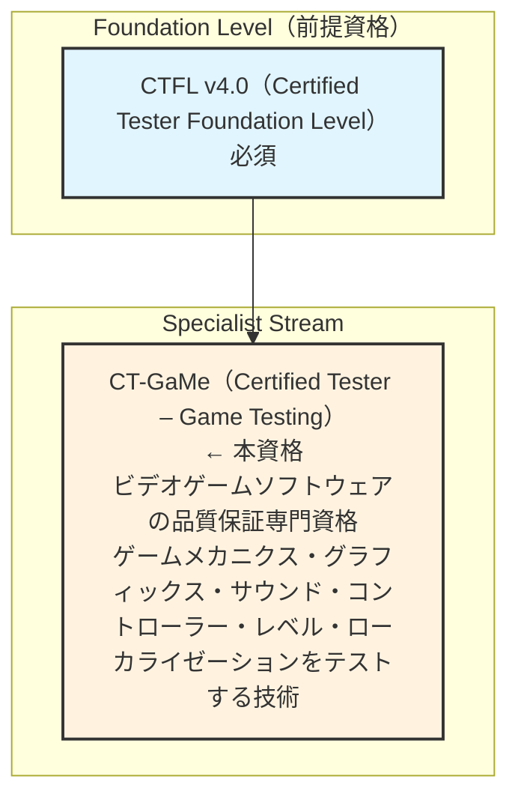

# 🎮 ゲームテスト 完全ガイド 2025

## ISTQB® Certified Tester – Game Testing (CT-GaMe) v1.0.1 準拠

### 初学者から実践者まで｜ステップバイステップ図解解説

> **対応資格**: ISTQB® CT-GaMe（Certified Tester – Game Testing）v1.0.1  
> **試験形式**: 40問 / 合格基準 26/40点（65%） / 60分  
> **前提資格**: ISTQB CTFL（Foundation Level）保有必須  
> **シラバス版**: CT-GaMe v1.0.1（2024年11月更新）  
> **最低学習時間**: 15時間25分（公認研修）  
> **最終更新**: 2025年  
>
> 📌 **公式ページ**: <https://istqb.org/certifications/certified-tester-game-testing-ct-game/>

---

## 📚 目次

1. [CT-GaMe 概要と資格ロードマップ](#0-ct-game-概要と資格ロードマップ)
2. [ゲームテスト業界の現状 2025](#業界現状)
3. [Chapter 1: ゲームテストの特殊性](#chapter-1)
4. [Chapter 2: ゲームメカニクスのテスト](#chapter-2)
5. [Chapter 3: グラフィックスのテスト](#chapter-3)
6. [Chapter 4: サウンドのテスト](#chapter-4)
7. [Chapter 5: ゲームコントローラーのテスト](#chapter-5)
8. [Chapter 6: ゲームレベルのテスト](#chapter-6)
9. [Chapter 7: ローカリゼーションテスト](#chapter-7)
10. [ゲームテスト自動化ツール 2025年版](#tools)
11. [試験対策・サンプル問題](#exam-tips)
12. [参照URL一覧（全件）](#references)

---

## 0. CT-GaMe 概要と資格ロードマップ

### 0.1 この資格とは何か？



**CT-GaMe がカバーする領域：**
1. ゲームメカニクスのテスト（コアループ・メタループ・サーバー連携）
2. グラフィックスのテスト（3Dモデル・テクスチャ・アニメーション等）
3. サウンドのテスト（SE・BGM・ボイス・音響統合）
4. コントローラーのテスト（入力デバイス・ボタンマッピング等）
5. ゲームレベルのテスト（ナビゲーション・コリジョン・環境品質）
6. ローカリゼーションテスト（翻訳・文化適合・地域対応）

📌 CT-GaMe 公式ページ: <https://istqb.org/certifications/certified-tester-game-testing-ct-game/>  
📌 CT-GaMe v1.0.1 プレスリリース: <https://istqb.org/istqb-releases-certified-tester-game-testing/>

---

### 0.2 試験概要（v1.0.1）

**CT-GaMe v1.0.1 試験スペック**

| 項目 | 詳細 |
|---|---|
| **問題数** | 40問（多肢選択式） |
| **合格点** | 26点（40点満点）= 65% |
| **試験時間** | 60分（英語非母語者: +25% = 75分） |
| **前提条件** | CTFL（必須） |
| **最低学習時間（公認研修）** | 15時間25分 |
| **学習目標数** | 55個（6つのBO経由） |
| **最新シラバス** | v1.0.1（2024年11月更新） |

📌 試験プロバイダー（iSQI）: https://isqi.org/ISTQB-Certified-Tester-Game-Testing-CT-GaMe/CT-GaMe  
📌 試験プロバイダー（ASTQB）: https://astqb.org/istqb-game-testing-syllabus/

---

### 0.3 シラバス構成と学習時間配分

**章ごとの学習時間配分（合計 ~925分 = 15時間25分）**

| 章 | テーマ | 学習時間 | 割合 |
|---|---|---|---|
| **Chapter 1** | ゲームテストの特殊性 | 75分 | 8.1% |
| **Chapter 2** | ゲームメカニクスのテスト | 180分 | 19.5% |
| **Chapter 3** | グラフィックスのテスト | 160分 | 17.3% |
| **Chapter 4** | サウンドのテスト | 190分 | 20.5% |
| **Chapter 5** | コントローラーのテスト | 95分 | 10.3% |
| **Chapter 6** | ゲームレベルのテスト | 55分 | 5.9% |
| **Chapter 7** | ローカリゼーションテスト | 155分 | 16.8% |
| **合計** | | **~925分 (15時間25分)** | |

---

### 0.4 6つのビジネスアウトカム（Business Outcomes）

| # | ビジネスアウトカム |
|----|-----------------|
| BO1 | ビデオゲームとゲームソフトウェアテストの基本概念を説明できる |
| BO2 | ステークホルダーのニーズと期待に基づいてリスク・目標・ゲームソフトウェア要件を特定できる |
| BO3 | ゲームソフトウェアテストを概念的に設計・実装・実行できる |
| BO4 | ゲームソフトウェアテストのアプローチとその目的を把握できる |
| BO5 | テストへのAI活用など、ゲームテストを支援するツールを認識できる |
| BO6 | テスト活動がSDLCとどのように整合し、開発・パブリッシングコストを削減するかを特定できる |

📌 ISTQB CT-GaMe シラバス PDF（ASTQB）: https://astqb.org/assets/documents/ISTQB_CT_GaMe_Syllabus_v1.0.1.pdf

---

<a id="業界現状"></a>
## 🌍 ゲームテスト業界の現状 2025

### ゲーム産業の規模とゲームテストの重要性

> 「ビデオゲーム産業は映画産業と音楽産業を合わせたよりも大きい。ソフトウェアはビデオゲームの基盤であり、ゲームテストへの標準的なアプローチの欠如は、市場における品質不足製品の高いリスクを生む。」
> ― ISTQB® CT-GaMe プレスリリース, 2024

**ゲーム産業の規模（参考データ）：**
- 世界のゲーム市場規模：420億ドル以上（2023年）
- 2029年の予測：691億ドル
- ゲームテスター米国平均年収：約$31,769〜$87,427（ポジション・経験依存）
  - エントリーレベル：$30,000〜$50,000
  - シニアレベル：$80,000〜$116,000以上
- 採用企業例：EA, Ubisoft, Rockstar, Riot Games, Nintendo, Sony等

**テストが必要なプラットフォーム（2025年）：**
- **コンソール**: PlayStation 5/4・Xbox Series X|S・Nintendo Switch/Switch 2
- **PC**: Windows（DirectX12/Vulkan）・macOS・Linux
- **モバイル**: iOS（iPhone/iPad）・Android（多数のデバイス）
- **クラウド**: Xbox Cloud Gaming・PlayStation Now・NVIDIA GeForce NOW
- **VR/AR**: Meta Quest 3・PlayStation VR2・Apple Vision Pro

### ゲームテストが特別である理由

```
通常のソフトウェアテストとの主な違い：

  通常のソフトウェアテスト:
    → バグを見つける → 仕様通りに動くかを確認

  ゲームテスト:
    ① バグを見つける（機能面）
    ② 楽しさ・バランス・没入感を確認（非機能面）
    ③ マルチプラットフォーム対応を確認（PC/コンソール/モバイル）
    ④ リアルタイム処理の品質を確認（60fps維持等）
    ⑤ グラフィックス・サウンド・レベル設計の品質を確認
    ⑥ ローカライゼーション（多言語・文化対応）を確認
    ⑦ 非決定論的動作（乱数・AI）のテスト
    ⑧ 不正行為（チート）への脆弱性チェック
```

📌 ゲームテスターキャリアガイド: https://www.cgspectrum.com/career-pathways/qa-game-tester  
📌 ゲームテスター年収データ: https://www-cloudfront-alias.coursera.org/articles/video-game-tester-salary  
📌 ゲーム市場規模データ: https://www.businessnewsdaily.com/4259-how-to-become-a-video-game-tester.html

---

<a id="chapter-1"></a>
## 🎯 Chapter 1: ゲームテストの特殊性（Specificity in Game Testing）
> 学習時間: ~75分 | 試験配点: ~8%

### 1.1 ゲームテストとは何か？（テストとプレイの違い）

```
多くの人が「ゲームテスターは仕事でゲームを楽しむだけ」と思いがちだが、
これは大きな誤解！

ゲームをプレイすること（Playing）:
  → 楽しみを目的とする
  → ランダムな行動・自然な動線のみ
  → バグを見逃しやすい（問題のあるパターンを試さない）
  → 主観的な「楽しさ」を重視

ゲームをテストすること（Testing）:
  → 品質を目的とする
  → 体系的・計画的な行動
  → 意図的に境界値・異常系・エッジケースを試す
  → 客観的に欠陥を記録・報告する
  → 「普通のプレイヤーがしない操作」を意図的に行う

ゲームテスト固有の難しさ：
  ① リアルタイム応答性の要求     → フレームドロップ・レイテンシ検証が必要
  ② 非決定論的動作              → ランダム要素・AI・物理シミュレーションは毎回異なる
  ③ 感情的・美的品質の評価       → 「楽しい」「快適」の定性評価が必要
  ④ マルチプラットフォーム複雑性   → PC・コンソール・モバイルで動作が異なる
  ⑤ オンライン・マルチプレイヤー  → 同時接続・ネットワーク遅延・チート対応
```

### 1.2 ゲーム製品リスク（Game Product Risks）- 試験頻出！

```
ゲーム製品特有のリスクカテゴリ：

1. ゲームバランスの不均衡
   → 特定の武器・戦術・キャラクターが圧倒的に強すぎる
   → ユーザーが「不公平」と感じてゲームを離脱する

2. 公平性の侵害（不正行為への脆弱性）
   → チートツール・ハックによるアンフェアなゲームプレイ
   → オンラインゲームでは特に重大なリスク

3. 市場成功のプレイヤー主観意見への依存
   → ゲームの「面白さ」は客観的に測定しにくい
   → 低評価レビューがゲームの商業的成功を大きく左右する

4. マルチプラットフォーム問題
   → 特定のプラットフォームでのみ発生するバグ
   → コンソール認証（ロットレビュー）の失敗リスク

5. ゲームメカニクスの効果予測の困難さ
   → 設計段階で「面白い」と思われたものが実際はつまらない場合がある
   → プレイテストなしには気づけない問題

6. パフォーマンス問題
   → 特定のシーンでフレームレートが下がる
   → 長時間プレイでメモリリーク
```

### 1.3 ゲームで見つかる欠陥の種類

**ゲーム欠陥のカテゴリと優先度：**

| 欠陥カテゴリ | 優先度 | 具体例 |
|---|---|---|
| **クラッシュ・フリーズ** | Critical | 特定マップで強制終了・セーブ読込でフリーズ |
| **ゲームプレイ欠陥** | High | ジャンプが特定角度で機能しない<br>AIが特定パターンでスタックして動かない<br>スコアが正しく計算されない |
| **グラフィックス欠陥** | High/Med | テクスチャが黒い四角で表示される<br>キャラクターが壁に埋まる（クリッピング） |
| **オーディオ欠陥** | Medium | BGMが途切れる・足音が地面材質に無関係 |
| **UI/UX欠陥** | Medium | ボタンラベルが切れる・ミニマップが消える |
| **パフォーマンス欠陥** | Med/High | 大規模戦闘で30fps以下に・メモリリーク |
| **ローカライゼーション欠陥** | Medium | 日本語UIはみ出し・未翻訳テキスト残存 |

### 1.4 ゲームソフトウェア開発ライフサイクルとテスト

**ゲーム開発の主要フェーズとテスト活動：**

- **フェーズ1: コンセプト・プリプロダクション**
  - プロトタイプのユーザビリティ確認
  - ゲームメカニクスのコンセプト検証
  - リスク評価・テスト戦略の初期策定
- **フェーズ2: プロダクション**
  - ゲームメカニクス機能テスト（スプリントごと）
  - アルファビルドの回帰テスト
  - パフォーマンステスト（フレームレート・メモリ）
  - 多人数プレイテスト（fun factor確認）
- **フェーズ3: アルファ・ベータ**
  - フル機能の結合テスト
  - プラットフォーム認証テスト準備
  - ローカリゼーションテスト開始
  - クローズドベータ（実ユーザーによるテスト）
- **フェーズ4: ゴールドマスター・リリース**
  - 最終品質チェック・リグレッションテスト
  - プラットフォーム認証（Sony・Microsoft・Nintendo）
  - リリース後の本番環境モニタリング
- **フェーズ5: ポストリリース（ライブオペレーション）**
  - パッチ・DLCのテスト
  - コンテンツアップデートのリグレッション
  - オンラインサービスの継続的モニタリング

---

<a id="chapter-2"></a>
## ⚙️ Chapter 2: ゲームメカニクスのテスト（Testing Game Mechanics）
> 学習時間: ~180分 | 試験配点: ~20% ← 最重要章の一つ

### 2.1 ゲームメカニクスとは何か？

```
ゲームメカニクス（Game Mechanics）の定義：
  → ゲーム内でプレイヤーと相互作用するルール・システム・仕組みの総体
  → 「何ができるか」「何が起きるか」「どう反応するか」を決めるもの

身近な例で理解する：

  マリオシリーズの場合：
    コアメカニクス: ジャンプ・移動・走る（毎プレイで繰り返す基本操作）
    メタメカニクス: コイン収集・ライフ管理・スコアシステム（長期的進行）

  RPGの場合：
    コアメカニクス: ターン制バトル・呪文使用・アイテム使用
    メタメカニクス: 経験値・レベルアップ・装備システム・ストーリー進行
```

### 2.2 ゲームメカニクスの分類（試験頻出！）

> **【分類1: ゲームプレイ vs 非ゲームプレイメカニクス】**
> - **ゲームプレイメカニクス（Gameplay Mechanics）**:
>   直接ゲーム体験に影響するメカニクス
>   *(例: 移動・攻撃・防御・スキル使用・アイテム取得)*
> - **非ゲームプレイメカニクス（Non-Gameplay Mechanics）**:
>   ゲームを「管理する」ための仕組み
>   *(例: セーブ/ロード・設定変更・UI操作・マッチング・課金)*
>
> **【分類2: コアループ vs メタループ】**
> - **コアループ（Core Loop）**:
>   繰り返しプレイする基本行動サイクル（数分〜数十分）
>   *(例: バトル → 経験値獲得 → レベルアップ → 次のバトル)*
> - **メタループ（Meta Loop）**:
>   コアループを包む長期的な進行システム（数時間〜数週間）
>   *(例: キャラクター育成 → 強力な装備 → 新エリア解放 → 物語進行)*
>
> **【分類3: クライアント vs サーバー vs クライアント-サーバー】**
> - **クライアントメカニクス**:
>   ローカルデバイスのみで処理（オフラインゲーム向け）
>   *(例: ローカルセーブ・入力処理・ローカルAI判定)*
> - **サーバーメカニクス**:
>   サーバー側で処理（不正対策のため）
>   *(例: ゲームの勝敗判定・ランキング・課金処理)*
> - **クライアント-サーバーメカニクス**:
>   クライアントとサーバーが連携して処理（多人数ゲーム）
>   *(例: マルチプレイヤーの位置同期・リアルタイムバトル判定)*

### 2.3 サーバー権威型モデルのテスト（重要概念！）

```
サーバー権威型（Server Authoritative）モデルとは？
  → ゲームの最終的な「正しい状態」はサーバーが決める仕組み
  → チート対策として非常に重要なアーキテクチャ

なぜテストが必要か（チートシナリオ）：
> **悪意あるプレイヤーが自分のPC上で：**
> 「自分のHPは無限だ」とローカルデータを改ざんしようとする
> ↓
> **サーバー権威型なら：**
> サーバーが「実際のHP値」を管理しているので改ざんは無効
> → ゲームの公平性が保たれる

テストの主な観点：
  ✓ クライアントデータ改ざんがサーバー判定に影響しないか
  ✓ ネットワーク遅延（ラグ）時の状態同期の正確性
  ✓ クライアントの予測（Prediction）とサーバー修正の整合性
  ✓ パケットロス時のゲーム状態の安定性
```

### 2.4 ゲームバランスのテスト

```
ゲームバランスとは？
  → プレイヤーが「不公平」に感じないよう、
    ゲーム要素が適切に調整されていること

バランステストの主な観点：
  ✓ ゲームの難易度（簡単すぎる・難しすぎる）
  ✓ 武器・能力の強さのバランス（特定アイテムが支配的でないか）
  ✓ マルチプレイヤーでの有利・不利（マップの有利ポイント等）
  ✓ キャラクター間のバランス
  ✓ 経済システムのバランス（インフレ・デフレ問題）

バランステストの手法：
  ① データ解析: 勝率・使用率・選択率データの収集
  ② シミュレーション: AIを使った大量のゲーム実行
  ③ プレイテスト: 実際のプレイヤーによる主観評価
  ④ 数値モデリング: パラメータを数式でモデル化して検証
```

### 2.5 ゲームメカニクス欠陥の典型例

```
コアループの欠陥:
  ✗ 特定の地点でジャンプすると境界外に出られる（OOB: Out of Bounds）
  ✗ ダメージ計算式にバグがあり、弱い武器の方が強い
  ✗ AI敵が特定の地形で動けなくなる（スタック問題）

メタループの欠陥:
  ✗ レベルアップしても能力値が増加しない
  ✗ クリア済みのクエストが未完了として表示される
  ✗ 実績/トロフィーが解除条件を満たしても取得できない

クライアント-サーバー連携の欠陥:
  ✗ ラグ時に弾が当たっていないのにダメージ判定される
  ✗ オフライン状態でも課金アイテムが使用できる
  ✗ マッチング終了後もゴーストセッションが残る

チート・セキュリティ欠陥:
  ✗ メモリエディタで所持金を書き換えられる
  ✗ スピードハックが検出されない
  ✗ 開発者専用のデバッグモードが本番ビルドに残っている
```

---

<a id="chapter-3"></a>
## 🎨 Chapter 3: グラフィックスのテスト（Graphics Testing）
> 学習時間: ~160分 | 試験配点: ~17%

### 3.1 ゲームグラフィックスの主要構成要素

```
ゲームのグラフィックスを構成する要素（テスト対象）：

① 3Dモデル（3D Models）
   → キャラクター・建物・小道具の3D形状データ
   → テスト観点: 変形・歪み・頂点の欠落・LOD（詳細度）設定

② テクスチャ（Textures）
   → 3Dモデルの表面に貼り付ける2D画像
   → テスト観点: 伸び・ズレ・低解像度・欠落・Z-ファイティング

③ ライティング（Lighting）
   → 光源の種類（ポイント・ディレクショナル・スポット・アンビエント）
   → テスト観点: 不自然な影・光の貫通・オーバーブライト・ライト欠落

④ アニメーション（Animations）
   → スケルタルアニメーション（キャラクターの動き）
   → テスト観点: 関節の歪み・クリッピング・アニメーション遷移のズレ

⑤ ビジュアルエフェクト（VFX）
   → パーティクル・炎・煙・爆発等の特殊効果
   → テスト観点: タイミングのズレ・表示されない・残存し続ける

⑥ コリジョン（Collision）
   → 物理的な接触判定（見た目と判定の一致確認）
   → テスト観点: 見た目と判定のズレ・すり抜け・段差での引っかかり

⑦ LOD（Level of Detail）
   → 距離に応じてポリゴン数を減らす最適化技術
   → テスト観点: LOD切り替えが不自然にポップアップする
```

### 3.2 グラフィックステストの3つのアプローチ（試験頻出！）

> **アプローチ1: アーティスティックテスト（Artistic Testing）**
> 視覚的な美しさ・スタイルの一貫性を確認
> - **確認項目：**
>   - キャラクターデザインがアートガイドラインに準拠しているか
>   - 色彩・トーン・雰囲気がゲーム全体で一貫しているか
>   - ゲームのビジュアルスタイルが維持されているか
>   - 歴史的・文化的な再現性（該当するゲームの場合）
>
> **アプローチ2: テクニカルテスト（Technical Testing）**
> 技術的な正確性・パフォーマンスを確認
> - **確認項目：**
>   - フレームレート（60fps/30fps目標の達成）
>   - レンダリングエラー（黒い四角・Z-ファイティング・ちらつき）
>   - メモリ使用量（テクスチャメモリの超過）
>   - シェーダーの正常動作・HDRレンダリング品質
>
> **アプローチ3: ゲームプレイグラフィックステスト（Gameplay Graphics）**
> グラフィックスがゲームプレイに悪影響を与えないか確認
> - **確認項目：**
>   - ヒットボックス（当たり判定）と見た目の一致
>   - 敵・重要アイテムが見えにくくなっていないか
>   - UIが重要な視覚情報を隠していないか
>   - 過度なパーティクルエフェクトによる視野妨害がないか

### 3.3 グラフィックス欠陥カタログ

```
テクスチャ系:
  テクスチャの欠落:  モデルが真っ黒・チェッカーボーン表示
  テクスチャ引き伸ばし: 特定の角度で画像が不自然に伸びる
  Z-ファイティング:  2つのサーフェスが重なりちらつく
  ミップマップ問題:  遠景でテクスチャが急に粗くなる

ジオメトリ系:
  クリッピング:    キャラクターが壁・床に埋まる
  面法線の反転:    モデルの一部が透明・裏返しに見える
  ポリゴンの欠落:  モデルに穴が開いている
  LODポップ:      距離変化で急にモデルの詳細度が変わる

アニメーション系:
  T字ポーズ:          キャラクターが初期ポーズのまま固まる
  アニメーション遅延:   アクションと見た目のタイミングがズレる
  関節のストレッチ:    ボーンが異常に伸びたり縮んだりする
  スキニング問題:      服・髪が身体から離れて浮く

ライティング系:
  光の貫通:      壁を通過して光が差し込む
  影の欠落:      浮いているオブジェクトに影がない
  オーバーブライト: 画面全体が白飛びする
  影のちらつき:   移動するにつれ影がちかちかする

VFX系:
  エフェクト未表示: 爆発・炎が表示されない
  エフェクト残存:   弾着エフェクトが消えずに残り続ける
  スケールの問題:  エフェクトが巨大すぎる・小さすぎる
```

---

<a id="chapter-4"></a>
## 🔊 Chapter 4: サウンドのテスト（Sound Testing）
> 学習時間: ~190分 | 試験配点: ~20% ← 最大章！

### 4.1 ゲームサウンドの3大カテゴリ

```
【1. サウンドエフェクト（Sound Effects / SE）】
  → ゲーム内のアクションに対応する効果音

  種類：
    環境サウンド（Ambient Sounds）: 背景の自然音・室内音（川のせせらぎ等）
    ダイエゲティックサウンド:        ゲーム世界内の音（銃声・足音・爆発音）
                                  → キャラクターも「聞こえる」音
    ノンダイエゲティックサウンド:    ゲーム世界外の音（UIクリック音・通知音）
                                  → キャラクターには「聞こえない」音

  製作プロセス:
    ① 録音（Foley・実物録音・シンセサイザー生成）
    ② 編集（ノイズ除去・ピッチ調整・タイミング調整）
    ③ ゲームエンジンへの統合（Wwise/FMOD等を使用）
    ④ ゲームオブジェクトへのアタッチ（どのオブジェクトが鳴るか設定）

【2. BGM（Background Music / サウンドトラック）】
  → ゲームの雰囲気を演出する音楽

  アダプティブミュージック（試験頻出！）:
    → ゲーム状況に応じてシームレスに変化する音楽システム
    例: 平和なフィールド → 敵が接近 → バトルBGMへ自動切り替え

  スティンガー（Stingers）:
    → 特定イベントで一時的に鳴る音楽断片
    例: 新エリア到達・ボス登場・ゲームクリア時

【3. ボイス（Voice / ダイアログ）】
  → キャラクターの音声・ナレーション

  ローカライゼーション時の主要課題：
    → リップシンク: 日本語版と英語版でキャラクターの口の動きがずれる
    → 尺の差: 翻訳文が元の音声より長くなり、収録し直しが必要
```

### 4.2 サウンドテストの方法論

```
サウンドテスト3段階チェック：

**ステップ1: サウンドアセットの検証**
> - [ ] サウンドファイルの品質（ビットレート・サンプルレート）
> - [ ] サウンドの長さ（ループ設定の適切さ・継ぎ目の自然さ）
> - [ ] ノイズ・クリック音・歪みの有無
> - [ ] 音量レベルの統一性（ラウドネス規格への準拠）
>
> **ステップ2: ゲームへの統合確認**
> - [ ] 正しいオブジェクトに正しいSEが設定されているか
> - [ ] トリガー条件が正しく機能するか（いつ・どこで鳴るか）
> - [ ] 3Dサウンドの距離減衰が自然か
> - [ ] 複数SEが重なった際の音の混濁がないか
>
> **ステップ3: ゲームプレイ中の確認**
> - [ ] BGMとSEのバランスが適切か
> - [ ] アダプティブミュージックの遷移がスムーズか
> - [ ] 音声が対応するアニメーションと同期しているか（リップシンク）
> - [ ] 長時間プレイでの音の劣化・途切れがないか
```

### 4.3 サウンド欠陥の分類（誰が修正するか）

```
サウンド欠陥カタログと責任者の対応：

ソースファイル欠陥（→ サウンドエンジニアが修正）:
  ✗ 音声のクリップノイズ（音が割れている）
  ✗ ループポイントが不自然でBGMに継ぎ目のズレがある
  ✗ ステレオファイルに意図しない無音チャンネルがある

統合欠陥（→ レベルデザイナー/サウンドエンジニアが修正）:
  ✗ オブジェクトに間違ったSEが設定されている（木材に金属音）
  ✗ 距離に関係なく同じ音量でSEが鳴る（3Dサウンド未適用）
  ✗ 爆発SEが視覚エフェクトより0.5秒遅れて鳴る

状態管理欠陥（→ 開発者が修正）:
  ✗ BGMが特定のシーン切り替えで停止したまま
  ✗ 同じSEが重複して同時に複数回鳴る（スタック問題）
  ✗ セーブ/ロード後にBGMが初期状態に戻る

プラットフォーム固有欠陥:
  ✗ PC版では正常だがPS5版でのみ音飛びが発生
  ✗ ヘッドセット接続時にサラウンド音場が機能しない
  ✗ 日本語音声のリップシンクがズレる
```

### 4.4 主要なオーディオミドルウェア

| ツール | 特徴 | URL |
|-------|------|-----|
| **Wwise（Audiokinetic）** | 業界最大手。アダプティブミュージック・3Dサウンド統合管理 | https://www.audiokinetic.com/ |
| **FMOD** | リアルタイムのオーディオプログラミング対応。Unity/UE両対応 | https://fmod.com/ |
| Unity Audio | エンジン内蔵の基本オーディオ。小規模プロジェクト向け | https://docs.unity3d.com/Manual/Audio.html |

---

<a id="chapter-5"></a>
## 🕹️ Chapter 5: ゲームコントローラーのテスト（Game Controllers Testing）
> 学習時間: ~95分 | 試験配点: ~10%

### 5.1 コントローラーの種類

**ゲームで使用される入力デバイス：**

- **標準ゲームパッド**:
  - PlayStation DualSense（振動・アダプティブトリガー）
  - Xbox ワイヤレスコントローラー（Xbox/Windows共通）
  - Nintendo Switch Pro コントローラー
- **キーボード & マウス（PC）**:
  - 最も精密な入力が可能
  - FPS・RTSジャンルで標準
- **スペシャリストコントローラー**:
  - フライトスティック（フライトシム用）
  - レーシングホイール（レーシングゲーム用）
  - アーケードスティック（格闘ゲーム用）
  - ギター・ドラムコントローラー（音楽ゲーム用）
- **モバイル**:
  - タッチスクリーン（タップ・スワイプ・ピンチ操作）
- **モーションコントローラー**:
  - Nintendo Joy-Con（ジャイロ入力）
  - Meta Touch Controllers（VR用）
- **アクセシビリティコントローラー**:
  - Xbox Adaptive Controller（障害を持つゲーマー向け）
  - スイッチアクセス・視線入力デバイス

### 5.2 コントローラーテストの主要観点

```
ボタンマッピングのテスト：
  □ 全ボタン・スティック・トリガーが正しく機能するか
  □ カスタムキーマッピング変更後に正常動作するか
  □ ゲーム内の表示アイコンと実際のボタンが一致するか
  □ プラットフォーム間でのボタン表示差異が適切か
    （PS版「○ボタン」vs Xbox版「Bボタン」等）

コントローラー切り替えのテスト：
  □ ゲーム中にコントローラーを抜き差ししても安定しているか
  □ コントローラーとキーボード/マウスを切り替えても動作するか
  □ 複数コントローラー接続時の認識が正確か（ローカルマルチ）

感触・フィードバックのテスト：
  □ 振動（Haptic Feedback）のタイミングが適切か
  □ DualSenseのアダプティブトリガー設定が正しく動作するか
  □ ジャイロ・加速度センサーの精度確認

アクセシビリティのテスト：
  □ ボタン長押しとタップの切り替えが可能か
  □ コントローラー感度の調整が可能か
  □ 障害者向けコントローラーが正常認識されるか
```

### 5.3 入力ラグのテスト

```
入力ラグ（Input Lag）とは？
  → ボタンを押してから画面に反映されるまでの遅延時間

業界標準目標値（2025年）:
  一般ゲーム（コンソール/PC）:  < 50ms
  格闘ゲーム:                  < 33ms（2フレーム以内、60fps時）
  VRゲーム:                    < 20ms（VR酔い防止のため特に厳しい）

なぜ重要か：
  → 格闘ゲームでは1フレーム（16.6ms）の誤差が勝敗を左右する
  → VRゲームで入力ラグが大きいと「VR酔い」の原因になる
  → FPSゲームでの応答性はプレイヤー体験の核心
```

---

<a id="chapter-6"></a>
## 🗺️ Chapter 6: ゲームレベルのテスト（Game Level Testing）
> 学習時間: ~55分 | 試験配点: ~6%

### 6.1 ゲームレベル（ゲーム環境）とは？

```
ゲームレベルの定義：
  → プレイヤーが探索・活動する仮想の空間・環境
  → マップ・ステージ・ワールドとも呼ばれる

ゲームレベルの主な構成要素：
  地形（Terrain）:      山・川・平地・建物等の地形構造
  オブジェクト（Props）: 木・椅子・コンテナ等の配置物
  NavMesh:             AIの移動経路データ
  スポーンポイント:     プレイヤー・敵の出現位置
  トリガーゾーン:       イベント発動領域
  ライティング:         レベル固有の光源・雰囲気設定

ゲームレベルの製作フェーズ（試験頻出！）：

  ① ホワイトボックス（グレーボックス）:
     → 基本的な形のみで構成したプロトタイプレベル
     → 「遊べるか」の確認が目的（見た目は二の次）
     → テスターはこの段階からナビゲーションテストを開始

  ② ドレスアップ（Dressing）:
     → テクスチャ・小道具・照明を追加した中間レベル
     → グラフィックスとゲームプレイの両面を確認

  ③ 最終レベル（Final Level）:
     → すべての要素が揃った完成レベル
     → 全項目の最終確認を実施
```

### 6.2 レベルテストのチェックリスト（5カテゴリ）

```
> **ナビゲーションテスト：**
> - [ ] すべての到達可能エリアに正常にアクセスできるか
> - [ ] 到達できないはずの場所に侵入できてしまわないか
> - [ ] レベルの外に出てしまう方法がないか（「飛び出しバグ」）
> - [ ] AIの道案内（NavMesh）が正しく機能しているか
>
> **コリジョンテスト：**
> - [ ] 壁・床・天井をすり抜けてしまわないか
> - [ ] 見えない壁（インビジブルウォール）が適切な場所にあるか
> - [ ] 段差の乗り越え判定が一貫しているか
> - [ ] 水中・溶岩等の特殊ゾーンの判定が正確か
>
> **ゲームプレイテスト：**
> - [ ] プレイヤーが迷子にならないよう誘導できているか
> - [ ] スポーン位置が公平・合理的か（マルチプレイの場合）
> - [ ] 難易度曲線がレベル設計と一致しているか
>
> **パフォーマンステスト：**
> - [ ] レベルの特定ポイントでフレームドロップしないか
> - [ ] 大規模な敵・オブジェクトが出現してもGPU/CPUが耐えられるか
> - [ ] レベルのロード時間が許容範囲か
>
> **ビジュアルテスト：**
> - [ ] グラフィックスの境界（クリッピング・Z-ファイティング）がないか
> - [ ] 照明・影が正しく機能しているか
> - [ ] テクスチャが正しく表示されているか
```

---

<a id="chapter-7"></a>
## 🌍 Chapter 7: ローカリゼーションテスト（Localization Testing）
> 学習時間: ~155分 | 試験配点: ~17%

### 7.1 ローカリゼーションとは何か？

```
ローカリゼーション（Localization / L10n）の定義：
  → ゲームを特定の地域・言語・文化に適応させるプロセス
  → 単なる「翻訳（Translation）」を超えた文化的適合作業

翻訳 vs ローカリゼーションの違い（試験頻出！）：

  翻訳（Translation）:
    英語: "Hello, hero!"
    日本語: 「こんにちは、英雄よ！」（言語的には正確だがゲームのトーンに合わない）

  ローカリゼーション（Localization）:
    英語: "Hello, hero!"
    日本語: 「よう、勇者！」（文化・キャラクター性格・ゲームの雰囲気を考慮）

ローカリゼーションがカバーする範囲：
  ① 言語テキスト:     UI・ダイアログ・チュートリアル・字幕
  ② 音声:            ローカル言語のボイス収録・リップシンク
  ③ 文化的適合:       ユーモア・隠喩・慣用句の書き換え
  ④ 宗教・政治的内容:  地域の規制に準拠した表現変更
  ⑤ 法的要件:        各国ゲーム規制・年齢レーティングへの対応
  ⑥ UI/UX調整:       文字の長さ・書字方向（アラビア語等のRTL）の対応
  ⑦ 地域固有コンテンツ: 特定市場向けの追加/削除コンテンツ
```

### 7.2 ローカリゼーションテストの3種類（試験頻出！）

> **【1. 機能ローカリゼーションテスト（Functional Localization Testing）】**
> 翻訳されたテキスト・UIが正しく動作するか確認
> - **確認項目：**
>   - [ ] テキストが指定領域に収まるか（テキストオーバーフロー）
>   - [ ] フォントが全文字を正しく表示できるか（特殊文字・記号）
>   - [ ] 未翻訳テキストが残っていないか（プレースホルダー残存）
>   - [ ] 翻訳文字数の差によるUI崩れ
> - **テキストオーバーフローの例：**
>   - 英語ボタン: [PLAY] → 文字数: 4
>   - ドイツ語: [SPIELEN] → 文字数: 7 → ボタンから文字がはみ出す！
>   - *(※ 英語→ドイツ語は平均30%文字数が増加する)*
>
> **【2. 言語品質テスト（Linguistic Quality Testing）】**
> 翻訳の品質・正確性を確認
> - **確認項目：**
>   - [ ] 文法的な正確性（ネイティブスピーカーによるレビュー）
>   - [ ] ゲーム内の一貫した用語使用（「魔法」vs「マジック」の統一）
>   - [ ] キャラクターのトーン・性格が翻訳に反映されているか
>   - [ ] 職業・スキル名等の専門用語が正確か
>
> **【3. 文化的適合性テスト（Cultural Appropriateness Testing）】**
> 地域の文化・感情・規制への適合を確認
> - **確認項目：**
>   - [ ] ジョーク・隠喩が対象文化圏で理解できるか
>   - [ ] 宗教・政治的に敏感な表現がないか
>   - [ ] 特定国向けに変更すべきコンテンツが適切に変更されているか

### 7.3 主要市場のローカリゼーション特記事項

- **🇯🇵 日本市場**:
  - 縦書きテキストのサポート
  - 日本語特有の敬語レベル（です/ます調 vs ため口）
  - CERO（コンピュータエンターテインメントレーティング機構）の審査
  - 年齢区分: A/B/C/D/Z の5段階
- **🇨🇳 中国市場**:
  - 簡体字と繁体字の分離が必要
  - 国家インターネット信息弁公室（CAC）の審査
  - 骨・血・骸骨の表現規制（ゲームへの影響大）
  - 歴史的・政治的に敏感な内容の修正
  - 外資系ゲームの配信には現地パブリッシャーが必要
- **🇩🇪 ドイツ市場**:
  - USK（Unterhaltungssoftware Selbstkontrolle）による年齢審査
  - ナチス象徴は歴史的文脈でのみ許可（2018年以降緩和）
  - ゴア表現の規制
- **🇺🇸 米国市場**:
  - ESRB（Entertainment Software Rating Board）レーティング
  - アクセシビリティ対応の推奨
  - 英語の方言対応（米語 vs 英語）

### 7.4 ローカリゼーション典型欠陥

```
欠陥1: テキストオーバーフロー
  英語基準のUIで、ドイツ語・ポルトガル語・ロシア語に
  翻訳した際にボタンや吹き出しからテキストがはみ出す

欠陥2: 未翻訳テキスト（プレースホルダー残存）
  "AUDIO_SETTING_KEY" や "Tip goes here..."
  のような開発時のプレースホルダーがそのまま表示される

欠陥3: リップシンクのズレ（音声と口の動きの不一致）
  英語音声に合わせて作られたアニメーションに
  日本語音声を後付けする際、口の動きとズレが生じる
  （英語と比較して日本語は音節数が多く収録時間が長くなりやすい）

欠陥4: フォント・エンコーディング問題
  韓国語・中国語・アラビア語等の特殊文字が文字化けする
  アラビア語・ヘブライ語でのRTL（右から左）表示が未対応

欠陥5: 文化的問題
  欧米では問題ないが、特定の地域では宗教的・政治的に
  不適切なコンテンツ（絵・シンボル・コンテキスト等）が
  そのまま残っている
```

📌 IGDA ローカリゼーション SIG: https://igda.org/sigs/localization/  
📌 Crowdin（翻訳管理ツール）: https://crowdin.com/  
📌 Phrase（翻訳プラットフォーム）: https://phrase.com/

---

<a id="tools"></a>
## 🔧 ゲームテスト自動化ツール 2025年版

### テストフレームワーク・エンジン別ツール

**主要テストツール比較（2025年版）**

| ツール名 | 特徴と用途 |
|---|---|
| **Unity Test Framework (UTF)** | ✓ Unity エンジンに直接統合<br>✓ Edit Mode & Play Mode 両方のテスト<br>✓ NUnit フレームワークを使用<br>✓ CI/CDパイプラインに統合可能<br>URL: https://docs.unity3d.com/Packages/com.unity.test-framework@1.1/manual/index.html |
| **GameDriver** | ✓ Unity & Unreal Engine 両対応<br>✓ PC・コンソール・モバイル対応<br>✓ ソースコードなしでテスト作成可能<br>✓ ゲームテスト自動化の業界標準<br>URL: https://gamedriver.io/ |
| **Applitools** | ✓ AI搭載のビジュアルリグレッションテスト<br>✓ UIの微妙な変化も自動検出<br>✓ 全解像度・デバイスでの比較が可能<br>URL: https://applitools.com/ |
| **GameBench** | ✓ モバイルゲームのパフォーマンス測定専門<br>✓ FPS・CPU/GPU使用率・メモリ・温度のリアルタイム計測<br>URL: https://www.gamebench.net/ |
| **Functionize** | ✓ AI搭載のセルフヒーリングテスト<br>✓ ライブゲームのUI変更に自動対応<br>URL: https://www.functionize.com/ |

### パフォーマンステストの目標指標（2025年）

```
プラットフォーム別パフォーマンス目標値：

  コンソール（PS5/Xbox Series X）:
    目標FPS:     60fps（一部タイトルは120fps対応）
    ロード時間:  < 5秒（SSD活用）

  PC:
    目標FPS:     可変（ユーザー設定依存）・60fps以上推奨
    ロード時間:  < 10秒

  モバイル（iOS/Android）:
    目標FPS:     60fps（一部30fps）
    考慮事項:    長時間プレイでの発熱・バッテリー消費
    ロード時間:  < 15秒

  VR（Meta Quest 3 / PS VR2）:
    目標FPS:     90fps以上（VR酔い防止のため厳しい）
    最大レイテンシ: < 20ms
    特記事項:    フレームドロップはVR酔いの直接原因！
```

### グラフィックスデバッグツール

| ツール | 用途 | URL |
|-------|------|-----|
| **RenderDoc** | グラフィックスAPIレベルのデバッグ（DX/Vulkan/GL） | https://renderdoc.org/ |
| **PIX for Windows** | Xbox/Windows のグラフィックスデバッグ専用 | https://devblogs.microsoft.com/pix/ |
| **Unity Profiler** | Unityゲームのリアルタイムパフォーマンス分析 | https://docs.unity3d.com/Manual/Profiler.html |
| **Unreal Insights** | Unreal Engineゲームの詳細プロファイリング | https://docs.unrealengine.com/insights |
| **Android GPU Inspector** | AndroidのGPU使用率・シェーダー分析 | https://gpuinspector.dev/ |
| **Xcode Instruments** | iOS ゲームのCPU・GPU・メモリ分析 | https://developer.apple.com/instruments/ |

### バグ追跡・テスト管理ツール

| ツール | 用途 | URL |
|-------|------|-----|
| **Jira（Atlassian）** | 最も広く使われるプロジェクト管理・欠陥追跡 | https://www.atlassian.com/jira |
| **TestRail** | テストケース・実行・レポートの一元管理 | https://www.testrail.com/ |
| **DevTrack** | ゲーム業界向け欠陥追跡専門ツール | https://devtrack.io/ |
| **Firebase Crashlytics** | モバイルゲームのクラッシュ分析 | https://firebase.google.com/docs/crashlytics |

📌 ゲームテストツール比較（2025年）: https://www.softwaretestingmaterial.com/game-testing-tools/  
📌 ゲームQA自動化ツール比較: https://qawerk.com/blog/game-testing-automation-tools/

---

<a id="exam-tips"></a>
## 📝 試験対策・サンプル問題

### 試験概要の再確認

```
CT-GaMe v1.0.1 試験仕様：
  問題数:    40問（多肢選択式）
  合格点:    26点（40点満点） = 65%
  試験時間:  60分（英語非母語者: +25% = 75分）
  前提条件:  CTFL（必須）
  
  問題の認知レベル（K-Level）：
    K1（記憶）:   用語・概念の定義を答える
    K2（理解）:   概念を説明・分類・解釈する
    K3（適用）:   実際のシナリオに技法を適用する
```

### 章別重要度と出題比率（推定）

| 章 | テーマ | 学習時間 | 推定出題比率 | 重要度 |
|---|--------|---------|------------|-------|
| 1 | ゲームテストの特殊性 | 75分 | ~8% | ★★★ |
| **2** | **ゲームメカニクスのテスト** | **180分** | **~20%** | **★★★★★** |
| 3 | グラフィックスのテスト | 160分 | ~17% | ★★★★★ |
| **4** | **サウンドのテスト** | **190分** | **~20%** | **★★★★★** |
| 5 | コントローラーのテスト | 95分 | ~10% | ★★★★ |
| 6 | ゲームレベルのテスト | 55分 | ~6% | ★★★ |
| **7** | **ローカリゼーションテスト** | **155分** | **~17%** | **★★★★★** |

---

### 必ず覚える重要概念チェックリスト

```
✅ ゲームテスト vs ゲームプレイの違い
   テスト：体系的・計画的・欠陥発見目的・エッジケースを意図的に試す
   プレイ：娯楽目的・自然な動線のみ・問題に気づかないことが多い

✅ ゲームメカニクスの3分類（試験最頻出！）:
   ① ゲームプレイ vs 非ゲームプレイ
   ② コアループ vs メタループ
   ③ クライアント vs サーバー vs クライアント-サーバー

✅ サーバー権威型（Server Authoritative）モデル:
   → サーバーがゲームの正しい状態を決定する
   → チート・不正行為対策として重要なアーキテクチャ

✅ グラフィックステストの3アプローチ:
   ① アーティスティックテスト（ビジュアルスタイル・美しさの確認）
   ② テクニカルテスト（パフォーマンス・レンダリングエラーの確認）
   ③ ゲームプレイグラフィックステスト（ゲームへの影響確認）

✅ ゲームオーディオの3カテゴリ:
   ① サウンドエフェクト（SE）: 効果音・環境音
   ② BGM（サウンドトラック）: アダプティブミュージック含む
   ③ ボイス（ダイアログ）: キャラクター音声・ナレーション

✅ アダプティブミュージックとは:
   → ゲーム状況に応じてシームレスに変化する音楽システム
   → 例: 平和なフィールド → 敵接近 → バトルBGMへ自動切替

✅ ダイエゲティック vs ノンダイエゲティックサウンド:
   ダイエゲティック: ゲーム世界内に存在する音（キャラクターも聞こえる）
   ノンダイエゲティック: ゲーム世界外の音（UIクリック音等・キャラには聞こえない）

✅ ローカリゼーション vs 翻訳の違い:
   翻訳: 言語変換のみ
   ローカリゼーション: 文化・法的・技術的な総合的適応

✅ テキストオーバーフロー:
   → 翻訳文字数の差によってUIが崩れる問題
   → ドイツ語・ポルトガル語・ロシア語で特に頻出

✅ ローカリゼーションテストの3種類:
   ① 機能ローカリゼーションテスト（UIの動作確認）
   ② 言語品質テスト（翻訳の正確性確認）
   ③ 文化的適合性テスト（文化・規制への準拠確認）

✅ ゲームレベルのテスト5カテゴリ:
   ナビゲーション・コリジョン・ゲームプレイ・パフォーマンス・ビジュアル

✅ レベル製作の3フェーズ:
   ホワイトボックス → ドレスアップ → 最終レベル

✅ 主要プラットフォーム認証機関:
   Sony: PlayStation Partner Certification
   Microsoft: Xbox Certification (XR)
   Nintendo: Lotcheck (LOT)
```

---

### サンプル問題と解説

---

**問1（K2 / Chapter 2 ゲームメカニクス）**

オンラインRPGで、プレイヤーのHPはサーバーで管理され、クライアント側でのデータ改ざんが無効化されている。このアーキテクチャの説明として最も適切なものはどれか？

A) クライアントメカニクス  
B) サーバーメカニクス  
C) クライアント-サーバーメカニクス  
D) メタループメカニクス  

<details>
<summary>📌 解答を見る</summary>

**正解: B（サーバーメカニクス）**

サーバーメカニクスは、サーバー側でゲームの重要な状態を管理し、クライアント側からの不正改ざんを防ぐ仕組み（サーバー権威型）。HPのような重要な値はサーバーが権威を持つ。

- A) クライアントメカニクス: ローカルのみで処理（オフラインゲーム向け）
- C) クライアント-サーバーメカニクス: 双方が協力して処理（位置同期等）
- D) メタループ: メカニクスの分類であり、このシナリオとは異なる

</details>

---

**問2（K3 / Chapter 3 グラフィックス）**

ゲームテスターが「あるキャラクターが特定のエリアで壁の中に半分埋まる」欠陥を発見した。この欠陥のカテゴリとして最も適切なものはどれか？

A) テクスチャ欠陥  
B) アニメーション欠陥  
C) コリジョン欠陥  
D) ライティング欠陥  

<details>
<summary>📌 解答を見る</summary>

**正解: C（コリジョン欠陥）**

コリジョン（当たり判定）の欠陥は、物体の物理的な接触判定が正しく機能しない問題。キャラクターが壁に埋まる現象（クリッピング）はコリジョン設定の誤りが原因であることが多い。

</details>

---

**問3（K2 / Chapter 4 サウンド）**

ゲームのBGMが「プレイヤーが静かな村を歩いているときは穏やかな音楽が流れ、敵が接近すると自動的に緊張した音楽に切り替わる」機能を何と呼ぶか？

A) ダイエゲティックサウンド  
B) アダプティブミュージック  
C) サウンドエフェクト  
D) スティンガー  

<details>
<summary>📌 解答を見る</summary>

**正解: B（アダプティブミュージック）**

アダプティブミュージックは、ゲームの状況に応じてシームレスに音楽が変化するシステム。

- A) ダイエゲティックサウンド: ゲーム世界内に存在する音
- C) サウンドエフェクト: アクションに対応する効果音
- D) スティンガー: 特定イベント時に一時的に鳴る短い音楽断片

</details>

---

**問4（K3 / Chapter 7 ローカリゼーション）**

ゲームをドイツ語にローカライズした際、ボタンのUIに表示されるテキストが枠からはみ出している。この問題の原因として最も適切なものはどれか？

A) テクスチャの解像度不足  
B) テキストオーバーフロー（翻訳テキストの文字数超過）  
C) フォントのエンコーディング問題  
D) アニメーションのタイミングズレ  

<details>
<summary>📌 解答を見る</summary>

**正解: B（テキストオーバーフロー）**

英語のUIデザインに合わせて枠サイズが設定されていても、ドイツ語の単語は英語より長いことが多く（例：PLAY → SPIELEN）、翻訳後に枠をはみ出す。英語→ドイツ語の文字数比は平均30%増と言われている。

</details>

---

**問5（K2 / Chapter 1 ゲームテスト特殊性）**

ゲームのテストにおいて、テスターが「普通のプレイヤーがしないような操作」を意図的に行う理由として最も適切なものはどれか？

A) テスターはゲームを楽しむことが目的だから  
B) ゲームのバランスを意図的に壊すことが目的だから  
C) 通常のプレイでは発見されにくいエッジケースの欠陥を発見するため  
D) チート方法をプレイヤーに教えるため  

<details>
<summary>📌 解答を見る</summary>

**正解: C（エッジケースの欠陥を発見するため）**

ゲームテストは、通常のプレイヤーが試さない操作（境界値・異常操作・意図しない組み合わせ）を意図的に実行することで、一般ユーザーが発見する前に欠陥を検出することを目的とする。

</details>

---

**問6（K3 / Chapter 2 ゲームメカニクス）**

以下のゲームメカニクスの説明のうち、「コアループ」を最もよく表しているものはどれか？

A) プレイヤーが装備を集めてキャラクターを成長させる長期的な進行  
B) プレイヤーがセーブ/ロード操作をする機能  
C) バトル→経験値獲得→レベルアップ→次のバトルという繰り返しの基本サイクル  
D) サーバー側でゲームの勝敗を決定する機能  

<details>
<summary>📌 解答を見る</summary>

**正解: C（繰り返しの基本サイクル）**

コアループは数分〜数十分で繰り返す基本的な行動サイクル。「装備収集による長期的な成長（A）」はメタループ、「セーブ/ロード（B）」は非ゲームプレイメカニクス、「サーバーの勝敗決定（D）」はサーバーメカニクスである。

</details>

---

### 試験直前チェックリスト

```
✅ Chapter 1 ゲームテストの特殊性:
□ テストとプレイの違いを3点以上説明できる
□ ゲーム製品リスクを4つ以上挙げられる
□ ゲームで見つかる欠陥の種類を優先度付きで分類できる
□ ゲーム開発ライフサイクルの各フェーズのテスト活動を説明できる

✅ Chapter 2 ゲームメカニクスのテスト（最重要）:
□ ゲームプレイ vs 非ゲームプレイメカニクスを説明できる
□ コアループ vs メタループの違いを具体例で説明できる
□ クライアント・サーバー・クライアント-サーバーメカニクスの違いを説明できる
□ サーバー権威型モデルの概念と目的を説明できる
□ ゲームバランスのテスト観点を3つ以上挙げられる

✅ Chapter 3 グラフィックスのテスト:
□ グラフィックステストの3アプローチを説明できる
□ 典型的なグラフィックス欠陥（クリッピング・Z-ファイティング・LODポップ等）を説明できる
□ LOD（Level of Detail）の概念を説明できる
□ コリジョンとビジュアルの違いを説明できる

✅ Chapter 4 サウンドのテスト（最重要）:
□ ゲームサウンドの3カテゴリ（SE・BGM・ボイス）を説明できる
□ アダプティブミュージックの概念を具体例で説明できる
□ ダイエゲティック vs ノンダイエゲティックサウンドを説明できる
□ サウンド欠陥の3レイヤー（ソースファイル・統合・状態管理）を説明できる
□ Wwise・FMODの役割を説明できる

✅ Chapter 5 コントローラーのテスト:
□ 主要な入力デバイスの種類を5つ以上挙げられる
□ コントローラーテストの主要観点（マッピング・切り替え・フィードバック・アクセシビリティ）を説明できる
□ 入力ラグとその影響（特にVRゲーム）を説明できる

✅ Chapter 6 ゲームレベルのテスト:
□ ゲームレベルの構成要素（地形・オブジェクト・NavMesh等）を説明できる
□ レベル製作の3フェーズ（ホワイトボックス・ドレスアップ・最終レベル）を説明できる
□ レベルテストの5カテゴリを説明できる

✅ Chapter 7 ローカリゼーションテスト（最重要）:
□ ローカリゼーション vs 翻訳の違いを説明できる
□ ローカリゼーションテストの3種類を説明できる
□ テキストオーバーフローの原因と影響を説明できる
□ 主要市場（日本・中国・ドイツ・米国）の考慮事項を説明できる
□ リップシンクズレの原因を説明できる
```

---

<a id="references"></a>
## 📚 参照URL一覧（全件）

### 🏛️ ISTQB® 公式リソース

| リソース | URL |
|---------|-----|
| **CT-GaMe 公式認定ページ** | https://istqb.org/certifications/certified-tester-game-testing-ct-game/ |
| **CT-GaMe v1.0.1 プレスリリース（2024年11月）** | https://istqb.org/istqb-releases-certified-tester-game-testing/ |
| **CT-GaMe シラバス PDF（ASTQB）** | https://astqb.org/assets/documents/ISTQB_CT_GaMe_Syllabus_v1.0.1.pdf |
| **CT-GaMe 最新版シラバス PDF（ISTQB）** | https://istqb.org/wp-content/uploads/2024/11/ISTQB_CT_GaMe_Syllabus_v1.0.1_LtrKuyi.pdf |
| **ISTQB グロッサリー** | https://glossary.istqb.org/en_US/search?term= |
| **試験プロバイダー検索** | https://istqb.org/exam-providers/ |
| **研修プロバイダー検索** | https://istqb.org/training-providers/ |
| **CTFL v4.0（前提資格）** | https://istqb.org/certifications/certified-tester-foundation-level/ |

### 📢 試験プロバイダー

| リソース | URL |
|---------|-----|
| iSQI 試験情報（CT-GaMe） | https://isqi.org/ISTQB-Certified-Tester-Game-Testing-CT-GaMe/CT-GaMe |
| ASTQB 試験情報（米国） | https://astqb.org/istqb-game-testing-syllabus/ |

### 🎓 学習リソース

| リソース | URL |
|---------|-----|
| ISTQB.Guru CT-GaMe ガイド | https://www.istqb.guru/game-testing/ |
| Modern Game Testing CT-GaMe レビュー | https://www.moderngametesting.com/articles/istqb-game-testing-review |
| Udemy CT-GaMe 完全コース | https://www.udemy.com/course/istqb-game-testing-ct-game-complete-syllabus-guide/ |
| ProcessExam CT-GaMe シラバス解説 | https://www.processexam.com/istqb/istqb-ct-game-certification-exam-syllabus |

### 🔧 ゲームテストツール

| ツール | URL |
|-------|-----|
| Unity Test Framework（UTF） | https://docs.unity3d.com/Packages/com.unity.test-framework@1.1/manual/index.html |
| Unity Profiler | https://docs.unity3d.com/Manual/Profiler.html |
| GameDriver（Unity/UE対応） | https://gamedriver.io/ |
| Unreal Insights | https://docs.unrealengine.com/insights |
| Applitools（ビジュアルAIテスト） | https://applitools.com/ |
| GameBench（モバイルパフォーマンス） | https://www.gamebench.net/ |
| RenderDoc（グラフィックスデバッグ） | https://renderdoc.org/ |
| PIX for Windows（DirectX デバッグ） | https://devblogs.microsoft.com/pix/ |
| Android GPU Inspector | https://gpuinspector.dev/ |
| Xcode Instruments（iOS） | https://developer.apple.com/instruments/ |
| Functionize（AI自動テスト） | https://www.functionize.com/ |
| TestRail（テスト管理） | https://www.testrail.com/ |
| Jira（Atlassian）| https://www.atlassian.com/jira |
| Firebase Crashlytics | https://firebase.google.com/docs/crashlytics |
| ゲームテストツール比較（2025年） | https://www.softwaretestingmaterial.com/game-testing-tools/ |
| ゲームQA自動化ツール比較 | https://qawerk.com/blog/game-testing-automation-tools/ |

### 🎵 オーディオツール・リソース

| リソース | URL |
|---------|-----|
| Wwise（Audiokinetic）公式 | https://www.audiokinetic.com/ |
| FMOD 公式 | https://fmod.com/ |
| Unity Audio ドキュメント | https://docs.unity3d.com/Manual/Audio.html |

### 🌍 ローカリゼーションリソース

| リソース | URL |
|---------|-----|
| IGDA ローカリゼーション SIG | https://igda.org/sigs/localization/ |
| Crowdin（翻訳管理） | https://crowdin.com/ |
| Phrase（翻訳プラットフォーム） | https://phrase.com/ |
| Xbench（翻訳QAツール） | https://www.xbench.net/ |
| CERO（日本のゲームレーティング） | https://www.cero.gr.jp/ |
| ESRB（北米レーティング） | https://www.esrb.org/ |
| PEGI（欧州レーティング） | https://pegi.info/ |

### 📖 キャリア・業界情報

| リソース | URL |
|---------|-----|
| ゲームテスターキャリアガイド | https://www.cgspectrum.com/career-pathways/qa-game-tester |
| ゲームテスター年収データ（Coursera） | https://www-cloudfront-alias.coursera.org/articles/video-game-tester-salary |
| ゲームテスター年収（BusinessNewsDaily） | https://www.businessnewsdaily.com/4259-how-to-become-a-video-game-tester.html |
| Game Industry Career Guide | https://www.gameindustrycareerguide.com/video-game-tester-salary/ |
| Modern Game Testing（書籍・記事） | https://www.moderngametesting.com/ |

### 🏭 プラットフォーム公式リソース

| リソース | URL |
|---------|-----|
| PlayStation Partner プログラム | https://partners.playstation.net/ |
| Xbox Developer Program | https://developer.microsoft.com/en-us/games/xbox/ |
| Nintendo Developer Portal | https://developer.nintendo.com/ |
| Steam Steamworks SDK | https://partner.steamgames.com/ |
| Apple Game Center | https://developer.apple.com/game-center/ |
| Google Play ゲームサービス | https://developers.google.com/games |

### 📐 グラフィックスAPI・エンジンリソース

| リソース | URL |
|---------|-----|
| Unity グラフィックス最適化ガイド | https://docs.unity3d.com/Manual/OptimizingGraphicsPerformance.html |
| Unreal Engine グラフィックスドキュメント | https://docs.unrealengine.com/designing-visuals-rendering-and-graphics |
| Khronos Vulkan（グラフィックスAPI） | https://www.vulkan.org/ |

---

## 🏁 まとめ：ゲームテスト成功の10の鉄則

```
1. 🎮 テストとプレイを混同しない
   → 目的は「楽しむこと」ではなく「品質を担保すること」
   → 普通のプレイヤーがしないような操作を意図的に行う

2. ⚙️ ゲームメカニクスの構造を理解する
   → コアループ・メタループの区別をつけてテスト優先度を設定する
   → サーバー権威型の仕組みを理解してチート脆弱性を確認する

3. 🎨 グラフィックスは3つの視点で確認する
   → アーティスティック（美しさ）・テクニカル（パフォーマンス）・
     ゲームプレイ（プレイへの影響）の三視点を必ず使う

4. 🔊 サウンドテストを軽視しない
   → サウンドはゲームの没入感を大きく左右する
   → ソースファイル・統合・ゲーム状態の3レイヤーで確認する

5. 🕹️ 全コントローラー・全プラットフォームで確認する
   → PC版で通るテストがPS5版で失敗することは珍しくない
   → アクセシビリティコントローラーも忘れない

6. 🗺️ レベルテストはホワイトボックス段階から始める
   → 最終版になってからナビゲーション問題を発見すると修正コストが高い
   → 各フェーズで段階的にテスト範囲を広げる

7. 🌍 ローカリゼーションをリリース直前にしない
   → 翻訳テキストの長さ差によるUI崩れを設計段階から対処する
   → 文化的問題は法的リスクになりえる（特に中国・ドイツ市場）

8. 📊 バグを重大度で優先順位付けする
   → 全てのバグを同じ重大度で扱わない
   → クラッシュ > ゲームプレイ破綻 > UI崩れ > 軽微な見た目の問題

9. 🤝 開発チームとの協力関係を築く
   → ゲームテスターはゲームの「敵」ではなく「品質の味方」
   → バグ発見だけでなく「改善提案」を積極的に行う

10. 🚀 CI/CDパイプラインにテストを組み込む
    → スプリントごとに自動テストを実行して問題の早期発見を習慣化する
    → ゲームメカニクスの自動リグレッションテストで品質を継続維持する
```

---

> **📌 最終更新日**: 2025年  
> **📌 準拠資格**: ISTQB® CT-GaMe v1.0.1（2024年11月更新）  
> **📌 前提資格**: ISTQB® CTFL v4.0（Foundation Level）  
> **📌 次のステップ**:
> - CTAL-TM v3.0（Test Management）でテスト管理スキルを習得
> - CT-AI（AI Testing）でAI活用テストを学ぶ
> - CT-PT（Performance Testing）でパフォーマンステストを深掘り
>
> 🔗 **公式リソース**: https://istqb.org/certifications/certified-tester-game-testing-ct-game/

---

> ⚠️ **免責事項**: 本ガイドはISTQB®が公認したトレーニング資料ではありません。
> 公式シラバス・サンプル問題と合わせてご使用ください。
> 試験情報の最終確認は必ず公式サイト（istqb.org）で行ってください。
> 本ガイドに掲載されているURLはすべて2025年5月時点での情報に基づいています。