# 🎰 ISTQB® Certified Tester – Gambling Industry Tester (CT-GT)

## 完全学習ガイド 2025年版 | 初学者から実践者まで対応

> **対応資格**: ISTQB® CT-GT（Certified Tester – Gambling Industry Tester）  
> **試験形式**: 40問 / 合格基準 26/40点（65%） / 60分  
> **前提資格**: ISTQB CTFL（Foundation Level）保有必須  
> **最終更新**: 2025年5月  

📌 **公式ページ**: https://istqb.org/certifications/certified-tester-gambling-industry-tester-ct-gt/

---

## 📚 目次

1. [CT-GT 概要と資格ロードマップ](#chapter-0)
2. [Chapter 1: ギャンブル産業入門](#chapter-1)
3. [Chapter 2: ギャンブル産業エコシステム](#chapter-2)
4. [Chapter 3: ギャンブル産業テスト技法](#chapter-3)
5. [試験対策・サンプル問題](#exam-tips)
6. [参照URL一覧](#references)

---

## 🌟 Chapter 0: CT-GT 概要と資格ロードマップ

### 0.1 なぜ今ギャンブル産業テスターが重要か？

2024年のオンラインギャンブル世界市場規模は約**780億ドル**（Grand View Research）に達し、2030年までに**1,535億ドル**（CAGR 11.9%）に成長すると予測されています。この巨大産業では、欠陥のあるRNG・不正なペイアウト計算・規制違反が直接的に法的リスクと財務損失につながるため、専門テスターの需要は急増しています。

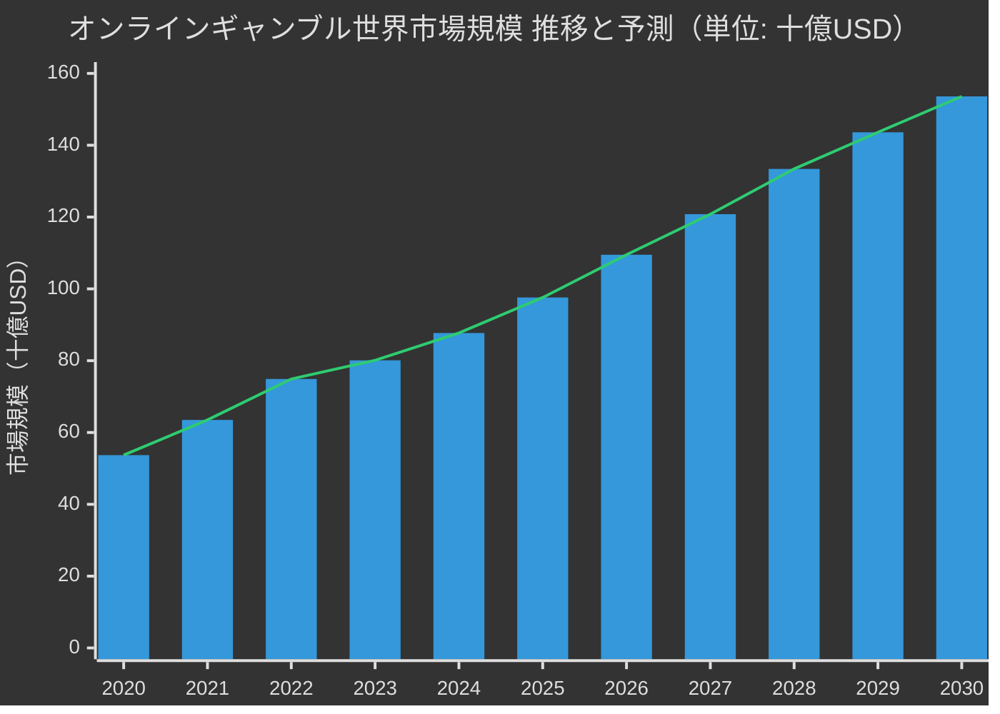

📌 出典: [Grand View Research – Online Gambling Market Report 2024](https://www.grandviewresearch.com/industry-analysis/online-gambling-market)

---

### 0.2 ISTQB® 認定資格ロードマップ

```mermaid
%%{init: {'theme': 'dark', 'themeVariables': {'primaryColor': '#2d6a4f', 'lineColor': '#74c69d', 'fontSize': '13px'}}}%%
graph TB
    subgraph Expert["🏆 Expert Level"]
        ETMT["Expert Level Test Management"]
        EITP["Expert Level Improving Test Process"]
    end
    subgraph Advanced["🎓 Advanced Level"]
        TM["CTAL-TM v3.0\nTest Management"]
        TA["CTAL-TA v4.0\nTest Analyst"]
        TTA["CTAL-TTA\nTech Test Analyst"]
        TAE["CTAL-TAE v2.0\nTest Automation Eng"]
    end
    subgraph Specialist["⭐ Specialist Stream"]
        CTGT["🎰 CT-GT\nGambling Industry Tester\n← ここ！"]
        CTAI["CT-AI\nAI Testing"]
        CTUT["CT-UT\nUsability Testing"]
        CTSEC["CT-SEC\nSecurity Tester"]
        CTMAT["CT-MAT\nMobile App Testing"]
        CTGAME["CT-GaMe\nGame Testing"]
    end
    subgraph Foundation["📚 Foundation Level（前提条件：必須）"]
        CTFL["CTFL v4.0\nCertified Tester Foundation Level"]
    end

    CTFL --> CTGT
    CTFL --> CTAI
    CTFL --> CTUT
    CTFL --> CTSEC
    CTFL --> CTMAT
    CTFL --> CTGAME
    CTFL --> TM
    CTFL --> TA
    CTFL --> TTA
    CTFL --> TAE
    TM --> ETMT
    TA --> EITP

    style CTGT fill:#d4a017,stroke:#f0c040,color:#000,font-weight:bold
    style Foundation fill:#1a3a5c,stroke:#4a90d9
    style Advanced fill:#2d4a1a,stroke:#6ab04c
    style Specialist fill:#4a1a3a,stroke:#d48ab0
    style Expert fill:#3a2a00,stroke:#d4a017
```

📌 出典: [ISTQB® 公式資格一覧](https://istqb.org/certifications/)

---

### 0.3 試験概要

| 項目 | 内容 |
|------|------|
| **問題数** | 40問（多肢選択式） |
| **合格点** | 26点 / 40点満点（65%） |
| **試験時間** | 60分（英語非母語者は +25% = 75分） |
| **前提条件** | CTFL（必須）、実務経験18ヶ月推奨 |
| **認知レベル** | K1（記憶）・K2（理解）・K3（適用） |
| **試験形式** | オンラインまたは試験センター |
| **費用** | 試験プロバイダーにより異なる |
| **シラバス** | v1.0 |

📌 試験申込: [iSQI CT-GT試験情報](https://isqi.org/ISTQB-Certified-Tester-Gambling-Industry-Tester-CT-GT/CT-GT.82)  
📌 ANZTB CT-GT情報: [https://www.anztb.org/certification/ctfl-gt/](https://www.anztb.org/certification/ctfl-gt/)

---

### 0.4 章別学習時間配分

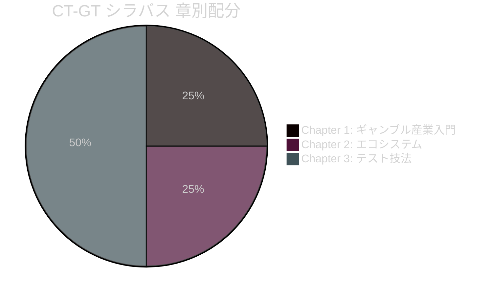

---

### 0.5 6つのビジネスアウトカム

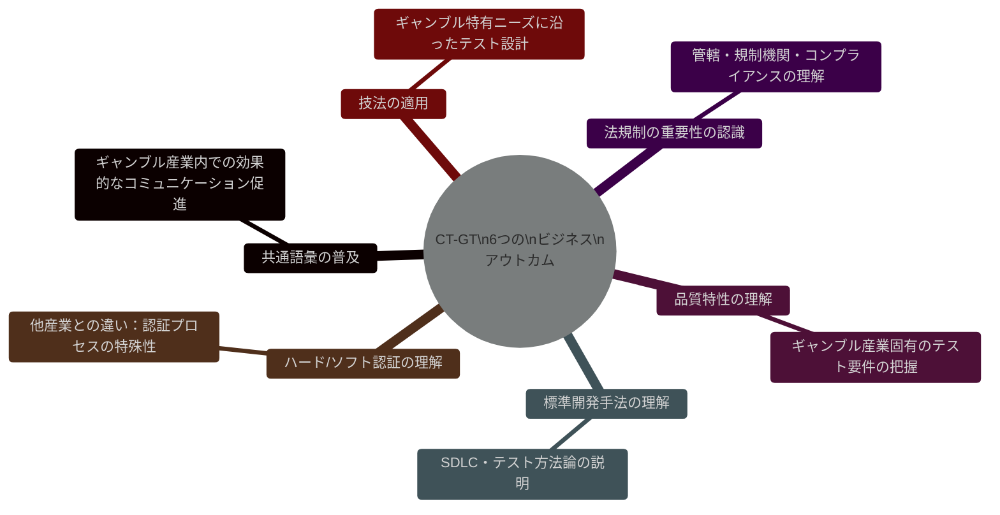

---

## 🎲 Chapter 1: ギャンブル産業入門（Introduction to the Gambling Industry）

### 1.1 ギャンブルとは何か？なぜ専門シラバスが必要か？

**ギャンブルの定義（CT-GT シラバスより）**:
> 「金銭・物品などの価値あるものをリスクにさらし、不確実な結果によって多くを得るか失うかを決める行為」

#### 一般ソフトウェアとギャンブルソフトウェアの違い

```mermaid
%%{init: {'theme': 'dark'}}%%
graph LR
    subgraph 一般ソフトウェアテスト["🖥️ 一般ソフトウェアテスト"]
        A1["機能テスト"]
        A2["性能テスト"]
        A3["UIテスト"]
        A4["セキュリティ"]
    end
    
    subgraph ギャンブルテスト["🎰 ギャンブルソフトウェアテスト（追加要素）"]
        B1["🎯 コンプライアンステスト\n管轄ごとに異なる法規制"]
        B2["🔢 数学テスト\nRNG・ペイアウト率検証"]
        B3["🏛️ 独立テストラボ（ITL）\n認証プロセス必須"]
        B4["🔒 セキュリティ特化\n不正防止・データ保護"]
        B5["🎮 プレイヤー体験テスト\nFun Factor評価"]
        B6["🔌 ハードウェア統合テスト\nEGM・スロット機器"]
    end
    
    一般ソフトウェアテスト --> ギャンブルテスト
    
    style B1 fill:#c62828,stroke:#ef5350,color:#fff
    style B2 fill:#1565c0,stroke:#42a5f5,color:#fff
    style B3 fill:#2e7d32,stroke:#66bb6a,color:#fff
    style B4 fill:#6a1b9a,stroke:#ab47bc,color:#fff
    style B5 fill:#e65100,stroke:#ffa726,color:#fff
    style B6 fill:#00695c,stroke:#4db6ac,color:#fff
```

---

### 1.2 ギャンブルの種類（Types of Gambling）

```mermaid
%%{init: {'theme': 'dark'}}%%
graph TB
    Root["🎰 ギャンブルの種類\n(Types of Gambling)"]
    
    Root --> Casino["🏛️ カジノゲーム\nCasino Games"]
    Root --> Lottery["🎫 宝くじシステム\nLottery Systems"]
    Root --> Racing["🏇 競馬・スポーツ賭け\nRace & Sports Wagering"]
    Root --> Online["📱 オンライン・モバイル\nOnline & Mobile Gambling"]
    
    Casino --> C1["スロットマシン\nSlot Machines"]
    Casino --> C2["テーブルゲーム\nBlackjack/Roulette"]
    Casino --> C3["ポーカー\nPoker"]
    Casino --> C4["ビデオポーカー\nVideo Poker"]
    
    Lottery --> L1["ビデオ宝くじ端末\nVLT (Video Lottery Terminals)"]
    Lottery --> L2["インスタントくじ\nInstant Scratch"]
    Lottery --> L3["キノ\nKeno"]
    Lottery --> L4["ナンバーズゲーム\nNumbers Games"]
    
    Racing --> R1["競馬ベッティング\nHorse Racing"]
    Racing --> R2["スポーツブック\nSports Book"]
    Racing --> R3["パリミュエル式\nPari-mutuel"]
    
    Online --> O1["オンラインカジノ\nOnline Casino"]
    Online --> O2["ライブディーラー\nLive Dealer"]
    Online --> O3["モバイルギャンブル\nMobile Apps"]
    Online --> O4["ゲーミフィケーション\nSocial Gaming"]
    
    style Root fill:#d4a017,stroke:#f0c040,color:#000,font-weight:bold
    style Casino fill:#1565c0,stroke:#42a5f5,color:#fff
    style Lottery fill:#2e7d32,stroke:#66bb6a,color:#fff
    style Racing fill:#6a1b9a,stroke:#ab47bc,color:#fff
    style Online fill:#e65100,stroke:#ffa726,color:#fff
```

---

### 1.3 ギャンブル産業の重要概念（Key Concepts）

#### 1.3.1 プログレッシブジャックポット（Progressive Jackpots）

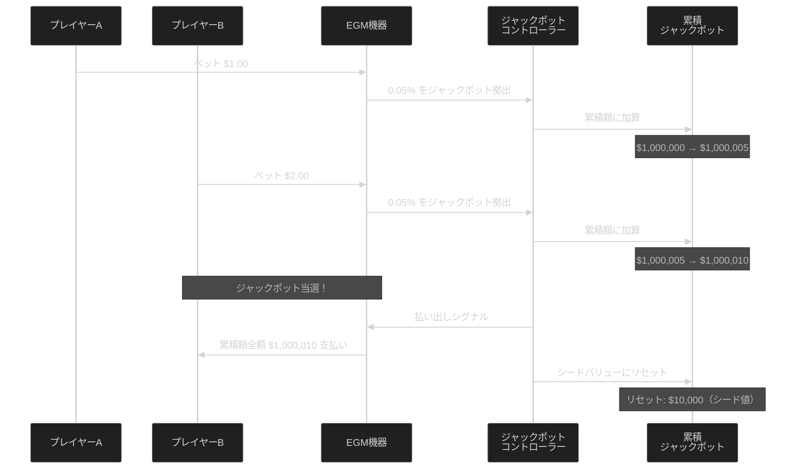

**テスト観点**: ジャックポットのトリガー条件・累積計算・リセット値・マルチサイト連携の検証

---

#### 1.3.2 RNG（Random Number Generator：乱数生成器）

RNGはギャンブルソフトウェアの心臓部であり、コンプライアンステストで最も重要な検証対象です。

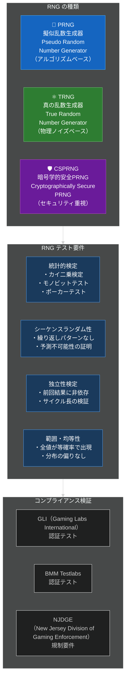

---

#### 1.3.3 勝利選択プロセス（Win Selection Process）

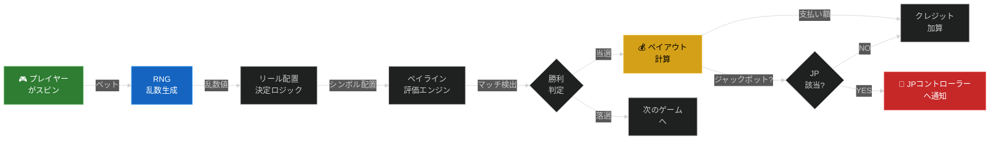

---

### 1.4 ギャンブル産業のメトリクス（Gambling Industry Metrics）

| メトリクス | 定義 | 重要性 |
|-----------|------|--------|
| **First Pass Percentage（初回合格率）** | コンプライアンステストを最初の提出で合格する割合 | 高いほど開発品質が高く、ITLとのサイクルが少ない |
| **Escape Compliance Defects（逸失コンプライアンス欠陥）** | ITLまたは規制機関に発見される前に逃れた欠陥数 | ゼロが理想。発見されると罰金・製品回収リスク |
| **RTP（Return To Player）** | プレイヤーへの総支払い率（例：96%） | 管轄ごとに最低RTPlimit が規制される |
| **House Edge（ハウスエッジ）** | カジノが理論上保持する割合（例：4%） | RTP = 100% - House Edge |
| **Volatility（ボラティリティ）** | 払い出しの頻度と金額の分散 | 高ボラティリティ = 少ない大当たり / 低ボラティリティ = 多い小当たり |

---

### 1.5 ギャンブルソフトウェア開発ライフサイクル（GSDLC）

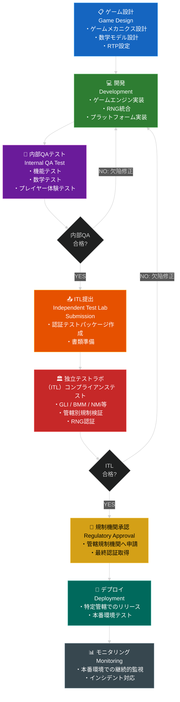

#### 独立テストラボ（ITL: Independent Test Lab）の役割

> ITLとは、ギャンブル機器・ソフトウェアが特定管轄の規制要件に準拠しているかを独立した立場で検証する認定機関です。

**主要な世界ITL機関**:

| 機関名 | 特徴 | 認定管轄 |
|-------|------|---------|
| **GLI（Gaming Labs International）** | 世界最大のITL | 世界480以上の管轄 |
| **BMM Testlabs** | アジア・ヨーロッパに強み | マカオ・シンガポール・欧州 |
| **NMi** | ヨーロッパ特化 | オランダ・欧州各国 |
| **eCOGRA** | オンラインカジノ特化 | 英国・マルタ・その他 |
| **iTech Labs** | オーストラリア拠点 | APAC・欧州 |

📌 参照: [GLI公式 – Gaming Labs International](https://www.gaminglabs.com/)

---

### 1.6 規制管轄と規制機関（Jurisdictions and Regulatory Bodies）

```mermaid
%%{init: {'theme': 'dark'}}%%
graph TB
    subgraph EU["🇪🇺 ヨーロッパ"]
        UKGC["英国\nUK Gambling Commission\n(UKGC)"]
        MGA["マルタ\nMalta Gaming Authority\n(MGA)"]
        KSA["オランダ\nKansspelautoriteit\n(KSA)"]
        GGL["ドイツ\nGemeinsame Glücksspielbehörde\n(GGL)"]
    end
    subgraph NA["🇺🇸 北米"]
        NV["ネバダ州\nNevada Gaming\nControl Board"]
        NJ["ニュージャージー州\nNJDGE\nDivision of Gaming Enforcement"]
        NIGC["連邦\nNIGC\n(Native American Gaming)"]
    end
    subgraph APAC["🌏 アジア太平洋"]
        PAGCOR["フィリピン\nPAGCOR"]
        IOM["マン島\nIsle of Man GSC"]
        GBGA["ジブラルタル\nGibraltar Licensing Authority"]
    end
    subgraph AUS["🇦🇺 オーストラリア"]
        ILGA["ILGA\n(Independent Liquor &\nGaming Authority NSW)"]
        VGCCC["VGCCC\n(Victoria)"]
    end
    
    style EU fill:#1a3a5c,stroke:#4a90d9
    style NA fill:#2e4a1a,stroke:#6ab04c
    style APAC fill:#4a1a3a,stroke:#d48ab0
    style AUS fill:#3a2a00,stroke:#d4a017
```

**重要な法令・規制**:

| 法令 | 地域 | 主な要件 |
|------|------|---------|
| **Gambling Act 2005（改正2023）** | 英国 | ライセンス・広告・責任ある賭博 |
| **Remote Gambling Act** | オランダ | オンラインカジノ合法化（2021年〜） |
| **GlüStV 2021** | ドイツ | 連邦統合ライセンス制度 |
| **PASPA廃止（2018）** | 米国 | 州別スポーツベッティング合法化 |
| **Interactive Gambling Act** | オーストラリア | オンラインカジノ規制 |

📌 参照: [UK Gambling Commission 公式](https://www.gamblingcommission.gov.uk/)

---

## 🎮 Chapter 2: ギャンブル産業エコシステム（The Gambling Industry Ecosystems）

### 2.1 3大エコシステム概要

```mermaid
%%{init: {'theme': 'dark'}}%%
graph TB
    subgraph VLT["🖥️ VLT エコシステム\nVideo Lottery Terminals"]
        VLT_Center["VLTセントラル\nシステム\n（州・規制機関管理）"]
        VLT1["VLT端末1"]
        VLT2["VLT端末2"]
        VLT3["VLT端末3"]
        VLT1 <-->|暗号化通信| VLT_Center
        VLT2 <-->|暗号化通信| VLT_Center
        VLT3 <-->|暗号化通信| VLT_Center
        VLT_Center --> VLT_Monitor["規制機関\nモニタリング\nシステム"]
    end
    
    subgraph SLOT["🎰 スロット機 エコシステム\nSlot Machines"]
        CMS["カジノ管理システム\nCMS（Casino Management System）"]
        EGM1["EGM1\n（Electronic Gaming Machine）"]
        EGM2["EGM2"]
        JP_CTRL["ジャックポット\nコントローラー"]
        EGM1 <-->|SAS/G2S Protocol| CMS
        EGM2 <-->|SAS/G2S Protocol| CMS
        EGM1 -->|JP拠出| JP_CTRL
        EGM2 -->|JP拠出| JP_CTRL
        JP_CTRL -->|JP払い出し| EGM1
    end
    
    subgraph LOTTERY["🎫 宝くじ エコシステム\nLottery Systems"]
        LC["宝くじ\nセントラルシステム"]
        POS["販売端末\nPOS Terminal"]
        KIOSK["セルフ端末\nKiosk"]
        DRAW["抽選\nシステム"]
        POS <-->|SSL/TLS| LC
        KIOSK <-->|SSL/TLS| LC
        LC --> DRAW
        DRAW --> LC
    end

    style VLT fill:#1a3a5c,stroke:#4a90d9
    style SLOT fill:#2e4a1a,stroke:#6ab04c
    style LOTTERY fill:#4a1a3a,stroke:#d48ab0
```

---

### 2.2 VLT（Video Lottery Terminal）エコシステム詳細

VLTは宝くじ機関（多くの場合、政府）が管理するセントラルシステムに接続された端末です。

**VLTとスロットマシンの主な違い**:

| 観点 | VLT | スロットマシン |
|------|-----|------------|
| RNG所在 | **セントラルシステム側** | **端末側（EGM内）** |
| 管理者 | 政府・州当局 | カジノオペレーター |
| 結果決定 | 中央サーバーで決定 | 端末のRNGで決定 |
| 設置場所 | バー・コンビニ等 | カジノ専用 |
| コンプライアンス | セントラルシステムが認証対象 | 各EGMが認証対象 |

---

### 2.3 EGM（Electronic Gaming Machine）のハードウェア構成

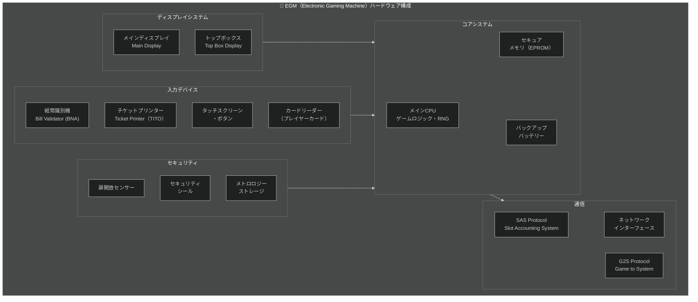

---

### 2.4 オンラインギャンブルエコシステム

```mermaid
%%{init: {'theme': 'dark'}}%%
flowchart LR
    subgraph Player["👤 プレイヤー側"]
        PC["PCブラウザ"]
        Mobile["モバイルアプリ"]
        Tablet["タブレット"]
    end
    
    subgraph CDN["🌐 CDN / ロードバランサー"]
        LB["負荷分散\nLoad Balancer"]
    end
    
    subgraph Platform["🖥️ ゲームプラットフォーム"]
        API["プラットフォームAPI"]
        Auth["認証\nAuthentication"]
        Wallet["ウォレット\nシステム"]
        Geo["ジオロケーション\nサービス"]
        KYC["KYC\n本人確認"]
        RG["責任ある賭博\nResponsible Gambling\nEngine"]
    end
    
    subgraph Game["🎮 ゲームコンテンツ"]
        GameServer["ゲームサーバー"]
        RNG2["RNGサービス"]
        Math["数学エンジン"]
        LiveDealer["ライブディーラー\nスタジオ"]
    end
    
    subgraph Backend["🔧 バックエンド"]
        CRM["CRM\nプレイヤー管理"]
        Bonus["ボーナス\nエンジン"]
        Report["レポーティング\n・分析"]
        AML["マネーロンダリング\n防止（AML）"]
    end
    
    subgraph Payment["💳 決済"]
        PSP["決済サービス\nプロバイダー"]
        Bank["銀行振込"]
        EWallet["電子ウォレット\ne-Wallet"]
        Crypto["仮想通貨"]
    end
    
    Player --> CDN
    CDN --> Platform
    Platform --> Game
    Platform --> Backend
    Platform --> Payment
    
    style Player fill:#2e7d32,stroke:#66bb6a
    style Platform fill:#1565c0,stroke:#42a5f5
    style Game fill:#6a1b9a,stroke:#ab47bc
    style Backend fill:#37474f,stroke:#78909c
    style Payment fill:#e65100,stroke:#ffa726
```

---

## 🔬 Chapter 3: ギャンブル産業テスト技法（Testing in the Gambling Industry）

### 3.1 テスト種別マップ

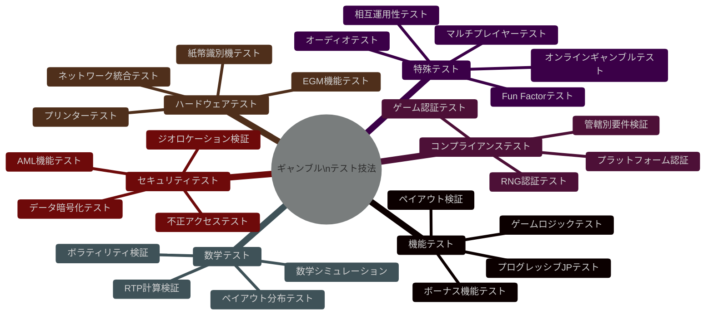

---

### 3.2 コンプライアンステスト（Compliance Testing）

コンプライアンステストは、ギャンブルテストの中で**最も重要かつ固有**の活動です。

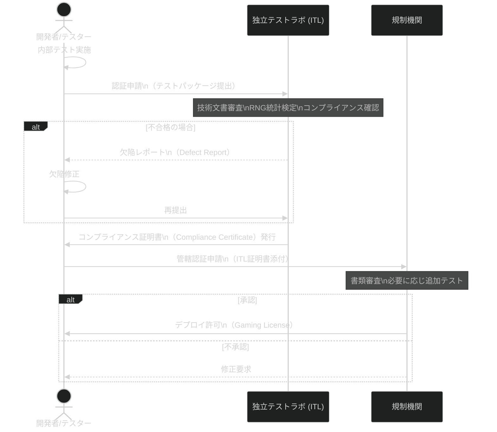

---

### 3.3 数学テスト（Math Testing）

数学テストはギャンブルに固有の、最も技術的に深いテスト分野です。

#### 主要な数学概念とテスト観点

```mermaid
%%{init: {'theme': 'dark'}}%%
graph TB
    subgraph RTP["📊 RTP（Return To Player）テスト"]
        RTP_Theory["理論RTP\n（設計値）\n例：96.00%"]
        RTP_Sim["数学シミュレーション\n（数十億ゲーム分）"]
        RTP_Accept["許容誤差内確認\n例：95.90%〜96.10%"]
        RTP_Theory --> RTP_Sim --> RTP_Accept
    end
    
    subgraph Vol["📈 ボラティリティ（Volatility）テスト"]
        Low["低ボラティリティ\nLow Variance\n少額・高頻度払出"]
        Med["中ボラティリティ\nMedium Variance\nバランス型"]
        High["高ボラティリティ\nHigh Variance\n大額・低頻度払出"]
    end
    
    subgraph Hit["🎯 ヒット率（Hit Rate）テスト"]
        HR["ヒット率 =\n勝利ゲーム数 / 総ゲーム数\n例：28.50%"]
        Verify["管轄要件との\n比較検証"]
        HR --> Verify
    end
    
    subgraph Payout["💰 最大ペイアウトテスト"]
        MaxPay["最大ペイアウト額確認\n例：最大ベットの 2,000倍"]
        JurLimit["管轄ペイアウト\n上限との照合"]
        MaxPay --> JurLimit
    end
    
    style RTP fill:#1a3a5c,stroke:#4a90d9
    style Vol fill:#2e4a1a,stroke:#6ab04c
    style Hit fill:#4a1a3a,stroke:#d48ab0
    style Payout fill:#3a2a00,stroke:#d4a017
```

#### 数学テスト実施例（疑似コード）

```python
# 数学シミュレーションの概念的な実装例
# 実際のギャンブルテストでは数十億回のシミュレーションを実施

class MathTester:
    """ギャンブルゲームの数学的検証クラス"""
    
    def calculate_theoretical_rtp(self, paytable: dict, reel_strips: list) -> float:
        """
        理論RTPlimit（Return To Player）を計算する
        
        paytable: シンボルの組み合わせ → ペイアウト倍率のマッピング
        reel_strips: 各リールのシンボル配列
        """
        total_combinations = 1
        for reel in reel_strips:
            total_combinations *= len(reel)
        
        total_return = 0
        for combination, payout in paytable.items():
            # 各組み合わせの発生確率計算
            probability = self._calc_probability(combination, reel_strips)
            total_return += probability * payout
        
        return (total_return / total_combinations) * 100
    
    def simulate_rtp(self, game_engine, iterations: int = 10_000_000) -> dict:
        """
        シミュレーションによる実際のRTPと理論値の照合
        
        iterations: シミュレーション回数（通常 1千万〜100億回）
        """
        total_bet = 0
        total_win = 0
        jackpot_hits = 0
        
        for _ in range(iterations):
            bet = 1.0  # 単位ベット
            result = game_engine.spin(bet)
            total_bet += bet
            total_win += result.payout
            if result.is_jackpot:
                jackpot_hits += 1
        
        actual_rtp = (total_win / total_bet) * 100
        
        return {
            "theoretical_rtp": game_engine.theoretical_rtp,
            "simulated_rtp": actual_rtp,
            "deviation": abs(actual_rtp - game_engine.theoretical_rtp),
            "jackpot_hit_frequency": iterations / jackpot_hits if jackpot_hits > 0 else None,
            "passes_threshold": abs(actual_rtp - game_engine.theoretical_rtp) < 0.5,
        }
    
    def verify_rng_distribution(self, rng_output: list, expected_range: tuple) -> bool:
        """
        RNG出力の均等分布を統計的に検証する（カイ二乗検定）
        """
        import statistics
        
        # 期待頻度（均等分布の場合）
        expected_freq = len(rng_output) / (expected_range[1] - expected_range[0] + 1)
        
        # 実際の頻度分布
        value_counts = {}
        for val in rng_output:
            value_counts[val] = value_counts.get(val, 0) + 1
        
        # カイ二乗統計量の計算
        chi_square = sum(
            (observed - expected_freq) ** 2 / expected_freq
            for observed in value_counts.values()
        )
        
        return chi_square < self.chi_square_critical_value  # 95%信頼区間
```

---

### 3.4 ハードウェアテスト（Hardware Testing）

```mermaid
%%{init: {'theme': 'dark'}}%%
graph TB
    subgraph HWFunc["🔧 ハードウェア機能テスト"]
        BNA_Test["紙幣識別機(BNA)テスト\n・真偽判定精度\n・対応紙幣種類\n・リジェクト率"]
        Print_Test["プリンターテスト\n・TITO印刷精度\n・バーコード可読性\n・紙切れ検出"]
        Card_Test["カードリーダーテスト\n・プレイヤーカード認識\n・磁気・ICカード対応"]
        Btn_Test["ボタン・タッチスクリーン\n・レスポンス時間\n・マルチタッチ検出"]
    end
    
    subgraph HWComp["📋 ハードウェアコンプライアンステスト"]
        Door_Test["扉開閉テスト\n・扉開放時の動作\n・ログ記録確認"]
        Power_Test["電源障害テスト\n・停電後の状態回復\n・ゲーム状態保持"]
        Security_Test["セキュリティテスト\n・不正アクセス検出\n・シール破損検出"]
        MetroTest["計量学テスト\n・メトロロジーデータ保全\n・改ざん検出"]
    end
    
    subgraph HWInteg["🔗 ハードウェア統合テスト"]
        Protocol_Test["プロトコルテスト\n・SAS (Slot Accounting System)\n・G2S (Game to System)\n・通信安定性"]
        Network_Test["ネットワーク統合テスト\n・CMS接続確認\n・JP接続確認\n・タイムアウト処理"]
        Floor_Test["フロア統合テスト\n・複数EGM同時動作\n・JP同時トリガー"]
    end
    
    style HWFunc fill:#1a3a5c,stroke:#4a90d9
    style HWComp fill:#2e4a1a,stroke:#6ab04c
    style HWInteg fill:#4a1a3a,stroke:#d48ab0
```

#### よくあるハードウェア統合テストの欠陥（試験頻出！）

| 欠陥カテゴリ | 説明 | 影響 |
|------------|------|------|
| **通信切断欠陥** | EGMとCMSの接続が突発的に切断 | ゲーム中断・データロス |
| **JP計算欠陥** | 累積JPの加算エラー | 不正なJP額の表示・支払い |
| **状態回復欠陥** | 停電後のゲーム状態が正しく復元されない | プレイヤー損失・コンプライアンス違反 |
| **BNA偽札検出漏れ** | 偽造紙幣を正規と誤認識 | 金融リスク |
| **タイムアウト欠陥** | ネットワーク障害時の処理が不適切 | デッドロック・不正なゲーム結果 |

---

### 3.5 プロトコルテスト（Protocol Testing）

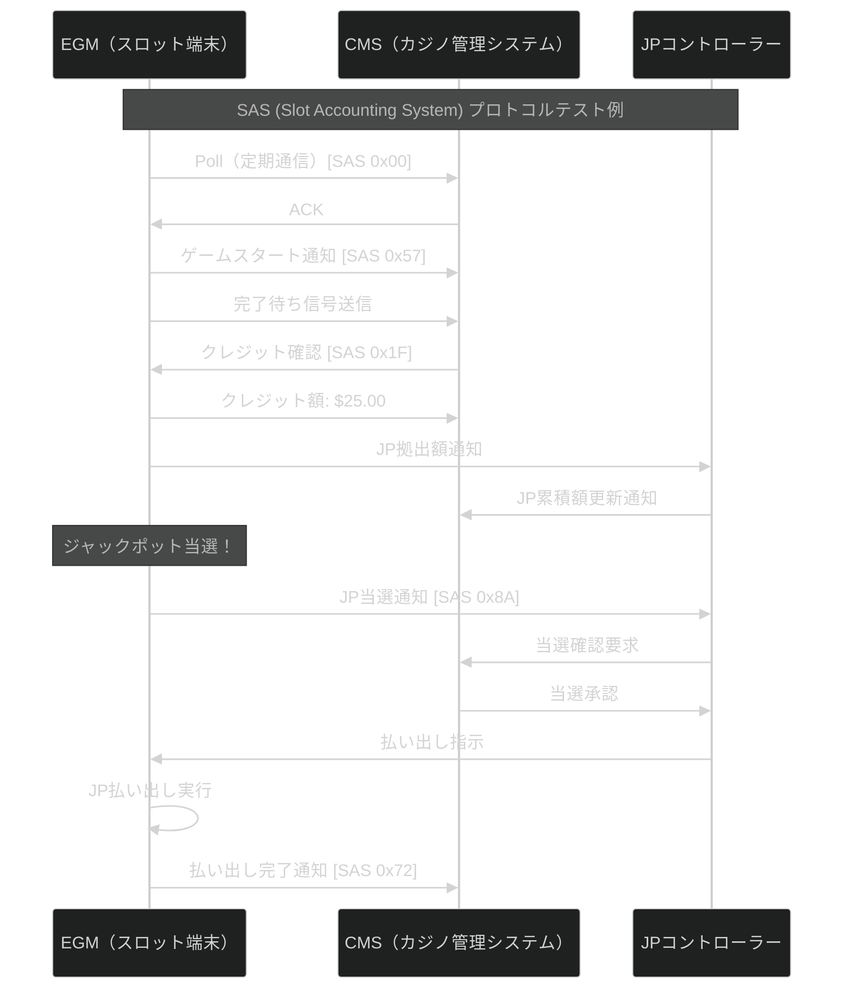

---

### 3.6 オンラインギャンブルテスト（Online Gambling Testing）

```mermaid
%%{init: {'theme': 'dark'}}%%
graph TB
    subgraph OGTest["オンラインギャンブルテストの領域"]
        direction TB
        
        subgraph FuncTest["機能テスト"]
            GameEngine["ゲームエンジン\nテスト"]
            BonusEngine["ボーナス機能\nテスト"]
            WalletTest["ウォレット統合\nテスト"]
            LiveDealer["ライブディーラー\nテスト"]
        end
        
        subgraph SecTest["セキュリティテスト"]
            AuthTest["認証・認可\nテスト"]
            GeoTest["ジオロケーション\nテスト"]
            AMLTest["AMLフィルター\nテスト"]
            DataTest["データ暗号化\nテスト"]
        end
        
        subgraph CompTest["コンプライアンステスト"]
            KYCTest["KYC\n（本人確認）テスト"]
            RGTest["責任ある賭博\n機能テスト"]
            LimitTest["賭け金制限\nテスト"]
            ExclusionTest["自己排除\n機能テスト"]
        end
        
        subgraph PerfTest["性能テスト"]
            LoadTest["負荷テスト\n（同時接続数）"]
            LatencyTest["レイテンシ\nテスト"]
            AvailTest["可用性テスト\n（99.9% SLA）"]
        end
        
        subgraph CompatTest["互換性テスト"]
            BrowserTest["クロスブラウザ\nテスト"]
            DeviceTest["マルチデバイス\nテスト"]
            OSTest["クロスOS\nテスト"]
        end
    end
    
    style FuncTest fill:#1a3a5c,stroke:#4a90d9
    style SecTest fill:#c62828,stroke:#ef5350
    style CompTest fill:#2e4a1a,stroke:#6ab04c
    style PerfTest fill:#6a1b9a,stroke:#ab47bc
    style CompatTest fill:#e65100,stroke:#ffa726
```

---

### 3.7 Fun Factor・プレイヤー体験テスト

「ゲームが楽しいかどうか」という主観的要素を評価する、ギャンブルテスト固有のアプローチです。

**Fun Factor テスト観点**:

| テスト観点 | 内容 | 評価方法 |
|-----------|------|---------|
| **ゲームフロー** | プレイの流れがスムーズか | ユーザーテスト・観察 |
| **ビジュアル演出** | 勝利時のアニメーションが適切か | 専門家評価 |
| **オーディオ** | 音楽・効果音の品質と適切さ | オーディオテスト（後述） |
| **期待感（Anticipation）** | 当選直前の盛り上がり感 | プレイヤーフィードバック |
| **機能の発見可能性** | ボーナスゲームの入り方が分かるか | ユーザビリティテスト |
| **マルチプレイヤー体験** | 他プレイヤーとのインタラクション | 統合テスト |

---

### 3.8 オーディオテスト（Audio Testing）

```mermaid
%%{init: {'theme': 'dark'}}%%
graph LR
    subgraph AudioAssets["🎵 オーディオアセットの種類"]
        BGM["バックグラウンドミュージック\n(BGM)"]
        SFX["サウンドエフェクト\n(SFX)"]
        Voice["ボイス・ナレーション"]
        Jingle["勝利ジングル\n(Win Jingle)"]
    end
    
    subgraph AudioTest["🔊 オーディオテスト内容"]
        Volume["音量レベルテスト\n・最大/最小音量\n・フェードイン/アウト"]
        Sync["同期テスト\n・ビジュアルとの同期\n・遅延（< 50ms）"]
        Loop["ループテスト\n・シームレスループ\n・切り替えのなめらかさ"]
        Locale["多言語テスト\n・ボイスの言語設定\n・地域ごとの適切さ"]
        Compliance["法令適合テスト\n・音楽版権確認\n・管轄の音量基準"]
    end
    
    AudioAssets --> AudioTest
```

---

### 3.9 マルチプレイヤーテスト（Multiplayer Testing）

```mermaid
%%{init: {'theme': 'dark'}}%%
sequenceDiagram
    participant P1 as プレイヤー1
    participant P2 as プレイヤー2
    participant P3 as プレイヤー3
    participant GameServer as ゲームサーバー
    
    Note over P1,GameServer: コミュナルゲームテストシナリオ（Bingo例）
    
    P1->>GameServer: 参加要求
    P2->>GameServer: 参加要求
    P3->>GameServer: 参加要求
    GameServer->>P1: ゲーム開始通知
    GameServer->>P2: ゲーム開始通知
    GameServer->>P3: ゲーム開始通知
    
    GameServer->>GameServer: RNGで番号を抽選
    GameServer->>P1: 番号 "42" を通知
    GameServer->>P2: 番号 "42" を通知
    GameServer->>P3: 番号 "42" を通知
    
    Note over P2: P2がビンゴ達成！
    P2->>GameServer: ビンゴ申告
    GameServer->>GameServer: ビンゴ検証
    
    alt 検証成功
        GameServer->>P2: 当選確認・払い出し
        GameServer->>P1: ゲーム終了通知（P2当選）
        GameServer->>P3: ゲーム終了通知（P2当選）
    else 検証失敗（不正申告）
        GameServer->>P2: エラー通知・申告却下
        GameServer->>GameServer: 不正行為ログ記録
    end
```

---

### 3.10 相互運用性テスト（Interoperability Testing）

```mermaid
%%{init: {'theme': 'dark'}}%%
graph TB
    subgraph Interop["相互運用性テストの領域"]
        direction LR
        
        subgraph Proto["プロトコル間"]
            SAS_G2S["SAS ↔ G2S\nプロトコル変換テスト"]
            OpenAPI["OpenAPI\n標準化テスト"]
        end
        
        subgraph Platform["プラットフォーム間"]
            PC_Mobile["PC ↔ モバイル\n継続性テスト\n（セッション維持）"]
            iOS_And["iOS ↔ Android\n同一ゲームテスト"]
        end
        
        subgraph Jurisdiction["管轄間"]
            JurA_JurB["管轄A設定 →\n管轄Bでの動作\n（RTP・言語・通貨）"]
        end
        
        subgraph Vendor["ベンダー間"]
            CMS_EGM["複数ベンダーCMSと\nEGM間の互換性"]
            ThirdParty["サードパーティ\nゲームコンテンツの\n統合テスト"]
        end
    end
    
    style Proto fill:#1a3a5c,stroke:#4a90d9
    style Platform fill:#2e4a1a,stroke:#6ab04c
    style Jurisdiction fill:#4a1a3a,stroke:#d48ab0
    style Vendor fill:#3a2a00,stroke:#d4a017
```

---

### 3.11 セキュリティテスト（System and Network Security Testing）

```mermaid
%%{init: {'theme': 'dark'}}%%
graph TB
    subgraph SecDomains["🔒 ギャンブルシステムのセキュリティテスト領域"]
        
        subgraph GameSec["ゲームセキュリティ"]
            RNG_Sec["RNG改ざん防止テスト\n・メモリ改ざん検出\n・外部操作不可確認"]
            Payout_Sec["ペイアウト不正防止\n・パリティチェック\n・二重支払い防止"]
        end
        
        subgraph NetSec["ネットワークセキュリティ"]
            Encrypt["暗号化テスト\n・TLS 1.3\n・エンドツーエンド暗号化"]
            DDoS["DDoS耐性テスト\n・高負荷時の動作確認"]
            Firewall["ファイアウォール\nペネトレーションテスト"]
        end
        
        subgraph PlayerSec["プレイヤーセキュリティ"]
            GeoBlock["ジオブロッキングテスト\n・VPN検出\n・プロキシ検出\n・IPブラックリスト"]
            AgeVerify["年齢確認テスト\n・KYCフロー検証\n・バイパス試行テスト"]
            DataPrivacy["個人情報保護テスト\n・GDPR準拠\n・データ最小化"]
        end
        
        subgraph FinanceSec["金融セキュリティ"]
            AML_Test["AML（マネーロンダリング防止）\n・大額取引検出\n・不審パターン検知"]
            Payment_Sec["決済セキュリティテスト\n・PCI-DSS準拠\n・不正取引検出"]
        end
    end
    
    style GameSec fill:#c62828,stroke:#ef5350
    style NetSec fill:#1565c0,stroke:#42a5f5
    style PlayerSec fill:#2e7d32,stroke:#66bb6a
    style FinanceSec fill:#6a1b9a,stroke:#ab47bc
```

---

## 📝 試験対策・サンプル問題

### 試験の重要概念チェックリスト

```mermaid
%%{init: {'theme': 'dark'}}%%
graph LR
    subgraph MustKnow["✅ 必ず覚える重要概念"]
        direction TB
        K1["RNG（乱数生成器）の\n種類と役割"]
        K2["VLT vs スロットマシン\nの違い（RNG所在）"]
        K3["ITL（独立テストラボ）\nの役割と代表機関"]
        K4["First Pass Percentage\nの定義と重要性"]
        K5["SAS・G2S\nプロトコルの概要"]
        K6["コンプライアンステスト\nとFunctional Testingの違い"]
        K7["管轄（Jurisdiction）\nの重要性"]
        K8["EGMのハードウェア構成\n（BNA・TITO・カードリーダー）"]
        K9["Fun Factor テスト\nの目的"]
        K10["RTP・ハウスエッジ\n・ボラティリティの関係"]
    end
```

### 章別出題比重（推定）

| 章 | テーマ | 推定出題数 | 重要度 |
|---|--------|----------|-------|
| 1 | ギャンブル産業入門 | ~10問 | ★★★★ |
| 2 | エコシステム（VLT・スロット・宝くじ） | ~10問 | ★★★★★ |
| 3 | テスト技法（コンプライアンス・数学・ハードウェア等） | ~20問 | ★★★★★ |

---

### サンプル問題と解説

---

**問1（K2 / Chapter 1）**

RNGに関する説明として正しいものはどれか？

A) VLTではRNGは各端末内に搭載される  
B) スロットマシンのRNGはセントラルシステムで動作する  
C) VLTのRNGはセントラルシステムで動作し、スロットマシンのRNGは各EGM内に搭載される  
D) すべてのギャンブル機器のRNGは独立テストラボで管理される  

<details>
<summary>📌 解答を見る</summary>

**正解: C**

VLTとスロットマシンのRNGの最大の違いは搭載場所です：
- VLT: RNGは**セントラルシステム側**で動作（政府・規制機関が管理）
- スロットマシン: RNGは**各EGM（端末）内**に搭載

</details>

---

**問2（K2 / Chapter 1）**

「First Pass Percentage（初回合格率）」の定義として正しいものはどれか？

A) ゲームが最初のプレイで当選する確率  
B) ITLへの最初の認証申請で合格する製品の割合  
C) プレイヤーが初回ログインに成功する割合  
D) 独立テストラボが最初の審査で欠陥を発見する割合  

<details>
<summary>📌 解答を見る</summary>

**正解: B**

First Pass Percentageは、製品を**最初のITL（独立テストラボ）への提出で**合格する割合を示すギャンブル産業固有のメトリクスです。高いほど開発品質が高いことを意味します。

</details>

---

**問3（K3 / Chapter 2）**

ニュージャージー州向けの新しいEGMのハードウェアコンプライアンステストを担当しています。以下のうち、最も適切なテストはどれか？

A) 紙幣識別機がUS紙幣とスロットバウチャーを受け入れることを検証する  
B) プレイヤー識別デバイスがニュージャージー州用に設定されたカードのみを受け入れることを確認する  
C) ベット上限がRNG上限（最大$500）と一致することを確認する  
D) メカニカルリールがゲーム仕様通りの速度で回転することを確認する  

<details>
<summary>📌 解答を見る</summary>

**正解: B**

ハードウェアコンプライアンステストでは**管轄固有の要件**に焦点を当てます。ニュージャージー州用の設定に限定されたカードのみを受け付けることは、その管轄のコンプライアンス要件への準拠確認として最も適切です。

- A) は機能テストの要素
- C) はRNG規制の誤解（RNGのベット上限設定はゲーム設定の問題）
- D) は仕様準拠テストだが管轄固有のコンプライアンスではない

</details>

---

**問4（K2 / Chapter 3）**

プラットフォームコンプライアンステストの最終的な主目的はどれか？

A) プラットフォームが管轄規格を満たしているか確認する  
B) プラットフォームが管轄国で利用可能かどうか確認する  
C) ゲームが管轄国で合法かどうか確認する  
D) プラットフォームが最高のゲーム体験を提供するか確認する  

<details>
<summary>📌 解答を見る</summary>

**正解: A**

プラットフォームコンプライアンステストの目的は「**プラットフォーム抽象化レイヤーが管轄の仕様要件を満たしているか**」を検証することです。

</details>

---

### 試験直前チェックリスト

```mermaid
%%{init: {'theme': 'dark'}}%%
graph TD
    Start["試験直前\nチェックリスト"] --> CH1["Chapter 1"]
    Start --> CH2["Chapter 2"]
    Start --> CH3["Chapter 3"]
    
    CH1 --> C1_1["✅ ギャンブルの4種類\n（カジノ・宝くじ・競馬賭け・オンライン）"]
    CH1 --> C1_2["✅ RNG・プログレッシブJP・\nRTP・ハウスエッジの定義"]
    CH1 --> C1_3["✅ GSDLC とITLの役割"]
    CH1 --> C1_4["✅ First Pass % と\nEscape Compliance Defects"]
    CH1 --> C1_5["✅ 規制機関の例\n（UKGC・MGA・NJDGE等）"]
    
    CH2 --> C2_1["✅ VLT vs スロットマシン\nの根本的違い（RNGの場所）"]
    CH2 --> C2_2["✅ EGMの主要ハードウェア\n（BNA・TITO・カードリーダー）"]
    CH2 --> C2_3["✅ プロトコル：SAS・G2S の概要"]
    CH2 --> C2_4["✅ 宝くじエコシステムの構成"]
    
    CH3 --> C3_1["✅ コンプライアンステスト vs\n機能テストの違い"]
    CH3 --> C3_2["✅ 数学テスト：RTP・ボラティリティ\n・ヒット率の計算"]
    CH3 --> C3_3["✅ ハードウェアテストの4種類\n（機能・コンプライアンス・統合）"]
    CH3 --> C3_4["✅ オンラインギャンブルの\n特有テスト（ジオロケーション・AML・KYC）"]
    CH3 --> C3_5["✅ Fun Factor・オーディオ・\nマルチプレイヤーテスト"]
    
    style Start fill:#d4a017,stroke:#f0c040,color:#000,font-weight:bold
    style CH1 fill:#1565c0,stroke:#42a5f5,color:#fff
    style CH2 fill:#2e7d32,stroke:#66bb6a,color:#fff
    style CH3 fill:#6a1b9a,stroke:#ab47bc,color:#fff
```

---

## 📚 参照URL一覧（全件）

### 🏛️ ISTQB® 公式リソース

| リソース | URL |
|---------|-----|
| **CT-GT 公式認定ページ** | https://istqb.org/certifications/certified-tester-gambling-industry-tester-ct-gt/ |
| **ISTQB 試験プロバイダー検索** | https://istqb.org/exam-providers/ |
| **ISTQB 研修プロバイダー検索** | https://istqb.org/training-providers/ |
| **ISTQB グロッサリー** | https://glossary.istqb.org/ |
| **CT-GT サンプル試験問題 PDF** | https://istqb.org/wp-content/uploads/2024/11/ISTQB_CT-GT_Sample-Exam-A-Questions_v1.0.1.pdf |

### 📋 試験プロバイダー

| リソース | URL |
|---------|-----|
| **iSQI CT-GT試験情報** | https://isqi.org/ISTQB-Certified-Tester-Gambling-Industry-Tester-CT-GT/CT-GT.82 |
| **ANZTB CT-GT情報（豪州・NZ）** | https://www.anztb.org/certification/ctfl-gt/ |
| **Brightest CT-GT情報** | https://www.brightest.org/en/certifications/ISTQB-r-CT-Gambling-Industry-Tester/ |
| **Credly バッジ情報** | https://www.credly.com/org/brightest/badge/istqb-certified-tester-gambling-industry-tester-ct- |

### 🎓 学習リソース

| リソース | URL |
|---------|-----|
| **ISTQB.Guru CT-GT ガイド** | https://www.istqb.guru/gambling-tester/ |
| **Acumen IT Training CT-GTコース（シラバス詳細）** | https://acumenph.com/courses/certified-tester-gambling-industry-tester-ct-gt/ |
| **ProcessExam CT-GT サンプル問題** | https://www.processexam.com/istqb/istqb-ct-gt-certification-exam-sample-questions |
| **ProcessExam シラバス詳細** | https://www.processexam.com/istqb/istqb-ct-gt-certification-exam-syllabus |
| **Udemy CT-GT 模擬試験（200問）** | https://www.udemy.com/course/istqb-gambling-industry-tester-ct-gt-mock-exam-set-a/ |

### 🎰 ギャンブル産業・規制機関

| リソース | URL |
|---------|-----|
| **UK Gambling Commission** | https://www.gamblingcommission.gov.uk/ |
| **Malta Gaming Authority (MGA)** | https://www.mga.org.mt/ |
| **GLI (Gaming Labs International)** | https://www.gaminglabs.com/ |
| **BMM Testlabs** | https://www.bmm.com/ |
| **eCOGRA** | https://ecogra.org/ |

### 📊 市場データ・統計

| リソース | URL |
|---------|-----|
| **Grand View Research – Online Gambling Market** | https://www.grandviewresearch.com/industry-analysis/online-gambling-market |
| **GM Insights – Online Gambling Market 2025-2034** | https://www.gminsights.com/industry-analysis/online-gambling-market |
| **Gambling Industry News – Global Statistics** | https://gamblingindustrynews.com/global-gambling-statistics/ |

### 📖 標準・プロトコル

| リソース | URL |
|---------|-----|
| **G2S Protocol（ゲーム-システム間プロトコル）** | https://www.gamingstandards.com/g2s-protocol/ |
| **Gaming Standards Association (GSA)** | https://www.gamingstandards.com/ |
| **GLI Standards（技術要件）** | https://www.gaminglabs.com/standards |

---

## 🏁 まとめ：ギャンブル産業テスト成功の10の鉄則

1. **🎲 管轄ファーストで考える**  
   テストケースを設計する前に「どの管轄向けか」を常に確認する。規制要件はすべての判断の根拠になる。

2. **🔢 RNGは信頼の核心**  
   RNGが適切に実装・テストされていることがすべての品質の前提。統計検定を理解して活用する。

3. **🏛️ ITLとのコラボレーションを早期に**  
   First Pass Percentageを高めるために、ITL要件を内部テストフェーズから組み込む。

4. **📊 数学テストは省略しない**  
   RTPlimitシミュレーションは数百万〜数十億回のサイクルが必要。自動化と計算ライブラリを活用する。

5. **🔌 ハードウェアは実機でテスト**  
   エミュレーターでは発見できないハードウェア固有の問題がある。実際のEGMでのテストを必ず実施する。

6. **🌍 多管轄展開を計画的に**  
   各管轄の要件は異なる。テスト環境を管轄別に構築し、要件差分を明示的に管理する。

7. **🛡️ セキュリティテストはギャンブル特有観点で**  
   一般的なセキュリティに加え、ジオロケーション・AML・不正ゲーム操作防止のテストを必ず実施する。

8. **🎮 Fun Factorを定量化する**  
   プレイヤー体験テストをチェックリスト化し、定性的評価を構造化する。

9. **📝 コンプライアンス証跡を確実に残す**  
   すべてのテスト活動をトレーサブルに記録する。規制機関への提出資料になる。

10. **🔄 継続的な規制動向のモニタリング**  
    ギャンブル規制は頻繁に変わる。各管轄のニュースレター・告示を定期的にチェックする。

---

> **📌 最終更新日**: 2025年5月  
> **📌 準拠資格**: ISTQB® CT-GT v1.0（Foundation Level Gambling Industry Tester Specialist）  
> **📌 次のステップ**: CTAL-TA v4.0（Test Analyst）・CT-SEC（Security Tester）も参照推奨  
>
> 🔗 **公式リソース**: https://istqb.org/certifications/certified-tester-gambling-industry-tester-ct-gt/

---

> ⚠️ **免責事項**: 本ガイドはISTQB®が公認したトレーニング資料ではありません。  
> 公式シラバス・サンプル問題と合わせてご使用ください。  
> 試験情報の最終確認は必ず公式サイト（istqb.org）で行ってください。
