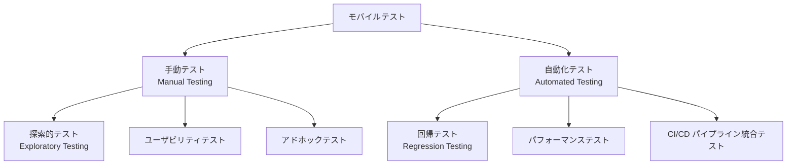
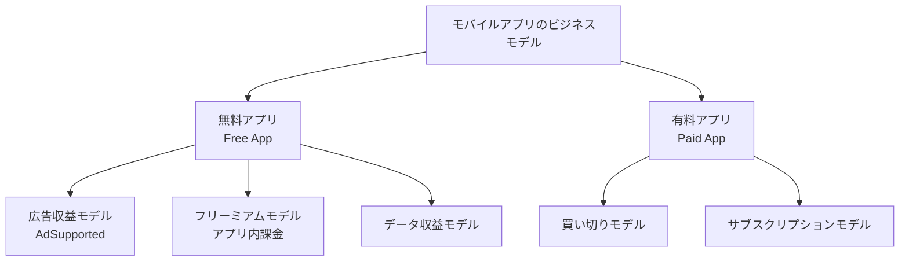
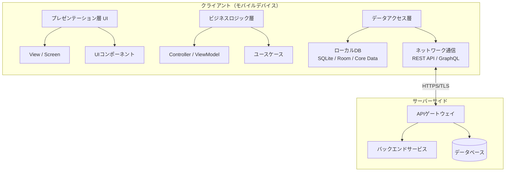
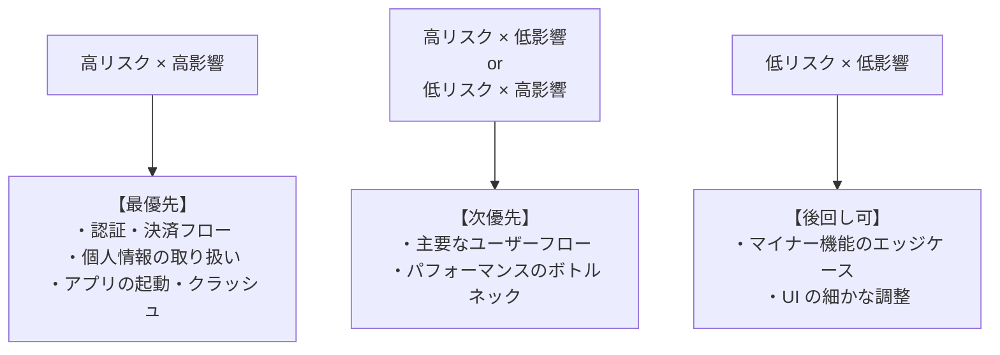
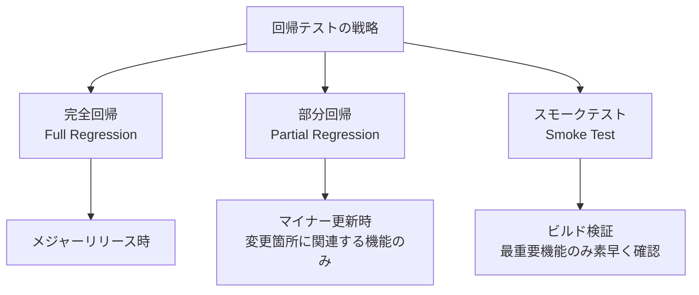
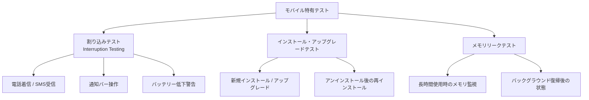
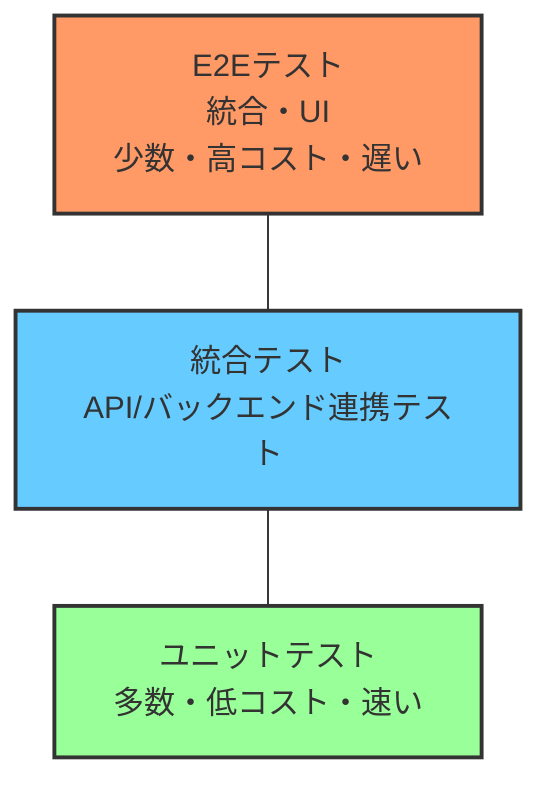
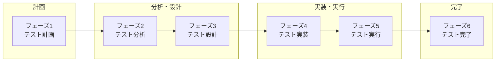
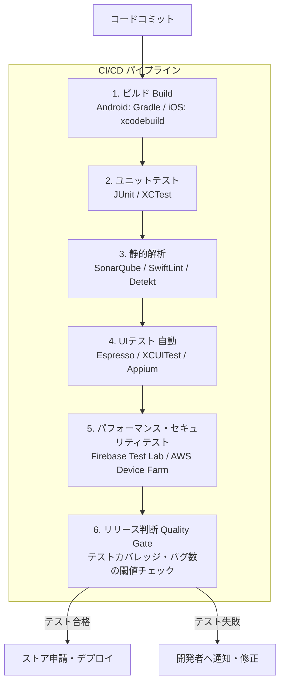

# 📱 モバイルアプリケーションテスト完全ガイド

## ISTQB CT-MAT (Certified Tester Mobile Application Testing) 準拠

> **対象読者:** モバイルテスト初学者〜中級者  
> **参考規格:** ISTQB CT-MAT v1.0 | OWASP Mobile Top 10 (2024) | 最新業界ベストプラクティス  
> **最終更新:** 2026年4月

---

## 📚 目次

1. [モバイルアプリテストとは？](#1-モバイルアプリテストとは)
2. [モバイルの世界：ビジネスと技術のドライバー](#2-モバイルの世界ビジネスと技術のドライバー)
3. [モバイルアプリの種類とアーキテクチャ](#3-モバイルアプリの種類とアーキテクチャ)
4. [テスト戦略の策定](#4-テスト戦略の策定)
5. [モバイルテストの種類](#5-モバイルテストの種類)
6. [テストレベルとテストプロセス](#6-テストレベルとテストプロセス)
7. [互換性テスト：デバイス・ハードウェア](#7-互換性テストデバイスハードウェア)
8. [接続性テスト](#8-接続性テスト)
9. [セキュリティテスト（OWASP Mobile Top 10）](#9-セキュリティテストowasp-mobile-top-10)
10. [パフォーマンステスト](#10-パフォーマンステスト)
11. [ユーザビリティテスト](#11-ユーザビリティテスト)
12. [テスト環境の構築](#12-テスト環境の構築)
13. [テスト自動化](#13-テスト自動化)
14. [自動化ツールの比較と選定](#14-自動化ツールの比較と選定)
15. [CI/CDとの統合](#15-cicdとの統合)
16. [テスト計画書とテストケース実例](#16-テスト計画書とテストケース実例)
17. [ISTQB CT-MAT 試験対策](#17-istqb-ct-mat-試験対策)
18. [参考URL一覧](#18-参考url一覧)

---

## 1. モバイルアプリテストとは？

### 1.1 定義

**モバイルアプリテスト**とは、モバイルアプリケーションが様々なデバイス・OS・ネットワーク環境において正常に動作すること、品質基準を満たすこと、そして優れたユーザー体験を提供することを検証するプロセスです。

| 機能性の検証 | 品質の担保 | ユーザー体験の確保 |
| --- | --- | --- |
| ・機能が仕様通りに動作するか<br/>・エラー処理 | ・パフォーマンス<br/>・セキュリティ<br/>・安定性 | ・UI/UX の一貫性<br/>・アクセシビリティ<br/>・使いやすさ |

### 1.2 なぜモバイルテストが重要なのか？

- 🌍 **世界のスマートフォンユーザーは57.8億人**（2025年時点）＝全人口の70.1%
- 💸 バグがリリース後に発見されると、開発段階の**最大100倍のコスト**がかかる
- ⭐ アプリが1回クラッシュすると、**ユーザーの50%以上がアンインストール**する
- 🔐 2023年のデータ侵害の約40%にモバイルアプリの脆弱性が関係している

### 1.3 モバイルテストの2大アプローチ



> ✅ **ベストプラクティス:** 手動と自動の「ハイブリッドアプローチ」が最も効果的です。
> 自動化で繰り返しタスクをカバーし、手動でユーザー体験や視覚的な品質を評価します。

---

## 2. モバイルの世界：ビジネスと技術のドライバー

### 2.1 モバイル市場の現状（2025年）

| 指標 | データ |
|------|--------|
| スマートフォンユーザー数 | 57.8億人（全人口比70.1%） |
| モバイルインターネット利用率 | デジタルインタラクション全体の70% |
| Google Play アプリ数 | 約270万本 |
| Apple App Store アプリ数 | 約180万本 |
| アプリへの1日あたり平均接触時間 | 4.8時間以上 |

### 2.2 主要なビジネスモデル



### 2.3 モバイルデバイスの種類

| デバイス種類 | 特徴 | テスト上の考慮点 |
|------------|------|----------------|
| スマートフォン | 最も普及、多様な画面サイズ | デバイスの断片化が最大の課題 |
| タブレット | 大画面、ビジネス用途も多い | レイアウト適応性のテストが重要 |
| スマートウォッチ | 小画面、センサー豊富 | 限られたUI、ヘルスデータの精度 |
| スマートTV | 大画面、リモコン操作 | ナビゲーションパターンが異なる |
| IoTデバイス | 組み込み系、センサー活用 | 通信プロトコルの互換性 |

---

## 3. モバイルアプリの種類とアーキテクチャ

### 3.1 アプリの3種類

> | モバイルアプリの種類 | 特徴・技術 | メリット | デメリット |
> | --- | --- | --- | --- |
> | **ネイティブアプリ (Native App)** | ・iOS: Swift/Objective-C<br>・Android: Kotlin/Java | ✅ 高パフォーマンス<br>✅ デバイス機能フル活用 | ❌ プラットフォーム毎に開発 |
> | **ハイブリッドアプリ (Hybrid App)** | ・React Native<br>・Flutter<br>・Ionic<br>・Cordova | ✅ コード共有可能<br>✅ コスト削減 | ❌ ネイティブより遅い場合あり |
> | **モバイルWebアプリ (Mobile Web App)** | ・HTML5/CSS/JS<br>・ブラウザで動作<br>・インストール不要 | ✅ クロスプラットフォーム<br>✅ 更新容易 | ❌ オフライン機能制限<br>❌ デバイス機能制限 |

### 3.2 モバイルアプリのアーキテクチャ



---

## 4. テスト戦略の策定

### 4.1 テスト戦略の5つの要素

> 1. テスト目的の定義
>    ↓
> 2. リスク分析と優先順位付け
>    ↓
> 3. テスト範囲の決定（スコープ）
>    ↓
> 4. テストアプローチの選択（手動/自動）
>    ↓
> 5. テスト環境と必要ツールの特定

### 4.2 モバイルテスト特有の課題（CT-MAT重要項目）

| 課題カテゴリ | 具体的な課題 | 対策 |
|------------|------------|------|
| **デバイスの断片化** | Android端末だけで1万種類以上の機種 | 代表デバイスの選定、クラウド端末の活用 |
| **OS バージョン** | Android/iOSの複数バージョンが並存 | サポートマトリクスの定義 |
| **ネットワーク環境** | 3G/4G/5G/Wi-Fi/オフライン | 各条件での動作検証 |
| **バッテリー消費** | バックグラウンド処理の影響 | 長時間動作テスト |
| **センサー** | GPS/カメラ/加速度センサー等 | エミュレータとリアルデバイスの併用 |
| **割り込み処理** | 電話着信、通知、低バッテリー | 割り込みシナリオのテスト |

### 4.3 テスト優先順位のフレームワーク（リスクベース）



---

## 5. モバイルテストの種類

### 5.1 機能テスト（Functional Testing）

アプリの各機能が仕様通りに動作するかを検証します。

**テスト対象の例：**

- [ ] アプリの起動・終了
- [ ] ユーザー登録・ログイン（正常系・異常系）
- [ ] 多要素認証（MFA）
- [ ] 各画面間のナビゲーション
- [ ] 入力フォーム（文字数制限、入力型、バリデーション）
- [ ] フォーム送信とフィードバック表示
- [ ] データの保存・取得
- [ ] プッシュ通知の受信
- [ ] アプリ内購入（In-App Purchase）

### 5.2 UI/UXテスト

#### UI/UXテストの観点

- **ビジュアルデザイン**
  - デザインガイドライン準拠（Material Design / Human Interface Guidelines）
  - フォント・アイコン・色の一貫性
  - ダークモード対応
- **レスポンシブレイアウト**
  - 縦・横向き切替時の表示崩れ
  - 異なる画面サイズへの対応
- **タッチ・ジェスチャー**
  - タップ・スワイプ・ピンチ・ダブルタップ
  - タッチターゲットのサイズ（最低 44×44pt）
- **アクセシビリティ**
  - スクリーンリーダー対応（VoiceOver/TalkBack）
  - 文字サイズ変更対応
  - WCAG 2.1 AA準拠

### 5.3 パフォーマンステスト（後述10章で詳述）

| テスト種類 | 目的 |
|----------|------|
| 負荷テスト（Load Test） | 通常の高負荷状態での動作確認 |
| ストレステスト（Stress Test） | 限界を超えた際の挙動確認 |
| スケーラビリティテスト | ユーザー増加時の拡張性確認 |
| レイテンシテスト | 各機能の応答時間計測 |

### 5.4 セキュリティテスト（後述9章で詳述）

### 5.5 回帰テスト戦略（Regression Testing）

コード変更後に既存機能が壊れていないことを確認します。



### 5.6 モバイル特有のテスト種類



---

## 6. テストレベルとテストプロセス

### 6.1 モバイルアプリのテストレベル



| テストレベル | 説明 | ツール例 |
|------------|------|---------|
| **ユニットテスト** | 個別の関数・クラスの動作確認 | JUnit(Android)、XCTest(iOS) |
| **統合テスト** | コンポーネント間の連携確認 | Mockito、OHHTTPStubs |
| **UIテスト（E2E）** | ユーザー操作シナリオ全体の確認 | Appium、Espresso、XCUITest |

### 6.2 モバイルテストプロセス（CT-MAT準拠）



#### 各フェーズの詳細

- **フェーズ1: テスト計画（Test Planning）**
  - テスト目標の定義
  - スコープと除外項目の決定
  - リスク評価
  - テスト環境の選定（実機/エミュレータ/クラウド）
  - テスト工数・スケジュールの見積もり
- **フェーズ2: テスト分析（Test Analysis）**
  - 要件・仕様の分析
  - テスト可能性の評価
  - テスト条件の特定
- **フェーズ3: テスト設計（Test Design）**
  - テストケースの設計
  - テストデータの準備
  - テスト環境のセットアップ
- **フェーズ4: テスト実装（Test Implementation）**
  - テストスクリプトの作成（自動化）
  - テストデータの投入
  - テスト環境の構築・検証
- **フェーズ5: テスト実行（Test Execution）**
  - テストケースの実行
  - バグレポートの作成
  - 再テスト（バグ修正後）
- **フェーズ6: テスト完了（Test Completion）**
  - テストサマリーレポートの作成
  - 教訓の記録
  - テスト成果物のアーカイブ

---

## 7. 互換性テスト：デバイス・ハードウェア

### 7.1 デバイス互換性テストの戦略

**デバイス選定マトリクス（例）：**

- **優先度 HIGH（必須）**
  - 市場シェア上位5機種（自社ユーザーデータ参照）
  - 最新OS バージョン（iOS/Android）
  - 直前のメジャーOSバージョン
- **優先度 MEDIUM（推奨）**
  - 市場シェア上位6〜15機種
  - 2世代前のOSバージョン
- **優先度 LOW（任意）**
  - ニッチデバイス・古いOS
  - タブレット（アプリによる）

### 7.2 ハードウェアセンサーテスト

| センサー | テスト観点 |
|---------|-----------|
| GPS / 位置情報 | 精度・屋内外での動作・権限要求 |
| カメラ | 前面/背面カメラ切替・解像度・フラッシュ |
| 加速度センサー | 画面回転・歩数計・シェイク操作 |
| 指紋/Face ID | 生体認証の正確性・フォールバック |
| NFC | タッチ決済・データ転送 |
| Bluetooth | ペアリング・接続維持・切断時の挙動 |

### 7.3 スクリーンサイズと解像度

| デバイス | 解像度 | PPI |
| --- | --- | --- |
| iPhone 16 Pro | 2622×1206 | 460 ppi |
| iPhone SE (3rd) | 1334×750 | 326 ppi |
| Samsung S25 | 2340×1080 | 416 ppi |
| Pixel 9 | 2424×1080 | 416 ppi |

---

## 8. 接続性テスト

### 8.1 ネットワーク条件テスト

**テストすべきネットワーク状態：**

- **高速接続（Wi-Fi / 5G）**
  - 正常系の動作確認
- **低速接続（3G / 2G相当）**
  - 応答速度の確認
  - タイムアウト処理の確認
- **断続的な接続（Flaky Network）**
  - 接続が途切れた際のエラーハンドリング
  - 再接続後のデータ整合性
- **オフライン**
  - オフライン機能の動作確認
  - オンライン復帰後の同期確認

### 8.2 ネットワーク条件のシミュレーションツール

| ツール | プラットフォーム | 用途 |
|-------|--------------|------|
| Network Link Conditioner | iOS/macOS | 帯域・遅延・パケットロスの制御 |
| Android Emulator | Android | ネットワーク速度のシミュレーション |
| Charles Proxy | クロスプラットフォーム | トラフィック監視・スロットリング |
| Proxyman | macOS | HTTPトラフィックのデバッグ |

### 8.3 接続切替テスト

**テストシナリオ例：**

1. Wi-Fi → 4G切替時にデータが失われないか
2. 通話中のデータ通信への影響
3. Bluetooth接続デバイスとの通信安定性
4. VPN使用時のアプリ動作

---

## 9. セキュリティテスト（OWASP Mobile Top 10）

### 9.1 OWASP Mobile Top 10（2024年版）

OWASPが2024年に更新した「モバイルアプリセキュリティにおける最重要リスク10項目」です。

| ランク | リスク名 | 日本語説明 |
| --- | --- | --- |
| M1 | Improper Credential Usage | 認証情報の不適切な使用 |
| M2 | Inadequate Supply Chain Security | サプライチェーンの不備 |
| M3 | Insecure Authentication/Authorization | 不安全な認証・認可 |
| M4 | Insufficient Input/Output Validation | I/O検証の不足 |
| M5 | Insecure Communication | 安全でない通信 |
| M6 | Inadequate Privacy Controls | プライバシー制御の不備 |
| M7 | Insufficient Binary Protection | バイナリ保護の不足 |
| M8 | Security Misconfiguration | セキュリティの設定ミス |
| M9 | Insecure Data Storage | 安全でないデータ保管 |
| M10 | Insufficient Cryptography | 暗号化の不足 |

### 9.2 各リスクの詳細と対策

#### M1: 認証情報の不適切な使用

- **リスク:** ハードコードされた認証情報、平文でのパスワード保存
- **テスト方法:** 静的解析（MobSF）でソースコードのハードコード検出
- **対策:** Android Keystore / iOS Secure Enclave を使用

#### M3: 不安全な認証・認可

- **リスク:** セッション管理の不備、不十分なトークン検証
- **テスト方法:** Frida を使った MFA バイパステスト
- **対策:** 多要素認証の実装、適切なセッション管理

#### M5: 安全でない通信

- **リスク:** 弱いTLS、証明書ピンニングの欠如
- **テスト方法:** Burp Suite / Charles Proxy で中間者攻撃（MITM）シミュレーション
- **対策:** TLS 1.3の使用、証明書ピンニングの実装

#### M9: 安全でないデータ保管

- **リスク:** 機密データの平文保存、ログへの個人情報出力
- **テスト方法:** adb shell / Objection でファイルシステムの検査
- **対策:** AES-256暗号化、EncryptedSharedPreferences（Android）の使用

### 9.3 セキュリティテストツール

| ツール | 種類 | 用途 |
|-------|------|------|
| **MobSF** | SAST/DAST | 静的・動的解析（無料OSS） |
| **OWASP ZAP** | DAST | API・通信の脆弱性診断 |
| **Burp Suite** | プロキシ | 通信傍受・改ざんテスト |
| **Frida** | 動的解析 | ランタイム操作・フック |
| **Objection** | 動的解析 | Fridaベースの高レベルツール |
| **apktool** | リバース | APKの逆コンパイル |

---

## 10. パフォーマンステスト

### 10.1 測定すべき主要メトリクス

**パフォーマンス指標：**

- **起動時間（App Startup Time）**
  - コールドスタート（初回起動）: 目標 < 3秒
  - ウォームスタート（再起動）: 目標 < 1秒
- **応答性（Responsiveness）**
  - 画面遷移: 目標 < 0.3秒
  - API応答: 目標 < 2秒
- **リソース使用量**
  - メモリ使用量（RAM）
  - CPU使用率
  - バッテリー消費（mAh/時間）
- **ネットワーク**
  - データ転送量
  - API レイテンシ

### 10.2 パフォーマンステストの種類

| テスト種類 | 目的 | ツール |
|----------|------|-------|
| 負荷テスト | 高負荷時の安定性確認 | JMeter、k6 |
| ストレステスト | 限界点を超えた際の挙動 | BlazeMeter、Gatling |
| 耐久テスト | 長時間稼働時のメモリリーク | Firebase Performance |
| スパイクテスト | 突然のアクセス急増への対応 | LoadRunner |

### 10.3 パフォーマンステスト手順

1. **Step 1: テスト目標の定義（KPIの設定）**
   - 例: 「起動3秒以内」「100ユーザー同時接続でクラッシュなし」
2. **Step 2: ベースライン計測**
   - 現状のパフォーマンスを記録
3. **Step 3: テスト環境の準備**
   - 本番に近い環境を用意（ネットワーク遅延含む）
4. **Step 4: テスト実行**
   - 各種シナリオでの計測
5. **Step 5: 結果分析とボトルネック特定**
   - プロファイラーでのCPU/メモリ分析
6. **Step 6: 最適化と再テスト**
   - 修正後の改善確認

---

## 11. ユーザビリティテスト

### 11.1 ユーザビリティテストの観点

**ユーザビリティ評価基準（Nielsen's Heuristics モバイル版）：**

1. **現状の視認性（状態の把握のしやすさ）**
   - 例: ローディング中のプログレス表示
2. **実世界との一致（直感的なアイコン・用語）**
   - 例: ゴミ箱アイコン = 削除
3. **ユーザーコントロールと自由**
   - 例: 誤操作の「元に戻す」機能
4. **一貫性と標準への準拠**
   - 例: プラットフォームのUIパターン遵守
5. **エラーの防止**
   - 例: 削除前の確認ダイアログ
6. **認識より記憶（少ない記憶負荷）**
   - 例: 最近使った項目の表示
7. **柔軟性と効率性**
   - 例: 上級者向けショートカット
8. **美学とミニマルデザイン**
   - 例: 不要な情報の除外
9. **エラーの認識・診断・回復支援**
   - 例: わかりやすいエラーメッセージ
10. **ヘルプとドキュメント**
    - 例: コンテキストに応じたヘルプ

### 11.2 アクセシビリティテスト

**アクセシビリティチェックリスト：**

- [ ] スクリーンリーダー（VoiceOver/TalkBack）での操作可能性
- [ ] コントラスト比 4.5:1 以上（WCAG 2.1 AA準拠）
- [ ] タッチターゲットサイズ 44×44pt 以上
- [ ] 動画への字幕/音声説明の付与
- [ ] 色だけに依存しない情報伝達
- [ ] 点滅コンテンツの制限（3回/秒以下）
- [ ] フォントサイズ変更への対応

---

## 12. テスト環境の構築

### 12.1 テスト環境の3つの選択肢

- **実機（Physical Devices）**
  - 最も正確な結果
  - センサー・カメラ完全対応
  - コスト高・管理が大変
- **エミュレータ・シミュレータ**
  - Android Emulator（Android Studio付属）
  - iOS Simulator（Xcode付属）
  - コスト低・設定容易
  - センサー・カメラの制限あり
- **クラウドデバイスファーム**
  - BrowserStack（3000以上の実機）
  - AWS Device Farm
  - Firebase Test Lab（Google）
  - Sauce Labs
  - 多数の実機にリモートアクセス可能

### 12.2 エミュレータ vs 実機の比較

| 項目 | エミュレータ | 実機 |
|-----|-----------|------|
| コスト | 低（無料） | 高（購入・管理費用） |
| セットアップ | 容易 | 複雑（設定・登録） |
| センサーテスト | 制限あり | フル対応 |
| パフォーマンス精度 | 低（ホストPCに依存） | 高（実際の動作） |
| ネットワーク制御 | 容易 | 制限あり |
| 並列実行 | 可能（リソース消費大） | 可能（複数台必要） |

### 12.3 テストラボの構築手順

1. **Step 1: 対象デバイスのリストアップ**
   - ユーザーデバイス統計・市場シェアを参考に選定
2. **Step 2: テストデバイスの調達**
   - 購入 or クラウドサービス契約
3. **Step 3: デバイス管理システムの導入**
   - MDM（Mobile Device Management）ツールの設定
4. **Step 4: テスト用データ・アカウントの準備**
   - テスト専用の認証情報・データセット作成
5. **Step 5: CI/CDとの連携**
   - ビルドトリガーによる自動テスト実行の設定

---

## 13. テスト自動化

### 13.1 自動化すべき・すべきでないテスト

**自動化に向いているテスト：**

- [x] 回帰テスト（繰り返し実行するもの）
- [x] パフォーマンス・負荷テスト
- [x] データ主導型テスト（大量のデータパターン）
- [x] スモークテスト（ビルドごとの基本確認）
- [x] CI/CDパイプラインでの継続的テスト

**手動テストが向いているテスト：**

- [x] 探索的テスト（初回・新機能の探索）
- [x] UX/ユーザビリティの評価
- [x] 視覚的なデザイン確認
- [x] アドホックテスト（直感的なバグ発見）
- [x] 要件の曖昧な部分の確認

### 13.2 自動化の4つのアプローチ（CT-MAT準拠）

1. **コードベースのアプローチ（Code-based）**
   - Appium、Espresso、XCUITest 等でスクリプトを記述
2. **キーワード駆動（Keyword-driven）**
   - Robot Framework を使った自然言語に近いテスト記述
3. **データ駆動（Data-driven）**
   - テストデータを外部から注入して同一ロジックを繰り返し実行
4. **ノーコード/ローコード（No-code/Low-code）**
   - Maestro、TestComplete の録画＆再生機能

---

## 14. 自動化ツールの比較と選定

### 14.1 主要フレームワーク比較表

| フレームワーク | 対応プラットフォーム | 使用言語 | 速度 | 難易度 |
| --- | --- | --- | --- | --- |
| Appium | Android + iOS + Web | Java/Python/JS/Ruby等 | ⭐⭐⭐ | 中〜高 |
| Espresso | Android のみ | Java/Kotlin | ⭐⭐⭐⭐⭐ | 中 |
| XCUITest | iOS/iPadOS のみ | Swift/ObjC | ⭐⭐⭐⭐⭐ | 中 |
| Detox | Android + iOS (React Native) | JavaScript | ⭐⭐⭐⭐ | 中 |
| Maestro | Android + iOS | YAML | ⭐⭐⭐⭐ | 低 |

### 14.2 ツール選定ガイド

- **Q1: クロスプラットフォーム（iOS + Android）が必要？**
  - YES → Appium または Detox（React NativeならDetox推奨）
  - NO  → Q2へ
- **Q2: どのプラットフォーム？**
  - Android のみ → Espresso（速度・安定性◎）
  - iOS のみ    → XCUITest（Apple公式、信頼性◎）
- **Q3: チームのコーディングスキルは？**
  - 高い → コードベースフレームワーク（Appium/Espresso/XCUITest）
  - 低い → ノーコードツール（Maestro、TestComplete）

### 14.3 Appium の基本的な使い方（サンプルコード）

```python
# Python + Appium によるAndroidアプリの自動化例
from appium import webdriver
from appium.webdriver.common.appiumby import AppiumBy

desired_caps = {
    "platformName": "Android",
    "deviceName": "emulator-5554",
    "app": "/path/to/app.apk",
    "automationName": "UiAutomator2"
}

driver = webdriver.Remote("http://localhost:4723/wd/hub", desired_caps)

# ログイン操作の例
username_field = driver.find_element(AppiumBy.ID, "com.example:id/username")
username_field.send_keys("testuser@example.com")

password_field = driver.find_element(AppiumBy.ID, "com.example:id/password")
password_field.send_keys("password123")

login_button = driver.find_element(AppiumBy.ID, "com.example:id/login_button")
login_button.click()

# アサーション
welcome_text = driver.find_element(AppiumBy.ID, "com.example:id/welcome_msg")
assert "ようこそ" in welcome_text.text

driver.quit()
```

### 14.4 Espresso の基本的な使い方（Androidネイティブ）

```kotlin
// Kotlin + Espresso によるAndroidアプリのUIテスト例
@RunWith(AndroidJUnit4::class)
class LoginActivityTest {
    
    @get:Rule
    val activityRule = ActivityScenarioRule(LoginActivity::class.java)
    
    @Test
    fun testSuccessfulLogin() {
        // ユーザー名入力
        onView(withId(R.id.editUsername))
            .perform(typeText("testuser"), closeSoftKeyboard())
        
        // パスワード入力
        onView(withId(R.id.editPassword))
            .perform(typeText("password123"), closeSoftKeyboard())
        
        // ログインボタンをクリック
        onView(withId(R.id.btnLogin))
            .perform(click())
        
        // ホーム画面が表示されることを確認
        onView(withId(R.id.tvWelcome))
            .check(matches(isDisplayed()))
    }
}
```

### 14.5 XCUITest の基本的な使い方（iOSネイティブ）

```swift
// Swift + XCUITest によるiOSアプリのUIテスト例
import XCTest

class LoginUITests: XCTestCase {
    
    var app: XCUIApplication!
    
    override func setUpWithError() throws {
        continueAfterFailure = false
        app = XCUIApplication()
        app.launch()
    }
    
    func testSuccessfulLogin() throws {
        // ユーザー名フィールドに入力
        let usernameField = app.textFields["usernameField"]
        usernameField.tap()
        usernameField.typeText("testuser@example.com")
        
        // パスワードフィールドに入力
        let passwordField = app.secureTextFields["passwordField"]
        passwordField.tap()
        passwordField.typeText("password123")
        
        // ログインボタンをタップ
        app.buttons["loginButton"].tap()
        
        // ホーム画面の表示を確認
        XCTAssertTrue(app.staticTexts["welcomeLabel"].exists)
    }
}
```

---

## 15. CI/CDとの統合

### 15.1 モバイルCI/CDパイプラインの全体像



### 15.2 主要CI/CDツール

| ツール | 特徴 |
|-------|------|
| **GitHub Actions** | GitHubとの親和性高、無料枠あり |
| **Bitrise** | モバイル特化、Fastlaneとの統合◎ |
| **CircleCI** | 高速、モバイルサポート充実 |
| **Jenkins** | オンプレミス運用可、高カスタマイズ性 |
| **Fastlane** | リリース自動化ツール（テスト/署名/配布） |

### 15.3 GitHub Actions + Espresso の設定例

```yaml
# .github/workflows/android-test.yml
name: Android CI

on:
  push:
    branches: [ main, develop ]
  pull_request:
    branches: [ main ]

jobs:
  test:
    runs-on: ubuntu-latest
    
    steps:
    - uses: actions/checkout@v3
    
    - name: Set up JDK 17
      uses: actions/setup-java@v3
      with:
        java-version: '17'
        distribution: 'temurin'
    
    - name: Run Unit Tests
      run: ./gradlew testDebugUnitTest
    
    - name: Build Debug APK
      run: ./gradlew assembleDebug
    
    - name: Upload to Firebase Test Lab
      uses: google-github-actions/auth@v1
      with:
        credentials_json: ${{ secrets.GCP_SA_KEY }}
    
    - name: Run Instrumented Tests on Firebase
      run: |
        gcloud firebase test android run \
          --type instrumentation \
          --app app/build/outputs/apk/debug/app-debug.apk \
          --test app/build/outputs/apk/androidTest/debug/app-debug-androidTest.apk \
          --device model=Pixel6,version=31
```

---

## 16. テスト計画書とテストケース実例

### 16.1 テスト計画書の構成

**テスト計画書（Test Plan）：**

1. **テスト概要**
   - プロジェクト名・バージョン
   - テスト目的
   - テスト範囲（スコープ）
2. **テスト戦略**
   - テストアプローチ（手動/自動の割合）
   - テストレベル
   - リスクベースの優先順位
3. **テスト環境**
   - テストデバイス一覧
   - OSバージョン
   - テストデータ
4. **テスト工数・スケジュール**
   - 工数見積もり
   - マイルストーン
5. **入口・出口基準**
   - テスト開始条件（Entry Criteria）
   - テスト完了条件（Exit Criteria）
6. **リスクと軽減策**
   - 想定リスクと対応計画

### 16.2 モバイルアプリテストケース実例（20項目）

#### 🔧 機能テスト

| ID | テストケース | テスト手順 | 期待結果 |
|----|-----------|----------|---------|
| TC-F001 | アプリの起動確認 | アプリアイコンをタップ | スプラッシュ画面表示後、ログイン画面が3秒以内に表示 |
| TC-F002 | 正常ログイン | 有効なID/PW入力後「ログイン」タップ | ホーム画面に遷移 |
| TC-F003 | 異常ログイン（誤PW） | 誤パスワード入力後「ログイン」タップ | エラーメッセージ表示、画面遷移なし |
| TC-F004 | 入力フォームバリデーション | メールアドレス欄に「abc」を入力 | 無効なメール形式の警告表示 |
| TC-F005 | フォーム送信 | 全項目入力後「送信」タップ | 送信完了のフィードバック表示 |

#### 🎨 UI/UXテスト

| ID | テストケース | テスト手順 | 期待結果 |
|----|-----------|----------|---------|
| TC-U001 | レスポンシブレイアウト | 画面を横向きに回転 | レイアウトが崩れず表示 |
| TC-U002 | タッチ操作 | リストをスワイプ・スクロール | 滑らかに動作 |
| TC-U003 | フォントサイズ変更 | OS設定で文字サイズを最大に変更 | テキストが重なりなく表示 |
| TC-U004 | ダークモード | OS設定でダークモードに切替 | UIが正しく反転・表示 |

#### ⚡ パフォーマンステスト

| ID | テストケース | テスト手順 | 期待結果 |
|----|-----------|----------|---------|
| TC-P001 | 起動時間 | コールドスタートを5回計測 | 平均3秒以内 |
| TC-P002 | メモリ使用量 | 30分間連続使用後のRAM確認 | メモリリークなし |
| TC-P003 | バッテリー消費 | 1時間アクティブ使用後の消費量確認 | 10%/時間以内 |

#### 🔒 セキュリティテスト

| ID | テストケース | テスト手順 | 期待結果 |
|----|-----------|----------|---------|
| TC-S001 | 通信の暗号化 | Charles Proxy でHTTPSトラフィックを確認 | 全通信がTLS暗号化済み |
| TC-S002 | ローカルデータ保護 | ルート化端末でDBファイルを確認 | 暗号化されて読み取れない |
| TC-S003 | セッション管理 | ログアウト後にバックキーで戻る | ログイン画面にリダイレクト |

#### 🌐 ネットワークテスト

| ID | テストケース | テスト手順 | 期待結果 |
|----|-----------|----------|---------|
| TC-N001 | オフライン動作 | 機内モードでアプリ操作 | 適切なエラーメッセージ表示 |
| TC-N002 | 低速回線 | 3G相当の通信速度でAPI呼び出し | タイムアウト処理が正しく動作 |
| TC-N003 | 接続切替 | Wi-Fiから4Gに切替中にデータ送信 | データ損失なし・自動リトライ動作 |
| TC-N004 | ネットワーク復帰 | 機内モードON→OFFを繰り返す | オンライン復帰後に自動同期 |

---

## 17. ISTQB CT-MAT 試験対策

### 17.1 試験概要

| 項目 | 内容 |
|-----|------|
| 問題数 | 40問 |
| 合格点 | 26点（65%） |
| 試験時間 | 60分（非英語圏は+25%）|
| 受験資格 | CTFL（Foundation Level）の取得が必須 |
| 形式 | 多肢選択式（Single choice） |

### 17.2 シラバスの重要キーワード

- **チャプター1: モバイルの世界**
  - キーワード: モバイル分析データ、ビジネスモデル、アプリアーキテクチャ
- **チャプター2: テスト戦略**
  - キーワード: テスト戦略、課題（Challenges）、リスク（Risks）
- **チャプター3: モバイルアプリのテスト種類**
  - キーワード: ハードウェア互換性、ソフトウェアインタラクション、接続テスト
- **チャプター4: 一般的なテスト種類とプロセス**
  - キーワード: 経験ベーステスト、テストレベル、テストアプローチ
- **チャプター5: プラットフォーム・ツール・環境**
  - キーワード: 開発プラットフォーム、エミュレータ、テストラボ
- **チャプター6: テスト自動化**
  - キーワード: 自動化アプローチ、自動化手法、ツール評価

### 17.3 頻出問題パターン

**よく出題されるテーマ：**

1. ネイティブ/ハイブリッド/Webアプリの違いとテストアプローチ
2. エミュレータと実機の使い分け
3. クラウドテストサービスのメリット
4. 自動化ツールの選定基準
5. モバイル特有のテスト課題（断片化、センサー、割り込み）
6. テストピラミッドとレベル別テスト

### 17.4 推奨学習ステップ

- **Week 1-2: 基礎知識**
  - ISTQB CT-MAT Syllabus v1.0 の精読
  - CTFL の復習（テストプロセス・技法）
- **Week 3-4: 実践的理解**
  - 実際にエミュレータでテスト実施
  - Appium/Espresso の基本操作
  - OWASPモバイルセキュリティガイドの確認
- **Week 5-6: 試験対策**
  - サンプル問題の解答（公式Sample Exam A を活用）
  - 弱点分野の復習

---

## 18. 参考URL一覧

### 📘 ISTQB 公式

| 資料 | URL |
|-----|-----|
| CT-MAT 認定ページ | https://istqb.org/certifications/certified-tester-mobile-application-testing-ct-mat/ |
| CT-MAT シラバス v1.0 ダウンロード | https://www.istqb.org/?sdm_process_download=1&download_id=3551 |
| ISTQB 用語集 | https://glossary.istqb.org/en_US/search?term= |
| ISTQB SCR（認定資格確認） | http://scr.istqb.org/ |

### 🔒 セキュリティ参考資料

| 資料 | URL |
|-----|-----|
| OWASP Mobile Top 10（公式） | https://owasp.org/www-project-mobile-top-10/ |
| OWASP Mobile Top 10（2024年版解説） | https://www.indusface.com/blog/owasp-mobile-top-10-2024/ |
| OWASP MASVS（モバイルセキュリティ検証標準） | https://mas.owasp.org/MASVS/ |
| OWASP Mobile Top 10 完全ガイド | https://thecyphere.com/blog/owasp-mobile-top-10/ |

### 🛠️ テストツール・フレームワーク

| ツール | URL |
|-------|-----|
| Appium（公式） | https://appium.io/ |
| Espresso（Google公式ドキュメント） | https://developer.android.com/training/testing/espresso |
| XCUITest（Apple公式ドキュメント） | https://developer.apple.com/documentation/xctest |
| Maestro（軽量CLIテストツール） | https://maestro.mobile.dev/ |
| Detox（React Nativeテスト） | https://wix.github.io/Detox/ |

### ☁️ クラウドテストサービス

| サービス | URL |
|--------|-----|
| BrowserStack | https://www.browserstack.com/ |
| Firebase Test Lab | https://firebase.google.com/docs/test-lab |
| AWS Device Farm | https://aws.amazon.com/device-farm/ |
| Sauce Labs | https://saucelabs.com/ |
| LambdaTest | https://www.lambdatest.com/ |

### 📊 業界レポート・ベストプラクティス

| 資料 | URL |
|-----|-----|
| モバイルテストベストプラクティス2025 | https://wezom.com/blog/mobile-app-testing-best-practices-in-2025-how-to-deliver-quality-apps |
| モバイルテスト完全ガイド（appypie） | https://www.appypie.com/blog/mobile-app-testing |
| モバイルテスト戦略（Testlio） | https://testlio.com/blog/mobile-app-testing-strategy/ |
| モバイルパフォーマンステストガイド2026 | https://abstracta.us/blog/performance-testing/mobile-app-performance-testing/ |
| Appium vs Espresso vs XCUITest 比較 | https://www.testriq.com/blog/post/top-mobile-testing-frameworks-compared-appium-espresso-xcuitest |
| 20の必須テストケース | https://www.testriq.com/blog/post/checklist-20-essential-test-cases-for-mobile-apps |
| Androidテストチェックリスト | https://www.globalapptesting.com/blog/android-mobile-app-testing-checklist |
| DataReportal Digital 2026（モバイル統計） | https://datareportal.com/reports/digital-2026-global-overview-report |

### 🔧 追加参考資料

| 資料 | URL |
|-----|-----|
| OWASP MobSF（静的解析ツール） | https://github.com/MobSF/Mobile-Security-Framework-MobSF |
| Google Android Testing ガイド | https://developer.android.com/training/testing |
| Apple Testing ガイド | https://developer.apple.com/testing/ |
| Firebase Performance Monitoring | https://firebase.google.com/products/performance |

---

## 🎯 まとめ：モバイルテスト成功のための10原則

1. **📋 テスト戦略を最初に立てる**
   - ビジネス目標・リスク・対象デバイスを明確化
2. **🔺 テストピラミッドを守る**
   - ユニット > 統合 > UIテストの比率を維持
3. **🤖 自動化と手動の使い分け**
   - 繰り返し作業は自動化、UX確認は手動で
4. **📱 実機テストを怠らない**
   - エミュレータだけでは発見できないバグがある
5. **🌐 ネットワーク条件を変えてテスト**
   - オフライン・低速回線のシナリオも必須
6. **🔒 セキュリティをシフトレフト**
   - 開発の早い段階からOWASP基準でチェック
7. **⚡ パフォーマンス基準を数値で定める**
   - 「速い」ではなく「起動3秒以内」と明確に
8. **♿ アクセシビリティを最初から考慮**
   - WCAG 2.1 AA準拠は後付けではなく設計時から
9. **🔄 CI/CDに統合して継続的にテスト**
   - 毎コミットで自動テストを走らせる文化を作る
10. **📊 テスト結果をデータで可視化**
    - カバレッジ・バグ件数・パフォーマンス推移を追跡

---

> 📌 **著者注記:** このガイドは ISTQB CT-MAT v1.0 シラバス、OWASP Mobile Top 10 (2024)、および2025〜2026年の最新業界情報を基に作成されています。技術の進化が速い分野のため、各参考URLから最新情報を定期的に確認することをお勧めします。
