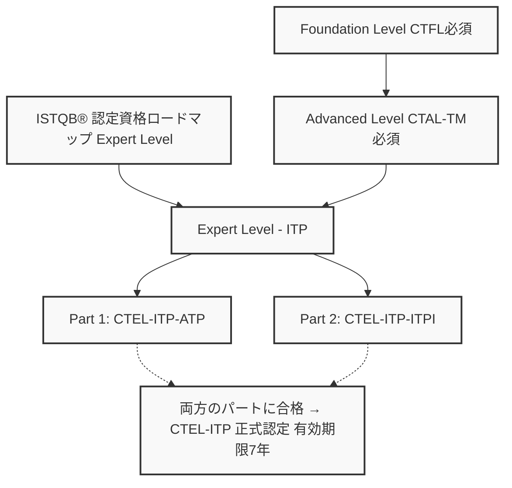
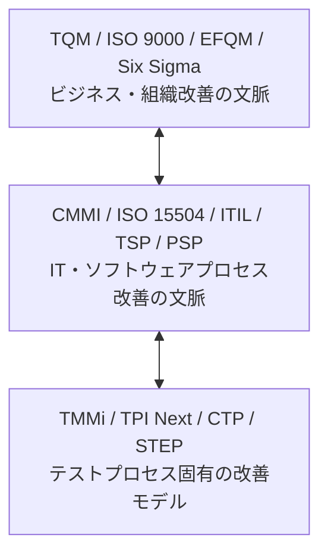
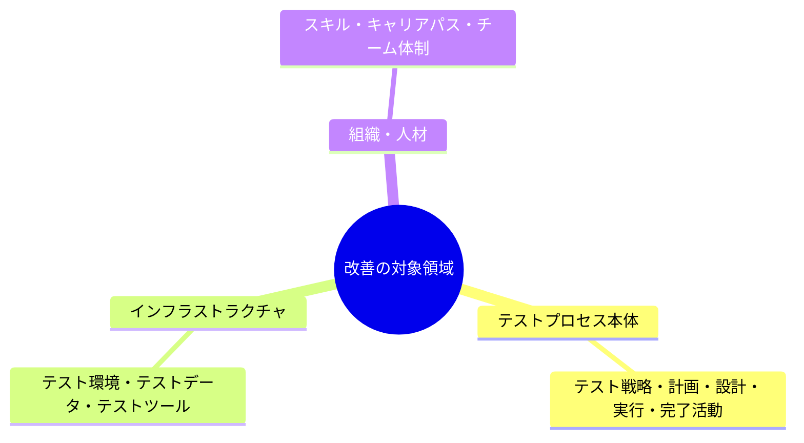
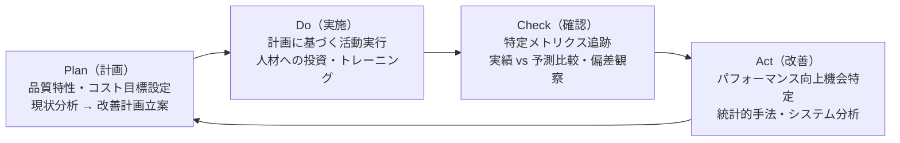
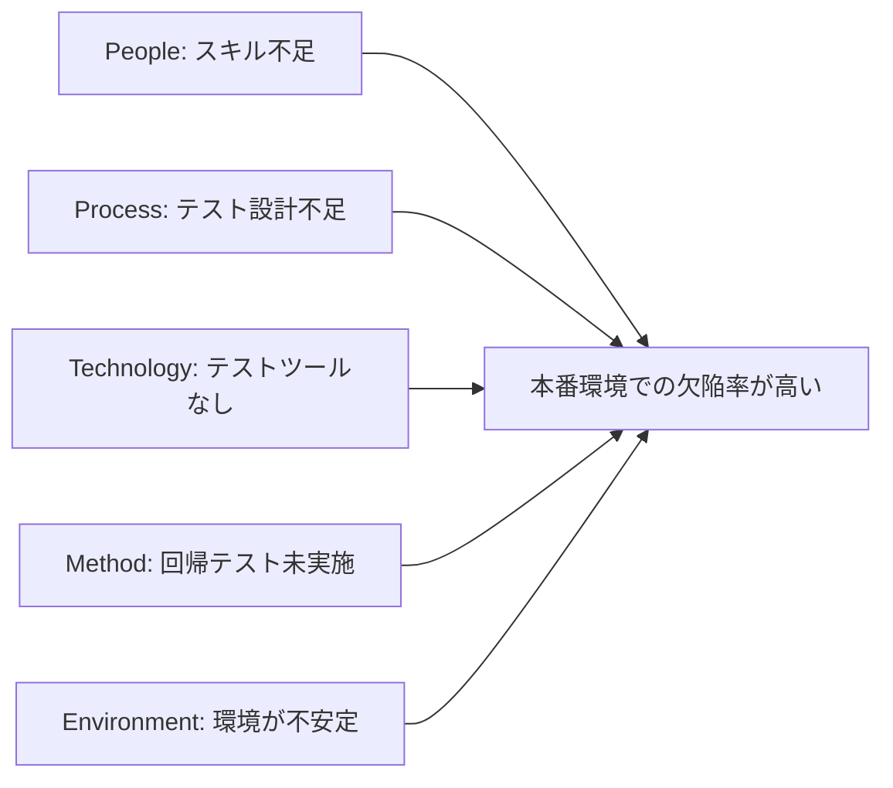
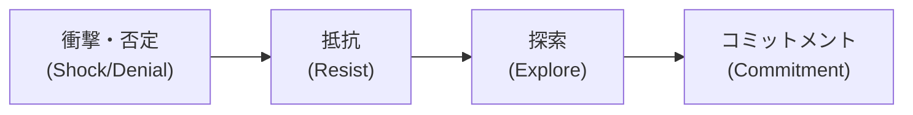

# 🏆 ISTQB® Expert Level – Assessing Test Processes (CTEL-ITP-ATP)

## テストプロセス評価 完全学習ガイド 2025

### 初学者から実践者まで｜ステップバイステップ図解解説

> **対応資格**: ISTQB® Certified Tester Expert Level – Improving the Test Process – Assessing Test Processes (CTEL-ITP-ATP)  
> **シラバス**: v2011（最新公式版）  
> **有効期間**: 取得後 **7年間**  
> **前提資格**: CTFL（Foundation Level）+ CTAL-TM（Advanced Level Test Manager）必須  
> **最終更新**: 2025年  
>
> 📌 **公式ページ**: <https://istqb.org/certifications/certified-tester-expert-level-assessing-test-processes-ctel-itp-atp/>

---

## 📚 目次

1. [CTEL-ITP-ATP 概要・資格ロードマップ](#chapter-0)
2. [Chapter 1: イントロダクション・知識レベル体系](#chapter-1)
3. [Chapter 2: 改善のコンテキスト（The Context of Improvement）](#chapter-2)
4. [Chapter 3: モデルベース改善（Model-based Improvement）](#chapter-3)
5. [Chapter 4: 分析ベース改善（Analytical-based Improvement）](#chapter-4)
6. [Chapter 5: テストプロセス改善アプローチの選択](#chapter-5)
7. [Chapter 6: 改善プロセス（Process for Improvement）](#chapter-6)
8. [Chapter 7: 組織・役割・スキル（Organization, Roles and Skills）](#chapter-7)
9. [Chapter 8: 変更管理（Managing Change）](#chapter-8)
10. [Chapter 9: 重要成功要因（Critical Success Factors）](#chapter-9)
11. [Chapter 10: ライフサイクルモデルへの適応](#chapter-10)
12. [試験対策・サンプル問題](#exam-tips)
13. [参照URL一覧（全件）](#references)

---

## 🌟 Chapter 0: CTEL-ITP-ATP 概要・資格ロードマップ

### 0.1 CTEL-ITP とは？ — 2段階の Expert Level 資格

### 0.2 試験概要

| 項目 | 内容 |
|------|------|
| **試験形式** | 多肢選択問題（MCQ）のみ（2022年4月以降） |
| **前提資格** | CTFL（必須）+ CTAL-TM（必須） |
| **実務経験** | ソフトウェアテスト全般 **5年以上** + 本モジュール領域 **2年以上** |
| **論文・発表** | テスト関連の論文または学会発表 **1件以上** |
| **有効期限** | **7年間**（ISTQB CEPで更新可能） |
| **試験プロバイダー** | iSQI（リモートプロクタリング可） |
| **試験言語** | 英語（その他言語の可否は各国ボードに確認） |

📌 試験予約: <https://isqi.org/ISTQB-CTEL-ITP-Part-1-Assessing-the-Test-Process/CT-EL-ITP-MCQ-P1.122>

### 0.3 CTEL-ITP 認定の全要件

CTEL-ITP 正式認定に必要な要件（全て満たすこと）：

  - [x] 試験合格：
     - [ ] Part 1 (CTEL-ITP-ATP) 合格
     - [ ] Part 2 (CTEL-ITP-ITPI) 合格
     ※ 両方合格して初めて CTEL-ITP 正式認定

  - [x] 資格要件：
     - [ ] CTFL（Foundation Level）取得
     - [ ] CTAL-TM（Advanced Test Manager）取得

  - [x] 実務経験要件：
     - [ ] ソフトウェアテスト全般 5年以上（CV + 参照者2名提出）
     - [ ] テストプロセス改善領域 2年以上（CV + 参照者2名提出）

  - [x] 貢献実績要件：
     - [ ] テスト関連のカンファレンス発表 1件以上、または
     - [ ] テスト関連の論文執筆・発表 1件以上

### 0.4 CTEL-ITP-ATP の学習範囲・章別時間配分

シラバス全10章の時間配分（合計 3,465分 / 57.75時間）：

Chapter 2:  改善のコンテキスト             ████████         285分  ( 8.2%)
Chapter 3:  モデルベース改善               ████████████████  570分  (16.4%) ← 重要
Chapter 4:  分析ベース改善                 ███████████████   555分  (16.0%) ← 重要
Chapter 5:  アプローチの選択               ████              105分  ( 3.0%)
Chapter 6:  改善プロセス（IDEAL）          ████████████████████████  900分  (26.0%) ← 最重要
Chapter 7:  組織・役割・スキル             █████████████     465分  (13.4%)
Chapter 8:  変更管理                       ████████          285分  ( 8.2%)
Chapter 9:  重要成功要因                   ████████          300分  ( 8.7%)
Chapter 10: ライフサイクル適応             ██                 60分  ( 1.7%)

---

## 📖 Chapter 1: イントロダクション・知識レベル体系

### 1.1 Expert Level の期待値

CTEL-ITP の合格者に期待される役割：

Expert Level 合格者に期待されること：

  - テストプロセス改善について助言できる（advise on TPI）
  - 組織・プロジェクト内のテストプロセス改善を主導できる
  - 改善を効果的に実施し成功の可能性を最大化できる
  
  ⚠️ 注意：「世界レベルの専門家」を即座に意味するものではない
     - 「組織・プロジェクト内で専門サポートを提供できる」レベルを目指す

### 1.2 認知レベル（K-Level）体系

Expert Level では K1〜K6 の6段階すべてが使用されます。

### 認知レベル（K-Level）一覧

| K-Level | 名称 | 説明 |
|---------|------|------|
| **K1** | Remember（記憶） | 用語・定義を覚えている |
| **K2** | Understand(理解) | 概念を分類・比較・説明できる |
| **K3** | Apply（適用） | 手順・技法を実際の状況に適用できる |
| **K4** | Analyze（分析） | 情報を分解し、問題を分析・評価できる |
| **K5** | Evaluate（評価） | 基準に基づいて判断・評価できる |
| **K6** | Create（創造） | 要素を組み合わせて新しいものを生み出せる |

Expert Level では特に **K4〜K6（分析・評価・創造）** が多く出題されます。

---

## 🌐 Chapter 2: 改善のコンテキスト（The Context of Improvement）
>
> 285分 | 試験への理解必須章

### 2.1 なぜテストを改善するのか？（Why Improve Testing?）

テストプロセス改善が必要な典型的な理由：

ビジネスドライバー：
- タイムトゥマーケットの短縮（speed to market）
- 製品品質・信頼性の向上
- テストコストの削減（ROI改善）
- 予測可能性・報告能力の向上
- サプライヤー要件への対応（例：TMMi Level 3以上を要求される）

組織的ドライバー：
- ソフトウェア障害によるビジネス損失の経験
- 第三者機関へのアウトソーシング展開
- 規制・コンプライアンス要件（例：FDA、SOX法）

改善の文脈（Context）：
テストプロセス改善は以下の文脈の中で行われる：

**学習目標（LO）:**

- `LO 2.1.1 (K2)` テスト改善の典型的な理由の例を挙げられる
- `LO 2.1.3 (K6)` 全ステークホルダーへ改善の理由をビジネスゴールと結びつけて説明できる

### 2.2 何が改善できるか？（What Can Be Improved?）

テストプロセス改善の対象（SPI との関係）：

SPI（Software Process Improvement）：
- ソフトウェアプロダクトの品質・プロセス効果・効率の継続的改善

テストプロセス改善：
- テストプロセスの有効性と/または効率性の継続的改善

改善の対象領域：

重要原則：
- テストのゴールは常にビジネスゴールと連携していること
- 常に最高のテスト成熟度レベルを目指す必要はない

### 2.3 品質の視点（Views of Quality）

5つの品質ビュー（Garvin 1984 / Trienekens & van Veenendaal 1997）：

  1. 製品ベース（Product-based）：
     - 測定可能な製品属性で品質を定義
     例：欠陥密度、コードカバレッジ

  2. 製造ベース（Manufacturing-based）：
     - 規格・仕様への準拠度で品質を定義
     例：ISO 9001準拠、繰り返し可能なプロセス

  3. ユーザーベース（User-based）：
     - ユーザーのニーズ充足度で品質を定義
     例：ユーザビリティ、顧客満足度

  4. 価値ベース（Value-based）：
     - コスト対効果で品質を定義
     例：ROI、コスト・パフォーマンス

  5. 超越的（Transcendent-based）：
     - 明確に定義できないが経験で分かる卓越性
     例：「一流のソフトウェア」という評判・信頼

  テスト改善における活用：
  - どの品質ビューが最も組織に適しているかを特定し、
    そのビューに対応するメトリクス・KPIを設定する

### 2.4 汎用的な改善プロセス（Generic Improvement Process）

#### 2.4.1 デミングサイクル（Deming Cycle / PDCA）

デミングサイクル（PDCA）：

#### 2.4.2 IDEAL フレームワーク（試験頻出！）

IDEAL フレームワーク（デミングサイクルの実例化）：

  I - Initiating（開始）
      - 改善の動機・理由を特定
      - コンテキストの設定・スポンサーシップの確立
      - 改善インフラの構築

  D - Diagnosing（診断）
      - 現行プラクティスの評価・特性把握
      - 推奨事項の策定・フェーズ結果の文書化

  E - Establishing（確立）
      - 戦略と優先順位の設定
      - テストプロセスグループ（TPG）の設立
      - アクションプランの策定

  A - Acting（実施）
      - プロセスと測定基準の定義
      - パイロットの計画・実行
      - インストール・追跡の計画・実行

  L - Learning（学習）
      - 教訓の文書化・分析
      - 組織アプローチの見直し

  ★ IDEAL は CTEL-ITP-ATP の試験で最頻出フレームワーク！

#### 2.4.3 EFQM 卓越モデルの基本概念（8原則）

EFQM（European Foundation for Quality Management）の基本概念：

  1. 結果志向（Results Orientation）
  2. 顧客フォーカス（Customer Focus）
  3. リーダーシップと目的の一貫性（Leadership & Constancy of Purpose）
  4. プロセスと事実による管理（Management by Processes & Facts）
  5. 人材開発と関与（People Development & Involvement）
  6. 継続的学習・革新・改善（Continuous Learning, Innovation & Improvement）
  7. パートナーシップ開発（Partnership Development）
  8. 企業の社会的責任（Corporate Social Responsibility）

  テスト改善への適用：
  - これら8つの概念をテストプロセス改善の目標設定に活用する

### 2.5 改善アプローチの概観（Overview of Improvement Approaches）

### 改善アプローチ比較

| アプローチ | 内容・特徴 |
|------------|------------|
| **モデルベース (Model-based)** | TMMi・TPI Nextなど定義されたモデルに沿って改善 ベストプラクティスを段階的に適用 例：TMMi Level 3 達成を目標とする |
| **分析ベース (Analytical)** | 実際の問題・データ分析から改善点を導き出す GQM・根本原因分析などを活用 例：欠陥原因分析でテスト見直しを実施 |
| **ハイブリッド (Hybrid)** | 上記2つを組み合わせたアプローチ 成熟度の高いプロジェクトの実践を他に展開 例：TMMi内で根本原因分析を活用 |

**その他の改善アプローチ:**

① 人材スキル向上による改善：
   - トレーニング・コーチング・メンタリング・ピアネットワーク
   - SFIA（Skills Framework for the Information Age）の活用

② ツール導入による改善：
   - CAST（Computer Aided Software Testing）ツールの活用
   - テスト管理ツール・コードカバレッジツール等

③ 異なるテストアプローチでの改善：
   - プロジェクトレトロスペクティブ（Scrum の Sprint Retrospective等）
   - 探索的テストの各セッション後評価

④ 標準・規制対応による改善：
   - FDA・SOX・ISO9001等の標準への準拠
   - ベンチマーク・相互運用性の向上

⑤ テスト環境・テストデータ等のリソース改善：
   - 環境仮想化によるコスト削減
   - テストデータの管理・セキュリティ強化

---

## 🏗️ Chapter 3: モデルベース改善（Model-based Improvement）
>
> 570分 | 試験の重要章

### 3.1 モデルベースアプローチの概要

#### 3.1.1 テストプロセス改善モデルの望ましい特性

優良なテストプロセス改善モデルの特性：

  - 使いやすい（Easy to use）
  - 公開されている（Publicly available）
  - コンサルタントによるサポートがある
  - 商業組織のマーケティング手段でない
  - 専門団体に認められている
  - 改善の仕組みを内包している
  - 多くの小さな改善ステップを提供する
  - 実践的・経験的・理論的・文書化・正当化されている
  - 評価方法・改善手順が明確
  - 定量化可能な改善
  - テーラリング可能（プロジェクト固有に調整できる）

#### 3.1.2 継続的表現 vs 段階的表現（試験頻出！）

### 段階的（Staged）vs 継続的（Continuous）表現の比較

| 段階的表現（Staged） | 継続的表現（Continuous） |
|----------------------|--------------------------|
| **TMMi が採用** | **TPI Next が採用** |
| 定義された成熟度レベル (TMMi: L1〜L5) 段階的に上位へ進む | 処方された成熟度レベルなし 任意の領域から改善を開始できる 異なる速度で複数領域を改善できる |
| ✅ 概念がシンプル ✅ 成熟度レベルが外部コミュニケーションに使いやすい | ✅ 柔軟性が高い ✅ 特定の問題領域に集中できる ✅「全か無か」問題を回避 |
| ❌ 柔軟性が限られる ❌「全か無か」になりがち | ❌ 管理上の複雑さが増す |

#### 3.1.3 モデル使用時の前提（注意点）

モデルベースアプローチの暗黙的前提：

  1. モデルは著者が考える「ベストプラクティス」を記述している
     - 実際には「グッドプラクティス」と考えた方が適切
     - 「何が最善か」はプロジェクト固有に判断が必要

  2. 「ベストプラクティス」への準拠が改善には必要と仮定される

  3. モデルは「標準的なプロジェクト・組織」を仮定している
     - 全てのプロジェクトに等しく適用できるとは限らない

  モデル適用が特別に考慮が必要なケース：
  - ライフサイクルモデル（従来型V字モデル vs アジャイル）
  - 使用技術（Web・オブジェクト指向・組込みシステム）
  - リスクレベル（安全クリティカル vs 業務システム）
  - テストアプローチ（スクリプトベース vs 探索的）

### 3.2 ソフトウェアプロセス改善モデル

#### 3.2.1 CMMI（Capability Maturity Model Integration）

CMMI の2つの表現：

  段階的表現（Staged）：5レベルの成熟度
  Level 1 Initial     → アドホック・カオスな状態
  Level 2 Managed     → 要件・プロジェクト管理が確立
  Level 3 Defined     → プロセスが組織全体で標準化
  Level 4 Quantitative→ 定量的管理が実施
  Level 5 Optimizing  → 継続的改善が行われている

  継続的表現（Continuous）：
  - 組織が自社のニーズに基づいて改善領域を選択可能

  テストに関連するCMMIプロセスエリア：
  - Validation（妥当性確認）
  - Verification（検証）
  - Technical Solution（技術的解決策）
  - Product Integration（製品統合）
  - Project Planning・Risk Management・Measurement and Analysis等

📌 CMMI参照: <https://cmmiinstitute.com/>

#### 3.2.2 ISO/IEC 15504（SPICE）

ISO/IEC 15504-5（ソフトウェアプロセス評価国際標準）：

  プロセスカテゴリ：
  - Engineering（エンジニアリング）
  - Management（管理）
  - Organization（組織）
  - Customer-Supplier（顧客-供給者）
  - Support（サポート）
      - Verification / Validation ← テストに関連

  アプローチ：継続的表現を採用
  各プロセスの能力レベルを定義されたプロセス属性で評価

### 3.3 テストプロセス改善モデル

#### 3.3.1 TPI Next®（Test Process Improvement Next）

TPI Next の基本構造：

開発者：Sogeti（オランダ）
表現：継続的表現（Continuous Representation）

### TPI Next の16のキーエリア

1. Test Strategy（テスト戦略）
2. Life Cycle Model（ライフサイクルモデル）
3. Moment of Involvement（関与のタイミング）
4. Estimating and Planning（見積もりと計画）
5. Test Specification Techniques（テスト仕様技法）
6. Static Test Techniques（静的テスト技法）
7. Metrics（メトリクス）
8. Test Tools（テストツール）
9. Test Environment（テスト環境）
10. Office Environment（作業環境）
11. Commitment and Motivation（コミットメントとモチベーション）
12. Test Functions and Training（テスト機能とトレーニング）
13. Scope of Methodology（方法論の範囲）
14. Communication（コミュニケーション）
15. Reporting（レポーティング）
16. Defect Management（欠陥管理）

成熟度マトリクスの4レベル：
Initial → Controlled → Efficient → Optimizing

クラスター（Clusters）の概念：
- 複数キーエリアのチェックポイントをクラスター化
- 「偏った改善」を防ぐ（例：メトリクスを高めるには欠陥管理・レポーティングも一定レベル必要）

📌 TPI Next 参照: <https://www.sogeti.com/explore/books/tpi-next/>

#### 3.3.2 TMMi®（Testing Maturity Model Integration）

TMMi の基本構造（段階的表現）：

管理元：TMMi Foundation（非営利）
表現：段階的表現（Staged Representation）

### TMMi の5段階成熟度レベル

| レベル | 概要 | プロセスエリア |
|--------|------|----------------|
| **Level 1: Initial（初期）** | テスト=デバッグ。アドホックで非構造化。 プロセスなし・ドキュメントなし | (なし) |
| **Level 2: Managed（管理）** | テストがデバッグから分離される | ・Test Policy and Strategy ・Test Planning ・Test Monitoring and Control ・Test Design and Execution ・Test Environment |
| **Level 3: Defined（定義）** | テストプロセスが組織全体で標準化 | ・Test Organization ・Test Training Program ・Test Lifecycle and Integration ・Non-functional Testing ・Peer Reviews |
| **Level 4: Management and Measurement（管理・測定）** | 定量的管理・測定プログラム | ・Test Measurement ・Software Quality Evaluation ・Advanced Peer Reviews |
| **Level 5: Optimization（最適化）** | 継続的最適化・欠陥防止 | ・Defect Prevention ・Quality Control ・Test Process Optimization |

★ TMMi Level 達成の目安：
- 各レベルのゴールが 85% 以上達成されていること

📌 TMMi公式: <https://www.tmmi.org/>  
📌 TMMi モデル（無料DL）: <https://www.tmmi.org/tmmi-model/>

#### 3.3.3 TPI Next vs TMMi 比較（試験頻出！）

### TPI Next® vs TMMi® 詳細比較

| 観点 | TPI Next | TMMi |
|------|----------|------|
| **表現タイプ** | 継続的表現（Continuous） | 段階的表現（Staged） |
| **テスト手法** | TMap® Nextを参照 | テスト手法独立 |
| **用語体系** | TMapに基づく | 標準テスト用語 |
| **SPI との関係** | 正式なSPIモデルとの関係なし（マッピング可） | CMMIと高度に相関 |
| **フォーカス** | 16のキーエリア テスト固有の詳細視点 | 成熟度レベルごとのプロセスエリア |
| **強み** | ビジネス主導・テストエンジニアリングの両方をカバー | 管理コミットメントへの強いフォーカス CMMIとの相関が高い |

### 3.4 コンテンツベースモデル（Content-based Models）

#### 3.4.1 STEP（Systematic Test and Evaluation Process）

STEP の基本：

  提唱者：Craig (2002)
  特徴：改善順序が規定されていない（非処方的）

  基本前提：
  - テストはライフサイクル活動であり、要件定義から
    システム廃止まで継続する
  - 「コーディング前のテスト」を重視（テスト戦略は要件から）
  - テストケースを早期に作成し要件の正確性を確認

  TPI Next との組み合わせ：
  - STEP の評価モデルは TPI Next と組み合わせることができる

#### 3.4.2 CTP（Critical Testing Process）

CTP の基本：

  提唱者：Black (2003)
  特徴：特定のテストプロセスが「クリティカル」であるという前提

  12のクリティカルテストプロセス：
  - モデルが特定する12のクリティカルプロセスを特定
  - 強み・弱みを識別し、組織ニーズに基づく優先改善推奨

  評価：
  - 定量的・定性的メトリクスを一般的に検討
  - 弱点特定後、汎用改善プランを基に大幅なテーラリング

  STEP との違い：
  - STEP は要件から始まる体系的評価
  - CTP は「どの12プロセスが最も重要か」に集中

---

## 🔍 Chapter 4: 分析ベース改善（Analytical-based Improvement）
>
> 555分 | 試験重要章

### 4.1 分析ベースアプローチの概要

分析ベースアプローチの特徴：

- **問題ベース（Problem-based）**：
  - 「ベストプラクティス」の汎用モデルではなく、実際の問題・目標に基づいて改善を決定する
- **データ分析が本質**：
  - 客観的なテストプロセス改善に不可欠
  - 定性的評価だけでは不精確な推奨になるリスクがある

### モデルベースとの違い

| モデルベース | 分析ベース |
|--------------|------------|
| 定義された「ベストプラクティス」を参照する | 実際の問題から改善点を特定 |
| 組織の現状をモデルと比較する | プロジェクト固有のゴールを定義・測定する |

### 4.2 因果分析（Causal Analysis）

#### 4.2.1 因果ダイアグラム（Cause-Effect Diagram / Ishikawa / Fishbone）

フィッシュボーン図の適用手順（Robson 1995 より）：

STEP 1: 効果（問題）を図の右側に記載
↓
STEP 2: リブ（骨）を描き、カテゴリでラベル付け
一般的なカテゴリ：
- People（人）
- Process（プロセス）
- Technology（技術・ツール）
- Method（手法）
- Environment（環境）
↓
STEP 3: ブレインストーミングのルール周知
- 批判なし・自由連想・量重視・全てを記録
↓
STEP 4: 可能な原因をブレインストーミングでリブに追加
- チェックリストを使用してルート原因を特定
↓
STEP 5: アイデアを一定期間熟成させる
↓
STEP 6: 原因・症状のクラスターを分析
- パレート分析（20%の努力で80%の改善）で優先すべきクラスターを特定

具体例（テストの問題への適用）：

#### 4.2.2 インスペクションプロセスでの因果分析

インスペクション因果分析ミーティング（2時間）：

  参加者：ファシリテーター + 分析チーム
  
  Part 1（90分）：欠陥分析
    - 各欠陥の分析：
       ・欠陥の説明（症状ではなく欠陥そのもの）
       ・原因カテゴリ（コミュニケーション・見落とし・
                      教育・転記ミス・プロセス）
       ・原因の説明（因果連鎖含む）
       ・欠陥が作り込まれたプロセスステップ
       ・原因を排除するための提案されたアクション

  Part 2（30分）：汎用分析
    - 欠陥のトレンド・共通点・改善点・悪化点を特定
    - 欠陥タクソノミー（分類体系）の活用

#### 4.2.3 標準異常分類の使用（IEEE 1044）

IEEE 1044 標準を使った異常分類：

  目的：組織全体で共通の分類によりデータを分析可能にする

  分析可能な情報：
  - 欠陥が作り込まれたプロジェクトフェーズ
  - 欠陥が検出されたプロジェクトアクティビティ
  - 欠陥修正コスト
  - 障害コスト
  - 欠陥発生フェーズ vs 発見フェーズ（欠陥漏洩）

  実施要件：
  - トレーニング・ツール・サポートによる分類の徹底
  - 全ライフサイクルフェーズ（保守・運用含む）での記録

#### 4.2.4 因果分析のための欠陥選定

分析対象欠陥の選定方法：

  ① パレート分析：
     - 欠陥の20%が全体の80%を代表するとして選定
  
  ② 統計的外れ値：
     - 特定メトリクスの3シグマ等の統計的変動を使用
  
  ③ プロジェクトレトロスペクティブ：
     - 振り返りで重要と特定された欠陥
  
  ④ 欠陥重要度カテゴリ：
     - 重要度・深刻度の高い欠陥を優先

### 4.3 GQM（Goal-Question-Metric）アプローチ

### GQM の3レベル（Basili の GQM アプローチ）

| レベル | 概要 | 詳細 |
|--------|------|------|
| **Level 1: Goal（ゴール）** | 概念レベル | 製品・プロセス・リソースへの組織の品質ゴール |
| **Level 2: Question（質問）** | 運用レベル | 品質に関してオブジェクトを特性付けする質問 |
| **Level 3: Metric（メトリクス）** | 定量的レベル | 客観的（定量・事実）または主観的（定性・視点） |

GQM の適用手順：
STEP 1: 特定のゴールを設定する
STEP 2: ゴールの達成情報を提供する質問を導出する
STEP 3: 質問への回答となるメトリクスを導出する

GQM の例：
- **Goal**: テスト有効性の向上
- **Question**: 本番でどれだけの欠陥が発見されているか？
- **Metric**: DDP（Defect Detection Percentage） = テストで検出した欠陥数 / 全既知欠陥数

📌 GQM 参照: <https://users.umiacs.umd.edu/~basili/>

### 4.4 測定値・メトリクス・指標の活用

#### 4.4.2 テスト有効性メトリクス（Test Effectiveness Metrics）

主要な有効性メトリクス：

  DDP（Defect Detection Percentage）★最重要★：
  定義: テスト検出欠陥数 / 全既知欠陥数 × 100%
  意味: テストがどれだけ欠陥を発見したか
  
  計算例：
  ・テスト中に発見した欠陥: 90件
  ・本番で見つかった欠陥:  10件
  ・DDP = 90 / (90+10) × 100% = 90%

  Post-release Defect Rate（リリース後欠陥率）：
  定義: 特定期間のリリース後発見欠陥数 / KLOC
  意味: 顧客が知覚する品質指標

#### 4.4.3 テスト効率/コストメトリクス

テスト効率・コストに関するメトリクス：

  品質コスト（Cost of Quality）：
  ・内部障害コスト（テスト中の欠陥修正）
  ・外部障害コスト（本番での欠陥修正）
  ・防止コスト（レビュー・計画）
  ・評価コスト（テスト活動そのもの）

  品質コスト比率（Cost of Quality Ratio）：
  = 静的テスト工数 / 動的テスト工数
  - 比率が高い → 欠陥除去効率が高い

  早期欠陥検出（Early Defect Detection）：
  = ユニット・統合テスト欠陥数 / 全動的テスト欠陥数

  相対テスト工数（Relative Test Effort）：
  = 総テスト工数 / 総プロジェクト工数

  自動化レベル（Automation Level）：
  = 自動実行テストケース数 / 全実行テストケース数

#### 4.4.4〜4.4.7 その他メトリクス

リードタイム・予測可能性・製品品質・テスト成熟度メトリクス：

  リードタイムメトリクス：
  - テスト実行リードタイム（日・週）
  - プロジェクトのクリティカルパスに直結

  予測可能性メトリクス：
  - テスト実行リードタイムスリッページ
     = (実績 - 見積) / 見積 × 100%
  - 工数スリップ（Effort Slip）
  - テストケーススリップ（Test Case Slip）

  製品品質メトリクス：
  - ISO 9126 / ISO 25000 の品質属性メトリクス
     機能性・信頼性・ユーザビリティ・効率性等
  - カバレッジ指標：
     要件カバレッジ = テストされた要件数 / 全要件数
     コードカバレッジ = 実行されたコード / 全コード

  テスト成熟度メトリクス：
  - TMMi / TPI Next の成熟度レベル
  - 成熟度が上がる → テスト目標を達成しないリスクが下がる

---

## 🧩 Chapter 5: テストプロセス改善アプローチの選択
>
> 105分

### 5.1 アプローチ選択の指針（試験頻出！）

### テストプロセス改善アプローチ選択ガイド

**プロセスモデル（TMMi / TPI Next）を使う場面：**
- [x] テストプロセスがすでに存在する場合（設立にも使える）
- [x] 類似プロジェクト間での比較・ベンチマークが必要
- [x] SPIモデルとの互換性が必要
- [x] 会社ポリシーとして特定成熟度レベル達成が目標
- [x] 明確な出発点と規定された改善パスが望ましい
- [x] テスト成熟度の測定がマーケティング目的で必要

**コンテンツモデル（CTP / STEP）を使う場面：**
- [x] テストプロセスを新規構築する必要がある
- [x] 現行テストプロセスのコスト・リスク評価が必要
- [x] TMMi / TPI Next の順序ではなくビジネスニーズ順で改善したい
- [x] 会社固有のコンテキストへのテーラリングが必要
- [x] 非連続的・急速な改善が必要

**分析的アプローチを使う場面：**
- [x] 特定の問題を対象にする必要がある
- [x] 測定値・メトリクスが利用可能（または確立できる）
- [x] テストプロセスの必要性の証拠が必要
- [x] 変更の理由について合意が必要
- [x] 問題の根本原因がテストプロセスオーナーの管理外の場合
- [x] 小規模の評価・改善パイロットが予算の範囲内の場合
- [x] 組織文化が内部分析による証拠を外部モデルより信頼する場合

---

## 🔄 Chapter 6: 改善プロセス（Process for Improvement）
>
> 900分 | 最重要章・試験最多配点

### 6.1 テストポリシー（Test Policy）の概要

テストポリシー（Test Policy）とは：

  - 組織のテストへの原則・アプローチを文書化したもの
  - テストプロセス改善は組織のテストポリシーに
    規定された目標であるべき

テストポリシーの主要要素：
  - テストの目的・ゴール
  - テストに対するマネジメントのコミットメント
  - 品質属性とテストの関係
  - テスト組織の役割と責任
  - 使用するプロセスモデル・基準
  - テストメトリクスと測定
  - 継続的改善へのコミットメント

**学習目標（LO）:**

- `LO 6.1.1 (K2)` テストポリシーの主要要素を要約できる
- `LO 6.1.2 (K6)` テスト（改善）ポリシーを作成できる

### 6.2 改善プロセスの開始（Initiating the Improvement Process）

#### 6.2.1 IDEAL フレームワーク「Initiating」フェーズ

Initiating フェーズの高レベル活動（IDEAL モデル）：

  1. 改善の動機を特定する（Identify Stimulus for Improvement）
  2. コンテキストの設定・スポンサーシップの確立
  3. 改善インフラの構築（組織化）

  Initiating フェーズで考慮すべき事項：
  ┌───────────────────────────────────────────────┐
  ・実際の改善の必要性を確立する
  ・目標をビジネスニーズと連携させる
  ・改善スコープを確立する
  ・改善戦略を選択する（Chapter 5 参照）
  ・人・文化の影響を考慮する
  -─────────────────────────────────────────────┘

#### 6.2.2 改善の必要性の確立

改善ニーズのステークホルダー別原動力：

  マネジメント・顧客：
  - より効果的なテスト、本番でのトラブル削減

  ユーザー：
  - より良いユーザビリティ

  開発者：
  - 欠陥分析のより良いサポート

  テスター：
  - より体系的なテストの確立

  保守担当：
  - ソフトウェア変更テストの時間削減

  現状指標の取得（例）：
  - 総品質コスト（COQ）
     = 本番での総障害コスト + 総テストコスト

#### 6.2.3 改善目標の設定（3ステップ）

改善目標設定の3つの主要ステップ：

STEP 1: 将来の（改善された）ビジョンを確立する
- スポンサーにROIを納得させる材料
- 変更管理は合意された目標に関連させる

STEP 2: 具体的な目標を設定する
- 定性的目標（スケール・質問票で表現）
- 定量的目標（GQMアプローチでメトリクス定義）
- 成熟度レベル目標（TMMi / TPI Next）

STEP 3: テスト改善を組織に整合させる
- ビジネスゴール・SPI・組織改善との整合
- コーポレートダッシュボード・バランスドスコアカードの活用：

### バランスドスコアカード（BSC）との整合例：

- **財務目標**: 生産性向上・コスト削減
- **顧客目標**: 市場シェア・顧客満足向上
- **内部目標**: プロジェクト予測可能性・欠陥削減
- **学習・成長**: 新市場・新製品・標準認証取得
- **人材目標**: 職務満足・離職率削減

#### 6.2.4 改善スコープの設定

改善スコープの設定で考慮すべき事項：

  ① 全般的プロセス範囲（General Process Scope）：
     - テストプロセス以外のプロセス（プロジェクト管理等）の範囲
     - テスト以外でも改善が必要な場合を特定

  ② テストプロセス範囲（Test Process Scope）：
     - テストプロセスのどの部分を対象とするか
     - 全体を広く改善 or 特定の側面（例：テスト計画）のみ

  ③ プロジェクト範囲（Project Scope）：
     プロジェクト/プログラム中心 vs 組織中心：
     
     プロジェクト中心（Program/Project-centric）：
     - 特定プロジェクトに集中、比較的素早い結果
     - 組織レベルの問題を解決できない可能性

     組織中心（Organization-centric）：
     - 組織全体の改善、長期的・広範な効果
     - 時間・コストがかかる

### 6.3 現状の診断（Diagnosing the Current Situation）

#### 6.3.1 評価計画（Assessment Plan）

評価計画に含めるべき内容：

  評価準備：
  - 予備分析
  - インタビュー資料（チェックリスト等）の準備
  - 既存テスト成果物の収集（テスト計画・仕様・報告書等）

  インタビュー計画：
  - 対象役割の特定：
    - テスター
    - テストマネージャー
    - 開発者
    - プロジェクトマネージャー
    - ビジネスオーナー・BA（ドメイン専門家）
    - 専門家（環境管理者・欠陥管理者・自動化専門家等）
  - 各インタビューでカバーする特定領域
  - 初期フィードバックの提供方法・日程

  全てのテスト領域が合意された目標・スコープに
  沿ってカバーされていることを確認すること

#### 6.3.2 評価準備（Assessment Preparation）

評価前の文書分析：

  組織レベルのスコープ：
  - テストポリシー・テストプロセス記述
  - 利用可能なテンプレート・マスターテスト計画

  プロジェクトレベルのスコープ：
  - テスト計画・テスト仕様・テスト報告書

  分析の目的：
  ① インタビュー前に現行テストプロセスへの洞察を得る
  ② インタビューの特定質問を準備する
  ③ 議論を要しない正式な評価要素を実施する
     （例：文書の完全性・標準への適合性の確認）

  インタビュー環境：
  - 快適・中断なし・プライベートな環境を準備

#### 6.3.3 インタビューの実施

インタビュー実施のベストプラクティス：

  - 個別インタビュー（Individual Basis）を推奨：
    - インタビュイーが自由に意見を表明できる
    - 上司の前ではインタビューしない

  - 情報提供者が正直に話す動機付け条件：
    - 機密保持の保証
    - 改善アイデアの認識・評価
    - 罰則・失敗への恐れがない
    - 情報の使い方が分かっている

  - 広範なスキルが必要（Section 7.3 参照）

#### 6.3.4 初期フィードバック

インタビュー完了直後の初期フィードバック：

  - 短いプレゼンテーション or ウォークスルーとして実施
  - 初期の評価結果を確認・誤解を明確化
  - 主要ポイントのステークホルダーへの概要提供

  注意事項：
  - 常に機密保持ルールを維持
  - 特定の問題に対する責任追及（blame）を避ける

#### 6.3.5 結果の分析

結果分析のアプローチ：

  分析ベースアプローチの場合：
  - Systems Thinking（Weinberg 1992）の活用
    - バランシングループ（安定したフィードバック）
    - 強化ループ
       - 負の強化ループ = 悪循環（vicious circle）
       - 正の強化ループ = 良循環（virtuous circle）
  - Tipping Points（Gladwell）
    - 特定のポイントへの小さな改善が連鎖反応を引き起こす

  モデルベースアプローチの場合：
  - 現状の成熟度と Initiating フェーズで定義した
    目標との比較

  ベンチマークの活用：
  - 企業ベース・業界ベース・プロジェクトベース
    のベンチマーク

#### 6.3.6 ソリューション分析（Solution Analysis）

ソリューション選択のアプローチ（5種類）：

  1. 先入観による解決（Pre-conceived Solution）：
     例：「全てを自動化しよう」
     ✗ 根本原因に対処しない可能性がある

  2. モデルに組み込まれた推奨ソリューション：
     - 外部の実績が使える
     ✗ 状況に応じた根本原因に対処しない場合がある

  3. 顧客・ステークホルダーからの要件：
     例：ISO9001:2008認証を要求される
     - ゴールが明確
     ✗ 改善を提供しない変更の可能性

  4. 問題情報に基づくソリューション分析：
     - 肯定的・否定的影響を議論し選択
     ✗ 時間・リソース・費用がかかる

  5. カスタマイズされたアプローチ（上記のミックス）：
     例：TMMi Level 4 要求 → コスト効果分析で
         TMMi Level 3 の部分採用を決定

  ソリューション分析に含まれるプロセス：
  - 問題と根本原因の優先順位付け
  - コスト便益分析・実装制約の特定
  - フィードバックループの分析
  - ギャップ分析・ROI推定
  - 「逆フィッシュボーン図」による解決策ブレインストーミング

#### 6.3.7 改善アクションの推奨

評価レポートに含める最小限の内容：

  - 管理サマリー（ビジョン声明の参照）
  - スコープと目標の声明
  - 分析結果（ポジティブな面・改善が必要な面・未解決事項）
  - 推奨改善アクション（優先順位付き）

  提供のタイミング：
  - 評価完了後できるだけ早く提供
  - 必要に応じて予備版 → 完全版の順で

### 6.4 テスト改善計画の策定（Establishing a Test Improvement Plan）

#### 6.4.1 IDEAL「Establishing」フェーズ

Establishing フェーズの高レベル活動：

  ・戦略と優先順位の設定
  ・テストプロセスグループ（TPG）の確立
  ・アクションプランの策定

#### 6.4.2 優先順位の設定（Setting Priorities）

改善推奨事項の優先順位付け基準：

  - 重要性（Significance）：ビジネスへの影響
  - 実現可能性（Feasibility）：実装の容易さ
  - コスト・効果（Cost/Benefit）：ROI
  - 緊急性（Urgency）：タイムライン要件
  - リスク（Risk）：実施・未実施のリスク
  - 依存性（Dependencies）：他の改善への依存

#### 6.4.3 トップダウン vs ボトムアップ改善

### 改善アプローチの比較

| トップダウン (Top-down) | ボトムアップ (Bottom-up) |
|-------------------------|--------------------------|
| 経営層から主導 | チームやプロジェクトから主導 |
| 全組織に適用 | 特定領域から開始 |
| 長期・体系的 | 短期・素早い成果 |
| 文化変革が可能 | 組織全体の変革が難しい |
| コミットメントが必要 | 自律的に実施可能 |

#### 6.4.4〜6.4.5 テスト改善計画の内容と作成

テスト改善計画（Test Improvement Plan）の典型的内容：

  - 改善の目標・ゴール
  - 評価の結果サマリー（現状）
  - 優先順位付きの推奨改善アクション
  - アクションの担当者と期限
  - 必要なリソース（予算・人員・ツール）
  - リスクと緩和策
  - 成功指標（メトリクス・KPI）
  - パイロット計画
  - コミュニケーション計画
  - 変更管理計画（Chapter 8 参照）

### 6.5 改善の実施（Acting to Implement Improvement）

#### 6.5.1 パイロットの選定・実行

パイロットプロジェクトの目的：

  - リスクを管理しながら改善を試験的に実施
  - 本格展開前の学習機会
  - 改善の実現可能性・効果の検証

  適切なパイロット選定基準：
  - 組織の典型例となるプロジェクト
  - 変更に前向きなチームメンバー
  - 適切な規模（小さすぎず大きすぎない）
  - 明確な成功基準が定義できる
  - 十分な時間軸（改善効果の測定が可能）
  - マネジメントのサポートがある

#### 6.5.2 実装の管理・コントロール

改善の実施管理：

  - 定義されたプロセスと測定基準を追跡
  - 計画 vs 実績の定期的な比較
  - 偏差の特定と是正措置
  - ステークホルダーへの進捗報告

### 6.6 改善プログラムからの学習（Learning from the Improvement Program）

IDEAL「Learning」フェーズの活動：

  - 教訓（Lessons Learned）の文書化・分析
  - 組織アプローチの見直し
  - 成功・失敗の要因の特定
  - 次の改善サイクルへのインプット

  振り返り（Retrospective）の重要性：
  - 成功した実践を次のプロジェクトへ展開
  - 改善インフラの継続的最適化

---

## 👥 Chapter 7: 組織・役割・スキル（Organization, Roles and Skills）
>
> 465分

### 7.1 組織

#### 7.1.1 テストプロセスグループ（Test Process Group: TPG）

TPG（Test Process Group）とは：

  - テストプロセスの定義・維持・改善を担うグループ
  - IDEAL フレームワークの「Establishing」フェーズで確立

  TPG の主な活動：
  - テストプロセスの標準化と文書化
  - テストプロセスの評価と改善
  - テストプロセスの組織展開支援
  - トレーニング・コーチングの調整
  - 改善効果の測定・報告

  TPG の組織上の配置：
  - テスト組織内
  - 品質保証組織内
  - 独立した改善チーム
  - プロセス改善部門内

#### 7.1.2 リモート・オフショア・アウトソースチームでのテスト改善

リモート・オフショア環境での特別考慮事項：

  課題：
  - 文化的・言語的差異
  - 時差によるコミュニケーション困難
  - プロセス理解・遵守の一貫性確保
  - ツール・インフラのアクセス差異

  対策：
  - 共通のテストプロセス基準の明確化
  - 定期的なビデオ会議・コミュニケーション
  - ローカルチャンピオンの指定
  - テストプロセスの可視化・文書化の強化
  - 改善成功事例の組織全体への共有

### 7.2 個人の役割

#### 7.2.1 テストプロセス改善者（Test Process Improver）

テストプロセス改善者の役割：

  - テストプロセス改善活動を主導・支援する専門家
  - 評価者・コーチ・ファシリテーターとして機能

  テストプロセス改善者に必要な知識：
  - テストプロセス・技法の深い知識
  - 改善モデル（TMMi・TPI Next等）の知識
  - 分析・測定・メトリクスの知識
  - 変更管理・組織行動の知識
  - ソフトスキル（コミュニケーション・ファシリテーション等）

#### 7.2.2 評価者の役割（Assessor Roles）

評価者の種類（TMMi を例に）：

  TMMi Assessor（評価者）：
  - 非公式評価・公式評価の実施
  - TMMi Foundation の資格認定が必要

  TMMi Lead Assessor（主任評価者）：
  - 公式な TMMi 評価の主導
  - より高度な資格認定が必要

  ISTQB との関係：
  - CTEL-ITP-ATP の取得は TMMi Test Process Improver
    （TMMi-TPI）認定の要件の一つとして認められている

📌 TMMi-TPI 認定: <https://isqi.org/TMMi-Test-Process-Improver-TMMi-TPI/SP-138.210>

### 7.3 テストプロセス改善者/評価者のスキル

#### 7.3.1 インタビュースキル

効果的なインタビューのスキル：

  質問タイプ：
  - 開放型質問（Open questions）：幅広い回答を引き出す
  例：「テスト計画プロセスはどのように機能していますか？」
  - 閉鎖型質問（Closed questions）：Yes/No または短い回答
  例：「テストケースはレビューされていますか？」
  - 深掘り質問（Probing questions）：詳細を引き出す
  例：「どのようなツールを使用していますか？」
  - 仮定型質問（Hypothetical questions）：シナリオを探る
      例：「もし優先度が変わったらどうしますか？」

  インタビューの構造：
  1. 導入（アイスブレイク・目的の説明）
  2. 準備した質問の実施
  3. 深掘りと確認
  4. サマリーと確認
  5. 次のステップの説明

#### 7.3.2 傾聴スキル

傾聴（Active Listening）の重要性：

  - インタビュイーが完全に話せるようにする
  - 非言語的サインを観察する
  - 確認・要約で理解を確かめる
  - 判断・推測を保留する
  - 適切なフィードバックを提供する

#### 7.3.3〜7.3.7 その他の必須スキル

テストプロセス改善者の必須スキルセット：

  プレゼンテーション・報告スキル：
  - 複雑な結果を明確・簡潔に伝える能力
  - 異なるオーディエンスへの適応
  - 視覚的資料の効果的使用

  分析スキル：
  - 複雑な問題の構造化と分解
  - パターン・トレンドの特定
  - データからの推論と結論導出

  メモ取りスキル：
  - 正確・迅速な記録
  - 文脈の保持と整理

  説得スキル（Persuasion Skills）：
  - ステークホルダーの買い込みを得る
  - 改善の必要性を効果的に伝える
  - 抵抗に対処する

  管理スキル：
  - プロジェクト管理
  - リソース・時間の管理
  - ステークホルダーマネジメント

---

## 🔀 Chapter 8: 変更管理（Managing Change）
>
> 285分

### 8.1 変更管理の重要性

なぜ変更管理が重要か：

  テストプロセス改善 = 変更の実施
  - 人は変化に抵抗する傾向がある
  - 変更管理なしの改善は失敗しやすい
  - 技術的な変更だけでなく、人・文化・プロセスの変更が必要

### 8.2 基本的な変更管理プロセス

変更管理の基本フロー：

  STEP 1: 変更の必要性の認識
      ↓
  STEP 2: 変更のビジョンの共有
      ↓
  STEP 3: 変更計画の策定
      ↓
  STEP 4: 変更の実施
      ↓
  STEP 5: 変更の強化（定着化）

  ジョン・コッター（John Kotter）の8段階変革プロセス：
  1. 緊急性の確立
  2. 強力な連携チームの形成
  3. ビジョンの創造
  4. ビジョンのコミュニケーション
  5. 他者がビジョンに沿って行動できるようにする
  6. 短期的成果の計画・達成
  7. 改善の統合・変化の促進
  8. 新しいアプローチの組織への定着

### 8.3 変更管理における人的要因

変更への人間の反応（典型的なパターン）：

感情的な反応の段階：

抵抗の一般的な原因：
- 利益がわからない（「なぜ変わる必要があるのか？」）
- 能力・スキルへの不安
- 現行の作業方法への慣れ
- 信頼の欠如（上位管理層・変更エージェントへの）
- 過去の失敗した改善経験

抵抗への対処法：
- [x] 変更の利益を明確・具体的に示す
- [x] 関係する人を設計プロセスに巻き込む
- [x] トレーニング・サポートを提供する
- [x] 早期の成功事例を共有する
- [x] 変更エージェント・チャンピオンを活用する
- [x] 懸念事項を聞き、対処する

---

## 🔑 Chapter 9: 重要成功要因（Critical Success Factors）
>
> 300分

### 9.1 主要成功要因

テストプロセス改善の主要成功要因（KSF）：

  1. マネジメントのコミットメントとサポート：
     - 上位管理層のスポンサーシップ
     - リソース（時間・予算・人材）の提供
     - 変更へのコミットメントの可視化

  2. 明確なビジョンと目標：
     - なぜ改善するのかの明確な理由
     - 測定可能な成功基準
     - ビジネスゴールとの整合

  3. 適切なリソースの確保：
     - 専任の改善チーム
     - 十分な予算
     - 必要なツール・インフラ

  4. ステークホルダーの関与・参加：
     - 関係者全員の早期参加
     - コミュニケーションの透明性
     - 定期的なフィードバック

  5. 段階的・管理されたアプローチ：
     - 小さく始めてスケールアップ
     - パイロットによる検証
     - 継続的なモニタリング

  6. 知識・スキルの構築：
     - 適切なトレーニング
     - コーチング・メンタリング
     - 専門知識の活用

  7. 変化に対応する組織文化：
     - 失敗から学ぶ文化
     - イノベーションへのオープンな態度
     - 継続的改善の定着

### 9.2 改善のための文化形成

改善文化（Culture for Improvement）を設定するポイント：

  組織的側面：
  - テストプロセス改善を組織戦略の一部として位置付ける
  - 改善活動への投資を明確に示す
  - 成功の認識・報酬システムの設置
  - 学習と実験を奨励する環境

  人的側面：
  - ロールモデルの活用（リーダーが率先して変化を示す）
  - 改善チャンピオンの特定・支援
  - 成功事例の共有・可視化
  - 失敗を責めない（学びを促進する）

  プロセス側面：
  - 定期的なレトロスペクティブの実施
  - 改善活動の進捗の継続的な測定・報告
  - 教訓の組織的な蓄積・共有

---

## 🔄 Chapter 10: 異なるライフサイクルモデルへの適応
>
> 60分

### 10.1 ライフサイクルモデルへの適応

各SDLCモデルとテストプロセス改善の適応：

  ウォーターフォール（V字モデル）：
  - フェーズ間のゲートレビュー
  - フェーズ終了時のレトロスペクティブ
  - 段階的な改善の機会

  アジャイル（スクラム等）：
  - スプリントレトロスペクティブ（継続的改善ループ）
  - 各スプリントでの改善機会
  - 短い反復サイクルが頻繁な改善を可能にする
  - TMMi / TPI Next はアジャイルコンテキストでの
    適用も可能

  ハイブリッドモデル：
  - ウォーターフォールとアジャイルの組み合わせ
  - 各部分に適した改善サイクルを適用

  探索的テスト：
  - 各テストセッション後の評価
  - セッションベーステスト管理での継続改善

  DevOps / CI/CD：
  - 継続的テストと継続的改善の統合
  - 自動化されたメトリクス収集・フィードバックループ
  - テストプロセス改善が CI/CD パイプラインに組み込まれる

---

## 📝 試験対策・サンプル問題

### 試験の特徴

CTEL-ITP-ATP 試験の特徴：

  形式：多肢選択問題（MCQ）のみ
  特徴：
  - シナリオベースの問題が多い
  - K4〜K6（分析・評価・創造）レベルが中心
  - 実際の改善状況への適用を問われる
  - CTFL・CTAL-TM の知識も組み合わせて使用
  
  出題頻度が高いトピック：
  ★★★ IDEAL フレームワーク（全フェーズの活動）
  ★★★ TMMi の成熟度レベルと各プロセスエリア
  ★★★ TPI Next の16キーエリアと成熟度
  ★★★ TMMi vs TPI Next の比較・適用判断
  ★★★ GQM アプローチの適用
  ★★★ 因果分析（フィッシュボーン）の適用
  ★★★ アプローチ選択（モデルベース vs 分析ベース）
  ★★ 段階的 vs 継続的表現の比較
  ★★ 各メトリクスの計算・解釈（DDP等）
  ★★ インタビュースキル・評価プロセス
  ★ 変更管理・抵抗への対処
  ★ 成功要因と文化形成

### 必ず覚える重要概念チェックリスト

#### GQM の3レベル（重要概念リマインダ）

| レベル | 概要 | 詳細 |
|--------|------|------|
| **Level 1: Goal（ゴール）** | 概念レベル | 製品・プロセス・リソースへの組織の品質ゴール |
| **Level 2: Question（質問）** | 運用レベル | 品質に関してオブジェクトを特性付けする質問 |
| **Level 3: Metric（メトリクス）** | 定量的レベル | 客観的（定量・事実）または主観的（定性・視点） |

GQM の適用手順：
STEP 1: 特定のゴールを設定する
STEP 2: ゴールの達成情報を提供する質問を導出する
STEP 3: 質問への回答となるメトリクスを導出する

GQM の例：
- **Goal**: テスト有効性の向上
- **Question**: 本番でどれだけの欠陥が発見されているか？
- **Metric**: DDP（Defect Detection Percentage） = テストで検出した欠陥数 / 全既知欠陥数

### サンプル問題と解説

---

**問1（K5 / Chapter 3.3）TMMi vs TPI Next の選択**

あなたはテストプロセス改善コンサルタントです。クライアント企業は大規模な金融機関で、サプライヤーから「TMMi Level 3以上の認定が必要」と要求されています。また、CMMIを既に導入しています。どのアプローチが最も適切ですか？

A) TPI Next（継続的モデル）を選択する  
B) TMMi（段階的モデル）を選択する  
C) STEP（コンテンツモデル）を選択する  
D) 分析的アプローチのみを使用する  

📌 解答を見る

**正解: B（TMMi）**

理由：

- サプライヤーが「TMMi Level 3」という特定のレベルを要求している
- CMMIを既に導入 → TMMiはCMMIと高度に相関している
- 外部への成熟度レベルのコミュニケーションが必要 → 段階的表現が有利
- TMMiが最も適切な条件：会社ポリシーとして特定の成熟度レベル達成が目標

---

**問2（K4 / Chapter 4.3）GQM の適用**

テスト改善ゴールが「テストの効率を向上させる」の場合、GQMアプローチで最も適切な質問（Q）はどれですか？

A) 「ユーザーはシステムに満足しているか？」  
B) 「テスト実行に対してどれくらいの費用がかかっているか？」  
C) 「コード品質は十分高いか？」  
D) 「テストチームは何人いるか？」  

📌 解答を見る

**正解: B**

GQMアプローチの流れ：

- Goal: テストの効率を向上させる
- Question: **テスト実行にどれくらいの費用がかかっているか？** → 効率に直結
- Metric: テスト効率（欠陥数/テスト工数）、相対テスト工数等

Aはユーザー満足度（効率ではない）
Cはコード品質（テスト効率ではない）
Dはチームサイズ（効率に直接関連しない）

---

**問3（K3 / Chapter 4.2）DDP の計算**

テスト中に75件の欠陥が発見され、リリース後3ヶ月間に25件の欠陥がユーザーに発見されました。DDP（Defect Detection Percentage）を計算してください。

A) 75%  
B) 33%  
C) 25%  
D) 50%  

📌 解答を見る

**正解: A（75%）**

DDP = テスト検出欠陥数 / 全既知欠陥数 × 100%
    = 75 / (75 + 25) × 100%
    = 75 / 100 × 100%
    = **75%**

全既知欠陥数 = テスト検出 + リリース後発見 = 75 + 25 = 100件

---

**問4（K4 / Chapter 5）アプローチの選択**

テストプロセス改善を検討中の組織があります。次の状況での最適なアプローチはどれですか？

「テスト中に同種の欠陥が繰り返し発生しており、根本原因を特定したい。データは収集できる環境にある。」

A) TMMi（段階的モデル）  
B) TPI Next（継続的モデル）  
C) 分析的アプローチ（因果分析・GQM等）  
D) STEP（コンテンツモデル）  

📌 解答を見る

**正解: C（分析的アプローチ）**

分析的アプローチが適切な条件：

- **特定の問題を対象にする必要がある** ✓（繰り返す同種欠陥）
- **測定値・メトリクスが利用可能または確立できる** ✓
- **変更の理由について合意が必要** ✓（根本原因特定）

A・Bはベストプラクティスモデルで特定問題への根本原因分析には直接適さない
Dは改善順序を規定しないコンテンツモデルで特定問題への分析には向かない

---

**問5（K2 / Chapter 3.1.2）段階的 vs 継続的表現**

TPI Next モデルの継続的表現（Continuous Representation）の利点として最も正確なものはどれか？

A) 明確な成熟度レベルの評価が可能で外部コミュニケーションに有利  
B) 組織が特定の問題領域に集中して改善でき、「全か無か」を避けられる  
C) CMM/CMMIとの整合性が高く、既存のプロセス改善活動と統合しやすい  
D) 段階的なアプローチのため、改善の優先順位が自動的に決まる  

📌 解答を見る

**正解: B**

継続的表現の主な利点：

- **特定の問題領域や目標に集中して改善できる** ✓
- **「全か無か」の段階的表現の問題を回避できる** ✓
- 異なる領域を異なる速度で改善できる

A・CはTMMi（段階的表現）の利点
Dは段階的モデルの特徴（継続的表現は優先順位を組織が決める）

---

### 試験直前チェックリスト

#### GQM の3レベル（試験直前リマインダ）

| レベル | 概要 | 詳細 |
|--------|------|------|
| **Level 1: Goal（ゴール）** | 概念レベル | 製品・プロセス・リソースへの組織の品質ゴール |
| **Level 2: Question（質問）** | 運用レベル | 品質に関してオブジェクトを特性付けする質問 |
| **Level 3: Metric（メトリクス）** | 定量的レベル | 客観的（定量・事実）または主観的（定性・視点） |

GQM の適用手順：
STEP 1: 特定のゴールを設定する
STEP 2: ゴールの達成情報を提供する質問を導出する
STEP 3: 質問への回答となるメトリクスを導出する

GQM の例：
- **Goal**: テスト有効性の向上
- **Question**: 本番でどれだけの欠陥が発見されているか？
- **Metric**: DDP（Defect Detection Percentage） = テストで検出した欠陥数 / 全既知欠陥数

---

## 📚 参照URL一覧（全件）

### 🏛️ ISTQB® 公式リソース

| リソース | URL |
|---------|-----|
| **CTEL-ITP-ATP 公式認定ページ** | <https://istqb.org/certifications/certified-tester-expert-level-assessing-test-processes-ctel-itp-atp/> |
| **CTEL-ITP-ITPI 公式認定ページ** | <https://istqb.org/certifications/certified-tester-expert-level-implementing-test-process-improvement-ctel-itp-itpi/> |
| **CTEL-ITP シラバスPDF（2011）** | <https://istqb.org/wp-content/uploads/2024/11/ISTQB-CTEL-ITP_Syllabus_v1.0_2011.pdf> |
| **サンプル試験問題・解答** | <https://istqb.org/wp-content/uploads/2024/11/ISTQB_CTEL-ITP-Part_1_Sample_Exam-A-Answers_v1.1.pdf> |
| **ISTQB グロッサリー** | <https://glossary.istqb.org/en_US/search?term=> |
| **試験プロバイダー検索** | <https://istqb.org/exam-providers/> |
| **研修プロバイダー検索** | <https://istqb.org/training-providers/> |
| **ISTQB CEP（認定延長プログラム）** | <https://istqb.org/cep/> |

### 📢 試験プロバイダー

| リソース | URL |
|---------|-----|
| **iSQI（CTEL-ITP-ATP Part 1 試験）** | <https://isqi.org/ISTQB-CTEL-ITP-Part-1-Assessing-the-Test-Process/CT-EL-ITP-MCQ-P1.122> |
| **iSQI（CTEL-ITP-ITPI Part 2 試験）** | <https://isqi.org/ISTQB-CTEL-ITP-Part-2-Implementing-Test-Process-Improvement/CT-EL-ITP-MCQ-P2.26> |
| **GASQ（試験・バッジ）** | <https://www.gasq.org/en/exam-modules/istqb-r.html> |
| **iSQI（TMMi Test Process Improver認定）** | <https://isqi.org/TMMi-Test-Process-Improver-TMMi-TPI/SP-138.210> |

### 🏗️ TMMi関連リソース

| リソース | URL |
|---------|-----|
| **TMMi Foundation 公式サイト** | <https://www.tmmi.org/> |
| **TMMi Model（無料ダウンロード）** | <https://www.tmmi.org/tmmi-model/> |
| **TMMi Framework（R1.2 PDF）** | <https://tmmi.org/tm6/wp-content/uploads/2018/11/TMMi-Framework-R1-2.pdf> |
| **TMMi ニュース・最新情報** | <https://www.tmmi.org/news/> |
| **TMMi Lightning Scan Tool** | <https://www.tmmi.org/tmmi-assessment/> |

### 🔧 TPI Next 関連リソース

| リソース | URL |
|---------|-----|
| **TPI Next（Sogeti）** | <https://www.sogeti.com/explore/books/tpi-next/> |
| **TPI Next vs TMMi 比較（ResearchGate）** | <https://www.researchgate.net/figure/Comparison-of-TMMi-and-TPI-Next_tbl1_349601314> |

### 📐 プロセス改善標準・参考資料

| リソース | URL |
|---------|-----|
| **CMMI Institute** | <https://cmmiinstitute.com/> |
| **ISO/IEC 15504（SPICE）** | <https://www.iso.org/standard/60555.html> |
| **GQM アプローチ（Basili）** | <https://users.umiacs.umd.edu/~basili/> |
| **EFQM Excellence Model** | <https://www.efqm.org/> |
| **IEEE 1044（欠陥分類標準）** | <https://standards.ieee.org/ieee/1044/6456/> |
| **ISO 9001（品質管理システム）** | <https://www.iso.org/iso-9001-quality-management.html> |

### 🎓 学習リソース・訓練コース

| リソース | URL |
|---------|-----|
| **ISTQB.Guru（Expert Level ガイド）** | <https://www.istqb.guru/> |
| **Acumen IT Training（CTEL-ITP-ATP コース詳細）** | <https://acumenph.com/courses/certified-tester-expert-level-assessing-test-processes-ctel-itp-atp/> |
| **TestMocks（CTEL-ITP-ATP 模擬試験）** | <https://testmocks.com/exams/istqb-ctel-itp-atp/> |
| **TMMiプロフェッショナルおよびTMMi-TPI認定** | <https://isqi.org/TMMi-Test-Process-Improver-TMMi-TPI/SP-138.210> |
| **TMMi vs TPI Next 解説（tryqa.com）** | <https://tryqa.com/software-testing-process-improvement-models-tmmi-tpi-next-ctp-step/> |

### 📖 関連ISTQB® 資格ページ

| 資格 | URL |
|------|-----|
| CTFL v4.0（前提資格） | <https://istqb.org/certifications/certified-tester-foundation-level/> |
| CTAL-TM v3.0（必須前提） | <https://istqb.org/certifications/certified-tester-advanced-level-test-management-ctal-tm-v3-0/> |
| CTEL-ITP-ITPI（Part 2） | <https://istqb.org/certifications/certified-tester-expert-level-implementing-test-process-improvement-ctel-itp-itpi/> |

### 📋 主要参考書籍

| タイトル | 著者 | 備考 |
|---------|------|------|
| TPI Next: Business Driven Test Process Improvement | Sogeti | TPI Next の公式書籍 |
| TMMi: Test Maturity Model Integration | TMMi Foundation | TMMi の公式モデル |
| Improving the Test Process (ISTQB Syllabus) | ISTQB Expert Level WP | 公式シラバス |
| The Little TMMi Book | van Veenendaal & Cannegieter | TMMi 入門書（日本語なし） |
| Testing Maturity Model Integration: A Reference Guide | ISTQB/TMMi | |

---

## 🏁 まとめ：Expert Level テストプロセス改善者としての心得10箇条

1. 🎯 ビジネスゴールと連携した改善を設計する
   - 「テストのためのテスト改善」ではなく、
     ビジネス価値を生む改善を目指す

2. 📊 データとエビデンスで判断する
   - GQM / DDP / COQ などのメトリクスで
     客観的な判断基準を持つ

3. 🔄 IDEAL フレームワークを体系的に適用する
   - I→D→E→A→L の各フェーズを丁寧に実施する
     特に「Initiating」と「Diagnosing」を疎かにしない

4. 🏗️ 状況に適したアプローチを選ぶ
   - TMMi / TPI Next / STEP / CTP / 分析的アプローチ
     を状況に応じて使い分ける（ハイブリッドも有効）

5. 👥 人と文化を尊重した変更管理を行う
   - 技術的変更だけでなく、人の感情・文化も
     変更管理に取り込む

6. 🎤 効果的なコミュニケーションで改善を推進する
   - インタビュー・プレゼンテーション・説得スキルを磨く
   - ステークホルダーにとって意味のある言葉で話す

7. 🔍 根本原因に対処する
   - 症状ではなく根本原因（Root Cause）を特定し、
     本質的な改善を実現する

8. 📈 小さく始めて大きく展開する（パイロット活用）
   - パイロットで検証し、成功事例を広げる
   - 早期の成功事例が組織の改善文化を醸成する

9. 🔑 マネジメントのコミットメントを確保する
   - 改善はトップダウンのサポートがなければ
     継続しない
   - ROI と改善の必要性を明確に示す

10. 🌱 継続的改善（Continuous Improvement）を定着させる
    - 一時的なイベントではなく、
      組織のDNAとして改善活動を根付かせる
    - 教訓を蓄積し、次のサイクルに活かす

---

> **📌 作成日**: 2025年  
> **📌 準拠資格**: ISTQB® CTEL-ITP-ATP（Expert Level Syllabus v2011）  
> **📌 次のステップ**:
>
> - CTEL-ITP-ITPI（Part 2）でテストプロセス改善の実装を学ぶ
> - TMMi Professional 認定でTMMiの専門知識を深める
> - TMMi Test Process Improver（TMMi-TPI）で評価者資格を取得
>
> 🔗 **公式リソース**: <https://istqb.org/certifications/certified-tester-expert-level-assessing-test-processes-ctel-itp-atp/>

---

> ⚠️ **免責事項**: 本ガイドはISTQB®が公認したトレーニング資料ではありません。
> 公式シラバス・サンプル問題と合わせてご使用ください。
> 試験情報の最終確認は必ず公式サイト（istqb.org）で行ってください。
