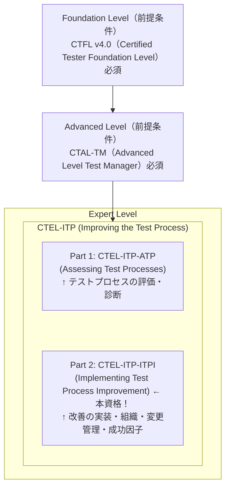
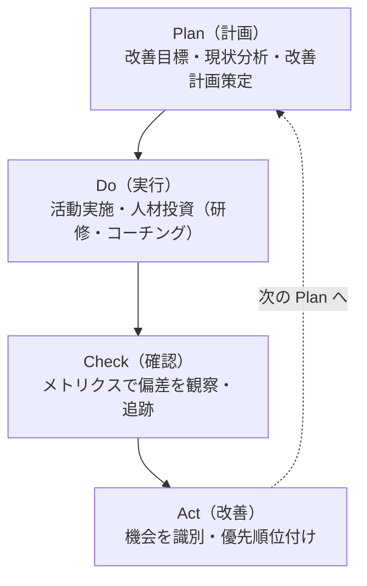
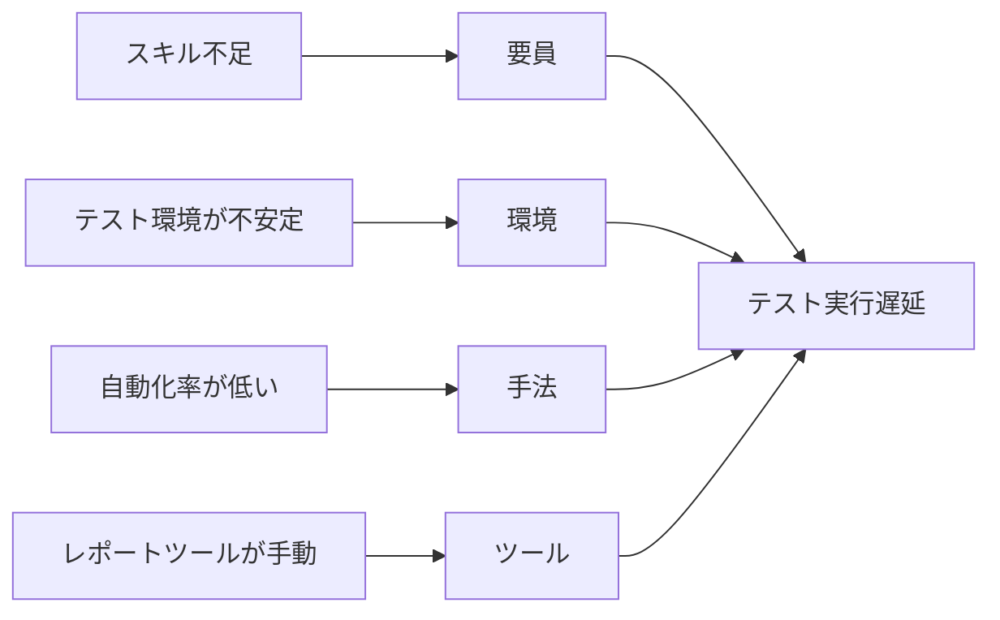

# 🏆 ISTQB® Expert Level – Implementing Test Process Improvement

## CTEL-ITP-ITPI 完全学習ガイド【2025年最新版・初学者対応】

> **最終更新**: 2025年（ISTQB® 公式シラバス v2011 準拠）  
> **対象読者**: CTAL-TM取得済みで、テストプロセス改善の実装専門家を目指す方  
> **参照元**: ISTQB® 公式シラバス「Improving the Testing Process」v2011  
> **資格区分**: CTEL-ITP の Part 2（Part 1 は CTEL-ITP-ATP）

📌 **公式ページ**: <https://istqb.org/certifications/certified-tester-expert-level-implementing-test-process-improvement-ctel-itp-itpi/>  
📌 **試験プロバイダー（iSQI）**: <https://isqi.org/ISTQB-CTEL-ITP-Part-2-Implementing-Test-Process-Improvement/CT-EL-ITP-MCQ-P2.92>  
📌 **公式シラバスPDF**: <https://istqb.org/wp-content/uploads/2024/11/ISTQB-CTEL-ITP_Syllabus_v1.0_2011.pdf>

---

## 📚 目次

1. [CTEL-ITP-ITPI 概要と資格ロードマップ](#chapter-0)
2. [Chapter 2: 改善のコンテキスト](#chapter-2)
3. [Chapter 3: モデルベース改善](#chapter-3)
4. [Chapter 4: 分析ベース改善](#chapter-4)
5. [Chapter 5: テストプロセス改善アプローチの選択](#chapter-5)
6. [Chapter 6: 改善のプロセス（IDEAL フレームワーク）](#chapter-6) ← **ITPI中心**
7. [Chapter 7: 組織・役割・スキル](#chapter-7) ← **ITPI中心**
8. [Chapter 8: 変更管理（チェンジマネジメント）](#chapter-8) ← **ITPI中心**
9. [Chapter 9: 重要成功因子（CSF）](#chapter-9) ← **ITPI中心**
10. [Chapter 10: 異なるライフサイクルモデルへの適応](#chapter-10) ← **ITPI中心**
11. [試験対策・サンプル問題](#exam-tips)
12. [参照URL一覧](#references)

---

<a id="chapter-0"></a>

## 🌟 Chapter 0: CTEL-ITP-ITPI 概要と資格ロードマップ

### 0.1 この資格とは？



**CTEL-ITP-ITPI** は、テストプロセス改善の「実装」に焦点を当てた国際エキスパート資格です。

### 0.2 CTEL-ITP の2部構成を理解する（重要！）

**CTEL-ITP 全体 = Part 1（ATP）＋ Part 2（ITPI）の両方合格が必要**

| 分類 | 章（学習時間） | 備考 |
|---|---|---|
| **Part 1 (ATP)** | Chapter 2: 改善のコンテキスト（285分）<br>Chapter 3: モデルベース改善（570分）<br>Chapter 4: 分析ベース改善（555分）<br>Chapter 5: アプローチ選択（105分） | |
| **Part 2 (ITPI)** | Chapter 6: 改善のプロセス（900分）<br>Chapter 7: 組織・役割・スキル（465分）<br>Chapter 8: 変更管理（285分）<br>Chapter 9: 重要成功因子（300分）<br>Chapter 10: ライフサイクル適応（60分） | **本ガイドの中心** |

> ⚠️ **注意**: 本ガイドは Part 2（ITPI）を重点的に解説しますが、Part 1（ATP）の章も ITPI 試験の背景知識として重要です。

### 0.3 試験概要（CTEL-ITP-ITPI）

| 項目 | スペック |
|---|---|
| **試験形式** | 多肢選択問題（MCQ）のみ |
| **認知レベル** | K5（評価）・K6（創造）中心 |
| **有効期間** | 7年間（更新要） |
| **前提条件** | CTFL ＋ CTAL-TM（必須） |
| **実務経験要件** | テスト経験5年以上<br>プロセス改善経験2年以上 |
| **追加要件** | カンファレンス発表 or 論文執筆・発表 |

📌 **重要**: エキスパートレベル資格は **試験合格だけでは取得できません**。  
実務経験証明（CV＋2名の推薦状）と発表実績も必要です。

### 0.4 エキスパートレベルの認知レベル（K-Level）

ITPI は K5・K6 レベルが中心で、単純な暗記ではなく**総合的な判断と創造**が問われます。

| レベル | 意味 | キーワード | 例 |
|--------|------|-----------|-----|
| K5 | Evaluate（評価） | 評価・判定・モニタリング | 「改善計画の効果を評価する」 |
| K6 | Create（創造） | 生成・設計・構築・計画 | 「テスト改善計画を策定する」 |

### 0.5 CTEL-ITP-ITPI のビジネスアウトカム

CTEL-ITP 全体の認定者は以下を達成できます：

| # | ビジネスアウトカム |
|----|-----------------|
| 1 | テストプロセス改善プログラムをリードし、重要成功因子を識別・管理できる |
| 2 | テストプロセスへの改善アプローチについてビジネス主導の適切な意思決定ができる |
| 3 | テストプロセスの現状を評価し、段階的改善を提案し、ビジネス目標との関連を示せる |
| 4 | テストプロセス改善の戦略的ポリシーを策定・実施できる |
| 5 | テストプロセスの特定問題を分析し、原因・症状・影響を評価できる |
| 6 | 改善を実施するために必要な変更管理を実行できる |

---

<a id="chapter-2"></a>

## 📚 Chapter 2: 改善のコンテキスト（The Context of Improvement）
>
> 285分 | **ATP・ITPI 共通の基礎知識**

### キーワード

> Deming cycle, EFQM Excellence Model, IDEAL, manufacturing-based quality,
> product-based quality, retrospective meeting, software lifecycle,
> Software Process Improvement (SPI), standard, test tool,
> Total Quality Management (TQM), transcendent-based quality,
> user-based quality, value-based quality

### 2.1 なぜテストを改善するのか？（Why Improve Testing?）

テストプロセス改善は以下のビジネス的背景から実施されます：

> 改善が必要な典型的なビジネス理由：
>
> ① 品質向上の必要性
> → 市場に出荷されたソフトウェアの欠陥削減
> → 「品質」は今や市場参入の必須条件
>
> ② コスト削減
> → テスト効率の向上で工数を削減
> → 本番障害のコストは開発中の100倍以上
>
> ③ タイム・トゥ・マーケットの短縮
> → 早期フィードバックで手戻りを削減
> → CI/CD・DevOpsへの対応
>
> ④ 予測可能性の向上
> → プロジェクトの見積もり精度向上
> → ステークホルダーへの報告品質向上
>
> ⑤ 規制・標準への準拠
> → FDA（医療機器）、Sarbanes-Oxley（金融）など
> → ISO 9001、CMMI などの認定取得
>
> ⑥ サードパーティへの能力証明
> → 顧客から特定の成熟度レベルを要求される場合

テスト改善は以下のコンテキスト内で実施されます：

```
テスト改善のコンテキスト：

  組織・ビジネス改善：
  ├── TQM（Total Quality Management）
  ├── ISO 9000:2000
  ├── EFQM Excellence Model
  └── Six Sigma

  IT/ソフトウェアプロセス改善：
  ├── CMMI（Capability Maturity Model Integration）
  ├── ISO/IEC 15504
  ├── ITIL
  └── TSP（Team Software Process）/ PSP（Personal Software Process）
```

### 2.2 何を改善できるか？（What can be Improved?）

```
テスト改善の対象範囲：

  プロセス改善：
  ├── テスト計画・設計・実行・評価のプロセス
  ├── レビュープロセス
  └── 欠陥管理プロセス

  インフラ改善：
  ├── テスト環境（仮想化・コンテナ化）
  ├── テストデータ管理
  └── CI/CDパイプライン

  組織・人材改善：
  ├── テスターのスキル向上
  ├── 役割・責任の明確化
  └── キャリアパスの整備

  ツール改善：
  ├── テスト管理ツール
  ├── 自動化ツール
  └── 静的解析ツール

  ⚠️ 重要: テスト目標は常にビジネス目標に合わせる必要がある
  → 最大の成熟度レベル達成が常に最適とは限らない
```

### 2.3 品質のビュー（Views of Quality）

品質には5つの視点があり、改善の方向性を決定します：

| 品質ビュー | 説明とテストへの適用 |
|---|---|
| **製品ベース**<br>(Product-based) | 製品の属性・特性で品質を定義<br>→ 要件適合性、信頼性指標 |
| **製造ベース**<br>(Manufacturing-based) | プロセス・仕様への適合で品質を定義<br>→ 欠陥数、プロセス遵守率 |
| **ユーザーベース**<br>(User-based) | ユーザーのニーズ充足度で品質を定義<br>→ ユーザビリティ、顧客満足度 |
| **価値ベース**<br>(Value-based) | コストと品質のバランスで定義<br>→ ROI、コスト対効果比率 |
| **超越ベース**<br>(Transcendent-based) | 経験を通じて認識される卓越性<br>→ 信頼・評判・ブランド |

### 2.4 汎用的な改善プロセス（Generic Improvement Process）

#### 2.4.1 デミングサイクル（PDCA）



#### 2.4.2 IDEALフレームワーク（試験頻出！）

IDEAL は Deming サイクルの具体的実装です。

```
IDEAL フレームワーク の5フェーズ：

  I - Initiating（開始）
    ├── 改善の理由を明確にする
    ├── コンテキストを設定し、スポンサーを確保する
    └── 改善インフラ（組織）を確立する

  D - Diagnosing（診断）
    ├── 現在の実践を評価・特性化する
    └── 推奨事項を作成し、フェーズ結果を文書化する

  E - Establishing（確立）
    ├── 戦略と優先順位を設定する
    ├── テストプロセスグループを確立する
    └── アクションを計画する

  A - Acting（実行）
    ├── プロセスと測定を定義する
    ├── パイロットを計画・実行する
    └── インストールを計画・実行・追跡する

  L - Learning（学習）
    ├── 教訓を文書化・分析する
    └── 組織的アプローチを改訂する
```

#### 2.4.3 EFQM 卓越性の基本概念（Fundamental Concepts of Excellence）

8つの卓越性の基本概念：

```
1. 結果指向（Results Orientation）
2. 顧客フォーカス（Customer Focus）
3. リーダーシップと目的の一貫性（Leadership & Constancy of Purpose）
4. プロセスと事実による管理（Management by Processes & Facts）
5. 人材の育成と関与（People Development & Involvement）
6. 継続的学習・革新・改善（Continuous Learning, Innovation & Improvement）
7. パートナーシップの発展（Partnership Development）
8. 企業の社会的責任（Corporate Social Responsibility）
```

📌 EFQM 公式: <https://www.efqm.org/>

### 2.5 改善アプローチの概要（Overview of Improvement Approaches）

| アプローチ | 特徴・詳細 |
|---|---|
| **モデルベースアプローチ** | TMMi・TPI Next などのモデルを使用<br>ベストプラクティスに基づく体系的な改善<br>→ Section 2.5.1 / Chapter 3 参照 |
| **分析ベースアプローチ** | メトリクス・根本原因分析を使用<br>実際の問題から目標を設定し改善を計測<br>→ Section 2.5.2 / Chapter 4 参照 |
| **ハイブリッドアプローチ** | モデルベース＋分析ベースの組み合わせ<br>多くの実際のプロジェクトで採用される<br>→ Section 2.5.3 参照 |

その他の改善アプローチ：

- **人材スキル開発**: 研修・コーチング・ネットワーキング
- **ツール導入**: テスト管理・自動化・静的解析ツール
- **反省会・レトロスペクティブ**: プロジェクト終了時・スプリント後
- **標準・規制への適合**: ISO 9001、FDA、SOX等
- **リソース改善**: テスト環境・テストデータ管理

---

<a id="chapter-3"></a>

## 🔧 Chapter 3: モデルベース改善（Model-based Improvement）
>
> 570分 | **主に ATP（Part 1）の範囲、ITPI でも背景知識として重要**

### キーワード

> CTP, CMMI, continuous representation, GQM, maturity level,
> software process improvement, staged representation, STEP,
> TPI, TMMi, content-based model, process model

### 3.1 モデルベースアプローチの概要

#### テストプロセス改善モデルの望ましい特性

```
良いテストプロセス改善モデルの特性：
  ✓ 使いやすい（Easy to use）
  ✓ 公開されている（Publicly available）
  ✓ コンサルタントによるサポートあり
  ✓ 専門団体に認められている
  ✓ 改善の提供が含まれている
  ✓ 多くの小さな進化的改善を提供する
  ✓ 実践的・経験的・理論的基盤がある
  ✓ 定量化可能な改善を提供する
  ✓ 仕立て可能（プロジェクト固有）
```

#### ステージド表現 vs 継続表現（試験頻出！）

| ステージド表現（Staged）<br>例：TMMi | 継続表現（Continuous）<br>例：TPI Next |
|---|---|
| 決められたレベルを順に上がる | レベルに縛られず改善エリアを選べる |
| 「成熟度レベル」でコミュニケーションしやすい | 特定の問題点に集中できる |
| 外部認定に使いやすい | 柔軟性が高い |
| 全段階達成が必要（柔軟性低） | 「全か無か」の問題がない<br>比較・ベンチマークには適さない |

### 3.2 ソフトウェアプロセス改善モデル

#### CMMI（Capability Maturity Model Integration）

```
CMMI の5つの成熟度レベル（ステージド表現）：

  Level 1: Initial（初期）
  └── プロセスが無秩序・場当たり的

  Level 2: Managed（管理された）
  └── プロジェクトレベルの管理プロセスが確立

  Level 3: Defined（定義された）
  └── 組織標準プロセスが確立・適用

  Level 4: Quantitatively Managed（定量的管理）
  └── メトリクスで管理・予測可能

  Level 5: Optimizing（最適化）
  └── 継続的改善が定常化

テスト関連プロセスエリア：
  ✓ Validation（検証）
  ✓ Verification（妥当性確認）
  ✓ Technical Solution（技術的解決策）
  ✓ Product Integration（製品統合）
```

📌 CMMI 公式: <https://cmmiinstitute.com/>

#### ISO/IEC 15504（SPICE）

```
ISO/IEC 15504-5 の関連プロセスカテゴリ：
  - Engineering（エンジニアリング）
  - Management（管理）
  - Organization（組織）
  - Customer-Supplier（顧客-サプライヤー）
  - Support（サポート）← Verification・Validationを含む

  → 継続表現アプローチを使用
```

### 3.3 テストプロセス改善モデル

#### 3.3.1 TPI Next®（Test Process Improvement Next）

```
TPI Next の構造：

**16のキーエリア（Key Areas）で構成**：

| キーエリア (1-8) | キーエリア (9-16) |
|---|---|
| テスト戦略（Test Strategy） | メトリクス（Metrics） |
| ライフサイクルモデル | テストツール（Test Tools） |
| 旋回ポイント（Moment of Involvement） | テスト環境（Test Environment） |
| 見積もり・計画（Estimating/Planning） | オフィス環境（Office Environment） |
| テストケース（Test Case Design） | コミットメント・動機 |
| テスト技法（Test Techniques） | テスト機能（Testing Functions） |
| テストベース（Test Basis） | コミュニケーション |
| 欠陥管理（Defect Management） | 報告（Reporting） |

> **マトリクスで全体の成熟度を可視化**：
> Initial → Controlled → Efficient → Optimizing
```

📌 TPI Next 公式: <https://www.sogeti.com/tpi-next/>

#### 3.3.2 TMMi®（Testing Maturity Model integration）

```
TMMi の5段階成熟度レベル：

  Level 1: Initial（初期）
  └── テストは場当たり的、定義されていない

  Level 2: Managed（管理）
  └── プロセスエリア：
      ├── テストポリシー・戦略
      ├── テスト計画
      ├── テストモニタリング・コントロール
      ├── テスト設計・実行
      └── テスト環境

  Level 3: Defined（定義）
  └── プロセスエリア：
      ├── テスト組織
      ├── テストプログラム管理
      ├── ピアレビュー
      ├── テスト環境（高度化）
      └── 非機能テスト

  Level 4: Management and Measurement（計測・管理）
  └── 定量的管理・統計的手法の導入

  Level 5: Optimization（最適化）
  └── 継続的改善と欠陥防止
```

📌 TMMi 公式: <https://www.tmmifoundation.org/>

#### 3.3.3 TPI Next と TMMi の比較（試験頻出！）

| 観点 | TPI Next | TMMi |
|---|---|---|
| **タイプ** | 継続モデル（Continuous） | ステージドモデル（Staged） |
| **テスト手法** | TMap Next を参照 | テスト手法非依存 |
| **用語** | TMap に基づく | 標準テスト用語 |
| **SPI との関係** | 特定のSPIモデルとの公式関係なし（マッピング可） | CMMI と高い相関 |
| **フォーカス** | 16のキーエリアでテスト特有の詳細な視点 | 成熟度レベルごとの限られたプロセスエリア |

### 3.4 コンテンツベースモデル

#### STEP（Systematic Test and Evaluation Process）

```
STEP の基本前提：
  → テストはライフサイクル全体を通じた活動
  → 要件定義から始まりシステム廃止まで継続
  → 改善は特定の順序を要求しない（TPI Next と組み合わせ可能）
```

#### CTP（Critical Testing Process）

```
CTP の基本前提：
  → 「重要なテストプロセス」が存在する
  → 12の重要テストプロセスを定義
  → 強みと弱みを識別し、優先度を付けた推奨事項を提供

CTP アセスメントの流れ：
  ① 弱いプロセスエリアの識別
  ② 改善計画の策定（モデルが提供する汎用計画を組織に合わせてカスタマイズ）
  ③ 定量・定性メトリクスの収集・分析
```

---

<a id="chapter-4"></a>

## 📊 Chapter 4: 分析ベース改善（Analytical-based Improvement）
>
> 555分 | **主に ATP（Part 1）の範囲、ITPI でも基礎として重要**

### キーワード

> causal analysis, cause-effect diagram, cause-effect graph,
> Defect Detection Percentage, Failure Mode and Effect Analysis,
> Fault Tree Analysis, indicator, inspection, measure, metric,
> Pareto analysis

### 4.2 原因分析（Causal Analysis）

分析ベースアプローチは「問題の根本原因」を特定して改善を行います。

#### 4.2.1 原因・結果図（Cause-Effect Diagrams / 石川フィッシュボーン図）

```
フィッシュボーン図の作成手順：

  STEP 1: 効果（問題）を右側に記述する
  STEP 2: リブ（原因カテゴリ）を描き、ラベルを付ける
           代表的なカテゴリ:
           ├── Method（手法）
           ├── Machine（機械・ツール）
           ├── Material（資料・テストデータ）
           ├── Man（人材・スキル）
           ├── Measurement（測定・メトリクス）
           └── Environment（環境）
  STEP 3: ブレインストーミングルールを適用する
           ✓ 批判なし・自由な発想・数を重視・全て記録
  STEP 4: 各原因の根本原因を特定する
  STEP 5: アイデアを熟成させる
  STEP 6: クラスターを分析し、パレート原則（80/20）で優先順位付け
```

**実践例：「テスト実行の遅延」の分析**



#### 4.2.2 インスペクションプロセスでの原因分析

```
原因分析ミーティング（2時間のファシリテーション）：

  Part 1: 欠陥分析（90分）
  → 具体的な欠陥とその直接原因を分析
  各欠陥を以下でカテゴライズ：
  ├── 欠陥の説明（症状ではなく欠陥そのもの）
  ├── 原因カテゴリ（コミュニケーション/見落とし/教育/転記ミス/プロセス）
  ├── 原因の説明
  ├── 欠陥が作り込まれたプロセスステップ
  └── 原因を除去するための提案アクション

  Part 2: 汎用分析（30分）
  → 広範なトレンドと共通点を特定
```

#### 4.2.3 標準的な異常分類の使用

```
IEEE 1044 によるインシデント分類：
  → 組織全体での一貫した欠陥分類
  → フォルト混入フェーズ・発見フェーズの追跡
  → 欠陥漏洩（Defect Leakage）の分析
  → コスト削減効果の高い改善エリアを特定
```

#### 4.2.4 原因分析対象欠陥の選択

```
欠陥選択のアプローチ：
  ✓ パレート分析（上位20%が80%の問題を代表）
  ✓ 統計的外れ値（3シグマなど）
  ✓ プロジェクトレトロスペクティブ
  ✓ 欠陥重大度カテゴリ
```

### 4.3 GQM アプローチ（Goal-Question-Metric）

```
GQMの3レベル構造：

  レベル1: 概念レベル – GOALS（目標）
  「製品・プロセス・リソースの品質に関する組織の目標」
  例：「テスト工数を20%削減する」

  レベル2: 運用レベル – QUESTIONS（質問）
  「目標の達成を特性化する質問」
  例：「現在のテスト自動化率はどのくらいか？」

  レベル3: 定量レベル – METRICS（メトリクス）
  「質問に答えるための測定値（客観的または主観的）」
  例：「自動化テストケース数 / 全テストケース数 × 100」

GQM 適用例（品質改善目標）：

  Goal:     「本番環境への欠陥漏洩を50%削減する」
  Question: 「現在の欠陥検出率（DDP）はどのくらいか？」
            「どのテストフェーズで欠陥が見逃されているか？」
  Metric:   DDP = テストで発見した欠陥数 / 全既知欠陥数 × 100
            フェーズ別の欠陥漏洩率
```

### 4.4 メトリクス・測定値・指標による分析

#### 4.4.1〜4.4.7 主要なメトリクス体系

| 分類 | メトリクスの例と計算式 |
|---|---|
| **有効性メトリクス**<br>(Effectiveness) | **DDP（Defect Detection Percentage）**<br>= テスト検出欠陥数 / 全既知欠陥数 × 100<br><br>**本番後欠陥率**<br>= 一定期間後の顧客発見欠陥数 / KLOC |
| **効率性/コストメトリクス**<br>(Efficiency/Cost) | 品質コスト比（静的テスト工数/動的テスト工数）<br>早期欠陥検出率（UT・IT での検出比率）<br>相対テスト工数（テスト工数/総プロジェクト工数）<br>テスト効率（欠陥数/テスト工数）<br>自動化レベル（自動化TC/全TC）<br>テスト生産性（TC数/テスト工数） |
| **リードタイムメトリクス**<br>(Lead-time) | テスト実行リードタイム（開始〜終了の期間） |
| **予測可能性メトリクス**<br>(Predictability) | テスト実行リードタイム乖離<br>工数乖離（実績/計画）<br>テストケース数乖離 |
| **製品品質メトリクス**<br>(Product Quality) | 品質属性（機能性・信頼性・ユーザビリティ等）<br>カバレッジ指標（要件・コードカバレッジ） |
| **テスト成熟度メトリクス**<br>(Test Maturity) | TMMi/TPI Next の成熟度レベル |

---

<a id="chapter-5"></a>

## 🧩 Chapter 5: テストプロセス改善アプローチの選択
>
> 105分 | **ATP（Part 1）の範囲、ITPI でも意思決定の基盤として重要**

### 5.1 改善アプローチの選択基準（試験頻出！）

```
プロセスモデル（TMMi・TPI Next）が最適な場合：
  ✓ テストプロセスが既に存在する（確立にも役立つ）
  ✓ 類似プロジェクト間の比較・ベンチマークが必要
  ✓ ソフトウェアプロセス改善モデルとの互換性が必要
  ✓ 特定の成熟度レベル達成が会社方針（例：TMMi Level 3）
  ✓ 明確な開始点と改善パスが必要
  ✓ マーケティング目的の成熟度測定が必要
  ✓ 組織でプロセスモデルが尊重・受け入れられている

コンテンツモデル（CTP・STEP）が最適な場合：
  ✓ テストプロセスを新たに確立する必要がある
  ✓ 現状プロセスのコスト・リスク評価が必要
  ✓ TMMi/TPI Nextが規定する順序に縛られたくない
  ✓ 会社固有のコンテキストに合わせたテーラリングが必要
  ✓ 不連続で急速な改善が求められる

分析アプローチが最適な場合：
  ✓ 特定の問題に的を絞る必要がある
  ✓ メトリクスが利用可能またはすぐに収集できる
  ✓ 変更の根拠となるエビデンスが必要
  ✓ 変更の理由についてステークホルダーの合意が必要
  ✓ 問題の根本原因がテストプロセスオーナーの管理外
  ✓ 小規模の評価・改善パイロットが予算内
  ✓ 組織文化が外部モデルより内部分析を信頼する
```

---

<a id="chapter-6"></a>

## ⚙️ Chapter 6: 改善のプロセス（Process for Improvement）
>
> 900分 | **ITPI の中核章 ★★★★★**

### キーワード

> acting, assessment report, balanced scorecard, corporate dashboard,
> diagnosing, establishing, IDEAL, initiating, learning,
> process assessment, test improvement plan, test policy

### 6.1 テストポリシーとテスト改善ポリシー

```
テストポリシーの主要内容：

  ① テストの目標と範囲
  ② リスクベーステストの適用方針
  ③ テストの独立性レベル
  ④ テスト環境の要件
  ⑤ テストメトリクスと報告の方針
  ⑥ テストプロセス改善の方針 ← これが改善ポリシー

  【LO 6.1.2（K6）】テスト（改善）ポリシーを作成できる
```

### 6.2 改善プロセスの開始（Initiating the Improvement Process）

> **最も重要なステップ** — 初期段階のアクションが最終結果を直接左右する

#### 6.2.1 改善の必要性を確立する

```
改善ニーズの発生源（ステークホルダー別）：

  経営者/顧客：
  → より効果的なテスト、本番での問題削減

  ユーザー：
  → より良いユーザビリティ

  開発者：
  → 欠陥分析のより良いサポート

  テスター：
  → より体系的なテストの確立

  保守：
  → ソフトウェア変更のテスト時間短縮

改善エリアの特定方法：
  ✓ 予備分析（品質コスト、本番障害コストなど）
  ✓ ステークホルダーインタビュー
  ✓ 現在の指標（DDP、欠陥漏洩率）の分析
```

#### 6.2.2 テスト改善の目標を設定する

```
目標設定の3ステップ：

  STEP 1: 将来ビジョンの確立
    → スポンサーとなるステークホルダーに必要な便益を明確化
    → 共通ビジョンの欠如は改善失敗の主因

  STEP 2: 具体的な目標の設定
    → 定性的目標（スケール使用）
    → 定量的目標（GQM メソッドでメトリクス定義）
    → 成熟度レベル目標（TMMi Level 3 など）

  STEP 3: ビジネス目標との整合
    → バランスドスコアカードを活用
```

**バランスドスコアカードの4視点**：

| 視点 | 評価指標の例 |
|---|---|
| **財務** | 生産性向上・収益改善・コスト削減 |
| **顧客** | 市場シェア向上・顧客満足度・リスク管理 |
| **内部** | 予測可能性向上・欠陥削減・工期短縮 |
| **イノベーション** | 新市場参入・製品化速度・標準認定取得 |

#### 6.2.3 改善スコープを設定する

```
スコープの4つの観点：

  ① 汎用プロセススコープ
     → テストプロセス以外のプロセス（PM・要件管理等）が含まれるか？

  ② テストプロセススコープ
     → テストプロセスのどの部分を対象とするか？
     → 特定の部分だけでは「部分最適」のリスクがある！

  ③ テストレベルスコープ
     → ユニットテスト・統合テスト・システムテスト・受入テストの範囲

  ④ プロジェクトスコープ
     → プロジェクト中心（単一プロジェクト）か
       組織中心（全組織）かで改善の規模・期間・コストが変わる

組織中心 vs プロジェクト中心の比較：
  プロジェクト中心：
    + 結果が早い・コスト低
    - 組織レベルの問題を解決できない可能性
  
  組織中心：
    + 長期的・広範囲に効果
    - 時間・コストが多くかかる
```

### 6.3 現状の診断（Diagnosing the Current Situation）

> **アセスメントレポート**の作成がこのフェーズの成果物

#### 6.3.1〜6.3.3 アセスメント計画・準備・インタビュー

```
アセスメント計画に含めるべき内容：

  ① アセスメント準備活動のスケジュール
     → 予備分析・インタビュー資材準備・既存文書の収集

  ② インタビュー対象者（役割別）：
     ├── テスター
     ├── テストマネージャー
     ├── 開発者
     ├── プロジェクトマネージャー
     ├── ビジネスオーナー
     ├── ビジネスアナリスト（ドメイン専門家）
     └── スペシャリスト（環境・欠陥・リリース・自動化担当）

  ③ 各インタビューでカバーする特定エリア
  ④ 初期フィードバックの提供（日程・形式・期待値）
  ⑤ インタビュイーへの次ステップ説明

インタビューの実施ガイドライン：
  ✓ 個別インタビューが推奨（グループだと発言が制限される）
  ✓ 上司の前でインタビューしない（圧力を排除）
  ✓ 機密性を確保して正直な発言を促す
  ✓ インタビュイーが正直に話せる条件を作る：
    - 機密性の確保
    - 改善アイデアへの承認
    - 罰則・失敗への恐れがない
    - 情報の使用目的が明確
```

#### 6.3.4〜6.3.5 初期フィードバックと結果分析

```
結果分析で活用できる概念：

  システム思考（Systems Thinking）：
  → プロセスコンポーネント間の関係を分析
  → バランシングループ vs 強化ループ（悪循環/好循環）

  ティッピングポイント（Tipping Points）：
  → 小さくフォーカスされた改善が悪循環を断ち切り
    連鎖的な改善を引き起こすポイントを特定

ベンチマークの活用：
  ✓ 企業ベース（組織全体の比較）
  ✓ 業界ベース（同業他社との比較）
  ✓ プロジェクトベース（目標プロジェクトとの比較）
```

#### 6.3.6 ソリューション分析の実施

```
ソリューション選択の5つのアプローチ：

  1. 事前概念型（Preconception）
     → すでに解決策を決めている（例：「全て自動化する」）
     - 根本原因に対処しないリスクがある

  2. モデル推奨型
     → モデルが内蔵するベストプラクティスから選択
     - 状況に合わない場合もある

  3. 顧客・ステークホルダー要求型
     → 顧客が要求する（例：「ISO 9001取得必須」）
     - 他の計画改善と競合する可能性

  4. ソリューション分析型（推奨！）
     → 収集した問題情報に基づいて分析・選択
     + 負の影響も議論された上での選択
     - 時間・リソースが必要

  5. カスタムテーラリング型
     → 上記の組み合わせ
     - 分析プロセスに時間がかかる

ソリューション分析のプロセス：
  ✓ 問題・根本原因の優先順位付け
  ✓ コスト便益・ROI の計算
  ✓ ソリューション実装のリスク・制約の識別
  ✓ ソリューション間の競合確認
  ✓ フィードバックループ分析
  ✓ ギャップ分析
  ✓ 「逆フィッシュボーン図」（解決策のブレインストーミング）
```

#### 6.3.7 改善アクションの推奨（アセスメントレポート）

```
アセスメントレポートの最低限の内容：

  ① マネジメントサマリー（ビジョンへの言及）
  ② スコープと目標の記述
  ③ 分析結果
     ├── 肯定的な側面（強み）
     ├── 改善が必要な側面（弱み）
     └── 未解決の課題
  ④ 各観察事項の評価（重大度含む）
  ⑤ 提案する改善アクション（優先順位付き）
  ⑥ 評価の根拠（どの情報源から来たか）

  ⚠️ レポートはアセスメント完了後できる限り早く提供する
```

### 6.4 テスト改善計画の確立（Establishing a Test Improvement Plan）

#### 6.4.1〜6.4.3 優先順位付けとアプローチ

```
改善推奨事項の優先順位付け基準：
  ✓ ビジネス価値（最高優先度）
  ✓ 実現可能性（技術的・組織的）
  ✓ リスクレベル
  ✓ コストと工数
  ✓ 他の改善との依存関係

トップダウン vs ボトムアップ（試験頻出！）：

  トップダウン（Top-Down）：
  → 経営層の意思決定から始まる
  + 組織的コミットメントがある
  + リソース確保が容易
  - 現場の現実が見えにくい

  ボトムアップ（Bottom-Up）：
  → テスト現場の改善から始まる
  + 実際の問題に対処できる
  + 現場のエンゲージメントが高い
  - 組織全体への展開に時間がかかる
```

#### 6.4.4〜6.4.5 テスト改善計画の典型的な内容

```
テスト改善計画書の構成要素：

  ① 改善目標（ビジョンと具体的な目標）
  ② スコープと境界（何を含み、何を除外するか）
  ③ 役割と責任（RACI マトリクス）
  ④ スケジュールとマイルストーン
  ⑤ リソース計画（人員・ツール・予算）
  ⑥ リスクと軽減策
  ⑦ 成功基準とメトリクス（どう測定するか）
  ⑧ 変更管理の方針（Chapter 8 参照）
  ⑨ コミュニケーション計画
  ⑩ 教訓と継続改善の方針

  【LO 6.4.5（K6）】テスト改善計画を作成できる ← 試験最重要！
```

### 6.5 改善の実行（Acting to Implement Improvement）

#### 6.5.1 パイロットの選択と実行

```
パイロットプロジェクトを実施する理由：
  ✓ 低リスクで改善アプローチを試験できる
  ✓ 組織全体への本格展開前に問題を発見・修正できる
  ✓ エビデンスを収集して他のステークホルダーを説得できる
  ✓ コスト・リスクを最小化できる

良いパイロット選択の基準：
  ✓ 代表的なプロジェクト（特殊すぎない）
  ✓ 意欲的なチームがいる
  ✓ 適切な規模（小さすぎず大きすぎない）
  ✓ 短期間で結果が得られる
  ✓ ステークホルダーの可視性が高い

パイロット後の評価観点：
  ✓ 当初の目標は達成されたか？
  ✓ どのような問題が発生したか？
  ✓ 本格展開に何の修正が必要か？
  ✓ ROI はどのくらいか？
```

#### 6.5.2 実装の管理とコントロール

```
実装管理の主要活動：
  ✓ 進捗のモニタリングとレポート
  ✓ 問題の早期識別と対応
  ✓ 変更管理の適用（Chapter 8 参照）
  ✓ ステークホルダーへの定期コミュニケーション
  ✓ リスクの継続的な評価
```

### 6.6 改善プログラムからの学習（Learning from the Improvement Program）

```
学習フェーズの主要活動：

  ✓ 成功と失敗の文書化・分析
  ✓ 何がうまくいったか・改善できたかを整理
  ✓ 組織的アプローチの改訂（次の改善サイクルへの反映）
  ✓ 教訓の組織内での共有
  ✓ ナレッジリポジトリへの蓄積
  ✓ 次の IDEAL サイクルの開始

   → このフェーズこそが「継続的改善」の核心！
```

---

<a id="chapter-7"></a>

## 👥 Chapter 7: 組織・役割・スキル（Organization, Roles and Skills）
>
> 465分 | **ITPI の重要章 ★★★★★**

### キーワード（Chapter 7）

> assessor, interviewer, Test Process Group (TPG),
> Test Process Improver (TPI), assessor roles, organization

### 7.1 組織（Organization）

#### 7.1.1 テストプロセスグループ（Test Process Group: TPG）

```
TPG の概要：
  → テストプロセス改善活動を組織的に推進する専門チーム

TPG の主な役割：
  ✓ テストプロセス改善戦略の策定と推進
  ✓ アセスメントの計画・実施・報告
  ✓ 改善計画の策定と実装サポート
  ✓ ベストプラクティスの収集・普及
  ✓ 教育・コーチングの提供
  ✓ メトリクスの収集・分析・報告

TPG の組織構造モデル：

  モデル1: 中央集権型
  → 専任の TPG チームが全組織をサポート
  + 専門性が高い・一貫性がある
  - コストが高い・現場から乖離する可能性

  モデル2: 分散型
  → 各プロジェクトに TPG メンバーを配置
  + 現場に近い
  - 一貫性の維持が難しい

  モデル3: ハイブリッド型（実務で最多）
  → 中央に小さなコアTPGを持ちつつ、各組織に担当者を配置
```

#### 7.1.2 リモート・オフショア・アウトソースチームでのテスト改善

```
リモート・オフショアチームでの改善の課題：
  ✗ コミュニケーションのオーバーヘッド（言語・時差）
  ✗ 文化的差異（品質に対する考え方の違い）
  ✗ インタビューの実施が難しい（信頼関係の構築）
  ✗ アセスメントへのアクセスが制限される場合がある

対策：
  ✓ 効果的なコミュニケーションツールの使用
  ✓ 文化的な違いを理解し尊重したアプローチ
  ✓ 現地代表者（チャンピオン）の活用
  ✓ 定期的な対面セッション（アセスメント時）
  ✓ 標準化されたプロセスと文書の使用
```

### 7.2 個人の役割（Individual Roles）

#### 7.2.1 テストプロセス改善者（Test Process Improver）

```
テストプロセス改善者の主な責任：
  ✓ テストプロセス改善プログラムのリード
  ✓ アセスメントの実施（または調整）
  ✓ ステークホルダーとの関係構築
  ✓ 改善計画の策定・推進
  ✓ チェンジマネジメントの実施
  ✓ 成功因子の管理

テストプロセス改善者の地位：
  → 組織内で信頼を得た中立的な立場が重要
  → 経営層のスポンサーシップを持つことが不可欠
```

#### 7.2.2 アセッサーの役割

```
アセッサーの役割タイプ：

  内部アセッサー（Internal Assessor）：
  + 組織文化・コンテキストを理解している
  + コストが低い
  - 客観性・独立性が低い可能性
  - 内部政治の影響を受ける

  外部アセッサー（External Assessor）：
  + 高い客観性・独立性
  + 業界の比較情報を持っている
  - コストが高い
  - 組織文化への理解に時間が必要

  組み合わせアプローチ（推奨）：
  → 外部アセッサーがリード、内部が協力するハイブリッド
```

### 7.3 テストプロセス改善者/アセッサーのスキル

#### 7.3.1 インタビュースキル（試験頻出！）

```
効果的なインタビューの実施方法：

  準備：
  ✓ インタビューの目的と範囲を事前に共有
  ✓ オープン質問とクローズ質問を準備
  ✓ 快適でプライベートな環境を確保

  インタビュー中：
  ✓ 積極的傾聴（Active Listening）
  ✓ フォローアップ質問で深掘り
  ✓ 中立的な言葉遣い（誘導を避ける）
  ✓ ノートを適切に取る

  インタビュー後：
  ✓ 速やかにノートを整理・確認
  ✓ 必要に応じてフォローアップ

オープン質問 vs クローズ質問：
  オープン質問：「テスト計画について教えてください」
  クローズ質問：「テスト計画を文書化していますか？」
  → オープン質問でより多くの情報を引き出す
```

#### 7.3.2 傾聴スキル（Listening Skills）

```
効果的な傾聴のポイント：
  ✓ インタビュイーの言葉を遮らない
  ✓ 非言語的サイン（ボディランゲージ）に注意
  ✓ 理解を確認するために言い換えて確認する
  ✓ 沈黙を恐れない（考える時間を与える）
  ✓ 感情的な反応を示さない（中立性を保つ）
```

#### 7.3.3 プレゼンテーション・報告スキル（Presentation and Reporting Skills）

```
効果的なプレゼンテーションの構造：

  対象者別アプローチ：
  ✓ 経営層：ビジネス影響・ROI・リスクを簡潔に
  ✓ テストマネージャー：詳細な問題と解決策
  ✓ テスター：具体的な改善点と実装方法

  報告書の品質基準：
  ✓ 客観的事実に基づく（感情的でない）
  ✓ 証拠で裏付けられた発見事項
  ✓ 明確な優先順位付き推奨事項
  ✓ 測定可能な改善目標
  ✓ 責任者・期限の明記
```

#### 7.3.4〜7.3.7 その他のスキル

```
分析スキル（Analytical Skills）：
  ✓ 情報を論理的に構造化する能力
  ✓ パターン・トレンドの識別
  ✓ 根本原因と症状を区別する能力
  ✓ 複数の要因を総合的に判断する能力

ノートテイキングスキル（Note-taking Skills）：
  ✓ 重要な情報を正確に記録する
  ✓ インタビュイーの言葉を正確に記録（引用符で区別）
  ✓ 重要度を区別しながら記録する

説得スキル（Skills of Persuasion）：
  ✓ データと事実に基づく説得
  ✓ ステークホルダーの関心事に合わせたフレーミング
  ✓ Win-Win のシナリオを提示する
  ✓ 反論を予測し、準備しておく

マネジメントスキル（Management Skills）：
  ✓ プロジェクト管理（スコープ・スケジュール・リソース）
  ✓ リスク管理
  ✓ ステークホルダー管理
  ✓ チームリーダーシップ
```

---

<a id="chapter-8"></a>

## 🔄 Chapter 8: 変更管理（Managing Change）
>
> 285分 | **ITPI の中核章 ★★★★★**

### キーワード（Chapter 8）

> change management, human factors, organizational change,
> resistance to change, change agent, stakeholder management

### 8.1 変更管理の重要性

```
テストプロセス改善が失敗する主な理由の多くは：
  → 技術的な問題ではなく「人的・組織的な問題」

変更管理（チェンジマネジメント）の目的：
  → 組織・チーム・個人が変化を受け入れられるよう支援する
  → 変化への抵抗を最小化する
  → 改善の持続性を確保する
```

### 8.2 基本的な変更管理プロセス

```
変更管理の3フェーズモデル（Lewin のアンフリーズモデル）：

  フェーズ1: Unfreeze（解凍）
  → 現状への不満・変化の必要性の認識を高める
  → 変化のための「緊急感」を醸成する
  → ステークホルダーのコミットメントを得る

  フェーズ2: Change（変化）
  → 新しいプロセス・行動・考え方を実装する
  → 教育・コーチング・サポートを提供する
  → 段階的な変化（Incremental Change）を選ぶ

  フェーズ3: Freeze（凍結/定着）
  → 新しい状態を安定させる
  → 文化・慣行として定着させる
  → 後退しないための仕組みを作る

コッター（Kotter）の8ステップ変革モデル：
  1. 緊急性の確立
  2. ガイド連合の形成
  3. ビジョンと戦略の策定
  4. 変革ビジョンの伝達
  5. 行動のためのエンパワーメント
  6. 短期成果（クイックウィン）の創出
  7. 変化の定着と更なる変化の加速
  8. 文化への変化の定着
```

### 8.3 変更管理プロセスにおける人的要因（Human Factors）

#### 変化への抵抗（Resistance to Change）

```
変化への抵抗の主な原因：

  個人レベル：
  ✗ 現在の状況への満足（「現状で十分」）
  ✗ 失敗への恐れ
  ✗ 追加作業への不満
  ✗ スキル・能力の不足への不安
  ✗ 変化の意味が理解できない

  組織レベル：
  ✗ 組織の惰性（「いつもこうやっている」）
  ✗ 既存の投資を守ろうとする
  ✗ 権力関係の変化への懸念
  ✗ 情報の不足

変化への抵抗への対処法：

  ① 教育とコミュニケーション
     → 変化の理由と便益を明確に伝える
     → オープンな対話の場を設ける

  ② 参加と関与
     → 改善計画の策定に現場を巻き込む
     → 当事者意識を醸成する

  ③ サポートとファシリテーション
     → 必要なトレーニング・リソースを提供する
     → 心理的サポートを行う

  ④ 交渉と同意
     → 変化によって損失を被る人々と交渉する
     → インセンティブを検討する

  ⑤ クイックウィン（早期成果）
     → 小さな成功を早く見せることで信頼を得る
```

#### 変更エージェント（Change Agents）の役割

```
変更エージェントとは？
  → 変化を積極的に推進し、組織内で変革をリードする人

変更エージェントの特性：
  ✓ 組織内での信頼と信頼性がある
  ✓ 変化の必要性と便益を強く信じている
  ✓ 効果的なコミュニケーターである
  ✓ 障害を乗り越える粘り強さがある
  ✓ 組織のダイナミクスを理解している

テストプロセス改善者は主要な変更エージェントである！
```

#### ステークホルダー管理

```
ステークホルダーマッピング（影響力 vs 関心の4象限）：

        高い関心
             │
  監視する   │  密接に管理する
  (Monitor) │  (Manage Closely)
─────────────┼─────────────────→ 高い影響力
  最小限の   │  情報を提供する
  努力で維持 │  (Keep Informed)
   (Minimal)│
             │
        低い関心

各ステークホルダーへの対応：
  高影響力×高関心：スポンサー → 最優先で密接に協力
  高影響力×低関心：経営層 → 定期的に成果を報告して巻き込む
  低影響力×高関心：テスター → 情報提供と参加機会の提供
  低影響力×低関心：その他 → 最低限の情報提供
```

---

<a id="chapter-9"></a>

## 🌟 Chapter 9: 重要成功因子（Critical Success Factors）
>
> 300分 | **ITPI の中核章 ★★★★★**

### 9.1 主要な成功因子（Key Success Factors）

テストプロセス改善プログラムを成功させるための重要因子：

| CSF (重要成功因子) | 詳細・ポイント |
|---|---|
| **CSF 1: 経営のコミットメントとスポンサーシップ** | → CEOレベルの支援なしに大規模な改善は成功しない<br>→ 「予算・時間・人員」の確保が不可欠 |
| **CSF 2: 明確なビジネスゴールとの連携** | → 「テストのためのテスト改善」ではなく「ビジネスの成功のための改善」として位置づける |
| **CSF 3: 適切なスコープとリソース** | → 過度に広いスコープは失敗の元<br>→ 段階的なアプローチを採用する |
| **CSF 4: 強力な改善チームとスキル** | → 適切なスキルを持つ人材の配置<br>→ 内部と外部の専門家の適切な組み合わせ |
| **CSF 5: 効果的なチェンジマネジメント** | → 変化への抵抗を管理する能力<br>→ コミュニケーション計画の実施 |
| **CSF 6: 測定と可視化** | → 明確な成功基準とメトリクス<br>→ 定期的な進捗報告と可視化 |
| **CSF 7: 継続的なコミュニケーション** | → 全ステークホルダーへの定期的な情報提供<br>→ 透明性のある進捗共有 |
| **CSF 8: クイックウィン（早期成果）の達成** | → 早期に目に見える成果を出してモメンタムを維持<br>→ 懐疑的なステークホルダーへの説得材料 |

### 9.2 改善のための文化の醸成（Setting a Culture for Improvement）

```
改善文化の特性（試験頻出！）：

  ✓ 継続的改善が「標準的な仕事の進め方」になっている
  ✓ 失敗を学習の機会として捉える（心理的安全性）
  ✓ データと事実に基づく意思決定
  ✓ オープンなコミュニケーションとフィードバック
  ✓ 改善の成功を認め・祝う習慣
  ✓ テスト・品質が全員の責任という意識

改善文化を醸成するための活動：
  ✓ ロールモデルとしてのリーダー行動
  ✓ 成功事例の見える化と共有
  ✓ 定期的なレトロスペクティブの実施
  ✓ 改善アイデアを収集する仕組み（アイデアバンク）
  ✓ 改善貢献に対する表彰・インセンティブ
  ✓ 改善活動への時間・リソースの確保
  ✓ 「なぜ（Why）」から始まるコミュニケーション

アンチパターン（避けるべき行動）：
  ✗ 問題を隠す文化（失敗を責める）
  ✗ 改善提案が却下され続ける環境
  ✗ 「いつもこうやってきた」という慣性
  ✗ 形式的な改善活動（実態が伴わない）
  ✗ 改善に時間・リソースが割り当てられない
```

---

<a id="chapter-10"></a>

## 🔄 Chapter 10: 異なるライフサイクルモデルへの適応
>
> 60分 | **ITPI の補足章**

### 10.1 様々なライフサイクルモデルへの適応（試験頻出！）

```
モデルの適用における解釈が必要な要因：

  ✓ 適用するライフサイクルモデル
    （伝統的V字モデル vs アジャイル開発プロセス）
  ✓ 使用技術（Web・オブジェクト指向・組み込みシステム）
  ✓ システムアーキテクチャ（分散システム・SOA・組み込み）
  ✓ リスクレベル（安全クリティカル vs ビジネスシステム）
  ✓ テストアプローチ（スクリプト型 vs 探索的）
  ✓ 組織単位のコンテキスト適合性
```

#### ウォーターフォール/V字モデルにおける改善

```
ウォーターフォールでの改善の特徴：
  ✓ フェーズゲートでのアセスメントが自然
  ✓ フォーマルなドキュメントレビューが可能
  ✓ テスト改善計画が長期的になりやすい

課題：
  ✗ 改善サイクルが長い（プロジェクト間）
  ✗ フィードバックループが遅い
  ✗ 途中での変更が難しい
```

#### アジャイル開発における改善

```
アジャイルでの改善の特徴：
  ✓ スプリントレトロスペクティブが自然な改善サイクル
  ✓ 頻繁な改善の機会（2週間ごと）
  ✓ 継続的統合（CI）でのテスト自動化改善が容易

アジャイルでの改善の注意点：
  ⚠️ テスト改善モデル（TMMi等）をアジャイルに適用する場合、
     厳格な段階的アプローチの解釈が必要
  ⚠️ アジャイルチームは形式的なプロセスより
     「動くソフトウェア」を優先する傾向がある

アジャイル改善のアプローチ：
  ① スプリントレトロスペクティブの質を高める
  ② DevOps パイプラインへのテスト統合の改善
  ③ テスト自動化カバレッジの段階的な向上
  ④ チームの共同所有（テストは全員の責任）の強化
```

#### DevOps / CI/CD 環境における改善

```
DevOps でのテスト改善の焦点：
  ✓ テスト自動化率の向上（パイプライン全体）
  ✓ テストフィードバックの高速化
  ✓ 品質ゲート（Quality Gates）の定義と最適化
  ✓ 本番モニタリングとテストの連携
  ✓ シフトレフト（早期テスト）の実現

DevOps 改善メトリクス：
  ✓ デプロイ頻度
  ✓ 変更リードタイム
  ✓ 変更失敗率
  ✓ 平均復旧時間（MTTR）
```

---

<a id="exam-tips"></a>

## 📝 試験対策・サンプル問題

### 試験概要の再確認

```
CTEL-ITP-ITPI 試験：
  形式：多肢選択問題（MCQ）のみ
  認知レベル：主に K5（評価）・K6（創造）
  前提条件：CTFL + CTAL-TM（必須）
  有効期間：7年（更新要）

  ⚠️ 追加要件（試験合格後）：
  ✓ テスト経験 5年以上の CV（推薦状2通含む）
  ✓ プロセス改善経験 2年以上の CV
  ✓ テスト関連カンファレンスでの発表 or 論文発表

  モックテスト（無料）：
  https://isqi.org/ISTQB-CTEL-ITP-Part-2-Implementing-Test-Process-Improvement/CT-EL-ITP-MCQ-P2.92
```

### 章別重要度と学習時間

| 章 | テーマ | 学習時間 | 重要度（ITPI） |
|---|--------|---------|--------------|
| 2 | 改善のコンテキスト | 285分 | ★★★（背景知識） |
| 3 | モデルベース改善 | 570分 | ★★★（背景知識） |
| 4 | 分析ベース改善 | 555分 | ★★★（背景知識） |
| 5 | アプローチ選択 | 105分 | ★★★★ |
| **6** | **改善のプロセス** | **900分** | **★★★★★（中核）** |
| **7** | **組織・役割・スキル** | **465分** | **★★★★★（中核）** |
| **8** | **変更管理** | **285分** | **★★★★★（中核）** |
| **9** | **重要成功因子** | **300分** | **★★★★★（中核）** |
| **10** | **ライフサイクル適応** | **60分** | **★★★（ITPI固有）** |

### 必ず覚える重要概念チェックリスト

```
✅ IDEAL フレームワーク の5フェーズ（I・D・E・A・L）：
   Initiating → Diagnosing → Establishing → Acting → Learning

✅ デミングサイクル（PDCA）：
   Plan → Do → Check → Act

✅ ガービンの5つの品質ビュー：
   製品ベース / 製造ベース / ユーザーベース / 価値ベース / 超越ベース

✅ 3つの主要改善アプローチの使い分け基準：
   モデルベース / コンテンツベース / 分析ベース

✅ TMMi と TPI Next の主要な違い：
   ステージド（TMMi）vs 継続（TPI Next）
   CMMI相関（TMMi）vs なし（TPI Next）

✅ アセスメントレポートの最低限の内容：
   マネジメントサマリー / スコープと目標 /
   分析結果（強み・弱み・未解決課題） / 改善推奨事項

✅ テスト改善計画の典型的な内容：
   目標・スコープ・役割・スケジュール・リソース・
   リスク・成功基準・変更管理・コミュニケーション

✅ トップダウン vs ボトムアップ改善アプローチの違い

✅ テストプロセスグループ（TPG）の役割

✅ 変化への抵抗の主要原因と対処法

✅ 9つの重要成功因子（CSF）

✅ 改善文化の特性と醸成方法

✅ アジャイルとウォーターフォールでの改善の違い

✅ GQMアプローチの3レベル：
   Goals → Questions → Metrics

✅ DDP（Defect Detection Percentage）の計算式：
   DDP = テスト検出欠陥数 / 全既知欠陥数 × 100

✅ バランスドスコアカードの4視点：
   財務 / 顧客 / 内部 / イノベーション
```

### サンプル問題と解説

---

**問1（K5 / Chapter 6.4 テスト改善計画）**

テストプロセス改善プログラムの「確立（Establishing）」フェーズで作成されるテスト改善計画に必ず含めるべき内容はどれか？（最も適切なものを選べ）

A) 現在のテストプロセスの詳細な問題リスト  
B) 改善の目標・スコープ・役割・スケジュール・成功基準  
C) テスト対象システムの技術アーキテクチャ  
D) インタビューで収集した全発言の記録  

<details>
<summary>📌 解答を見る</summary>

**正解: B**

テスト改善計画（Test Improvement Plan）の典型的な内容は：

- 改善目標・ビジョン
- スコープと境界
- 役割と責任（RACI）
- スケジュールとマイルストーン
- リソース計画
- リスクと軽減策
- 成功基準とメトリクス
- 変更管理方針
- コミュニケーション計画

A) は「診断（Diagnosing）」フェーズの成果物（アセスメントレポート）の内容  
C) は改善計画に直接含めるものではない  
D) は診断フェーズのインプット情報（アセスメントレポートには要約が入る）  

</details>

---

**問2（K6 / Chapter 8 変更管理）**

テストプロセス改善を実施する中で、テスターのチームから「なぜ今まで通りのやり方ではダメなのか」という抵抗を受けた。最も適切な対処法はどれか？

A) 経営層の権限で強制的に新プロセスを導入する  
B) テスターを改善計画の策定プロセスに参加させ、変化の理由とメリットを明確に説明する  
C) 抵抗しているテスターを他のプロジェクトに異動させる  
D) 改善の範囲をそのチームを除外するよう縮小する  

<details>
<summary>📌 解答を見る</summary>

**正解: B**

変化への抵抗への最も効果的な対処法は「参加と関与」です。

テスターを改善計画の策定に巻き込むことで：

- 当事者意識が生まれる
- 変化の理由と便益を自然に理解できる
- 「自分たちが作ったプロセス」として受け入れやすくなる

A) 強制的な導入は表面的な従順さを生むが、持続的な改善にはならない  
C) 抵抗を排除するのではなく、エネルギーを活用する方向に転換すべき  
D) 問題から逃げる対処法は根本解決にならない  

</details>

---

**問3（K5 / Chapter 9 重要成功因子）**

テストプロセス改善プログラムが成功するための最も重要な条件はどれか？

A) 最新のテスト自動化ツールの導入  
B) 経営層からの明確なコミットメントとスポンサーシップ  
C) 詳細なテストプロセス文書の整備  
D) テスト専任チームの大幅な増員  

<details>
<summary>📌 解答を見る</summary>

**正解: B**

テストプロセス改善の重要成功因子（CSF）の中で最も重要なのは「経営のコミットメントとスポンサーシップ」です。

理由：

- 予算・時間・人員の確保には経営層の承認が必要
- 組織変革には権限を持つスポンサーの後押しが不可欠
- 抵抗を乗り越えるための権威ある支持者が必要

A) ツール導入は改善手段の一つであり、それ自体が成功因子ではない  
C) 文書化は重要だが、最も重要な成功因子ではない  
D) 人員増強は必ずしも必要ではなく、スキルと効率性の改善が先  

</details>

---

**問4（K5 / Chapter 6.3 ソリューション分析）**

アセスメントの結果、「テスト設計スキルの不足」と「テスト実行フェーズの遅延」という問題が発見された。ソリューション分析において最も適切なアプローチはどれか？

A) 即座にテスト自動化を全面導入することを決定する  
B) TMMi の推奨するレベル3の実装を開始する  
C) 問題の根本原因を分析し、複数の解決策のコスト・便益・リスクを比較する  
D) 外部のテスターを大量採用することを直ちに決定する  

<details>
<summary>📌 解答を見る</summary>

**正解: C**

ソリューション分析では「事前概念型」（すでに解決策が決まっている）を避けることが重要です。

最良のアプローチは：

1. 問題・根本原因の優先順位付け
2. 複数の解決策候補の洗い出し
3. 各解決策のコスト・便益・ROIの計算
4. リスクと制約の評価
5. ソリューション間の競合確認
6. 証拠に基づく最終選択

A) は「事前概念型」の典型例で、根本原因を分析していない  
B) はモデルを盲目的に適用しており、状況に合わない可能性がある  
D) は根本原因（スキル不足）への対処策の一つだが、他の選択肢との比較なしに決定するのは不適切  

</details>

---

**問5（K6 / Chapter 7.1 組織）**

テストプロセスグループ（TPG）を組織する際の最適な構造はどれか？

A) すべての改善活動を外部コンサルタントに委任する  
B) 組織の規模・文化・改善目標に応じて、中央集権型・分散型・ハイブリッド型から選択する  
C) 必ず専任の大規模な中央 TPG を設置する  
D) 各プロジェクトマネージャーが兼任で TPG の役割を担う  

<details>
<summary>📌 解答を見る</summary>

**正解: B**

TPG の組織構造は「一律の正解」がなく、組織のコンテキストに応じて選択します：

- 中央集権型：専門性が高いが現場から乖離するリスク
- 分散型：現場に近いが一貫性の維持が難しい
- ハイブリッド型：実務で最も多く採用される

A) 外部委任だけでは組織内の能力が育たない（知識移転が重要）  
C) 大規模 TPG が常に最適とは限らない（コスト・文化的適合）  
D) 兼任では改善活動への注力が難しい（日々の業務に追われる）  

</details>

---

### 試験直前チェックリスト（ITPI 重点項目）

```
✅ Chapter 2 – 改善コンテキスト:
□ デミングサイクル（PDCA）の4ステップを説明できる
□ IDEAL フレームワークの5フェーズを順番に説明できる
□ EFQM の8つの卓越性の基本概念を説明できる
□ 3つの改善アプローチ（モデル/分析/ハイブリッド）を比較できる
□ ガービンの5つの品質ビューを説明できる

✅ Chapter 3・4 – モデルベース・分析ベース:
□ TMMi と TPI Next の主な違いを説明できる
□ ステージド表現と継続表現の長所・短所を説明できる
□ GQM の3レベル（Goals/Questions/Metrics）を適用できる
□ フィッシュボーン図の作成手順を説明できる
□ DDP の計算式を適用できる

✅ Chapter 5 – アプローチ選択:
□ 各アプローチ（モデル/コンテンツ/分析）の適用条件を説明できる

✅ Chapter 6 – 改善プロセス（最重要）:
□ IDEAL の各フェーズで実施する主要活動を説明できる
□ アセスメントレポートの最低限の内容を説明できる
□ テスト改善計画の典型的な内容を説明できる（K6）
□ ソリューション分析の5つのアプローチの長短を比較できる
□ パイロット選択の基準を説明できる
□ トップダウン vs ボトムアップの違いを説明できる

✅ Chapter 7 – 組織・役割・スキル（最重要）:
□ TPG の役割と3つの組織構造（中央/分散/ハイブリッド）を説明できる
□ 内部アセッサー vs 外部アセッサーの長短を比較できる
□ テストプロセス改善者に必要な7つのスキルを説明できる
□ リモート・オフショアでの改善の課題と対策を説明できる
□ オープン質問 vs クローズ質問の使い分けを説明できる

✅ Chapter 8 – 変更管理（最重要）:
□ Lewin のアンフリーズモデル（3フェーズ）を説明できる
□ 変化への抵抗の主な原因を5つ以上挙げられる
□ 変化への抵抗への対処法を5つ以上挙げられる
□ ステークホルダーマッピング（4象限）を説明できる
□ 変更エージェントの特性を説明できる

✅ Chapter 9 – 重要成功因子（最重要）:
□ 9つの重要成功因子（CSF）を全て説明できる
□ 改善文化の特性と醸成方法を説明できる
□ アンチパターン（失敗要因）を3つ以上挙げられる

✅ Chapter 10 – ライフサイクル適応:
□ アジャイルとウォーターフォールでの改善の違いを説明できる
□ DevOps環境での改善の焦点を説明できる
□ モデル適用時に解釈が必要な6つの要因を説明できる
```

---

<a id="references"></a>

## 📚 参照URL一覧（全件）

### 🏛️ 公式 ISTQB® リソース

| リソース | URL |
|---------|-----|
| **CTEL-ITP-ITPI 公式認定ページ** | <https://istqb.org/certifications/certified-tester-expert-level-implementing-test-process-improvement-ctel-itp-itpi/> |
| **CTEL-ITP-ATP 公式認定ページ（Part 1）** | <https://istqb.org/certifications/certified-tester-expert-level-assessing-test-processes-ctel-itp-atp/> |
| **公式シラバス PDF（2011年）** | <https://istqb.org/wp-content/uploads/2024/11/ISTQB-CTEL-ITP_Syllabus_v1.0_2011.pdf> |
| **サンプル試験問題 Part 2 v1.1** | <https://istqb.org/wp-content/uploads/2024/11/ISTQB_CTEL-ITP-Part_2_Sample_Exam-A-Questions_v1.1.pdf> |
| **ISTQB グロッサリー** | <https://glossary.istqb.org/en_US/search?term=> |
| **試験プロバイダー検索** | <https://istqb.org/exam-providers/> |
| **研修プロバイダー検索** | <https://istqb.org/training-providers/> |

### 📢 試験プロバイダー

| リソース | URL |
|---------|-----|
| **iSQI（CTEL-ITP-ITPI 試験）** | <https://isqi.org/ISTQB-CTEL-ITP-Part-2-Implementing-Test-Process-Improvement/CT-EL-ITP-MCQ-P2.92> |
| Firebrand 認定トレーニング | <https://firebrand.training/en/courses/istqb/certified-tester-expert-level-implementing-test-process-improvement-ctel-itp-itpi-certification> |
| ISTQB.guru CTEL-ITP-ITPI | <https://www.istqb.guru/istqb-certification-levels-roadmap/> |

### 📖 テストプロセス改善モデル

| リソース | URL |
|---------|-----|
| **TMMi Foundation 公式** | <https://www.tmmifoundation.org/> |
| TMMi Foundation 認定資格 | <https://www.tmmifoundation.org/certifications> |
| CMMI Institute 公式 | <https://cmmiinstitute.com/> |
| ISO/IEC 15504（SPICE）解説 | <https://www.iso.org/standard/38932.html> |

### 🔧 改善フレームワーク・モデル

| リソース | URL |
|---------|-----|
| EFQM Excellence Model 公式 | <https://www.efqm.org/> |
| IDEAL フレームワーク解説 | <https://resources.sei.cmu.edu/library/asset-view.cfm?assetid=27427> |
| Kotter の8ステップ変革モデル | <https://www.kotterinc.com/methodology/8-steps/> |
| GQM アプローチ（ベースリ論文） | <https://www.cs.umd.edu/users/mvz/handouts/gqm.pdf> |

### 📊 メトリクス・測定

| リソース | URL |
|---------|-----|
| バランスドスコアカード解説 | <https://balancedscorecard.org/bsc-basics/> |
| DORA DevOps メトリクス | <https://dora.dev/research/2022/dora-report/> |
| IEEE 1044（インシデント分類標準） | <https://standards.ieee.org/ieee/1044/1839/> |

### 🎓 学習リソース

| リソース | URL |
|---------|-----|
| ISTQB 資格ロードマップ解説 | <https://www.istqb.guru/istqb-certification-levels-roadmap/> |
| Scribd サンプル問題（Part 2） | <https://www.scribd.com/document/823305435/ISTQB-CTEL-ITP-Part-2-Sample-Exam-A-Questions-v1-1> |
| iSQI モックテスト（無料） | <https://isqi.org/ISTQB-CTEL-ITP-Part-2-Implementing-Test-Process-Improvement/CT-EL-ITP-MCQ-P2.92> |

### 📋 関連資格

| 資格 | URL |
|------|-----|
| CTFL v4.0（前提資格） | <https://istqb.org/certifications/certified-tester-foundation-level/> |
| CTAL-TM v3.0（前提資格） | <https://istqb.org/certifications/certified-tester-advanced-level-test-management-ctal-tm-v3-0/> |
| CTEL-TM-SM（エキスパートTM Part 1） | <https://istqb.org/certifications/certified-tester-expert-level-test-management-strategic-test-management-ctel-tm-sm/> |
| CTEL-TM-OTM（エキスパートTM Part 2） | <https://istqb.org/certifications/certified-tester-expert-level-operational-test-management-ctel-tm-otm/> |
| CTEL-TM-MTT（エキスパートTM Part 3） | <https://istqb.org/certifications/certified-tester-expert-level-managing-the-test-team-ctel-tm-mtt/> |

---

## 🏁 まとめ：テストプロセス改善 エキスパートへの10の鉄則

```
1. 📊 ビジネス目標から始める
   → 「テストのための改善」ではなく「ビジネス成功のための改善」
   → バランスドスコアカードで改善とビジネス目標を連携させる

2. 🏗️ IDEAL フレームワークを活用する
   → I→D→E→A→L の順序を守りながら反復する
   → 特に「開始（Initiating）」フェーズに最大の注意を払う

3. 🎯 スコープを絞って始める
   → 「全改善」より「重要な一部の改善」を徹底的に実施
   → パイロットで小さく始めて確実に成功させる

4. 👥 経営のスポンサーシップを確保する
   → スポンサーなしの改善プログラムは失敗の確率が高い
   → CEO/Board レベルのコミットメントを目指す

5. 🔄 変更管理を軽視しない
   → 技術的な問題より人的・組織的な問題が失敗の主因
   → 変化への抵抗を予測し、事前に対処法を準備する

6. 📏 メトリクスで改善を可視化する
   → GQM で目標→質問→メトリクスを体系的に定義
   → DDP・品質コスト・テスト効率で変化を数値化する

7. 🔍 根本原因に対処する
   → 症状への対処は再発を招く
   → フィッシュボーン図・5Why で根本原因まで掘り下げる

8. 🏆 クイックウィンを戦略的に使う
   → 早期の小さな成功でモメンタムを作る
   → 懐疑的なステークホルダーを説得する材料にする

9. 🌱 改善文化を醸成する
   → 一時的なプログラムではなく「日常的な改善習慣」を作る
   → 失敗を学習の機会として受け入れる心理的安全性を確保する

10. 🔁 継続的に学習・改善する
    → 改善プログラム自体をレトロスペクティブで振り返る
    → 教訓を次のサイクルに活かし、螺旋的に成熟していく
```

---

> **📌 作成日**: 2025年  
> **📌 準拠資格**: ISTQB® CTEL-ITP-ITPI（シラバス v2011）  
> **📌 次のステップ**:
>
> - CTEL-TM（Expert Level Test Management）でテスト管理を深掘り
> - TMMi Foundation の認定取得で改善モデルの専門性を高める
>
> 🔗 **公式リソース**: <https://istqb.org/certifications/certified-tester-expert-level-implementing-test-process-improvement-ctel-itp-itpi/>  
> 🔗 **試験プロバイダー**: <https://isqi.org/ISTQB-CTEL-ITP-Part-2-Implementing-Test-Process-Improvement/CT-EL-ITP-MCQ-P2.92>

---

> ⚠️ **免責事項**: 本ガイドはISTQB®が公認したトレーニング資料ではありません。
> 公式シラバス・サンプル問題と合わせてご使用ください。
> 試験情報の最終確認は必ず公式サイト（istqb.org）で行ってください。
