# 🏆 ISTQB® Expert Level Test Management

## Strategic Test Management (CTEL-TM-SM) 完全学習ガイド 2025

### 初学者から実践者まで｜ステップバイステップ図解解説

> **対応資格**: ISTQB® Certified Tester Expert Level – Test Management  
> **Part 1**: Strategic Test Management (CTEL-TM-SM)  
> **試験形式**: 14問（多肢選択式）/ 合格基準 23/35点（約66%）/ 45分  
> **前提資格**: CTFL + CTAL-TM（Advanced Level Test Manager）必須  
> **実務経験**: テスト経験5年以上 ＋ テスト管理経験2年以上  
> **有効期限**: 取得後7年間有効  
> **最終更新**: 2025年  
>
> 📌 **公式ページ**: <https://istqb.org/certifications/certified-tester-expert-level-test-management-strategic-test-management-ctel-tm-sm/>

---

## 📚 目次

1. [CTEL-TM 概要と資格ロードマップ](#chapter-0)
2. [Chapter 1: テストのミッション・ポリシー・戦略・目標](#chapter-1)
3. [Chapter 2: 外部関係の管理](#chapter-2)
4. [Chapter 3: 組織全体にわたるテスト管理](#chapter-3)
5. [Chapter 4: ドメイン・プロジェクト要因のテスト考慮事項](#chapter-4)
6. [Chapter 5: 有効性・効率性・満足度の評価](#chapter-5)
7. [試験対策・サンプル問題](#exam-tips)
8. [実践的な適用フレームワーク](#practice-framework)
9. [試験直前チェックリスト](#final-checklist)
10. [参照URL一覧](#references)

---

## 🌟 Chapter 0: CTEL-TM 概要と資格ロードマップ {#chapter-0}

### 0.1 ISTQB® 資格体系における位置づけ

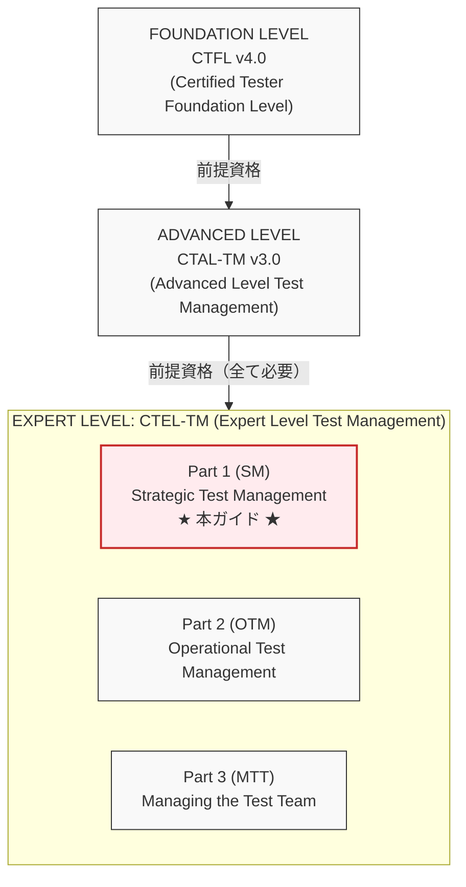

※ 3パート全て合格で CTEL-TM フル認定

📌 公式ロードマップ: <https://istqb.org/certifications/>

### 0.2 CTEL-TM 3パートの全体構成

CTEL-TM（Expert Level Test Management）= 3パート構成

| パート | 焦点領域 | 試験 |
| :--- | :--- | :--- |
| **Part 1: SM (SM)**<br>Strategic Test Management | ミッション・政策・戦略・ライフサイクル考慮<br>外部関係・組織内ツール統合 | 14問/45分<br>合格: 23/35点<br>← 本ガイド対象 |
| **Part 2: OTM**<br>Operational Test Management | 第三者関係・契約・プロジェクトリスク管理<br>回顧ミーティング | 個別試験 |
| **Part 3: MTT**<br>Managing the Test Team | 採用・目標設定・チームビルディング・分散チームの管理 | 個別試験 |

### 0.3 試験概要（CTEL-TM-SM Part 1）

| 項目 | 内容 |
| :--- | :--- |
| **問題形式** | 多肢選択式（Multiple Choice） |
| **問題数** | 14問 |
| **総得点** | 35点（各問題は1〜3点） |
| **合格点** | 23点（約65.7%） |
| **試験時間** | 45分 |
| **証明書有効期限** | 7年間 |
| **前提資格** | CTFL + CTAL-TM（必須） |
| **実務経験** | テスト経験5年以上<br>テスト管理経験2年以上 |

📌 試験プロバイダー: <https://isqi.org/ISTQB-CTEL-TM-Part-1-Strategic-Test-Management/CT-EL-TM-MCQ-P1.82>

### 0.4 CTEL-TM-SM の10のビジネスアウトカム

| # | ビジネスアウトカム |
|---|-----------------|
| BO1 | CEO/取締役会レベルのマネジメントコミットメントを持って、組織・プロジェクト・プログラム内のテスト管理をリードし、重要成功要因を特定・管理できる |
| BO2 | テスト管理戦略においてビジネス主導の意思決定を行い、品質KPIに基づいて組織全体のコミットメントとコンプライアンスを実施できる |
| BO3 | テスト管理の現状を評価し、段階的な改善を提案し、それらが組織コンテキスト内でのビジネス目標達成にどう連動するかを示せる |
| BO4 | テスト管理とテスティングを改善するための戦略的ポリシーを策定し、組織内でそのポリシーを実施できる |
| BO5 | テスト管理と、プロジェクト/組織内の他の役割・管理領域との整合に関する特定の問題を分析し、効果的な解決策を提案できる |
| BO6 | 組織またはプロジェクト/プログラムのビジネス目標を達成または超えるためのガバナンスダッシュボードを備えたマスターテスト計画を作成できる |
| BO7 | 必要な役割・スキル・手法（ツール）・組織構造を含むテスト管理（プロジェクト）組織の革新的コンセプトを開発できる |
| BO8 | 品質KPIに基づく標準化されたデリバリーを持つ組織（プロジェクト/プログラム）にテスト管理を実装するための標準プロセスを確立できる |
| BO9 | テスト管理プロセスの改善に向けて組織をリードし、変更の導入を管理できる |
| BO10 | テストプロジェクト管理に関連する人的問題を理解・効果的に管理し、必要な変更を実施できる |

### 0.5 章別学習時間配分（推定）

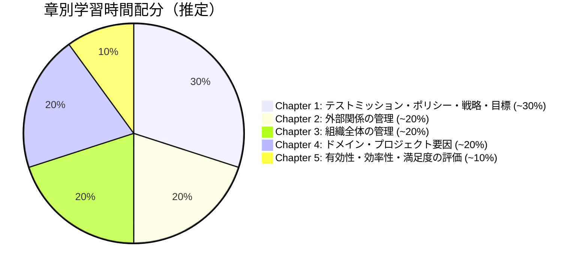

---

## 📋 Chapter 1: テストのミッション・ポリシー・戦略・目標 {#chapter-1}

> Test Missions, Policies, Strategies and Goals

### 1.1 テストのミッション（Test Mission）

#### テストミッションとは？

**テストミッション**とは、組織がテストを実施する根本的な「目的・使命」のことです。すべてのテスト活動の方向性を決定づける最上位の概念です。

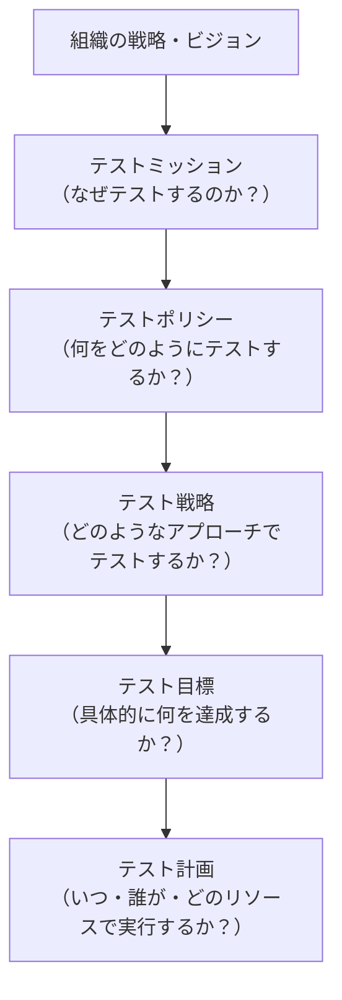

#### テストミッションの典型的なパターン

テストミッションは組織の性質・業界・製品の性格によって異なります。

```python
# テストミッションパターンの分類

test_missions = {
    "バグ検出型": {
        "説明": "できるだけ多くの欠陥を発見し、本番流出を防ぐ",
        "適用業界": "金融・医療・航空宇宙など安全性重要システム",
        "KPI例": "欠陥検出率 95%以上、本番流出欠陥ゼロ",
        "特徴": "徹底的なテストカバレッジを追求"
    },
    "リスク軽減型": {
        "説明": "最も重要なリスクをコントロールし、ビジネスインパクトを最小化",
        "適用業界": "eコマース・Webサービス・SaaS",
        "KPI例": "Critical欠陥の本番流出ゼロ、リスクカバレッジ 90%以上",
        "特徴": "リスクベーステストに特化"
    },
    "信頼構築型": {
        "説明": "製品・サービスの品質をステークホルダーに証明する",
        "適用業界": "政府・規制業界・コンプライアンス要件の高い企業",
        "KPI例": "監査合格率 100%、コンプライアンス証跡の完全性",
        "特徴": "文書化と証跡の整備を重視"
    },
    "品質改善型": {
        "説明": "テストを通じてプロセス全体の品質文化を向上させる",
        "適用業界": "製品開発企業・DevOps推進企業",
        "KPI例": "欠陥密度の四半期改善率 15%、MTBF の向上",
        "特徴": "品質メトリクスのトレンド管理に重点"
    }
}
```

**Expert Levelの視点**:

| 視点 | 初級（CTFL）| 中級（CTAL）| 上級（CTEL）|
|------|-----------|-----------|-----------|
| 関心 | テストの実行 | テストプロセスの管理 | 組織全体の品質ミッション |
| スコープ | プロジェクト単位 | プログラム・複数PJ | 組織・事業戦略レベル |
| コミュニケーション相手 | チームメンバー | PM・プロジェクトスポンサー | CEO・取締役会 |
| 時間軸 | スプリント・リリース | 四半期・年度 | 中長期（3〜5年） |

---

### 1.2 テストポリシー（Test Policy）

#### テストポリシーとは？

**テストポリシー**は、組織の上位レベルのドキュメントで、テスト原則・アプローチ・測定基準を組織全体で定義します。

テストポリシーの必須要素（CTEL-TM-SM 視点）：

| 要素 | 内容と記述例 |
| :--- | :--- |
| **目的とスコープ** | 対象システム・アプリケーション・業務プロセスの定義 |
| **テスト原則** | リスクベーステスト・シフトレフト・早期検証の方針 |
| **テストの責任範囲** | 誰がテストの最終責任を持つか（テスト管理者の権限） |
| **品質目標** | 製品品質・プロセス品質の測定可能な目標値 |
| **参照標準・規制** | ISO 29119、業界規制、GDPR等 |
| **ツールと環境** | 組織標準として使用するツール・フレームワーク |
| **例外ハンドリング** | ポリシーから逸脱できる条件と承認プロセス |
| **レビューサイクル** | ポリシーの定期見直し（例：年1回） |

#### テストポリシーの作成プロセス（ステップバイステップ）

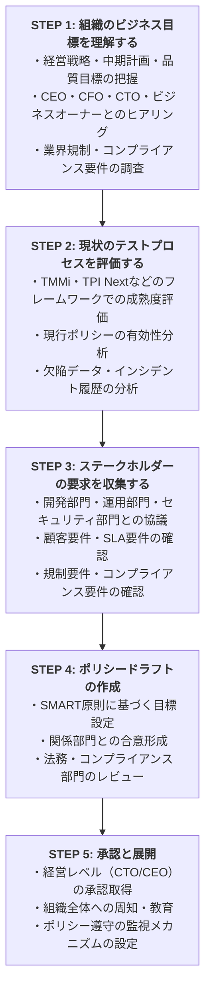

#### テストポリシー vs テスト戦略 vs テスト計画の違い（試験頻出！）

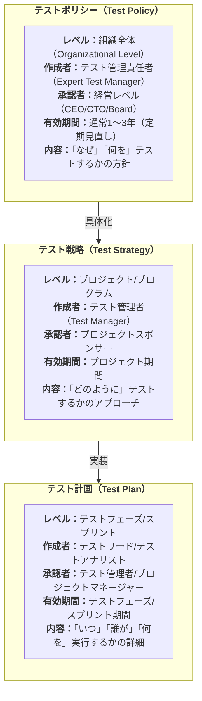

---

### 1.3 テスト戦略（Test Strategy）

#### テスト戦略のアプローチ分類

ISTQB® 公認のテスト戦略アプローチ（7種類）：

1. 分析的アプローチ（Analytical Approach）
   - リスクベーステスト・要件ベーステスト
   - 「どこに最も重大な欠陥があるか」を分析して優先順位付け
2. モデルベースアプローチ（Model-Based Approach）
   - 状態遷移・BDD・ユースケース等のモデルからテスト生成
   - モデルの品質がテストの品質に直結する
3. 方法論的アプローチ（Methodical Approach）
   - チェックリスト・過去の欠陥データ・経験則に基づく
   - 繰り返し実績のあるアプローチ
4. プロセス準拠アプローチ（Process-Compliant Approach）
   - ISO 26262（自動車）・DO-178C（航空）等の業界標準に準拠
   - 規制遵守が法的要件
5. 指示的アプローチ（Directed Approach）
   - 探索的テスト・経験ベーステスト
   - テスターの経験・直感・創造性を活用
6. 回帰回避アプローチ（Regression-Averse Approach）
   - 自動化回帰テスト・変更影響分析
   - CI/CDパイプラインへの統合
7. 反応的アプローチ（Reactive Approach）
   - アドホックテスト・探索的テスト
   - 最大の柔軟性を持つが予測しにくい

#### 複合テスト戦略の設計（Expert Level視点）

Expert Test Managerは、単一のアプローチではなく、文脈に応じた**複合テスト戦略**を設計します。

```python
# 複合テスト戦略の設計例

def design_test_strategy(context: dict) -> dict:
    """
    組織・プロジェクトコンテキストから最適な複合テスト戦略を設計する

    コンテキスト要素：
    - sdlc_model: ウォーターフォール/アジャイル/ハイブリッド
    - domain: 金融/医療/eコマース/組込み/etc.
    - risk_level: 高/中/低
    - team_maturity: 初心者/中級/上級
    - compliance_requirements: 規制要件のリスト
    """

    strategy = {
        "primary_approach": None,
        "secondary_approaches": [],
        "test_levels": [],
        "automation_strategy": None,
        "risk_focus": None,
    }

    # 規制要件が強い場合 → プロセス準拠アプローチが必須
    if context["compliance_requirements"]:
        strategy["primary_approach"] = "process_compliant"
        strategy["secondary_approaches"].append("analytical_risk_based")

    # アジャイル環境の場合
    elif context["sdlc_model"] == "agile":
        strategy["primary_approach"] = "regression_averse"  # 自動化重視
        strategy["secondary_approaches"].append("analytical_risk_based")
        strategy["secondary_approaches"].append("exploratory")

    # リスクが高い場合
    elif context["risk_level"] == "high":
        strategy["primary_approach"] = "analytical_risk_based"
        strategy["secondary_approaches"].append("methodical")

    return strategy


# 実践例：金融システムの場合
financial_context = {
    "sdlc_model": "waterfall_with_agile_sprints",
    "domain": "financial",
    "risk_level": "high",
    "team_maturity": "advanced",
    "compliance_requirements": ["PCI-DSS", "FISC", "Basel III"]
}

strategy = design_test_strategy(financial_context)
# → primary_approach: "process_compliant"（規制準拠）
# → secondary: "analytical_risk_based"（リスク分析）
# → 追加: 決済機能のペネトレーションテスト
```

---

### 1.4 テストポリシーと組織の戦略アライメント

#### 戦略的アライメントの重要性

Expert Test Managerの最も重要なスキルの一つは、テストポリシーを組織の戦略と**整合（アライン）**させることです。

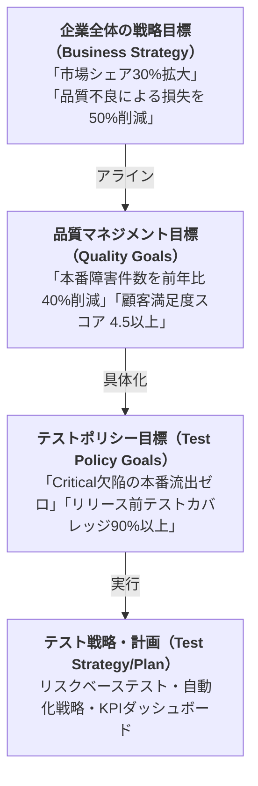

#### アライメントギャップの分析手法（Gap Analysis）

```mermaid
flowchart LR
    subgraph AsIs ["<b>現状（As-Is）</b>"]
        direction TB
        A1["テスト自動化率：30%"]
        A2["欠陥検出効率：75%"]
        A3["リリースサイクル：8週間"]
        A4["テストチームスキル：中級"]
    end

    subgraph Gap ["<b>ギャップ分析</b>"]
        direction TB
        G1["<b>自動化ギャップ：</b>40%の手動テストを自動化が必要"]
        G2["<b>品質ギャップ：</b>欠陥検出プロセスの改善が必要"]
        G3["<b>スピードギャップ：</b>CI/CDパイプラインの構築が必要"]
        G4["<b>スキルギャップ：</b>自動化エンジニアの育成/採用が必要"]
    end

    subgraph ToBe ["<b>目標・改善ロードマップ（To-Be）</b>"]
        direction TB
        T1["<b>Q1：</b>CI/CDパイプライン構築 + 主要機能の自動化（目標：自動化率50%）"]
        T2["<b>Q2：</b>スキルトレーニング + テストデータ管理改善（自動化率60%）"]
        T3["<b>Q3：</b>自動化率70%達成 + 欠陥予測モデルの導入"]
        T4["<b>Q4：</b>全KPI目標達成 + 継続的改善サイクルの確立"]
    end

    AsIs --> Gap --> ToBe
```

---

### 1.5 成功のメトリクス（Metrics of Success）

#### KPIの3つのカテゴリ

テストポリシーの成功を測定するKPI体系：

| カテゴリ | 具体的なKPI例 |
| :--- | :--- |
| **製品品質KPI (Product Quality)** | ・欠陥密度（Defect Density: 件/KLOC）<br>・本番障害率（Production Defect Rate）<br>・欠陥除去効率（DRE: Defect Removal Efficiency）<br>・顧客報告欠陥数（Customer-Found Defects） |
| **プロセス品質KPI (Process Quality)** | ・テストカバレッジ率（機能/リスク/コード）<br>・テスト実行率（TC実行数/全TC数）<br>・自動化率（自動化TC/全TC数）<br>・フレイキーテスト率 |
| **ビジネス価値KPI (Business Value)** | ・テストROI（節約額/コスト）<br>・市場投入時間（Time-to-Market）の短縮<br>・テスト起因のリリース遅延率<br>・品質コスト（CoQ：内部+外部失敗コスト） |

#### 欠陥除去効率（DRE）の計算

DRE（Defect Removal Efficiency）は、テストポリシーの最重要KPIの一つです。

```python
def calculate_dre(defects_found_in_test: int, 
                  defects_found_in_production: int) -> dict:
    """
    欠陥除去効率（Defect Removal Efficiency）の計算

    DRE = テスト中の欠陥数 / (テスト中 + 本番後) × 100

    理想値：95%以上（セーフティクリティカルシステムでは99%以上）
    業界平均：85〜90%
    """
    total_defects = defects_found_in_test + defects_found_in_production
    dre = (defects_found_in_test / total_defects) * 100

    interpretation = (
        "優秀（世界クラス）" if dre >= 95
        else "良好" if dre >= 90
        else "平均的" if dre >= 85
        else "改善が必要" if dre >= 75
        else "重大な問題あり"
    )

    return {
        "dre_percentage": round(dre, 2),
        "defects_in_test": defects_found_in_test,
        "defects_in_production": defects_found_in_production,
        "total_defects": total_defects,
        "interpretation": interpretation,
        "recommendation": (
            "テストプロセスを抜本的に改善し、早期検出の強化が必要"
            if dre < 85 else
            "現状維持しながら継続的改善を推進"
        )
    }

# 実践例
result = calculate_dre(
    defects_found_in_test=950,
    defects_found_in_production=50
)
# → DRE: 95.0%（優秀）
```

---

## 🌐 Chapter 2: 外部関係の管理 {#chapter-2}

> Managing External Relationships

### 2.1 テスト戦略の統合（Merging Test Strategies）

#### なぜテスト戦略の統合が必要か？

現代のソフトウェア開発では、複数のベンダー・パートナー・子会社が関与する**マルチベンダー環境**が標準です。Expert Test Managerは、異なる組織のテスト戦略を統合・調整する能力が求められます。

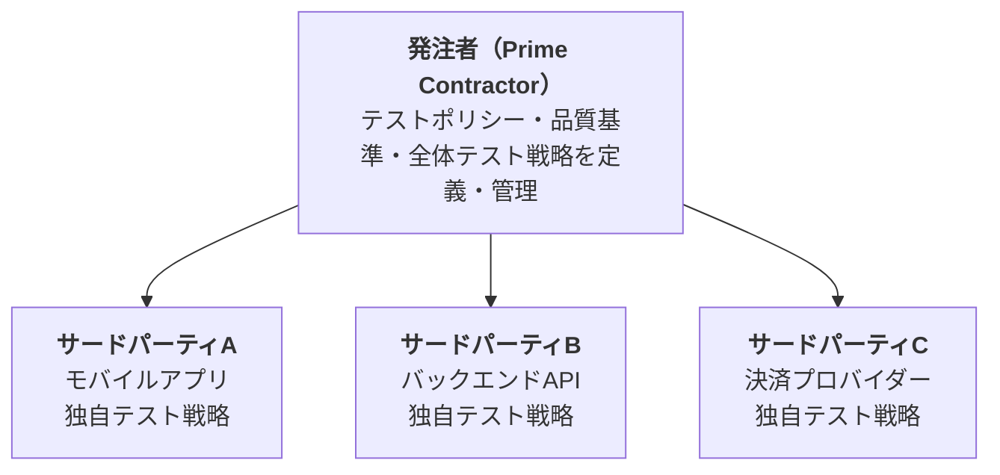

**統合の課題**:

- 各ベンダーが異なるツール・プロセス・品質基準を使用している
- テスト結果の形式が統一されていない
- 欠陥の責任範囲が曖昧である
- 統合テストのスコープが不明確である
- テストデータの共有とプライバシー問題がある

#### テスト戦略統合のフレームワーク

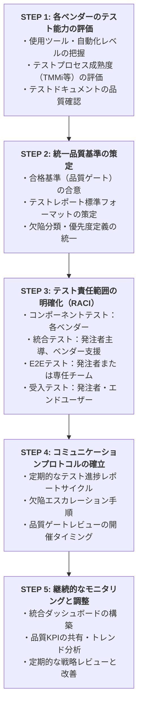

#### 契約ベースのテスト要件（Contractual Test Requirements）

```yaml
# サードパーティとの契約に含めるテスト要件の例

contractual_test_requirements:
  quality_gates:
    unit_test_coverage: ">= 80%"
    integration_test_pass_rate: ">= 95%"
    critical_defects_at_delivery: 0
    high_defects_at_delivery: "<= 5"

  test_documentation:
    - テスト計画書（Test Plan）
    - テストケース仕様書（Test Case Specification）
    - テスト実行レポート（Test Execution Report）
    - 欠陥レポート（Defect Report）
    - テスト完了レポート（Test Completion Report）

  test_environment:
    - 本番同等環境でのテスト実施
    - テスト環境仕様書の提出
    - 本番データ相当の匿名化テストデータの使用

  reporting:
    frequency: 週次
    format: "発注者指定のテンプレートを使用"
    escalation_sla: "Critical欠陥は24時間以内に報告"

  audit_rights:
    - "発注者はベンダーのテストプロセスを監査する権利を有する"
    - "監査は事前通知14日で実施"
```

---

### 2.2 品質の検証（Verifying Quality）

#### 受け入れテストと品質ゲート

外部委託先からの成果物品質を検証するための「品質ゲート」の設計が重要です。

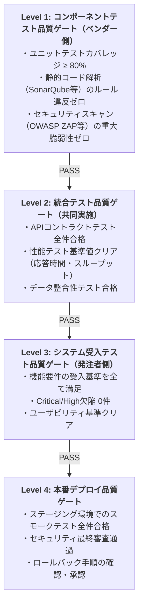

---

## 🏢 Chapter 3: 組織全体にわたるテスト管理 {#chapter-3}

> Managing Across the Organization

### 3.1 関係の構築（Creating and Building Relationships）

#### 内部ステークホルダーマップの作成

Expert Test Managerは、組織内の主要ステークホルダーとの関係を戦略的に管理します。

| 権限 \ 関心度 | 高い関心度 | 低い関心度 |
| :--- | :--- | :--- |
| **高い権限** | **[緊密に協力]**<br>・CTO<br>・リリース管理者<br>・セキュリティ責任者 | **[管理する]**<br>・開発PM<br>・QA部門長 |
| **低い権限** | **[情報提供]**<br>・エンドユーザー<br>・カスタマーサポート<br>・開発チームリード | **[最小限のコミュニケーション]**<br>・外部監査人 |

#### CEO/取締役会レベルのコミュニケーション

CTEL-TM-SM のユニークな要件の一つは、**経営トップ（CEO/取締役会）レベル**とのコミュニケーション能力です。

| 技術的な視点（テスター目線） | 経営レベルの言葉（ビジネス目線） |
| :--- | :--- |
| 「欠陥密度が3.2件/KLOC」 | 「開発の品質問題によりサポートコストが年間5,000万円増大しています」 |
| 「テストカバレッジ65%」 | 「現在のテストでは機能の35%が検証されておらず、本番障害リスクが高い状態です」 |
| 「フレイキーテスト率20%」 | 「テスト環境の不安定さにより、リリースサイクルが週あたり2日遅延しています」 |
| 「DRE 82%」 | 「品質管理の不備により、本番後の障害対応に年間2,000万円を費やしています」 |

#### ガバナンスダッシュボードの設計

##### Q3 2025 テスト品質ガバナンスダッシュボード

**📊 品質健全性スコア**: **82 / 100点**（ステータス：🟡 注意）

**📈 トレンド（前四半期比）**:

- **DRE (欠陥除去効率)**: 85% → 91% (+6%)
- **欠陥密度**: 4.1 → 3.2 (改善)
- **自動化率**: 45% → 62% (+17%)

| KPI達成状況 | リスク項目 |
| :--- | :--- |
| **✅ DRE目標（90%）**: 91% 達成<br>**🟡 Critical欠陥漏洩**: 1件（目標0件）<br>**✅ リリース遅延率**: 5%（目標<10%） | **🔴 決済モジュールの欠陥密度高**<br>**🟡 テスト自動化スキル不足**<br>**🟢 モバイルテスト環境安定化** |

| 品質コスト（CoQ） | 次四半期の重点施策 |
| :--- | :--- |
| ・**内部失敗コスト**: 1.2億円<br>・**外部失敗コスト**: 0.3億円<br>・**評価コスト**: 0.8億円<br>・**予防コスト**: 0.4億円 | 1. **決済モジュールの専門テスト**<br>2. **自動化エンジニア2名採用**<br>3. **セキュリティテスト強化** |

---

### 3.2 組織全体で品質活動を推進する（Advocating Quality Activities）

#### テスト文化（Quality Culture）の醸成

Expert Test Managerは、テストチームを超えて組織全体に**品質文化**を浸透させる責任があります。

```
品質文化の成熟度レベル：

レベル1（初期）: 「バグを見つけるのはテスターの仕事」
  → テストは開発後の後工程として認識されている
  → 品質は「テスト部門」だけの責任と見なされる

レベル2（発展中）: 「品質は全員の責任」（意識はあるが実践が弱い）
  → シフトレフトの概念は理解されている
  → TDDやコードレビューが一部で実践されている

レベル3（定義済）: 「品質を組み込む（Build Quality In）」
  → 開発者もテストを書く（TDD/BDD）
  → CI/CDパイプラインにテストが統合されている
  → 欠陥防止プラクティスが標準化されている

レベル4（管理済）: 「データ駆動の品質判断」
  → 品質KPIに基づいてリリース判断を自動化
  → 予測分析（欠陥予測・リスク予測）を活用
  → 組織全体の品質改善が継続的に測定される

レベル5（最適化）: 「継続的品質革新」
  → AI/MLを活用したテスト最適化
  → 業界ベストプラクティスを組織が創出・共有
  → 品質がビジネス競争優位の源泉となっている

Expert Test Manager の目標：
  → 組織をレベル3以上に引き上げ、レベル4・5を目指す
```

#### シフトレフトとシフトライトの統合戦略

##### 継続的テスト活動

- **シフトレフト（Shift Left）**: 開発の初期フェーズから品質活動を実施
  - 要件レビュー・受入基準の事前定義（ATDD）
  - 設計レビュー・アーキテクチャの脆弱性評価
  - TDD（テスト駆動開発）
  - 静的解析・コードレビュー
- **シフトライト（Shift Right）**: 本番環境での継続的な品質監視
  - 本番モニタリング（APM・ログ分析）
  - カナリアリリース・フィーチャーフラグ
  - A/Bテスト・ブルーグリーンデプロイ
  - カオスエンジニアリング（耐障害性テスト）
  - 実ユーザーモニタリング（RUM）

##### 統合された継続的テスト戦略ロードマップ

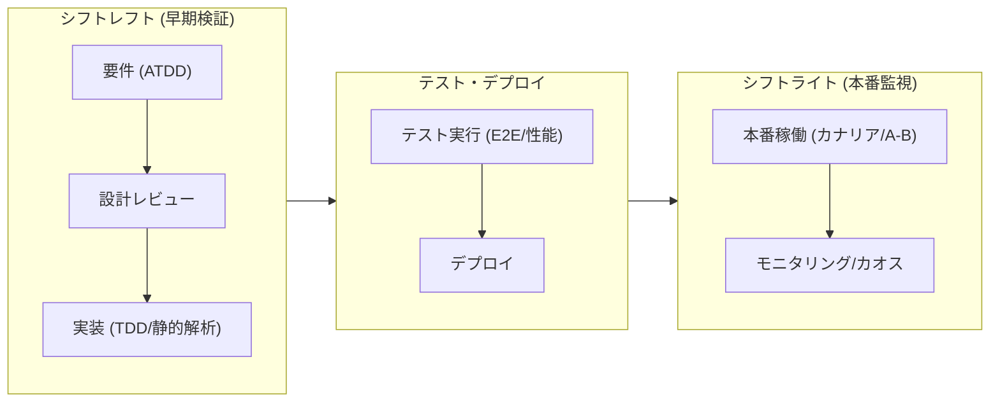

---

### 3.3 組織全体でのツール統合（Integrating Tools Across the Organization）

#### テストツールエコシステムの設計

組織全体でのツール統合は、Expert Test Managerの重要な戦略的タスクです。

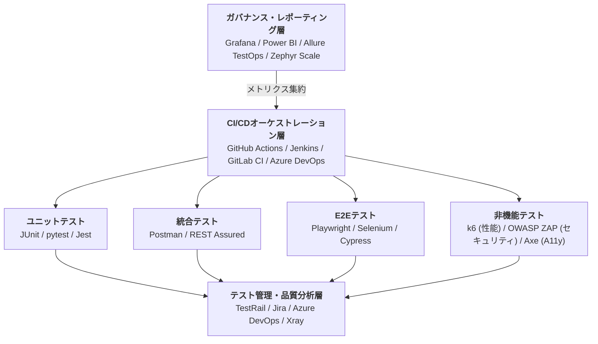

#### ツール統合ROIの計算と経営陣への説明

```python
def calculate_tool_integration_roi(
    annual_manual_test_hours: int,
    manual_hourly_cost: float,
    automation_rate_current: float,
    automation_rate_target: float,
    tool_integration_cost: float,
    annual_maintenance_cost: float
) -> dict:
    """
    テストツール統合によるROI計算

    Returns:
        ROI分析レポート
    """
    # 現状の手動テストコスト
    current_auto_hours = annual_manual_test_hours * automation_rate_current
    current_manual_hours = annual_manual_test_hours - current_auto_hours
    current_manual_cost = current_manual_hours * manual_hourly_cost

    # 目標達成後のコスト
    target_auto_hours = annual_manual_test_hours * automation_rate_target
    target_manual_hours = annual_manual_test_hours - target_auto_hours
    target_manual_cost = target_manual_hours * manual_hourly_cost

    # 年間節約額
    annual_savings = current_manual_cost - target_manual_cost

    # 投資回収期間
    total_first_year_cost = tool_integration_cost + annual_maintenance_cost
    payback_months = (tool_integration_cost / annual_savings) * 12

    # ROI（初年度）
    roi_first_year = (
        (annual_savings - total_first_year_cost) / total_first_year_cost
    ) * 100

    return {
        "現状手動テストコスト（年間）": f"¥{current_manual_cost:,.0f}",
        "目標達成後の手動テストコスト（年間）": f"¥{target_manual_cost:,.0f}",
        "年間節約額": f"¥{annual_savings:,.0f}",
        "投資回収期間": f"{payback_months:.1f}ヶ月",
        "初年度ROI": f"{roi_first_year:.1f}%",
        "推奨決定": (
            "投資を推奨（18ヶ月以内に回収見込み）"
            if payback_months <= 18
            else "詳細分析が必要"
        )
    }


# 実践例
roi_analysis = calculate_tool_integration_roi(
    annual_manual_test_hours=20000,
    manual_hourly_cost=8000,        # 8,000円/時
    automation_rate_current=0.30,   # 現在30%自動化
    automation_rate_target=0.70,    # 目標70%自動化
    tool_integration_cost=5_000_000, # ツール導入コスト500万円
    annual_maintenance_cost=1_000_000 # 年間メンテナンス100万円
)
# → 年間節約額: ¥44,800,000（4,480万円）
# → 投資回収期間: 1.3ヶ月
# → 初年度ROI: 671%
```

---

## 📊 Chapter 4: ドメイン・プロジェクト要因のテスト考慮事項 {#chapter-4}

> Testing Considerations for Domain and Project Factors

### 4.1 ライフサイクルモデル別テスト管理

Expert Test Managerは、プロジェクトのSDLCモデルに応じて、テスト管理アプローチを柔軟に適応させる能力が求められます。

#### 4.1.1 各SDLCモデルとテスト管理戦略

ライフサイクルモデル別テスト管理アプローチ：

> **ウォーターフォールモデル**
>
> - **特徴**：要件→設計→実装→テスト→デプロイの順次実行
> - **テスト管理のポイント**：
>   - V字モデルに基づく各フェーズのテスト活動計画
>   - テスト計画書は開発初期に詳細に作成
>   - 要件変更の影響分析が最重要（変更コストが高い）
>   - フォーマルなエントリ・イグジット基準の設定
>   - 独立したテスト組織（専任テストチーム）が有効
> - **リスク**：
>   - テストが後半に集中 → 欠陥の発見が遅れる
>   - 要件変更への対応が困難・コスト大
>
> **アジャイルモデル（Scrum/SAFe）**
>
> - **特徴**：スプリントごとの反復開発・継続的フィードバック
> - **テスト管理のポイント**：
>   - 各スプリントでのテスト活動（シフトレフト）
>   - Definition of Done（DoD）にテスト基準を組み込む
>   - 回帰テストの自動化が必須（継続的に増加するリグレッション対応）
>   - テストアナリストをスクラムチームに組み込む（全チームアプローチ）
>   - スプリントレビュー・レトロスペクティブへの参加
>   - テスト負債（Test Debt）の管理
> - **SAFe（スケールドアジャイル）での追加要素**：
>   - ProgamレベルのIP（Innovation & Planning）スプリントでの回帰テスト
>   - System DemoとSystem Integration Testingの計画
>   - Release Train Engineerとの連携
>
> **DevOps / 継続的デリバリー**
>
> - **特徴**：コードPush→自動テスト→自動デプロイの高速サイクル
> - **テスト管理のポイント**：
>   - テスト自動化率の最大化（目標70〜80%以上）
>   - テストピラミッドに基づくテスト設計
>   - 品質ゲートの自動化（人手による承認の最小化）
>   - カナリアリリース・フィーチャーフラグによるリスク軽減
>   - 本番モニタリングとアラートの設定
>   - カオスエンジニアリングの計画的実施
>
> **ハイブリッドモデル（最も実際に多い）**
>
> - **特徴**：ウォーターフォール的ガバナンス + アジャイル的実行
> - **テスト管理のポイント**：
>   - フォーマルなマスターテスト計画（ウォーターフォール要素）
>   - スプリントレベルの適応的テスト計画（アジャイル要素）
>   - ステークホルダーごとに異なる報告形式を準備
>   - 欠陥管理のワークフローを統一（Jira/Azure DevOps等）

#### 4.1.2 マスターテスト計画の設計

```yaml
# マスターテスト計画（Master Test Plan）の構成要素

master_test_plan:
  section_1_introduction:
    - プロジェクト/プログラムの概要
    - テストスコープ（対象・対象外）
    - テスト目標と成功基準
    - リスクと前提条件

  section_2_test_strategy:
    - テストアプローチ（リスクベース/モデルベース等）
    - テストレベルと責任分担
    - テスト技法の選択根拠
    - 自動化戦略

  section_3_test_organization:
    - テストチーム構成（ロール・責任・スキル）
    - 外部リソース（ベンダー・専門家）
    - コミュニケーション計画
    - トレーニング計画

  section_4_infrastructure:
    - テスト環境仕様
    - テストツール（ライセンス・バージョン）
    - テストデータ戦略
    - セキュリティ・プライバシー要件

  section_5_schedule_estimation:
    - マイルストーン
    - テスト工数見積もり（根拠込み）
    - 並列実行計画
    - 依存関係

  section_6_entry_exit_criteria:
    - 各テストフェーズのエントリ基準
    - 各テストフェーズのイグジット基準
    - 一時停止/再開基準
    - リリース基準（品質ゲート）

  section_7_risk_management:
    - テストリスクレジスター
    - リスク軽減策
    - コンティンジェンシー計画

  section_8_metrics_reporting:
    - 収集するメトリクス（定義・測定方法）
    - 報告スケジュール・フォーマット
    - ガバナンスダッシュボード設計
```

---

### 4.2 部分的なライフサイクルプロジェクトの管理（Managing Partial Lifecycle Projects）

#### 保守プロジェクト・既存システムのテスト管理

```
部分的ライフサイクルプロジェクトの典型的なシナリオ：

  シナリオ1: レガシーシステムのモダナイゼーション
  → 課題：テスト資産が存在しない、または古い
  → 対策：
    ① 現行システムの動作をリファレンスとしてキャプチャ
    ② キャラクタリゼーションテストの実施（「現在の動作」を記録）
    ③ 段階的な移行テスト戦略の策定

  シナリオ2: マイクロサービス移行
  → 課題：モノリスからマイクロサービスへの段階的移行
  → 対策：
    ① ストラングラーフィグパターンの活用
    ② コントラクトテスト（Pact）の導入
    ③ サービスメッシュレベルでのカオスエンジニアリング

  シナリオ3: サードパーティパッケージの統合
  → 課題：外部コンポーネントはブラックボックス
  → 対策：
    ① インターフェーステストに集中（内部は検証不要）
    ② ベンダーのテスト証跡の確認（COQ、テストレポート）
    ③ リスク評価に基づく受入テストの設計

  シナリオ4: 緊急パッチ/ホットフィックス
  → 課題：時間的制約の中でリグレッションを防ぐ
  → 対策：
    ① リスクベースの回帰テストスイート（スモークテスト）の実施
    ② 変更影響分析の自動化
    ③ カナリアリリース戦略の活用
```

---

## 📈 Chapter 5: 有効性・効率性・満足度の評価 {#chapter-5}

> Evaluating Effectiveness and Efficiency

### 5.1 テストプロセスの有効性・効率性・満足度メトリクス

#### メトリクスのGQM（Goal-Question-Metric）アプローチ

Expert Levelでは、単にメトリクスを収集するだけでなく、**目標から逆算してメトリクスを設計**するGQMアプローチが重要です。

```
GQMアプローチの適用例：

目標（Goal）:
  「テスト品質を改善し、本番障害を50%削減する」

質問（Questions）:
  Q1: 現在のテストで欠陥をどの程度発見しているか？
  Q2: どのコンポーネントで最も多くの本番障害が発生しているか？
  Q3: テスト実行後、本番にどのくらいの欠陥が漏洩しているか？
  Q4: テストプロセスで最も多くの時間を消費しているのはどこか？

メトリクス（Metrics）:
  M1: DRE（欠陥除去効率） → Q1, Q3への回答
  M2: コンポーネント別欠陥密度 → Q2への回答
  M3: 欠陥漏洩率（本番後の欠陥数/全欠陥数） → Q3への回答
  M4: テストフェーズ別の工数内訳 → Q4への回答
```

#### テストプロセスの主要メトリクス詳細

```python
class TestProcessMetrics:
    """テストプロセスメトリクス計算クラス（Expert Level）"""

    def effectiveness_metrics(self, data: dict) -> dict:
        """
        有効性（Effectiveness）メトリクス：
        「テストは目標を達成しているか」
        """
        # 欠陥除去効率（最重要！）
        dre = (data["defects_in_testing"] /
               (data["defects_in_testing"] + data["defects_in_production"])) * 100

        # 要件カバレッジ
        req_coverage = (data["tested_requirements"] / data["total_requirements"]) * 100

        # リスクカバレッジ
        risk_coverage = (data["mitigated_risks"] / data["identified_risks"]) * 100

        # テスト実行合格率
        pass_rate = (data["passed_tests"] / data["executed_tests"]) * 100

        return {
            "dre": f"{dre:.1f}%",
            "requirement_coverage": f"{req_coverage:.1f}%",
            "risk_coverage": f"{risk_coverage:.1f}%",
            "test_pass_rate": f"{pass_rate:.1f}%",
        }

    def efficiency_metrics(self, data: dict) -> dict:
        """
        効率性（Efficiency）メトリクス：
        「テストはリソースを効率的に使っているか」
        """
        # コストパーテスト（1テストケースあたりのコスト）
        cost_per_test = data["total_test_cost"] / data["total_test_cases"]

        # テスト自動化率
        automation_rate = (data["automated_tests"] / data["total_test_cases"]) * 100

        # テストサイクルタイム（テスト開始から完了まで）
        avg_cycle_time = data["total_test_hours"] / data["number_of_cycles"]

        # 欠陥発見コスト（1欠陥あたりの検出コスト）
        cost_per_defect = data["total_test_cost"] / data["total_defects_found"]

        return {
            "cost_per_test_case": f"¥{cost_per_test:,.0f}",
            "automation_rate": f"{automation_rate:.1f}%",
            "avg_cycle_time_hours": f"{avg_cycle_time:.1f}時間",
            "cost_per_defect_found": f"¥{cost_per_defect:,.0f}",
        }

    def satisfaction_metrics(self, data: dict) -> dict:
        """
        満足度（Satisfaction）メトリクス：
        「テストプロセスはステークホルダーを満足させているか」
        """
        return {
            "team_satisfaction_score": f"{data['team_survey_score']}/5.0",
            "stakeholder_confidence": f"{data['stakeholder_confidence']}%",
            "reporting_clarity_rating": f"{data['reporting_clarity']}/5.0",
            "process_adherence_rate": f"{data['process_adherence']}%",
        }
```

---

### 5.2 テストポリシー目標の有効性・効率性・満足度メトリクス

#### ポリシー達成度の評価フレームワーク

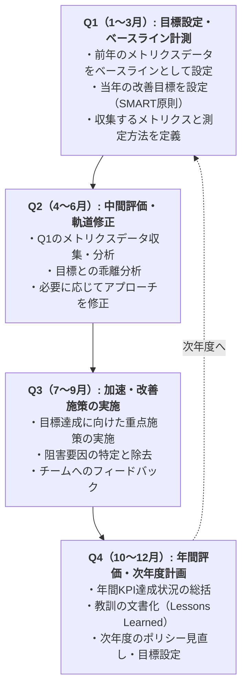

---

## 📝 試験対策・サンプル問題 {#exam-tips}

### 試験の重要情報

```
╔══════════════════════════════════════════════════════════════════╗
║         CTEL-TM-SM Part 1 試験対策サマリー                        ║
╠══════════════════════════════════════════════════════════════════╣
║  問題数: 14問 / 試験時間: 45分                                     ║
║  合格点: 23/35点（約65.7%）                                        ║
║  難易度: 実務経験と戦略的思考が必要（K4:分析レベルが中心）              ║
╚══════════════════════════════════════════════════════════════════╝
```

### 必ず覚える重要概念

```
✅ テストミッション・ポリシー・戦略・計画の階層関係と違い

✅ テスト戦略の7種類（分析的・モデルベース・方法論的・
   プロセス準拠・指示的・回帰回避・反応的）

✅ DRE（欠陥除去効率）の計算式と解釈
   DRE = テスト中欠陥 / (テスト中 + 本番後) × 100
   目標: ≥90%（クリティカルシステムでは≥99%）

✅ GQM（Goal-Question-Metric）アプローチの適用

✅ 品質のコスト（Cost of Quality: CoQ）の4分類
   予防・評価・内部失敗・外部失敗

✅ テストポリシーのアライメント：
   ビジネス戦略 → 品質目標 → テストポリシー → テスト戦略

✅ マルチベンダー環境でのテスト戦略統合の手順

✅ ライフサイクルモデル別テスト管理アプローチの違い
   （ウォーターフォール/アジャイル/DevOps/ハイブリッド）

✅ CEO/取締役会レベルのコミュニケーション：
   技術的メトリクス → ビジネスインパクトへの変換

✅ テスト文化の成熟度レベル（5段階）

✅ Expert Test Managerの役割と責任（10のビジネスアウトカム）
```

### サンプル問題と解説

---

**問1（K4 / Chapter 1 テストポリシー）**

あなたは大手金融機関のExpert Test Managerとして採用されました。現在、組織では複数のプロジェクトが異なるテストアプローチを採用しており、品質の一貫性がなく、本番障害が年間60件発生しています。CEO から「本番障害を1年以内に50%削減してほしい」という指示がありました。

最初に実施すべき行動として最も適切なものはどれか？

A) 即座に全プロジェクトに自動化テストを義務付けるポリシーを発行する  
B) 現状のテスト成熟度・本番障害の原因・組織の品質目標を評価・分析してからポリシーを策定する  
C) 競合他社のテストポリシーを入手して、そのままコピーして導入する  
D) テストエンジニアを20名追加採用することで対応する

<details>
<summary>📌 解答を見る</summary>

**正解: B**

Expert Test Managerは、まず**現状評価（As-Is分析）**を行い、データに基づいた戦略を立案します。

理由：

- A) 現状分析なしにポリシーを発行しても、根本原因に対処できない。自動化だけが解決策とは限らない
- B) ✅ 現状評価 → 問題の根本原因特定 → 効果的な改善ポリシー策定という正しいアプローチ
- C) 他社のポリシーは自組織のコンテキストに合わない場合がほとんど
- D) 人員増加は根本的な解決にならない（プロセス・技術的問題が根本原因の可能性が高い）

Expert Level の視点：問題を分析してから行動することが、CEO/取締役会レベルで信頼を得るためにも重要。

</details>

---

**問2（K4 / Chapter 2 外部関係）**

あなたの組織は、ECサイトのリニューアルプロジェクトで3社のベンダー（UI/UX、バックエンドAPI、決済システム）を使用しています。各ベンダーは独自のテストアプローチを持っており、品質基準も統一されていません。統合テストでは多数の不整合が発見されています。

最も効果的な対応策はどれか？

A) 全ベンダーに対して同一のテストツール（Playwright）の使用を義務付ける  
B) 統一された品質ゲート基準・テストレポートフォーマット・欠陥分類を合意し、契約に明記した上でコントラクトテストを導入する  
C) 発注者側のテストチームを3倍に増員して全統合テストを担当させる  
D) 問題が発生した際に個別対応するので、事前対策は必要ない

<details>
<summary>📌 解答 を見る</summary>

**正解: B**

マルチベンダー環境では、**統一された品質基準の合意と契約への明記**が最も効果的です。

理由：

- A) ツールの統一は有益だが、品質基準や責任範囲の合意なしには根本解決にならない
- B) ✅ 品質ゲート・フォーマット・欠陥分類の統一 + コントラクトテスト導入が包括的解決策
- C) コスト増大であり、ベンダーのテスト品質改善にはならない
- D) 問題が発生してからの対応では本番障害のリスクが高い

コントラクトテスト（Pact等）の活用により、APIインターフェースの互換性を早期・自動的に検証できる。

</details>

---

**問3（K3 / Chapter 5 メトリクス）**

テストプロジェクトで、テスト中に450件の欠陥を発見し、リリース後の本番環境で50件の欠陥が発見されました。DRE（欠陥除去効率）を計算し、適切な解釈を選びなさい。

A) DRE = 90%：業界平均を上回っており、改善が必要  
B) DRE = 90%：良好な水準だが、金融・医療等の高信頼性システムでは95%以上を目指す必要がある  
C) DRE = 85%：中程度のパフォーマンスで直ちに改善が必要  
D) DRE = 95%：優秀なパフォーマンスで問題ない

<details>
<summary>📌 解答を見る</summary>

**正解: B**

計算：DRE = 450 / (450 + 50) × 100 = **90%**

解釈：

- 90%は「良好（Good）」な水準
- ただし、業界・リスクレベルによって判断が異なる
- 一般的なWebアプリ：85〜90%で許容範囲
- 金融・医療・航空：95%以上が望ましい
- セーフティクリティカルシステム：99%以上が要求される

Expert Test Managerとして：単に数値を報告するのではなく、文脈（業界・リスクレベル）を踏まえた解釈と改善目標の設定が重要。

</details>

---

**問4（K4 / Chapter 3 組織管理）**

組織の開発部門では、「テストが開発のボトルネックになっている」という不満が高まっており、「テストフェーズを短縮してほしい」という要求が来ています。Expert Test Managerとして、CEO に対してどのように対応すべきか？

A) 開発部門の要求に応じてテストフェーズを即座に短縮する  
B) テストを廃止して開発者が全責任を持つ方式に変更する  
C) データを用いてテストのビジネス価値を示し、シフトレフト戦略（早期テスト統合）を提案して、テスト実行時間の短縮と品質向上を両立させる改善案を提示する  
D) テストは品質保証の義務であり短縮はできないと拒否する

<details>
<summary>📌 解答を見る</summary>

**正解: C**

Expert Test Managerはビジネスパートナーとして行動します。

理由：

- A) 根拠なくテストを短縮すると品質リスクが急増する
- B) テストの完全廃止は組織の品質を崩壊させる
- C) ✅ データでビジネス価値を証明 + 現実的な改善策を提案するのがExpert Level的アプローチ
  - 「シフトレフトにより、テストフェーズを60%短縮しながら欠陥検出率を向上できます」
  - 「自動化により現在の手動テスト時間を70%削減できます」
  - ビジネス言語で価値を伝える
- D) 拒否するだけでは信頼を失い、品質改善も進まない

Expert Test Managerは「品質のビジネスパートナー」として、問題解決策を提案する姿勢が重要。

</details>

---

## 🔧 実践的な適用フレームワーク {#practice-framework}

### テスト変革プログラムのロードマップ

Expert Test Managerが組織のテスト能力を変革するための実践的なロードマップを示します。

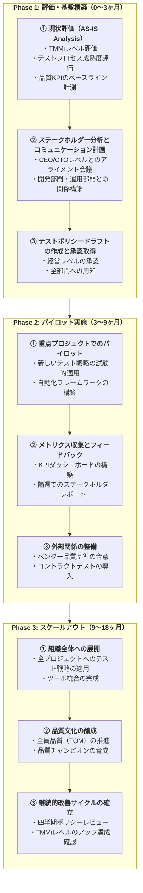

### 品質のコスト（Cost of Quality）分析フレームワーク

```python
def calculate_cost_of_quality(
    prevention_costs: dict,
    appraisal_costs: dict,
    internal_failure_costs: dict,
    external_failure_costs: dict
) -> dict:
    """
    品質のコスト（CoQ: Cost of Quality）分析

    品質コスト = 予防コスト + 評価コスト + 内部失敗コスト + 外部失敗コスト

    理想的な分布：
    - 予防コスト：15〜20%（投資すると他のコストが下がる）
    - 評価コスト：25〜35%
    - 内部失敗コスト：30〜40%
    - 外部失敗コスト：10〜20%（低いほどよい）
    """

    total_prevention = sum(prevention_costs.values())
    total_appraisal = sum(appraisal_costs.values())
    total_internal_failure = sum(internal_failure_costs.values())
    total_external_failure = sum(external_failure_costs.values())

    total_coq = (
        total_prevention + total_appraisal +
        total_internal_failure + total_external_failure
    )

    return {
        "予防コスト": {
            "金額": f"¥{total_prevention:,.0f}",
            "割合": f"{(total_prevention/total_coq)*100:.1f}%",
            "内訳": prevention_costs,
            "評価": (
                "✅ 理想的" if 0.15 <= total_prevention/total_coq <= 0.20
                else "📈 投資増加を推奨" if total_prevention/total_coq < 0.15
                else "🔍 効率化を検討"
            )
        },
        "評価コスト": {
            "金額": f"¥{total_appraisal:,.0f}",
            "割合": f"{(total_appraisal/total_coq)*100:.1f}%",
            "内訳": appraisal_costs,
        },
        "内部失敗コスト": {
            "金額": f"¥{total_internal_failure:,.0f}",
            "割合": f"{(total_internal_failure/total_coq)*100:.1f}%",
            "内訳": internal_failure_costs,
        },
        "外部失敗コスト": {
            "金額": f"¥{total_external_failure:,.0f}",
            "割合": f"{(total_external_failure/total_coq)*100:.1f}%",
            "内訳": external_failure_costs,
            "評価": (
                "✅ 優秀" if total_external_failure/total_coq <= 0.10
                else "⚠️ 要改善" if total_external_failure/total_coq <= 0.20
                else "🚨 重大問題あり"
            )
        },
        "品質総コスト": f"¥{total_coq:,.0f}",
        "改善提言": (
            "予防コストへの投資増加により外部失敗コストを削減できます"
            if total_external_failure/total_coq > 0.15
            else "品質コスト構造は良好です"
        )
    }


# 実践例：年次品質コスト分析
annual_coq = calculate_cost_of_quality(
    prevention_costs={
        "テスト計画・設計": 30_000_000,
        "テスト研修": 10_000_000,
        "プロセス改善活動": 5_000_000,
    },
    appraisal_costs={
        "テスト実行コスト": 80_000_000,
        "テスト環境コスト": 20_000_000,
        "テストツールライセンス": 10_000_000,
    },
    internal_failure_costs={
        "バグ修正コスト": 60_000_000,
        "再テストコスト": 20_000_000,
        "リリース遅延コスト": 15_000_000,
    },
    external_failure_costs={
        "本番障害対応コスト": 20_000_000,
        "顧客サポートコスト": 10_000_000,
        "賠償・ペナルティ": 5_000_000,
    }
)
```

---

## ✅ 試験直前チェックリスト {#final-checklist}

### Chapter別重要概念チェック

```
✅ Chapter 1: テストミッション・ポリシー・戦略・目標

  □ テストミッション・ポリシー・戦略・計画の階層関係を説明できる
  □ テストポリシーの必須要素（8要素）を言える
  □ テストポリシー作成の5ステップを順番に説明できる
  □ テスト戦略の7種類とそれぞれの特徴を説明できる
  □ 複合テスト戦略の設計アプローチを理解している
  □ ビジネス戦略からテストポリシーへのアライメントモデルを説明できる
  □ ギャップ分析（As-Is / To-Be）を実施できる
  □ KPI（品質KPI・プロセスKPI・ビジネス価値KPI）を分類できる
  □ DRE（欠陥除去効率）を計算し解釈できる
  □ テストポリシー目標のSMART原則を適用できる

✅ Chapter 2: 外部関係の管理

  □ マルチベンダー環境でのテスト課題を説明できる
  □ テスト戦略統合の5ステップを説明できる
  □ 契約ベースのテスト要件に含めるべき要素を説明できる
  □ 品質ゲートの多層防御モデルを設計できる
  □ コントラクトテストの目的と適用場面を説明できる

✅ Chapter 3: 組織全体の管理

  □ ステークホルダーマップの作成手法を説明できる
  □ CEO/取締役会レベルのコミュニケーション方法を説明できる
  □ テクニカルメトリクスをビジネスインパクトに変換できる
  □ ガバナンスダッシュボードの設計要素を説明できる
  □ テスト文化の5段階成熟度レベルを説明できる
  □ シフトレフトとシフトライトの統合戦略を説明できる
  □ テストツール統合アーキテクチャを設計できる
  □ ツール統合ROIの計算と説明ができる

✅ Chapter 4: ドメイン・プロジェクト要因

  □ 各SDLCモデル（ウォーターフォール/アジャイル/DevOps/ハイブリッド）
    でのテスト管理アプローチの違いを説明できる
  □ マスターテスト計画の構成要素（8セクション）を説明できる
  □ 部分的ライフサイクルプロジェクト（4シナリオ）への対応を説明できる
  □ SAFe（スケールドアジャイル）でのテスト管理を説明できる
  □ テスト負債（Test Debt）の概念と管理を説明できる

✅ Chapter 5: 有効性・効率性・満足度の評価

  □ GQM（Goal-Question-Metric）アプローチを適用できる
  □ 有効性・効率性・満足度の各メトリクスを分類・計算できる
  □ 品質のコスト（CoQ）の4分類と理想的な分布を説明できる
  □ 年間評価サイクル（Q1〜Q4）を説明できる
  □ テストポリシー目標の達成度評価手法を説明できる

✅ Expert Level共通事項

  □ 10のビジネスアウトカムを全て説明できる
  □ CTEL-TM 3パートの役割の違いを説明できる
  □ 前提資格（CTFL + CTAL-TM）と実務経験要件を説明できる
  □ 試験形式（14問・35点・合格23点・45分）を把握している
```

---

## 📚 参照URL一覧 {#references}

### 🏛️ ISTQB® 公式リソース

| リソース | URL |
|---------|-----|
| **CTEL-TM-SM 公式認定ページ** | <https://istqb.org/certifications/certified-tester-expert-level-test-management-strategic-test-management-ctel-tm-sm/> |
| **CTEL-TM-OTM（Part 2）公式ページ** | <https://istqb.org/certifications/certified-tester-expert-level-test-management-operational-test-management-ctel-tm-otm/> |
| **CTEL-TM-MTT（Part 3）公式ページ** | <https://istqb.org/certifications/certified-tester-expert-level-test-management-managing-the-test-team-ctel-tm-mtt/> |
| **CTEL-TM シラバス v1.0 ダウンロード** | <https://istqb.org/?sdm_process_download=1&download_id=3687> |
| **CTEL-TM サンプル試験A 問題** | <https://istqb.org/?sdm_process_download=1&download_id=3689> |
| **CTEL-TM サンプル試験A 解答** | <https://istqb.org/?sdm_process_download=1&download_id=3690> |
| **Expert Level 試験構造とルール** | <https://istqb.org/?sdm_process_download=1&download_id=3834> |
| **Expert Level ルールと推奨事項** | <https://istqb.org/?sdm_process_download=1&download_id=3835> |
| **Expert Level 証明書延長ポリシー** | <https://istqb.org/?sdm_process_download=1&download_id=3693> |
| **ISTQB® グロッサリー** | <https://glossary.istqb.org/en_US/search?term=> |
| **ISTQB® 資格一覧** | <https://istqb.org/certifications/> |
| **試験プロバイダー検索** | <https://istqb.org/exam-providers/> |
| **研修プロバイダー検索** | <https://istqb.org/training-providers/> |

### 📢 試験プロバイダー（iSQI）

| リソース | URL |
|---------|-----|
| **iSQI CTEL-TM Part 1（Strategic TM）** | <https://isqi.org/ISTQB-CTEL-TM-Part-1-Strategic-Test-Management/CT-EL-TM-MCQ-P1.82> |
| **iSQI CTEL-TM Full Certification** | <https://isqi.org/en/90-istqb-ctel-tm-part-1-strategic-test-management.html> |
| **Brightest CTEL-TM-SM 試験情報** | <https://www.brightest.org/en/certifications/ISTQB-r-CTEL-Test-Management-Strategic-Test-Management/> |
| **AZSTQB（アリゾナ州ISTQB）CTEL-TM** | <https://azstqb.org/certifications/expert-level/strategic-test-management> |

### 🎓 前提資格関連

| 資格 | URL |
|------|-----|
| CTFL v4.0（Foundation Level・必須）| <https://istqb.org/certifications/certified-tester-foundation-level/> |
| CTAL-TM v3.0（Advanced Level・必須）| <https://istqb.org/certifications/certified-tester-advanced-level-test-management-ctal-tm-v3-0/> |

### 📖 品質・テスト管理の参考資料

| リソース | 内容 | URL |
|---------|------|-----|
| TMMi Foundation | テストプロセス成熟度モデル | <https://www.tmmifoundation.org/> |
| ISO/IEC 29119 | ソフトウェアテスト国際標準 | <https://www.iso.org/standard/81291.html> |
| ISO/IEC 25010:2023 | ソフトウェア品質モデル（SQuaRE） | <https://www.iso.org/standard/78176.html> |
| IEEE 829 | テスト文書化標準 | <https://standards.ieee.org/> |
| GASQ CTEL-TM 情報 | Expert Level 詳細情報 | <https://www.gasq.org/en/exam-modules/istqb-r.html> |
| Google Testing Blog | テストのベストプラクティス | <https://testing.googleblog.com/> |
| Martin Fowler | テストピラミッド・技術的実践 | <https://martinfowler.com/articles/practical-test-pyramid.html> |
| ISTQB.Guru | 試験対策・解説 | <https://www.istqb.guru/> |

### 🔧 関連ツール・フレームワーク

| カテゴリ | ツール | URL |
|---------|-------|-----|
| テスト管理 | TestRail | <https://www.testrail.com/> |
| テスト管理 | Zephyr Scale | <https://smartbear.com/test-management/> |
| 欠陥管理 | Jira | <https://www.atlassian.com/software/jira> |
| コントラクトテスト | Pact | <https://docs.pact.io/> |
| CI/CD | GitHub Actions | <https://docs.github.com/en/actions> |
| コード品質 | SonarQube | <https://docs.sonarqube.org/> |
| レポーティング | Allure TestOps | <https://allurereport.org/> |
| 性能テスト | k6 by Grafana | <https://grafana.com/docs/k6/latest/> |
| セキュリティテスト | OWASP ZAP | <https://www.zaproxy.org/> |
| 欠陥予測・AI | Functionize | <https://www.functionize.com/> |

---

## 🏁 まとめ：Expert Test Managerとして成功する10の鉄則

```
1. 🎯 ビジネス視点で品質を語る
   → DRE・欠陥密度を「コスト」「リスク」「市場機会」に変換して経営に訴える
   → テストの価値をCEO/取締役会レベルで理解してもらえる言語で話す

2. 📐 戦略を階層的に設計する
   → ビジネス戦略 → テストポリシー → テスト戦略 → テスト計画の整合を保つ
   → 上位目標とのアライメントが常に取れているかを確認する

3. 📊 GQMでメトリクスを設計する
   → 目標から逆算して収集するメトリクスを決める（メトリクスのための
     メトリクス収集を避ける）
   → KPIは必ずビジネス目標と連動させる

4. 🌐 外部関係を戦略的に管理する
   → マルチベンダー環境では品質基準の統一と契約への明記が必須
   → コントラクトテストで統合リスクを早期に軽減する

5. 🏗️ 組織全体に品質文化を醸成する
   → テストチームだけでなく開発・運用・ビジネス全員を品質文化に引き込む
   → 品質はコストではなく投資であることを組織全体で理解させる

6. 🔄 SDLCモデルに柔軟に適応する
   → ウォーターフォール・アジャイル・DevOps・ハイブリッドそれぞれに
     最適なテスト管理アプローチを選択・適用する

7. ⚙️ ツールを戦略的に統合する
   → ツール先行ではなく、目的・プロセスに合わせてツールを選択する
   → 組織全体でのツール統合によりデータの一元管理と可視化を実現する

8. 🤝 ステークホルダーとの信頼を構築する
   → 問題を隠さず透明性を保つ（良いニュースも悪いニュースも迅速に共有）
   → データで語り、感情ではなく事実で意思決定を支援する

9. 🔁 継続的改善を制度化する
   → レトロスペクティブで教訓を確実に次に活かす
   → TMMiなどのフレームワークで成熟度の向上を継続的に目指す

10. 🌱 変化をリードする
    → テスト技術の最新動向（AI/ML、カオスエンジニアリング等）を把握する
    → 組織の変革を技術的・人的両面でリードし、抵抗を克服する
```

---

> **📌 作成日**: 2025年  
> **📌 準拠資格**: ISTQB® CTEL-TM-SM v1.0（シラバス2011年、最新試験情報2025年）  
> **📌 次のステップ**:
>
> - CTEL-TM-OTM（Operational Test Management）でPart 2を学習
> - CTEL-TM-MTT（Managing the Test Team）でPart 3を学習
> - 3パート全て合格で CTEL-TM フル認定取得
>
> 🔗 **公式リソース**: <https://istqb.org/certifications/certified-tester-expert-level-test-management-strategic-test-management-ctel-tm-sm/>

---

> ⚠️ **免責事項**: 本ガイドはISTQB®が公認したトレーニング資料ではありません。
> 公式シラバス・サンプル問題と合わせてご使用ください。
> 試験情報の最終確認は必ず公式サイト（istqb.org）で行ってください。
